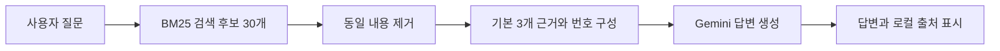

# 하이브리드 검색과 RAG

> 검색은 근거를 고르는 단계이고, 생성은 선택된 근거로 답변을 쓰는 단계다. 두 단계는 따로 평가해야 한다.

## 참고자료

- [Elastic의 한국어 RAG 설명](https://www.elastic.co/kr/what-is/retrieval-augmented-generation) — 검색과 생성의 전체 흐름.
- [OpenSearch의 RRF 소개](https://opensearch.org/blog/introducing-reciprocal-rank-fusion-hybrid-search/) — 점수 정규화와 순위 융합 비교.
- [AWS의 한국어 하이브리드 검색 구현](https://aws.amazon.com/ko/blogs/tech/aurora-postgresql-pg-bigm-pgvector-korean-hybrid-search/) — 텍스트·벡터 검색과 RRF를 연결한 SQL 예시. 키워드 검색에 pg_bigm을 사용하는 구성이다.

## RRF는 왜 점수 대신 순위를 섞나

### 20점과 0.8점은 무엇을 센 값인가

**BM25는 단어의 일치에 가중치를 붙인 점수**다. 질문의 단어가 문서에 얼마나 등장하는지, 그 단어가 전체 문서에서 얼마나 드문지, 문서가 얼마나 긴지를 반영한다. 여러 검색어의 기여가 합쳐지므로 모든 질문에 공통인 100점 만점이나 1점 만점이 없다. 20점은 정답 확률 20%라는 뜻도 아니다. [Elastic의 BM25 설명](https://www.elastic.co/kr/blog/practical-bm25-part-2-the-bm25-algorithm-and-its-variables)

**코사인 유사도는 두 벡터가 향하는 방향이 얼마나 비슷한지 계산한 값**이다. 길이로 나누어 방향을 비교하므로, 0이 아닌 두 벡터의 원래 코사인 값은 -1~1 범위다. 1은 같은 방향, 0은 직각, -1은 반대 방향이다. 0.8 역시 정답 확률 80%는 아니다. 검색 엔진이 반환하는 점수는 이 값을 변환한 것일 수 있으므로 여기서는 원래 코사인 값을 기준으로 비교한다.

다음은 가상 점수다. BM25에서 A가 2점 앞서고, 코사인에서는 B가 0.3 앞선다.

| 문서 | BM25 | 코사인 | 그대로 더한 값 |
|---|---:|---:|---:|
| A | 20 | 0.6 | 20.6 |
| B | 18 | 0.9 | 18.9 |

그냥 더하면 A가 앞선다. 하지만 **BM25의 2점 차이가 코사인의 0.3 차이보다 중요한 근거인지 정한 적은 없다.** 숫자의 크기 때문에 BM25 쪽 차이가 합계를 더 크게 움직인 것이다.

### 그러면 같은 범위로 바꿔서 더하면 안 되나

가능하다. 한 방법이 각 검색기의 후보 점수를 0~1로 바꾸는 min-max 정규화다.

```text
정규화 점수 = (원래 점수 - 후보 중 최솟값) / (후보 중 최댓값 - 최솟값)
```

예를 들어 같은 세 문서 A·B·C를 두 검색기로 채점했다고 하자.

| 문서 | BM25 원점수 → 정규화 | 코사인 원점수 → 정규화 | 두 값을 절반씩 반영 |
|---|---|---|---:|
| A | 20 → 1.0 | 0.6 → 0.5 | 0.75 |
| B | 18 → 0.8 | 0.9 → 1.0 | 0.90 |
| C | 10 → 0.0 | 0.3 → 0.0 | 0.00 |

BM25의 B는 `(18-10)/(20-10)=0.8`이다. 정규화 후 `0.5 × BM25 + 0.5 × 코사인`으로 합치면 B가 앞선다. BM25 비중을 0.8로 올리면 A는 0.90, B는 0.84가 되어 다시 A가 앞선다. 이렇게 **가중치로 검색 방식의 영향력을 조절**할 수 있다. 어느 설정이 더 좋은지는 실제 정답 근거로 평가해야 한다.

### 점수 분포와 극단값은 왜 신경 써야 하나

정규화의 기준이 후보 목록에 따라 달라지기 때문이다. BM25 후보가 `10, 18, 20`이면 18과 20은 각각 `0.8, 1.0`이다. 그런데 점수 100인 문서가 후보에 추가되면 같은 18과 20이 약 `0.089, 0.111`로 바뀐다. 원점수는 그대로인데 둘 사이 차이가 크게 압축되어, 다른 검색기와 합쳤을 때 영향도 달라진다.

반대로 한 질문의 코사인 후보가 `0.78~0.80`처럼 좁게 모여 있어도 min-max는 양 끝을 0과 1로 늘린다. 원래 차이가 작다는 정보가 사라지는 셈이다. 따라서 **같은 0~1 범위로 만들었다고 같은 신뢰도가 되는 것은 아니다.** 후보 개수와 가중치를 정하고 여러 질문으로 확인해야 한다. 최댓값과 최솟값이 같으면 분모가 0이 되므로 별도 처리도 필요하다.

점수 정규화와 가중합은 실제 검색 시스템에서도 사용하는 방식이다. RRF는 그와 다른 선택으로, 원점수의 차이 대신 순위를 이용한다. [Elastic의 정규화·가중합 예제](https://www.elastic.co/search-labs/blog/linear-retriever-hybrid-search)


RRF는 검색기 두 개를 **각자 추천 순서를 내는 심사위원**처럼 취급한다. 한쪽의 “20점”과 다른 쪽의 “0.8점”을 비교하지 않고, 몇 번째로 추천했는지만 본다.

### 먼저 문서로 생각해 보기

질문이 “택배를 보내기 전 주문을 취소하려면?”이라고 하자. 아래 문서와 순위는 설명용 가상 예시다.

| 문서 | 내용의 성격 | BM25 추천 순서 | 벡터 추천 순서 |
|---|---|---:|---:|
| A · 주문 취소 API | 질문과 같은 단어가 많음 | 1위 | 3위 |
| B · 발송 전 철회 안내 | 다른 표현으로 질문 의도에 맞음 | 2위 | 1위 |
| C · 취소 버튼 문구 | 일부 키워드가 겹침 | 3위 | 후보에 없음 |
| D · 배송 준비 상태 설명 | 의미상 연관되지만 키워드가 적음 | 후보에 없음 | 2위 |

A는 키워드 심사위원이 가장 좋아하고, B는 의미 심사위원이 가장 좋아한다. B는 두 심사위원 모두 상위에 두었으므로, 추천을 합치면 B가 A보다 조금 앞설 수 있다.

### 추천 순서를 점수로 바꾸는 규칙

```text
한 검색기가 주는 점수 = 1 / (60 + 추천 순위)
1위 → 1/61 ≈ 0.01639
2위 → 1/62 ≈ 0.01613
3위 → 1/63 ≈ 0.01587
후보에 없음 → 0
```

같은 문서가 받은 점수를 더한다. B는 BM25에서 2위 점수, 벡터에서 1위 점수를 받는다.

| 문서 | BM25의 기여 | 벡터의 기여 | 합계 |
|---|---:|---:|---:|
| A | 1/61 | 1/63 | 약 0.03227 |
| B | 1/62 | 1/61 | 약 0.03252 |
| C | 1/63 | 0 | 약 0.01587 |
| D | 0 | 1/62 | 약 0.01613 |

그래서 **B → A → D → C**로 정렬한다. 0.03252는 정답 확률이 아니라 합쳐진 목록을 정렬할 점수다. `0.01639`처럼 반올림한 수보다 분수 원값으로 계산하는 편이 정확하다.

이 규칙을 기호로 쓴 것이 다음 식이다.

```text
RRF(d) = Σ 1 / (c + rank_i(d))
```

`d`는 문서, `i`는 검색기, `rank_i(d)`는 그 검색기가 매긴 순위다. `Σ`는 검색기별 기여를 모두 더하라는 뜻이다. 후보에 없는 검색기의 항은 더하지 않는다.

`c`는 순위 차이를 얼마나 완만하게 반영할지 정하는 상수다. `c=0`이라면 1위는 1, 2위는 0.5로 차이가 크지만, `c=60`에서는 1위와 2위의 차이가 작아진다. 이는 수학적 비교이며 Elastic의 설정값은 1 이상이다. Elastic 기본값 60은 규칙의 유일한 정답이 아니라 출발 설정이다. 평가의 “상위 5개”에서 말하는 k와도 다르다. [RRF 공식 설명](https://www.elastic.co/docs/reference/elasticsearch/rest-apis/reciprocal-rank-fusion)

### 무엇이 좋아지고 무엇은 남나

서로 다른 점수 척도를 맞추는 부담이 줄고, 양쪽에서 꾸준히 추천받는 문서가 유리해진다. 대신 원래 1위가 2위를 압도했는지, 간신히 앞섰는지는 반영하지 않는다. 한쪽에만 있는 후보도 남을 수 있지만 두 검색기가 모두 놓친 문서는 되살릴 수 없다.

같은 청크 ID끼리 점수를 합친다. 본문은 같지만 ID가 다른 복제 문서를 하나로 볼지는 별도로 정해야 한다. 후보를 3개만 받았는지 30개 받았는지도 결과에 영향을 준다.

## RAG 루프와 지금 실행한 것



일반적인 RAG는 외부 지식을 검색해 생성에 이용한다. 현재 코드는 그중 단순한 “한 번 검색하고 답변하기” 흐름이다. 대화 UI나 에이전트 프레임워크가 필수는 아니다. [RAG 논문](https://arxiv.org/abs/2005.11401)

| 실행 | 실제 역할 |
|---|---|
| `notion_search.py search` | ES가 찾은 상위 5개 문서 조각을 출력 |
| `rag.py preview` | ES 후보에서 중복을 제거하고 API 전송 예정 본문을 로컬에서 확인 |
| `rag.py ask` | 같은 ES 검색 계열의 근거를 Gemini에 전달해 답변 생성 |

실습에서는 Elasticsearch가 검색한 본문을 Gemini에 전달했다. `search`는 검색 결과를, `ask`는 그 근거로 생성한 답변과 인용을 출력한다.

## 인용이 붙으면 검증이 끝난 것일까

아니다. `[1]`이 실제 제공한 문서 번호인지와 그 문서가 주장을 지지하는지는 다른 검사다. 현재 코드는 단순 번호 패턴과 범위만 확인한다. 인용된 문서에 없는 세부 사항, 서로 모순되는 버전, 마스킹으로 사라진 수치는 사람이 확인해야 한다.

원문에 적힌 설계와 실제 배포된 서비스의 동작도 다를 수 있다. 이 실행은 문서 근거를 이용한 답변 확인이며 운영 동작 검증은 아니다.

## 에이전트는 무엇을 추가하나

고정 RAG는 검색·생성 순서가 코드에 정해져 있다. 에이전틱 검색은 모델이 추가 검색이 필요한지, 어떤 질의로 재검색할지, 언제 멈출지를 판단하게 할 수 있다. 재검색 횟수·비용·중단 기준·도구 실패 처리도 필요해진다.

이번 실습은 한 번 검색한 근거로 답변하는 단발성 RAG 구조다.

## 다중 홉 질문 예시

- 문서 A: 주문서비스가 배송서비스를 호출한다.
- 문서 B: 배송서비스가 배송완료 이벤트를 발행한다.
- 질문: “주문서비스가 호출하는 서비스가 발행하는 이벤트는?”

답을 위해 A와 B를 모두 찾고 배송서비스라는 동일 대상을 연결해야 한다. 질문 표현이 B와 약하게 겹치면 B를 못 찾을 수 있다. 둘 다 찾고도 조건을 잘못 연결할 수 있다. 다중 홉 QA는 여러 문서의 근거 연결을 요구한다. [HotpotQA](https://arxiv.org/abs/1809.09600)

그래프에서는 `주문서비스 → calls → 배송서비스 → emits → 배송완료`로 표현할 수 있다. 다만 관계 추출·개체 연결이 틀리면 그래프도 틀린 답을 낸다. 검색 누락과 관계 연결 오류를 구분해서 살펴볼 필요가 있다.
