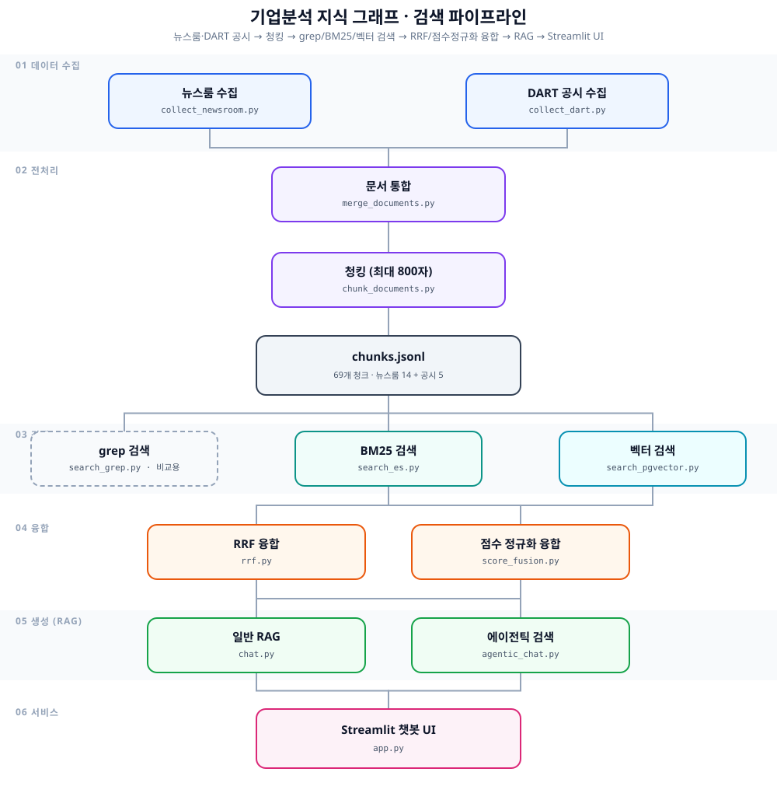
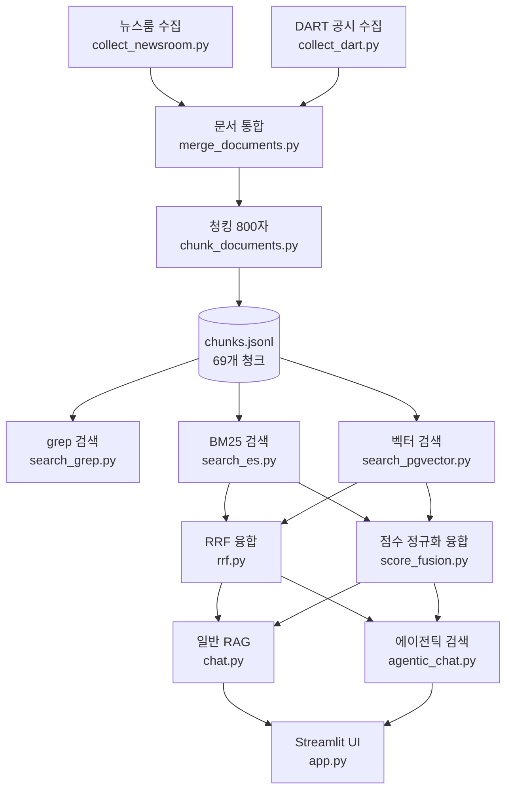

# 기업분석 지식 그래프

> 삼성전자와 SK하이닉스의 공식 뉴스룸 자료 14건, OpenDART 공시 관련 섹션 5건을 같은 JSON 구조로 정리해 grep·BM25·벡터·하이브리드 검색과 RAG 에이전트까지 이어지는 파이프라인.

## 목차

- [파이프라인](#파이프라인)
- [데이터 구조](#데이터-구조)
- [수집 방식](#수집-방식)
  - [뉴스룸](#뉴스룸)
  - [OpenDART](#opendart)
- [실행](#실행)
- [청킹](#청킹)
- [검색 실행](#검색-실행)
  - [grep](#grep)
  - [Elasticsearch BM25](#elasticsearch-bm25)
  - [pgvector](#pgvector)
  - [하이브리드 (RRF)](#하이브리드-rrf)
  - [점수 정규화 융합](#점수-정규화-융합-rrf와의-비교용-대안)
- [기업분석 에이전트 (RAG)](#기업분석-에이전트-rag)
  - [temperature 튜닝](#temperature-튜닝-근거-번호만-나열하는-답-방지)
  - [에이전틱 검색 (재질의 루프)](#에이전틱-검색-재질의-루프)
  - [챗봇 UI](#챗봇-ui)
- [검색 평가 질문](#검색-평가-질문)
- [이후 작업](#이후-작업)
- [RAG로 되는 것, 지식그래프가 필요한 것](#rag로-되는-것-지식그래프가-필요한-것)

## 파이프라인



grep은 검색 방식 비교(위 결과 표)용으로만 쓰고, 이후 RRF·점수 정규화 융합에는 BM25와 벡터 검색 결과만 들어간다. `chat.py`(검색 1회)와 `agentic_chat.py`(재질의 루프)는 같은 융합 결과를 입력으로 받아 서로 다른 방식으로 답변을 만들고, 둘 다 `app.py` 챗봇 UI에서 사이드바로 전환해가며 쓸 수 있다.

<details>
<summary>mermaid 원본 (다이어그램 수정용)</summary>



</details>

## 데이터 구조

```json
{
  "id": "newsroom_001",
  "title": "문서 제목",
  "date": "2026-07-30",
  "source": "newsroom",
  "company": ["삼성전자"],
  "text": "검색에 사용할 본문",
  "url": "원문 URL"
}
```

- `source`: `newsroom` 또는 `dart`
- `text`: 뉴스룸은 실제 기사 본문, DART는 HBM·AI·반도체·투자·실적 키워드와 가까운 섹션
- `url`: 원문을 확인할 수 있는 공식 페이지

## 수집 방식

### 뉴스룸

RSS가 아니라 파이썬 표준 라이브러리인 `urllib.request`로 `config/newsroom_sources.json`에 등록한 공식 URL의 HTML을 내려받는다. 삼성전자 뉴스룸의 `single_contents`, SK하이닉스 뉴스룸의 `post-contents` 영역에서 본문만 추출한다. 이미지, 스크립트, 스타일 같은 검색에 필요하지 않은 요소는 제외한다.

처음 10개 URL은 HBM, AI 반도체, 투자, 실적을 비교하기 위해 직접 선정한 고정 실험 데이터셋이다. 여기에 검색 난이도를 더 현실적으로 만들기 위해 **HBM·AI와 무관한 주제 4건**(삼성전자 가전 테크세미나, 삼성전자·필리핀 B2B 빌딩 솔루션, SK하이닉스 ESG 용수 절감, SK하이닉스 협력사 상생 행사)을 추가했다. 처음부터 키워드로 좁혀 고른 데이터만 쓰면 "질문도 그 키워드로 만들고 정답도 그 안에 있는" 셈이라 검색 성능이 실제보다 좋게 보일 수 있어서, 관련 없는 문서를 섞어 이 편향을 줄이려는 목적이다. 같은 자료로 검색 결과를 반복해서 비교하기 위한 방식이며, 새로운 뉴스가 자동으로 추가되지는 않는다.

### OpenDART

`urllib.request`로 OpenDART 원문 API를 호출한다. `config/dart_filings.json`에는 실험에 사용할 공시 5건의 접수번호를 고정해 두었다. 접수번호는 삼성전자와 SK하이닉스의 공시 목록을 조회한 뒤 분기·반기보고서와 시설투자 공시를 직접 선정한 것이다.

공시 원문에서는 HBM, AI, 반도체, 투자, 실적과 관련해 직접 정한 키워드가 많이 등장하는 연속 문단을 선택한다. 이는 작은 실험 데이터셋을 만들기 위한 임시 규칙이며, 실제 KG 파이프라인에서는 기업 코드와 공시 유형을 기준으로 새 공시 목록과 접수번호를 자동으로 수집해야 한다.

## 실행

저장소 루트의 `.env`에 `DART_API_KEY`를 입력한 뒤 실행한다.

```bash
python3 members/do-dop/labs/03-company-analysis-kg/src/collect_newsroom.py
python3 members/do-dop/labs/03-company-analysis-kg/src/collect_dart.py
python3 members/do-dop/labs/03-company-analysis-kg/src/merge_documents.py
python3 members/do-dop/labs/03-company-analysis-kg/src/chunk_documents.py
```

결과는 Git에 올리지 않는 `data/do-dop/company-analysis-kg/` 아래에 생성된다.

```text
data/do-dop/company-analysis-kg/
├── raw/
│   ├── newsroom/documents.jsonl
│   └── dart/documents.jsonl
└── processed/
    ├── documents.jsonl
    └── chunks.jsonl
```

뉴스룸 자료의 `text`에는 공식 페이지에서 추출한 실제 기사 본문이 들어간다. 사람이 정리한 짧은 설명은 `summary`에 따로 보존한다.

## 청킹

`chunks.jsonl`은 뉴스와 DART를 같은 규칙으로 나눈 검색용 데이터다. 긴 문서 전체를 하나의 검색 단위로 사용하면 질문과 관련 없는 내용까지 섞여 실제 정답 부분을 찾기 어렵다.

- BM25는 관련 단어가 밀집된 부분을 찾기 쉬워진다.
- 벡터 검색은 서로 다른 여러 주제가 하나의 임베딩에 섞이는 일을 줄일 수 있다.
- RAG에서는 필요한 부분만 LLM에 전달해 입력 길이와 불필요한 정보를 줄일 수 있다.

기본값은 최대 800자이며 문단 경계를 우선한다. 문맥이 청크 경계에서 갑자기 끊기지 않도록 이전 문단 하나를 다음 청크에 다시 포함한다. 800자는 확정된 정답이 아니라 초기 실험값이므로, 이후 검색 결과를 보며 다른 크기와 비교할 수 있다.

## 검색 실행

### grep

JSONL 전체가 아니라 각 청크의 `text` 필드에서 고정 문자열을 찾는다. 자연어 질문 전체를 그대로 검색한 결과와, 사람이 고른 `grep_query`를 검색한 결과를 함께 기록한다. 이를 통해 grep 자체는 질문의 의미를 이해하지 못하고 적절한 검색 문자열을 사람이 골라야 한다는 점을 확인할 수 있다.

```bash
python3 members/do-dop/labs/03-company-analysis-kg/src/search_grep.py "HBM4E 12단" --show
python3 members/do-dop/labs/03-company-analysis-kg/src/run_grep_queries.py
```

### Elasticsearch BM25

2주차와 같은 Nori 분석기를 사용한다. 본문뿐 아니라 제목도 검색하고 제목 일치에는 두 배의 가중치를 준다.

```bash
python3 members/do-dop/labs/03-company-analysis-kg/src/index_es.py --recreate
python3 members/do-dop/labs/03-company-analysis-kg/src/search_es.py \
  "AMD의 AI 가속기에 고대역폭 메모리를 공급하는 회사는?" --show
python3 members/do-dop/labs/03-company-analysis-kg/src/run_es_queries.py
```

### pgvector

```bash
cd members/do-dop/labs/03-company-analysis-kg
python3 -m venv .venv
source .venv/bin/activate
pip install -r requirements.txt

python3 src/index_pgvector.py --recreate
python3 src/search_pgvector.py \
  "AMD의 AI 가속기에 고대역폭 메모리를 공급하는 회사는?" --show
python3 src/run_pgvector_queries.py
```

### 하이브리드 (RRF)

BM25와 벡터 검색을 각각 상위 20개(`--pool-size`)까지 뽑은 뒤 Reciprocal Rank Fusion으로 순위를 합친다. 점수(BM25 27.5점 대 코사인 0.75)를 정규화해서 더하는 대신 순위만 사용하므로 스케일이 달라도 공정하게 비교할 수 있다. Elasticsearch와 pgvector가 모두 인덱싱돼 있어야 한다.

```bash
python3 src/run_hybrid_queries.py
```

세 방식의 일괄 실행 결과는 `data/do-dop/company-analysis-kg/results/`에 JSONL로 저장된다. 각 결과에는 상위 청크 ID와 `Hit@5`, `Recall@5`가 포함된다.

### 점수 정규화 융합 (RRF와의 비교용 대안)

RRF는 등수만 보고 점수를 무시하는데, "한쪽에서 압도적인 1등"을 과소평가하는 부작용이 있다(아래 참고). 대안으로 각 리스트의 점수를 0~1로 정규화한 뒤 가중합하는 방식을 `search_common/score_fusion.py`에 구현했다.

```bash
python3 src/run_score_fusion_queries.py
```

검색 실습에서 반복되는 JSONL 입출력, Elasticsearch HTTP 요청, Ollama 임베딩, 평가 지표 계산, RRF·점수 정규화 융합은 `members/do-dop/search_common/`에 분리했다. 데이터 필드와 청킹 규칙은 실습마다 다르므로 각 실습에 남겨둔다.

현재 10개 질문의 결과는 다음과 같다(69개 청크: 뉴스룸 14건 + 공시 5건).

| 검색 방식 | 평균 Hit@5 | 평균 Recall@5 |
|---|---:|---:|
| grep: 자연어 질문 전체 | 0% | 0% |
| grep: 사람이 고른 핵심 문자열 | 100% | 83.3% |
| BM25 | 100% | 96.7% |
| Vector Search | 100% | 100% |
| Hybrid (RRF, k=60) | 100% | 100% |
| Hybrid (점수 정규화) | 100% | 96.7% |

데이터셋이 69개 청크로 작고 평가 질문도 10개뿐이므로 이 수치만으로 검색 방식의 일반적인 우열을 결론 내릴 수는 없다. 현재 결과는 같은 데이터와 정답셋으로 구현이 동작하는지 확인한 기준선이다.

**RRF와 점수 정규화 중 어느 게 더 낫다고 단정할 수 없다는 것도 확인했다.** 위 표는 뉴스룸 문서를 10건에서 14건으로(HBM·AI와 무관한 문서 4건 추가) 늘린 뒤 다시 돌린 결과인데, 문서를 늘리기 전(57개 청크)에는 정확히 반대였다 — RRF가 96.7%, 점수 정규화가 100%였다. 두 방식 모두 q009 하나에서만 흔들리는데, **어떤 방식이 이기는지가 코퍼스에 어떤 문서가 섞여 있는지에 따라 바뀐다.** 그래서 "RRF가 항상 낫다"거나 "점수 정규화가 항상 낫다"고 미리 정할 수 없고, 실제 데이터로 둘 다 돌려서 비교하는 수밖에 없다.

**RRF가 "한쪽에서 압도적인 1등"을 놓치는 사례**: 무관한 멀티홉 질문 실험 중 발견한 것인데, `search_es.py`로 BM25만 돌리면 `dart_005_chunk_01`이 20개 후보 중 압도적 1위(점수 21.56, 2위는 16.41)였다. 근데 벡터 검색 20개 후보에는 이 청크가 아예 없었다. RRF(등수만 봄)로 합치면 "BM25 1등+벡터 없음"인 이 청크가 "BM25 중간+벡터 중간"을 동시에 만족하는 다른 문서들에 밀려 11위로 떨어졌다. 반면 점수 정규화(원점수의 압도적 격차를 그대로 반영)로 합치면 이 청크가 4위로 살아남았다 — RRF의 약점이 실측으로 드러난 사례다. 자세한 내용과 이 질문 자체의 문제(정답이 없었음)는 [failed_questions.md](failed_questions.md) 1번 참고.

## 기업분석 에이전트 (RAG)

질문 → 하이브리드 검색(RRF) → 컨텍스트 조립 → LLM 답변 + 근거 인용까지 이어지는 RAG 루프. LLM은 로컬 Ollama의 `exaone3.5:7.8b`를 쓰고, 시스템 프롬프트로 "근거에 없으면 모른다고 답하라"를 강제해 인용 없는 답변을 막는다.

```bash
ollama pull exaone3.5:7.8b

python3 src/chat.py "삼성전자 HBM4E 12단 제품의 용량은 얼마인가?"
python3 src/chat.py "삼성전자가 요즘 주목하는 기술이나 추진하는 사업은?" --show-context
```

답변 뒤에는 실제로 LLM에 넘긴 근거 청크 목록(제목·날짜·청크 ID·URL)을 그대로 출력해서, 인용 번호와 원문을 직접 대조할 수 있게 했다. `search_hybrid`(`src/hybrid_search.py`)가 검색을, `search_common.llm.chat`이 Ollama 채팅 호출을, `src/prompts.py`가 시스템 프롬프트 문구를 담당한다. 근거마다 소속 회사를 같이 보여주고 "질문이 가리키는 회사와 다른 회사의 근거는 쓰지 마라"를 프롬프트에 명시했다 — 다른 회사의 사실을 섞어 답하는 문제를 발견해서 추가한 방어 장치다(자세한 내용은 아래 링크).

이 에이전트가 못 답하는 질문은 [failed_questions.md](failed_questions.md)에 정리했다.

### temperature 튜닝: 근거 번호만 나열하는 답 방지

UI로 같은 걸 여러 번 물어보다가 가끔 설명 문장 없이 `[4], [5]`처럼 근거 번호만 답으로 나오는 걸 발견했다.

**temperature란**: LLM이 다음 단어를 고를 때, 확률이 가장 높은 단어만 고를지(낮은 temperature) 확률이 낮은 단어도 가끔 고를지(높은 temperature)를 정하는 값이다. Ollama 기본값이 다소 높아서, 가끔 "정상적인 설명 문장" 대신 "근거 번호만 나열"하는 낮은 확률의 경로로 새는 걸로 보였다.

**조치** (`search_common/llm.py`):
- `chat()` 호출에 `options.temperature=0.2`를 기본값으로 추가 — 확률 높은 경로 위주로만 답하게 해서 출력을 더 일관되게 만듦
- 시스템 프롬프트에 "설명 문장 없이 근거 번호만 나열하는 답은 절대 하지 마라"를 명시

적용 후 같은 질문 6회 반복 테스트에서 전부 정상적인 설명 문장으로 답변됨을 확인했다. 창의적인 글쓰기용 챗봇이면 temperature를 높게 쓰는 게 맞지만, 근거 기반으로 정확하게 답해야 하는 RAG 에이전트는 낮게 쓰는 편이 안정적이라는 걸 실측으로 확인한 것.

### 에이전틱 검색 (재질의 루프)

`chat.py`는 검색을 한 번만 하고 끝난다. `agentic_chat.py`는 매 홉마다 LLM에게 "지금 근거로 답할 수 있는지" 먼저 판단시키고, 부족하면 다음에 검색할 질의를 LLM이 직접 만들어 재검색하게 한다(`ANSWER: ...` / `SEARCH: ...` 프로토콜, 최대 `--max-hops`번).

```bash
python3 src/agentic_chat.py \
  "AMD에 HBM4를 공급하는 회사가 최근 분기에 낸 공시에서 투자 계획을 밝힌 반도체 클러스터의 이름은?" \
  --verbose
```

`failed_questions.md`의 멀티홉 질문으로 모델 크기를 바꿔가며 테스트했다.

- **`exaone3.5:2.4b`(2.4B)**: 재질의가 한 번도 일어나지 않았다. 1홉 검색 결과만 보고 바로 `ANSWER`로 판단했는데, 그 답변은 근거 청크의 제목을 그대로 베낀 것이었다 — "지금 근거가 부족하다"는 자기 점검 자체를 못 했다.
- **`exaone3.5:7.8b`(7.8B)**: 재질의는 제대로 일어났고, 재검색으로 정답 문서(`dart_005`, 용인 반도체 클러스터 공시)를 실제로 찾아왔다. 그런데도 끝까지 `ANSWER`를 내지 않고 비슷한 검색어를 계속 바꿔가며 `SEARCH`만 반복하다가(`--max-hops`를 6까지 늘려도 동일) 결국 흐지부지된 답을 냈다.

즉 모델을 키우니 "검색을 다시 해야 하나?"는 잘 판단하게 됐지만, "AMD 공급사=삼성전자, 삼성전자 공시=용인 클러스터, 그러니 정답은 용인 클러스터"라는 **두 사실을 이어붙이는 추론**은 여전히 못 했다 — 정답 문서가 근거 목록에 이미 들어있는데도 못 알아봄. 자세한 내용은 `failed_questions.md` 3번 항목 참고.

**쿼리 분해(`--decompose`)**: 첫 홉 전에 LLM한테 질문을 독립적인 하위 질의로 나누게 시키고, 하위 질의마다 따로 검색해서 근거를 한꺼번에 모은다.

```bash
python3 src/agentic_chat.py \
  "AMD에 HBM4를 공급하면서 엔비디아와 반도체 AI 팩토리도 구축하는 기업은 어디인가?" \
  --decompose --verbose
```

q009(같은 문서 안에 답이 흩어진 얕은 멀티홉)에서는 "① AMD가 HBM4 공급업체는?", "② 엔비디아와 반도체 AI 팩토리 구축하는 기업은?"으로 정확히 쪼개서 필요한 근거를 한 번에 다 모아왔고, 정답(삼성전자)도 바로 냈다.

**판단 과정 기록**: `run_agentic_search`는 매 단계(분해, 검색, SEARCH/ANSWER 판단)를 `trace`로 그대로 반환한다. CLI는 기본적으로 이걸 `data/do-dop/company-analysis-kg/traces/`에 JSON으로 저장한다(`--no-save-trace`로 끌 수 있음). 나중에 "이 에이전트가 왜 이렇게 판단했는지"를 그대로 재구성할 수 있다. Streamlit UI에서는 "에이전트 사고 과정" 접이식 패널로 같은 내용을 볼 수 있다.

### 챗봇 UI

`chat.py`/`agentic_chat.py`의 로직을 그대로 불러다 화면만 씌운 Streamlit 앱. 새 검색·답변 코드는 없다.

```bash
pip install -r requirements.txt
streamlit run src/app.py
```

사이드바에서 "일반 RAG"와 "에이전틱 검색"을 전환해볼 수 있고, 답변마다 참고한 근거를 접이식으로 보여준다.

## 검색 평가 질문

`config/evaluation_queries.json`에는 grep, BM25, 벡터 검색, 하이브리드 검색에 공통으로 사용할 질문 10개가 들어 있다.

- `keyword`: 제품명, 시설명, 수치처럼 정확한 단어가 중요한 질문
- `semantic`: 원문의 표현을 바꿔 물어보는 질문
- `multi_hop`: 서로 다른 문서의 정보를 함께 찾아야 답할 수 있는 질문

`relevant_document_ids`는 정답 원문, `relevant_chunk_ids`는 정답 내용이 실제로 들어 있는 검색 청크다. 검색 결과의 상위 k개 안에 이 청크가 포함됐는지 확인하면 Recall@k를 계산할 수 있다.

## 이후 작업

- [ ] OpenDART에서 기업 코드와 공시 유형으로 새 공시 목록 및 접수번호 자동 수집
- [ ] 공식 뉴스룸의 새 기사 URL 자동 탐색
- [ ] 청크 크기와 중복 범위를 바꿔 검색 품질 비교 (문단 경계는 지키지만 의미 단위는 아님 — semantic chunking 검토)
- [x] grep, BM25, 벡터 검색 결과 비교
- [x] BM25와 벡터 검색 결과를 RRF로 결합
- [ ] RRF `k`를 코퍼스 크기에 맞게 튜닝 (현재 69개 청크에는 k=60이 과함)
- [x] RRF 대신 점수 정규화 방식으로 융합해서 비교
- [x] HBM·AI와 무관한 주제 4건을 추가해 데이터셋 편향 완화 (뉴스룸 10→14건) — 더 다양한 주제(인사, 소송, 지배구조 등)로 계속 확장 필요
- [x] 에이전틱 검색에 쿼리 분해(query decomposition) 첫 홉 추가
- [x] 쿼리 분해가 실제 정답 없는 질문에서 과잉 확신 답변을 막는지 별도로 검증 — 막지 못함, 대신 질문을 벗어난 회피성 답변을 냄 ([failed_questions.md](failed_questions.md) 4번)
- [x] 에이전트의 판단 과정(분해→검색→SEARCH/ANSWER 판단)을 JSON으로 기록 (`data/.../traces/`)
- [ ] 문서에서 기업, 제품, 시설과 관계 추출 (v1 범위, [kg-build-plan.md](kg-build-plan.md) 참고)
- [ ] 추출한 개체와 관계를 지식 그래프에 저장 (Postgres nodes/edges 테이블로 시작)

## RAG로 되는 것, 지식그래프가 필요한 것

이번 실습 전체를 "RAG만으로 충분했던 지점"과 "구조적으로 지식그래프가 필요한 지점"으로 나눠 정리한 문서: [rag-vs-kg-summary.md](rag-vs-kg-summary.md)

## 지식그래프 구축 계획

위 결론을 바탕으로 KG를 어떤 엔티티·관계·저장소로 만들지 정리한 살아있는 계획 문서. 구축을 시작하면서 바뀌는 결정은 여기에 계속 기록한다: [kg-build-plan.md](kg-build-plan.md)
