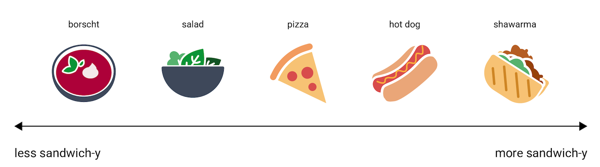
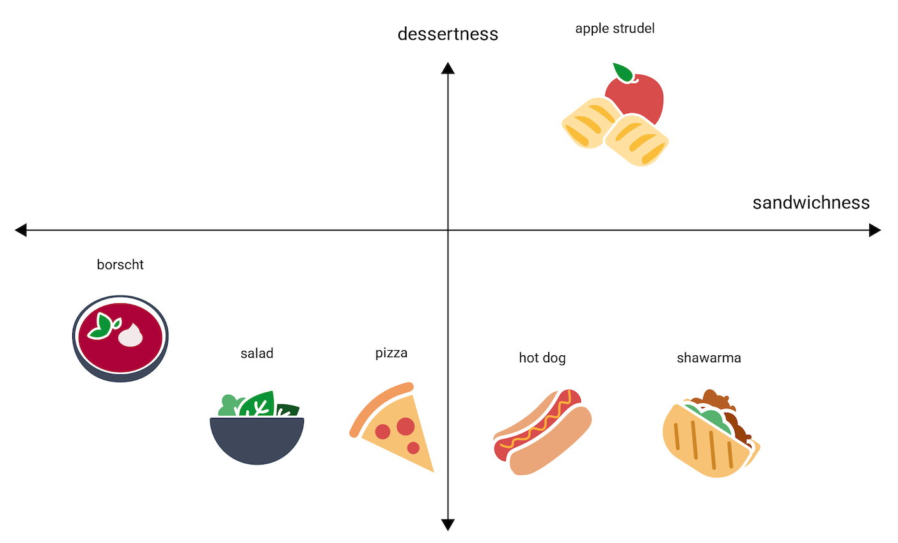
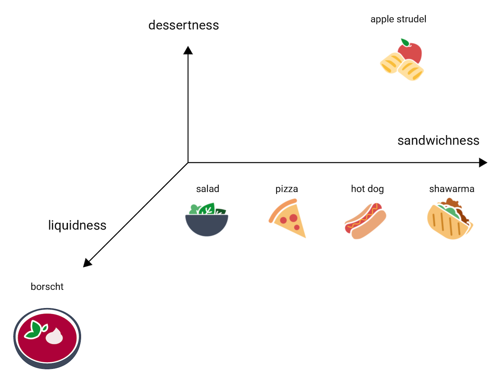

# grep에서 벡터 검색까지: 검색은 왜 문자열 매칭을 넘어서야 할까?

카카오톡 대화에서 예전에 나눈 이야기를 찾는다고 생각해보자. 정확한 단어가 기억난다면 `grep`으로도 원하는 메시지를 찾을 수 있다. 하지만 “그때 저녁에 만나자고 했던 이야기”처럼 내용만 어렴풋이 기억난다면 상황이 달라진다. 실제 대화에는 `저녁 약속` 대신 `퇴근하고 밥 먹자`라고 적혀 있을 수 있기 때문이다.

검색은 단순히 문자열의 존재 여부를 확인하는 데서 끝나지 않는다. 사용자의 표현과 문서의 표현이 다를 수 있고, 여러 결과 중 무엇을 먼저 보여줄지도 결정해야 한다. 이 문제를 기준으로 검색 방식의 발전 과정을 세 단계로 나눠볼 수 있다.

```text
0세대 grep        → 문자열이 일치하는가?
1세대 키워드 검색 → 어떤 문서가 질의와 더 관련 있는가?
2세대 벡터 검색   → 표현이 달라도 의미가 가까운가?
```

## 0세대: grep 문자열 매칭

### grep이 하는 일

`grep`은 입력에서 주어진 패턴과 일치하는 **줄**을 찾아 출력하는 도구다. 고정 문자열뿐 아니라 정규 표현식도 패턴으로 사용할 수 있다.

```text
D1: Kubernetes Kubernetes Kubernetes container
D2: Kubernetes
D3: Kubernetes is a container orchestration platform
```

```bash
grep "Kubernetes" documents.txt
```

세 줄에는 모두 `Kubernetes`라는 문자열이 있으므로 D1, D2, D3가 전부 결과에 포함된다. 여기까지 grep이 답하는 질문은 명확하다.

```text
이 줄이 패턴과 일치하는가? → match / no match
```

### 왜 검색 시스템으로는 부족할까?

#### 1. 표현이 다르면 의미가 같아도 찾지 못한다

grep은 패턴을 찾을 뿐, 문장의 의미를 이해하지 않는다.

```text
질의: "저녁 약속"

D1: 오늘 저녁에 만나자       → 문자열 불일치
D2: 퇴근하고 같이 밥 먹을래? → 문자열 불일치
D3: 저녁 약속 시간을 정하자   → 문자열 일치
```

D1과 D2도 사용자의 검색 의도와 관련될 수 있지만 `저녁 약속`이라는 문자열이 그대로 없기 때문에 검색되지 않는다. 정규 표현식으로 예상되는 변형을 추가할 수는 있어도, 가능한 동의어와 표현을 사람이 미리 나열해야 한다는 문제는 남는다.

#### 2. 관련도 순위가 없다

grep은 일치하는 줄을 찾아주지만 어떤 결과가 질의와 더 관련 있는지는 평가하지 않는다.

```text
질의: Kubernetes

D1: Kubernetes Kubernetes Kubernetes container
D2: Kubernetes
```

D1에는 검색어가 세 번, D2에는 한 번 등장한다. 그래도 기본 grep은 두 문서에 관련도 점수를 매기지 않는다. 일치한 줄을 입력에 나온 순서대로 보여줄 뿐이다.

```text
match / no match
        ↓ 검색 시스템에 더 필요한 것
얼마나 관련 있는가?
        ↓
relevance scoring과 ranking
```

#### 3. 검색 단위가 줄이다

grep은 기본적으로 줄 단위로 동작한다. GNU grep에서는 패턴 목록을 구분하는 데 줄바꿈을 사용하므로, 하나의 패턴이 줄바꿈을 가로질러 일치하도록 표현할 수 없다. 카카오톡 내보내기 파일에서 하나의 대화 맥락이 여러 줄에 걸쳐 있다면 각 줄은 따로 검색된다.

```text
[도연] 이번 스터디는
검색 시스템을 만들어보자
```

`이번 스터디는 검색 시스템`처럼 두 줄에 걸친 내용을 하나의 문장으로 찾기는 어렵다.

### grep이 여전히 좋은 경우

한계가 있다고 해서 grep이 나쁜 도구라는 뜻은 아니다. 로그의 오류 코드, 정확한 ID, 함수 이름처럼 **찾을 표현을 알고 있을 때**는 단순하고 투명하다. 별도의 색인을 만들지 않고 바로 파일을 확인할 수 있어 데이터 검증용 기준선으로도 유용하다.

정리하면 grep은 정확한 문자열을 찾는 도구이고, 우리가 만들려는 검색 시스템은 표현의 차이를 다루고 결과에 순위를 매겨야 한다.

## 1세대: 키워드 검색

키워드 검색은 문서를 검색 가능한 토큰으로 분석하고, 토큰과 문서의 관계를 **역색인(inverted index)**에 저장한다. 질의가 들어오면 관련 문서 후보를 찾고 점수를 계산해 순위를 매긴다.

1세대 키워드 검색을 이해할 때는 다음 세 요소를 구분해서 보는 것이 좋다.

| 요소 | 담당하는 질문 | 역할 |
|---|---|---|
| 토크나이저 | 텍스트를 어떤 검색어 단위로 나눌까? | 문서와 질의를 term으로 변환한다. |
| TF-IDF | 어떤 term이 문서를 잘 대표할까? | 문서 내부 빈도와 전체 문서에서의 희귀도로 가중치를 계산한다. |
| BM25 | 여러 검색 결과를 어떤 순서로 보여줄까? | TF 포화와 문서 길이를 반영해 관련도 점수를 계산한다. |

세 요소는 서로 대체하는 기술이 아니다. **토크나이저가 검색 단위를 만들고, TF-IDF나 BM25가 그 term을 이용해 점수를 계산한다.** 역색인은 이 과정에서 term으로 후보 문서를 빠르게 찾기 위한 공통 자료 구조다.

Elasticsearch의 전체 검색 흐름은 다음과 같이 정리할 수 있다.

```text
문서 입력
  ↓
텍스트 분석: 정규화 → 토큰화 → 토큰 필터링
  ↓
역색인 생성: term → posting list

질의 입력
  ↓ 같은 방식으로 분석
질의 토큰으로 posting list 조회
  ↓
BM25 관련도 점수 계산
  ↓
점수가 높은 문서부터 반환
```

### 토크나이저: 검색 단위 만들기

원문을 그대로 비교하지 않고 검색하기 좋은 단위로 변환한다. 언어와 설정에 따라 소문자 변환, 어간 추출, 불용어 제거 같은 정규화를 적용하고 tokenizer로 텍스트를 term으로 나눈다.

```text
원문: Kubernetes manages containers
토큰: [kubernetes, manages, containers]
```

문서만 분석하는 것이 아니다. 전체 텍스트 검색에서는 질의도 호환되는 방식으로 분석해야 같은 term을 이용해 역색인을 조회할 수 있다.

#### 한국어 토크나이저를 따로 고려해야 하는 이유

영어는 공백과 단어 경계가 비교적 분명하지만, 한국어는 어근에 조사와 어미가 결합한다.

```text
공부하다 / 공부했다 / 공부하는 / 공부를
```

공백만 기준으로 나누면 관련된 표현이 서로 다른 token으로 남을 수 있다. 따라서 한국어 검색에서는 형태소 분석기나 n-gram처럼 목적에 맞는 토크나이저를 선택해야 한다.

### 역색인: term으로 문서 찾기

세 문서를 토큰화했다고 하자.

```text
D1 → kubernetes, manages, containers
D2 → docker, runs, containers
D3 → kubernetes, uses, pods
```

정방향으로 보면 `문서 → 토큰` 구조다. 검색을 위해 이 관계를 뒤집으면 `토큰 → 문서` 구조가 된다.

```text
kubernetes → D1, D3
containers → D1, D2
docker     → D2
pods       → D3
```

이것이 역색인이다. Elasticsearch의 역색인은 크게 고유 term을 모은 **term dictionary**와 각 term이 등장한 문서 ID를 기록한 **posting list**로 볼 수 있다. posting에는 필요에 따라 문서별 등장 횟수와 위치 같은 정보도 들어간다.

질의가 `kubernetes`라면 모든 원문을 처음부터 비교하지 않고 해당 term의 posting list에서 D1과 D3를 후보로 얻는다. 그리고 색인에 저장된 통계를 사용해 각 후보의 관련도 점수를 계산한다.

### TF-IDF: term의 중요도 계산하기

TF-IDF는 **한 문서 안에서는 자주 등장하지만 전체 문서 집합에서는 희귀한 term**에 높은 가중치를 부여한다. 이를 이해하기 위해 TF와 IDF를 차례로 살펴보자.

#### TF(Term Frequency): 문서 안에서 얼마나 자주 등장하는가

검색 term이 한 문서에서 많이 등장할수록 해당 문서가 그 주제를 더 많이 다뤘다고 보는 것이 첫 번째 직관이다. 

```text
tf(t, d) = 문서 d에서 term t가 등장한 횟수
```

```text
D1: Kubernetes deployment
D2: Kubernetes Kubernetes Kubernetes cluster

tf(kubernetes, D1) = 1
tf(kubernetes, D2) = 3
```

단순 TF만 본다면 D2가 더 높은 점수를 받는다. 이 방식은 단어의 순서를 무시하고 각 단어의 등장 횟수만 남기는 **Bag of Words** 관점과 연결된다.

```text
Mary is quicker than John
John is quicker than Mary
```

두 문장의 의미는 다르지만 Bag of Words에서는 같은 단어와 빈도를 가지므로 동일하게 표현된다. 키워드 검색은 문장 전체의 의미보다 어떤 term이 얼마나 등장했는지를 주된 신호로 사용한다.

#### DF와 IDF: 흔한 단어의 영향 줄이기

TF만으로는 모든 term이 똑같이 중요한 것처럼 취급된다. 하지만 거의 모든 문서에 등장하는 `server`보다 소수의 장애 문서에만 등장하는 `CrashLoopBackOff`가 문서를 구별하는 데 더 유용할 수 있다.

이때 사용하는 통계가 **Document Frequency(DF)**다.

```text
df(t) = term t가 등장하는 문서 수
```

DF는 term이 전체에서 등장한 총횟수인 Collection Frequency(CF)와 다르다.

```text
Term A: 한 문서에서 10,000번 등장
cf = 10,000, df = 1

Term B: 10,000개 문서에서 한 번씩 등장
cf = 10,000, df = 10,000
```

CF는 같지만 Term A는 특정 문서를 강하게 구별하고, Term B는 여러 문서에 흔해서 구별력이 낮다. 정보 검색에서는 이런 차이를 문서 수준에서 나타내는 DF를 사용한다.

DF의 역수를 로그로 변환한 값이 **Inverse Document Frequency(IDF)**다.

```text
idf(t) = log(N / df(t))

N     = 전체 문서 수
df(t) = term t가 등장한 문서 수
```

```text
많은 문서에 등장 → df가 큼 → idf가 작음
적은 문서에 등장 → df가 작음 → idf가 큼
```

희귀한 term일수록 문서를 구분하는 강한 신호가 되고, 거의 모든 문서에 등장하는 term의 영향력은 작아진다.

#### TF-IDF 점수: 문서 안에서는 자주, 전체에서는 희귀하게

TF와 IDF를 곱하면 **TF-IDF**가 된다.

```text
tf-idf(t, d) = tf(t, d) × idf(t)
```

TF-IDF 가중치는 다음 조건에서 커진다.

1. term이 특정 문서 안에서 자주 등장한다.
2. 전체 문서 집합에서는 소수의 문서에만 등장한다.

```text
D1: kubernetes deployment kubernetes
D2: kubernetes cloud server
D3: CrashLoopBackOff kubernetes pod

질의: CrashLoopBackOff kubernetes
```

`kubernetes`는 세 문서에 모두 있어 IDF가 낮다. `CrashLoopBackOff`는 D3에만 있어 IDF가 높다. 따라서 질의 term들의 TF-IDF를 합산하면 D3가 높은 점수를 받을 가능성이 크다.

```text
score(q, d) = 질의에 포함된 각 term의 tf-idf(t, d) 합
```

이제 검색 결과를 단순한 일치 여부가 아니라 관련도 점수에 따라 정렬할 수 있다.

```text
D3: 8.3
D1: 5.1
D2: 2.4
```

#### 단순 TF-IDF의 한계

##### term frequency가 과도하게 반영될 수 있다

raw TF에서는 term이 100번 등장하면 한 번 등장했을 때보다 100배 큰 값을 갖는다. 하지만 실제 관련성이 항상 같은 비율로 커지는 것은 아니다.

이를 완화하는 방법 중 하나는 로그를 사용한 sublinear TF scaling이다.

```text
wf(t, d) = 1 + log(tf(t, d))  (tf > 0)
```

term이 처음 몇 번 등장할 때는 중요한 신호지만, 이미 많이 등장한 뒤 한 번 더 등장하는 효과는 작게 만든다.

##### 긴 문서가 유리해질 수 있다

긴 문서는 같은 term이 우연히 더 많이 등장할 가능성이 높다. 문서 D를 그대로 복사해 길이가 두 배인 D'를 만들었을 때 정보는 새로 늘지 않았지만, 단순 TF-IDF 합산 점수는 두 배가 될 수 있다. 따라서 문서 길이를 고려한 정규화가 필요하다.

### BM25: 검색 결과의 관련도 순위 계산하기

**BM25**는 TF와 IDF의 핵심 직관을 유지하면서, 단어 빈도 포화와 문서 길이 정규화를 포함하는 관련도 계산 방식이다. Elasticsearch는 기본 유사도 알고리즘으로 BM25를 사용한다.

개별 질의 term에 대한 대표적인 형태는 다음과 같다.

```text
score(t, d)
             tf(t, d) × (k1 + 1)
= idf(t) × ─────────────────────────────────────
            tf(t, d) + k1 × (1 - b + b × |d|/avgdl)
```

```text
tf(t, d) = 문서 d에서 term t의 빈도
|d|      = 문서 d의 길이
avgdl    = 전체 문서의 평균 길이
k1       = TF 포화 속도를 조절
b        = 문서 길이 보정 정도를 조절
```

핵심은 수식 자체보다 두 가지 보정의 의미다.

#### 단어 빈도 포화

term이 반복될수록 점수는 오르지만 증가 폭은 점점 작아진다. 10번 등장한 문서가 한 번 등장한 문서보다 관련 있을 수는 있어도 무조건 10배 관련 있다고 보지 않는다. `k1`은 이 포화 정도를 조절한다.

#### 문서 길이 정규화

같은 횟수로 term이 등장했다면 짧은 문서에서 차지하는 비중과 긴 문서에서 차지하는 비중은 다르다. BM25는 문서 길이를 전체 평균 길이와 비교해 보정한다. `b`가 0이면 길이 보정을 하지 않고, 값이 커질수록 길이의 영향을 더 많이 반영한다.

흐름을 압축하면 다음과 같다.

```text
TF-IDF
  ├─ 문서 안의 term 빈도
  └─ 전체 문서에서의 term 희귀도
          ↓ 한계 보정
BM25
  ├─ TF가 무한히 선형 증가하지 않도록 포화
  └─ 평균 문서 길이를 기준으로 길이 정규화
```

### 한국어 토크나이저 선택: 형태소 분석과 n-gram

어떤 tokenizer를 사용하느냐에 따라 역색인의 term과 검색 결과가 달라진다. 여기서는 한국어 형태소를 분석하는 nori와 문자 조각을 만드는 n-gram을 비교한다.

#### nori 형태소 분석

Elasticsearch의 nori 분석기는 한국어 텍스트를 형태소 단위로 분석한다. 조사나 어미를 분리하고 품사 정보를 이용해 검색에 덜 유용한 token을 제거할 수 있다. 복합 명사를 어떻게 나눌지도 설정할 수 있다.

```text
입력 예시: 클라우드기술을 공부했습니다
개념적인 분석 결과: [클라우드, 기술, 공부, 하다]
```

장점은 의미 있는 언어 단위를 얻을 수 있다는 점이다. 반면 신조어, 사람 이름, 줄임말, 서비스명처럼 사전에 없는 카카오톡 표현은 의도와 다르게 분석될 수 있다. 사용자 사전이나 분석 설정이 필요한 이유다.

#### n-gram

n-gram은 단어 안에서 길이가 n인 연속된 문자 조각을 sliding window처럼 만든다.

```text
"클라우드스터디"의 2-gram
[클라, 라우, 우드, 드스, 스터, 터디]
```

처음에는 형태소처럼 의미 있는 단위로 나누지 않고, 문자열을 무작정 2글자나 3글자씩 자르는 방식이 정말 검색에 도움이 될지 의문이 들었다. 하지만 검색의 목적은 항상 문장의 의미 구조를 정확히 분석하는 데 있지 않다. 사용자가 단어의 일부만 입력하거나, 사전에 없는 신조어·별명·상품명처럼 형태소 분석기가 제대로 인식하기 어려운 표현을 찾는 상황에서는 오히려 일정한 글자 단위로 나누는 방식이 더 쉽게 일치 지점을 만들 수 있다.

즉, 언어적으로 의미를 잘 나누는 것이 언제나 검색하기 좋은 단위를 만드는 것은 아니다. 의미 분석이 정확하지 않거나 부분 일치가 중요한 경우에는 n-gram처럼 단순하게 나눈 토큰이 검색 가능성을 높일 수 있다는 점이 흥미로웠다. 다만 이렇게 잘게 나누면 관련 없는 문서까지 검색될 가능성도 커지므로, 검색 대상과 목적에 따라 형태소 분석과 함께 선택해야 한다.

| 기준 | nori 형태소 분석 | n-gram |
|---|---|---|
| 검색 단위 | 형태소와 품사 | 연속된 문자 조각 |
| 장점 | 의미 있는 단위와 활용형 처리 | 사전 밖 표현과 부분 일치 |
| 약점 | 사전과 분석 품질에 의존 | 색인 크기와 오탐 증가 |
| 카카오톡 예시 | 일반 문장, 조사·어미가 붙은 표현 | 별명, 줄임말, 고유명사, 불완전한 검색어 |

둘 중 하나만 골라야 하는 것은 아니다. 본문 검색에는 nori를 사용하고, 부분 검색이 필요한 별도 필드에는 n-gram을 적용하는 방식도 가능하다.

## 2세대: 벡터 검색

키워드 검색은 질의와 문서에 같은 term이 있을 때 잘 동작한다. 그런데 `저녁 약속`을 검색했는데 실제 대화에는 `퇴근하고 밥 먹자`라고 적혀 있다면 어떨까? 뜻은 비슷하지만 겹치는 term이 없어 문서를 놓칠 수 있다.

벡터 검색은 이런 경우에 도움이 된다. 텍스트를 숫자 배열로 바꾸고, **임베딩 공간에서 서로 얼마나 가까운지**를 비교한다.

```text
질의: 저녁 약속

키워드 검색 → 같은 term이 있는가?
벡터 검색   → 의미가 가까운 위치에 있는가?
```

### 임베딩: 텍스트를 벡터로 표현하기

임베딩 모델에 문장을 넣으면 숫자 목록이 나온다. 이 숫자 목록을 **벡터**라고 한다.

```text
"퇴근하고 밥 먹자"
          ↓ 임베딩 모델
[0.13, -0.52, 0.81, ..., 0.27]
```

벡터 검색에서는 이 숫자의 뜻을 하나씩 해석하지 않는다. 두 문장에서 만든 벡터가 얼마나 가까운지만 비교한다.

예를 들어 `퇴근하고 밥 먹자`와 `저녁에 같이 식사할래?`는 표현은 다르지만 뜻은 비슷하다. 임베딩 모델은 이런 문장들이 비슷한 벡터를 갖도록 만든다. 그래서 검색어와 똑같은 단어가 없어도 관련된 문장을 찾을 수 있다.

### 임베딩 공간: 의미를 좌표로 배치하기

여러 음식을 공간에 배치해보자. 먼저 `샌드위치다움`이라는 축 하나만 만든다.



그런데 축 하나로는 달콤한 아펠슈트루델을 제대로 표현하기 어렵다. 그래서 `디저트다움` 축을 하나 더 추가한다. 이제 핫도그와 모양은 비슷하지만 디저트라는 차이도 나타낼 수 있다.



여기에 `액체다움` 축까지 더하면 수프인 보르시의 특징도 따로 표현할 수 있다.



차원이 늘어나면 더 많은 특징을 함께 표현할 수 있다. 텍스트 임베딩도 문장의 여러 특징을 많은 차원에 나눠 담는다.

다만 실제 축에 `약속다움`이나 `음식다움` 같은 이름이 붙어 있는 것은 아니다. 각 차원이 무슨 뜻인지 사람이 해석하기 어려운 경우가 많다.

### 거리로 유사도 계산하기

임베딩 공간에서는 두 벡터 사이의 거리를 계산할 수 있다. 가까우면 관련성이 높고, 멀면 관련성이 낮다고 보는 것이다.

```text
"오늘 저녁에 만날까?"  ─┐
                         ├─ 가까움
"퇴근하고 밥 먹자"      ─┘

"쿠버네티스 노드 장애"  ─── 멂
```

텍스트 벡터의 유사도를 비교할 때는 코사인 유사도를 자주 사용한다. 코사인 유사도는 두 벡터의 크기보다 방향이 얼마나 비슷한지를 측정한다.

```text
cosine_similarity(A, B) = (A · B) / (||A|| × ||B||)
```

값이 클수록 두 벡터의 방향이 비슷하다. pgvector의 `<=>` 연산자는 코사인 **거리**를 반환하므로 값이 작을수록 가깝다. 코사인 유사도가 필요하다면 `1 - cosine distance`로 바꿀 수 있다.

코사인 유사도 외에도 유클리드 거리와 내적을 사용할 수 있다.

| 측정 방식 | 무엇을 비교하는가? | 값의 해석 |
|---|---|---|
| 코사인 유사도 | 두 벡터 사이의 방향 | `1`에 가까울수록 같은 방향, `0`이면 직각, `-1`에 가까울수록 반대 방향 |
| 유클리드 거리 | 공간에서 두 점 사이의 직선거리 | `0`이면 같은 위치이고 값이 작을수록 가까움 |
| 내적(Dot Product) | 방향과 벡터 크기 | 일반적으로 값이 클수록 더 유사하다고 해석하지만 벡터의 정규화 여부에 영향을 받음 |

측정 방식이 달라지면 검색 순서도 달라질 수 있다. 그래서 임베딩 모델에 맞는 거리 함수를 사용해야 한다.

### 벡터 검색 과정

문서와 질의는 **같은 임베딩 모델**로 변환해야 한다. 모델이 다르면 좌표를 만드는 기준도 달라지기 때문이다.

문서는 지하철 노선도 좌표인데 질의는 위도와 경도 좌표라면 둘 사이의 거리를 계산할 수 없다. 임베딩도 마찬가지다.

```text
문서 입력
  ↓ 청킹
검색할 문서 조각
  ↓ 임베딩 모델
문서 벡터 저장

질의 입력
  ↓ 같은 임베딩 모델
질의 벡터
  ↓ 유사도 계산
가까운 문서 벡터를 관련도순으로 반환
```

여기서 청킹과 토크나이징은 역할이 다르다. 청킹은 긴 문서를 검색하기 좋은 크기로 나눈다. 토크나이저는 그 조각을 모델이 읽을 수 있는 토큰으로 바꾼다.

조각이 너무 크면 여러 주제가 한 벡터에 섞인다. 반대로 너무 작으면 의미를 판단할 문맥이 부족해진다.

### 벡터 데이터베이스: 벡터와 원문을 함께 관리하기

벡터 데이터베이스는 임베딩을 저장하고 비슷한 벡터를 빠르게 찾는 시스템이다. 벡터만 저장해서는 원래 내용을 알 수 없다. 그래서 원문을 가리키는 정보와 메타데이터도 함께 관리한다.

```text
문서 조각: "민수와 부산에서 돼지국밥을 먹었다"
임베딩: [0.21, -0.73, 0.18, ...]
원문 참조: message-1042
메타데이터: sender=민수, date=2026-08-10, chatroom=여행
```

일반적인 처리 흐름은 다음과 같다.

1. 원문을 검색할 단위로 나눈 뒤 임베딩 모델로 벡터를 만든다.
2. 벡터와 원문 참조, 메타데이터를 벡터 데이터베이스에 저장하고 인덱스를 구성한다.
3. 검색 질의를 같은 임베딩 모델로 벡터화한다.
4. 질의 벡터와 가까운 후보를 찾고 해당 벡터에 연결된 원문을 가져온다.
5. 필요하면 별도의 모델이나 점수로 후보를 다시 정렬하는 reranking을 수행한다.

벡터 데이터베이스도 결국 데이터베이스다. 제품에 따라 CRUD, 백업, 접근 제어와 확장 기능을 제공한다. 즉 벡터만 보관하는 것이 아니라, 원문과 메타데이터까지 검색 가능한 상태로 관리한다.

#### 벡터 인덱스와 벡터 데이터베이스의 차이

벡터 인덱스와 벡터 데이터베이스는 같은 말이 아니다.

```text
벡터 인덱스
= 가까운 벡터를 빠르게 찾기 위한 자료 구조와 탐색 방법

벡터 데이터베이스
= 벡터를 저장·관리·검색하는 전체 시스템
```

FAISS는 벡터 검색 라이브러리다. HNSW는 인덱스를 만드는 알고리즘이다. 벡터 데이터베이스는 이보다 범위가 넓다. 벡터 저장소와 인덱스에 더해 메타데이터, CRUD, 필터와 보안 같은 기능도 포함할 수 있다.

```text
Vector Database
├─ vector와 원문 참조 저장
├─ metadata와 filter
├─ CRUD, backup, access control
├─ 확장과 분산 처리
└─ Vector Index
   └─ HNSW, IVF 등의 검색 구조
```

pgvector는 독립된 데이터베이스가 아니다. PostgreSQL에 `vector` 자료형과 벡터 검색 기능을 더하는 확장이다. 덕분에 기존 테이블, 트랜잭션, SQL 필터와 벡터 검색을 함께 사용할 수 있다.

#### 메타데이터 필터링

의미가 비슷하다는 조건만으로는 검색 범위를 정확히 정하기 어렵다. 이럴 때 발신자, 날짜, 채팅방 같은 메타데이터를 함께 사용한다.

```text
질의: "부산에서 먹었던 음식"

vector similarity
+ sender = "민수"
+ date >= "2026-08-01"
```

벡터 검색은 `먹었던 음식`과 의미가 가까운 메시지를 찾는다. 메타데이터 필터는 그중 민수가 특정 기간에 보낸 메시지만 남긴다. 모든 조건을 임베딩 하나로 해결하지 않아도 되는 것이다.

### 정확 검색과 ANN

가장 단순한 검색 방법은 모든 문서 벡터와 질의 벡터를 비교하는 것이다. 정확하지만 문서가 많아질수록 계산량도 늘어난다.

**ANN(Approximate Nearest Neighbor)**은 가까울 가능성이 높은 후보만 먼저 살펴본다. 일부 결과를 놓칠 수 있지만 훨씬 빠르다. 벡터가 수백만 개 이상이라면 이런 근사 검색이 필요해진다.

| 방식 | 탐색 방법 | 장점 | 단점 |
|---|---|---|---|
| 정확 검색 | 모든 문서 벡터와 비교 | 가장 가까운 결과를 정확히 찾음 | 데이터가 커질수록 느려짐 |
| ANN | 가까울 가능성이 높은 후보만 비교 | 대규모 데이터에서 빠름 | 일부 결과를 놓칠 수 있음 |

여기서 **코사인 유사도와 HNSW를 헷갈리면 안 된다.** 코사인 유사도는 가까움을 계산하는 기준이다. HNSW는 가까운 후보를 빠르게 찾는 방법이다.

```text
코사인 유사도 = 거리 또는 유사도 판단 기준
HNSW          = 후보를 빠르게 찾는 ANN 인덱스
```

#### HNSW: 계층형 근접 그래프

HNSW(Hierarchical Navigable Small World)는 대표적인 ANN 인덱스다. 가까운 벡터들을 여러 층의 **근접 그래프(proximity graph)**로 연결한다. 부모와 자식이 정해진 트리보다는, 가까운 점끼리 길을 만든 그래프에 가깝다.

```text
상위 계층:  A ───────── F          노드가 적어 멀리 빠르게 이동
                       ↓
중간 계층:  A ── C ─── F ── H      검색 범위를 점차 좁힘
                       ↓
하위 계층:  A-B-C-D-E-F-G-H-I      가까운 이웃을 세밀하게 탐색
```

검색은 노드가 적은 상위층에서 시작한다. 여기서 목적지 근처까지 빠르게 이동한다. 그다음 한 층씩 내려가며 범위를 좁힌다. 마지막에는 가장 촘촘한 아래층에서 가까운 후보를 찾는다.

덕분에 모든 벡터를 하나씩 비교하지 않아도 된다. pgvector에서도 HNSW 인덱스를 사용할 수 있다.

정확 검색과 ANN 사이에는 **재현율(recall)과 속도**의 trade-off가 있다. 더 많이 탐색하면 정답을 찾을 가능성이 커지지만 느려진다. 적게 탐색하면 빨라지지만 가까운 결과를 놓칠 수 있다. 이 비율은 데이터와 인덱스 설정에 따라 달라진다.

### 벡터 검색 파이프라인

지금까지의 요소를 실제 검색 단계에 맞춰 정리하면 다음과 같다.

```text
1. Indexing
   원문 → 청킹 → 임베딩 → 벡터와 메타데이터 저장 → ANN 인덱스 구성

2. Querying
   질의 → 같은 모델로 임베딩 → 메타데이터 필터 → 가까운 후보 탐색

3. Post-processing
   후보의 정확한 거리 계산 → 원문 조회 → 필요하면 reranking → 최종 결과
```

인덱싱 단계에서는 HNSW, IVF, 양자화 같은 방법으로 검색 구조를 만든다. 쿼리 단계에서는 가까운 후보를 찾는다. 후처리 단계에서는 후보를 다시 점수화하거나 reranker로 순서를 다듬는다.

### 정적 임베딩과 문맥

word2vec은 **정적 임베딩**의 예다. 각 단어에 하나의 벡터를 부여한다. 비슷한 문맥에 자주 등장한 단어들은 임베딩 공간에서도 가까워지도록 학습한다.

하지만 단어마다 벡터가 하나뿐이면 여러 의미를 구분하기 어렵다. `은행`이 금융기관을 뜻할 때도, 강둑을 뜻할 때도 같은 벡터를 쓰게 된다.

문장 임베딩과 문맥 임베딩은 주변 내용까지 함께 본다. 그래서 질의와 문서 조각의 전체 의미를 비교하는 검색에 더 잘 맞는다.

임베딩은 학습 목표와 데이터에 따라서도 달라진다. 채식 여부를 구분할 때와 식사 시간을 추천할 때는 중요하게 보는 특징이 다르다.

따라서 임베딩이 세상의 의미를 그대로 담는다고 생각하면 안 된다. **모델이 주어진 데이터와 과업에서 배운 유사성**을 담는다고 보는 편이 정확하다.

### 벡터 검색이 놓치는 것

벡터 검색도 항상 키워드 검색보다 좋은 것은 아니다. 정확한 오류 코드, 주문 번호, 함수 이름처럼 문자열 자체가 중요한 질의는 키워드 검색이 더 정확할 수 있다. 임베딩 모델이 학습하지 못한 도메인 용어나 미묘한 숫자 차이를 놓칠 수도 있고, 가까운 벡터를 찾았더라도 왜 가까운지 설명하기 어렵다.

그래서 실제 시스템에서는 키워드 검색과 벡터 검색을 함께 사용하는 **하이브리드 검색**도 많이 사용한다.

```text
키워드 검색 → 정확한 term과 희귀한 표현에 강함
벡터 검색   → 표현이 달라도 의미가 가까운 문서에 강함
하이브리드  → 두 검색 결과나 점수를 결합
```

## 마치며: 문자열 일치에서 의미 유사성으로

| 방식 | 저장 구조 | 찾는 기준 | 순위 | 현재 확인한 한계 |
|---|---|---|---|---|
| grep | 원본 텍스트 파일 | 문자열 또는 정규 표현식 일치 | 없음 | 표현 불일치, 줄 단위 검색 |
| Elasticsearch 키워드 검색 | 원문 문서, term dictionary, posting list | 분석된 질의 term과 BM25 점수 | 있음 | 같은 의미의 다른 단어를 직접 연결하지 못함 |
| 벡터 검색 | 문서, 메타데이터, 임베딩 벡터, 벡터 인덱스 | 임베딩 공간에서의 거리 | 있음 | 정확한 문자열과 수치에 약할 수 있고 결과 설명이 어려움 |

지금까지의 흐름에서 가장 중요한 변화는 검색이 `일치 여부를 확인하는 문제`에서 `관련도를 계산하고 순위를 정하는 문제`로 확장됐다는 점이다.

grep은 찾고 싶은 표현을 정확히 알고 있을 때 여전히 훌륭한 도구다. 역색인은 term으로 문서에 빠르게 접근할 수 있게 만들었고, TF-IDF는 term의 빈도와 희귀도를 이용해 문서에 점수를 부여했다. BM25는 여기에 빈도 포화와 문서 길이 보정을 더해 실제 검색에 더 적합한 랭킹을 만든다. 임베딩은 텍스트를 벡터로 변환하고, 벡터 검색은 공간에서 가까운 문서를 찾아 표현이 다른 경우까지 검색 범위를 넓힌다.

벡터 검색은 이 한계를 없앤 것이 아니라 검색 기준을 하나 더 추가했다. `저녁 약속`과 `퇴근하고 밥 먹자`처럼 표현이 다른 문서를 연결할 수 있지만, 정확한 ID나 오류 코드를 찾는 일은 여전히 문자열 검색과 키워드 검색이 잘한다. 결국 중요한 것은 세대를 단순히 교체하는 것이 아니라, 찾으려는 정보에 맞는 검색 기준을 선택하고 필요하다면 결합하는 것이다.

## 참고 자료

- [GNU grep 공식 매뉴얼](https://www.gnu.org/software/grep/manual/grep.html)
- [Elastic Docs: How full-text search works](https://www.elastic.co/docs/solutions/search/full-text/how-full-text-works)
- [Elastic Docs: Similarity settings](https://www.elastic.co/docs/reference/elasticsearch/index-settings/similarity)
- [Elastic Docs: nori analyzer](https://www.elastic.co/docs/reference/elasticsearch/plugins/analysis-nori-analyzer)
- [Elastic Docs: nori tokenizer](https://www.elastic.co/docs/reference/elasticsearch/plugins/analysis-nori-tokenizer)
- [Elastic Docs: n-gram tokenizer](https://www.elastic.co/docs/reference/text-analysis/analysis-ngram-tokenizer)
- [Stanford NLP: Introduction to Information Retrieval, Chapter 6](https://nlp.stanford.edu/IR-book/pdf/06vect.pdf)
- [Google Machine Learning Crash Course: 임베딩 공간과 정적 임베딩](https://developers.google.com/machine-learning/crash-course/embeddings/embedding-space?hl=ko)
- [Pinecone Learn: What is a Vector Database?](https://www.pinecone.io/learn/vector-database/)
- [Malkov & Yashunin: Efficient and robust approximate nearest neighbor search using Hierarchical Navigable Small World graphs](https://arxiv.org/abs/1603.09320)
- [pgvector 공식 문서](https://github.com/pgvector/pgvector)
