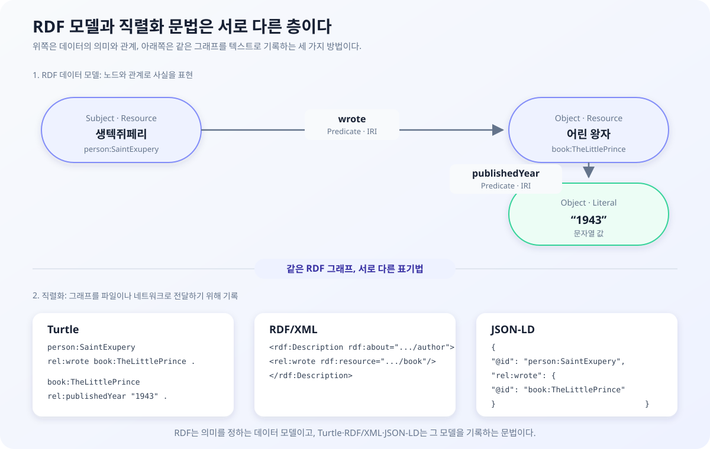
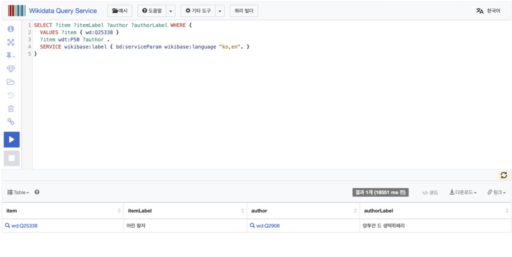
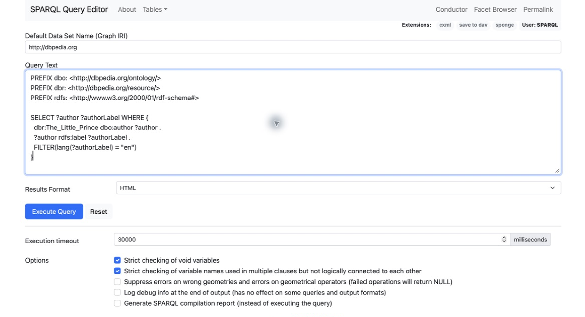
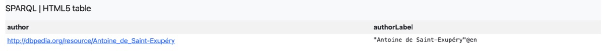

# 시맨틱 웹에서 지식그래프까지

> **4주차 문서 읽는 순서**
>
> 1. 현재 문서: 시맨틱 웹에서 기업 KG까지의 변천사
> 2. [온톨로지와 추론: 저장된 사실에서 새로운 지식으로](04-ontology-and-inference.md): RDFS·OWL·TBox/ABox·추론
> 3. [관계형 데이터베이스와 그래프 데이터 모델](04-relational-and-graph-data-models.md): RDBMS·그래프 탐색·프로퍼티 그래프와 RDF 비교

검색창에 책 제목을 입력하면 저자, 출판 연도와 줄거리를 설명하는 문서를 쉽게 찾을 수 있다.

> 『어린 왕자』의 저자는 누구이며, 이 책은 언제 출간되었는가?

이 질문 자체는 검색만으로도 쉽게 답할 수 있다. 하지만 검색 결과를 재사용 가능한 데이터로 만들려면 생텍쥐페리와 『어린 왕자』가 각각 어떤 대상인지, 두 대상은 어떤 관계인지, 1943은 무엇을 뜻하는 값인지 구분해야 한다.

    생텍쥐페리 ──저술했다──▶ 어린 왕자
    어린 왕자 ──유형────▶ 책
    어린 왕자 ──출판연도──▶ "1943"

시맨틱 웹과 지식그래프는 바로 이 문제에서 출발한다. 웹의 정보를 단순한 문자열과 문서가 아니라, **식별 가능한 대상과 의미 있는 관계**로 표현하려는 시도다.

## 먼저 보는 전체 흐름

    기존 웹
      사람이 읽는 문서와 하이퍼링크
          ↓
    Semantic Web
      기계가 처리할 수 있는 의미와 관계
          ↓
    RDF · RDFS · OWL · SPARQL
      사실 표현, 의미 체계, 추론, 질의 표준
          ↓
    Linked Data
      URI를 이용해 분산된 데이터 연결
          ↓
    DBpedia · Wikidata
      웹에서 공개된 지식그래프
          ↓
    Google Knowledge Graph
      문자열이 아닌 실세계 엔티티 중심 검색
          ↓
    Enterprise Knowledge Graph
      특정 조직과 업무 문제에 맞춘 지식그래프
          ↓
    LLM + KG · GraphRAG
      문서 이해 능력과 명시적 관계의 결합
          ↓
    Operational Ontology
      데이터·관계·업무 행동을 하나의 모델로 연결

이것은 앞의 기술이 사라지고 새로운 기술로 대체된 역사가 아니다. 시맨틱 웹이 제시한 엔티티 식별, 관계 표현과 데이터 연결 원칙이 공개 지식그래프와 기업 KG로 이어졌고, LLM 시대에는 문서 검색 및 생성 기술과 결합되고 있다.

## 1. 기존 웹은 문서를 연결한다

기존 웹의 핵심 단위는 문서다. HTML은 사람이 읽을 제목, 문단과 이미지를 표현하고, 하이퍼링크는 한 문서에서 다른 문서로 이동하게 한다.

    HTML 문서 A ── hyperlink ──▶ HTML 문서 B

웹페이지에 다음 문장이 있다고 가정해보자.

    생텍쥐페리는 『어린 왕자』를 썼다.

사람은 이 문장을 읽고 다음 사실을 자연스럽게 이해한다.

- 생텍쥐페리는 사람이며 작가다.
- 『어린 왕자』는 책이다.
- 두 대상 사이에는 저술 관계가 있다.

컴퓨터에는 이 문장이 우선 문자열이다. 생텍쥐페리가 사람인지, 『어린 왕자』가 책인지, 썼다는 표현이 저술 관계인지 문장 자체만으로 보장되지 않는다.

따라서 기존 웹에서의 기본 질문은 다음과 같다.

> 관련 내용이 어느 문서에 있는가?

시맨틱 웹과 지식그래프는 질문의 단위를 바꾼다.

> 어떤 대상이 다른 대상과 어떤 관계를 맺고 있는가?

## 2. 시맨틱 웹은 무엇을 바꾸려고 했을까

2001년 Tim Berners-Lee, James Hendler, Ora Lassila는 「The Semantic Web」에서 웹의 정보를 기계가 처리할 수 있는 의미 구조로 확장하는 비전을 제시했다.

시맨틱 웹을 “컴퓨터가 사람처럼 글을 이해하는 웹”이라고만 설명하면 다소 모호하다. 더 구체적으로는 다음을 가능하게 하려는 웹이다.

1. 사람, 기업, 제품과 개념을 고유하게 식별한다.
2. 각 대상이 어떤 종류인지 표현한다.
3. 대상 사이의 관계를 명시한다.
4. 서로 다른 데이터셋이 같은 대상을 가리킬 수 있게 한다.
5. 정의된 규칙을 이용해 새로운 사실을 도출한다.
6. 표준 질의 언어로 연결된 데이터를 탐색한다.

이를 책의 제목·저자·출판 연도 같은 **서지 데이터**로 표현하면 다음과 같다.

    생텍쥐페리 ──유형─────▶ 작가
    어린 왕자 ──유형─────▶ 책
    생텍쥐페리 ──저술했다──▶ 어린 왕자
    어린 왕자 ──출판연도──▶ "1943"

이제 생텍쥐페리와 『어린 왕자』는 문장 속 문자열이 아니라 각각 식별된 대상이다. 저술했다는 표현도 두 대상을 잇는 명시적인 관계가 된다.

### 시맨틱 HTML과는 무엇이 다른가

시맨틱 HTML도 태그를 이용해 의미를 나타낸다.

    <article>
      <header>
        <h1>블로그 제목</h1>
        <time datetime="2023-10-05">2023년 10월 5일</time>
      </header>
      <section>
        <p>본문 내용</p>
      </section>
    </article>

article, header, time과 section은 문서 안에서 각 부분의 역할을 알려준다. 검색엔진과 스크린 리더도 문서 구조를 더 쉽게 파악할 수 있다.

하지만 시맨틱 HTML과 RDF 기반 시맨틱 웹은 다루는 범위가 다르다.

| 구분 | 표현하는 의미 |
|---|---|
| 시맨틱 HTML | 문서 안에서 제목·본문·시간이 담당하는 역할 |
| 시맨틱 웹 | 문서 밖의 실세계 대상과 대상 사이의 관계 |

시맨틱 HTML은 시맨틱 웹을 이해하기 좋은 출발점이지만, HTML5 태그만으로 웹 전체의 엔티티와 관계를 연결할 수 있는 것은 아니다.

## 3. RDF: 문장을 사실의 그래프로 바꾸는 방법

RDF(Resource Description Framework)는 웹에서 자원에 관한 정보를 표현하고 교환하기 위한 W3C 표준 데이터 모델이다.

이름을 세 부분으로 나누면 RDF의 역할을 이해하기 쉽다.

### Resource: 무엇을 설명하는가

웹페이지뿐 아니라 사람, 책, 기업, 장소와 개념처럼 식별할 수 있는 모든 대상이다. 지식그래프에서는 대체로 엔티티(Entity)에 해당한다.

### Description: 어떻게 설명하는가

자원이 가진 속성과 다른 자원과의 관계를 설명한다.

    생텍쥐페리 ──저술했다──▶ 어린 왕자
    어린 왕자 ──출판연도──▶ "1943"

### Framework: 어떤 공통 구조를 사용하는가

자원의 설명을 기계가 동일한 방식으로 처리할 수 있도록 **주어–서술어–목적어**라는 공통 구조를 제공한다.

RDF는 이 구조를 정의하는 데이터 모델이다. Turtle, JSON-LD와 RDF/XML은 같은 RDF 그래프를 파일에 기록하는 서로 다른 문법이다.

### IRI: 자원과 관계를 구별하는 고유한 이름

IRI(Internationalized Resource Identifier)는 자원과 관계를 구별하는 고유한 이름이다. 표시 이름은 중복되거나 언어에 따라 달라질 수 있지만 IRI는 같은 대상을 계속 가리킨다.

```text
표시 이름: 어린 왕자 / The Little Prince / Le Petit Prince
IRI:      https://example.org/book/the-little-prince
```

긴 IRI는 prefix로 줄여 쓸 수 있다.

```turtle
@prefix book: <https://example.org/book/> .

book:the-little-prince
```

`book:the-little-prince`는 자원을 가리키는 IRI이고, `"1943"`은 문자열·숫자·날짜처럼 값 자체를 나타내는 Literal이다.

### Triple: RDF 그래프를 이루는 기본 단위

RDF 그래프는 트리플의 집합이다.

| 구성요소 | 역할 | 사용할 수 있는 값 |
|---|---|---|
| Subject | 설명하려는 대상 | IRI 또는 Blank Node |
| Predicate | 속성이나 관계 | IRI |
| Object | 연결된 대상 또는 값 | IRI, Blank Node 또는 Literal |

    Subject          Predicate     Object
    생텍쥐페리 ──저술했다────▶ 어린 왕자

Turtle 문법으로 표현하면 다음과 같다.

```turtle
@prefix person: <https://example.org/person/> .
@prefix book: <https://example.org/book/> .
@prefix rel: <https://example.org/relation/> .

person:SaintExupery rel:wrote book:TheLittlePrince .
book:TheLittlePrince rel:publishedYear "1943" .
```

첫 번째 트리플의 목적어는 다른 자원을 가리키는 IRI이고, 두 번째 트리플의 목적어는 값인 Literal이다.

다음 구조도는 방금 작성한 Triple과 Turtle 표현을 기준으로, 동일한 RDF 그래프를 RDF/XML과 JSON-LD로도 기록할 수 있다는 관계를 보여준다.



RDF의 핵심은 데이터를 그래프 모양으로 그리는 데 있지 않다. 대상과 관계를 식별 가능한 이름으로 표현하여 서로 다른 데이터가 같은 대상을 참조할 수 있게 하는 데 있다.

## 4. RDF만 있으면 온톨로지가 되는가

RDF는 개별 사실을 표현할 수 있지만, Person과 Book이 무엇이며 wrote 관계를 어디에 사용할 수 있는지는 충분히 설명하지 않는다.

    생텍쥐페리 wrote 어린 왕자

이 트리플 하나만으로는 다음 내용을 알 수 없다.

- 생텍쥐페리는 Person인가?
- 『어린 왕자』는 Book인가?
- wrote의 주어에는 어떤 종류의 대상이 올 수 있는가?
- writtenBy라는 반대 방향 관계도 존재하는가?

이 의미 체계를 표현하는 것이 RDFS와 OWL이다.

이 절에서는 변천사를 이해하는 데 필요한 수준만 다룬다. TBox/ABox, 공리, 개방 세계 가정과 추론의 자세한 설명은 [온톨로지와 추론: 저장된 사실에서 새로운 지식으로](04-ontology-and-inference.md)에서 이어진다.

### RDFS: 기본적인 분류와 계층

RDFS는 클래스, 하위 클래스, 속성, domain과 range를 정의한다.

    Book subClassOf CreativeWork
    Author subClassOf Person
    wrote domain Person
    wrote range Book

『어린 왕자』가 Book이고 모든 Book이 CreativeWork라면, 『어린 왕자』가 CreativeWork라는 사실을 추가로 도출할 수 있다.

    어린 왕자 instanceOf Book
    Book subClassOf CreativeWork
    ───────────────────────────
    어린 왕자 instanceOf CreativeWork

### OWL: 더 풍부한 관계와 공리

OWL은 동치, 역관계, 대칭 관계, 추이 관계와 카디널리티 같은 더 풍부한 공리를 표현한다.

    writtenBy inverseOf wrote

다음 사실이 있다면:

    생텍쥐페리 wrote 어린 왕자

역관계 정의를 이용해 다음 사실을 추론할 수 있다.

    어린 왕자 writtenBy 생텍쥐페리

명시적으로 저장하지 않은 사실을 기존 사실과 규칙으로 도출하는 과정을 추론이라고 한다.

### 스키마와 온톨로지의 차이

스키마는 주로 데이터가 어떤 구조를 가져야 하는지 정의한다.

    Book에는 title과 publishedYear 필드가 있다.

온톨로지는 도메인의 개념과 관계가 무엇을 의미하는지, 어떤 규칙을 갖는지 표현한다.

    Book은 CreativeWork의 하위 개념이다.
    writtenBy는 wrote의 역관계다.
    wrote의 주어는 Person이고 목적어는 Book이다.

둘의 경계는 항상 명확하지 않다. 중요한 것은 필드 형식을 정의하는 데서 끝나는지, 아니면 도메인의 의미와 추론 규칙까지 표현하는지다.

## 5. SPARQL: 그래프에서 관계 패턴 찾기

데이터를 그래프로 표현했다면 관계를 따라 질의할 방법이 필요하다. SPARQL은 RDF 그래프를 위한 표준 질의 언어다.

예를 들어 소설에 해당하는 책과 해당 책을 쓴 저자를 함께 찾을 수 있다.

    SELECT ?author ?book
    WHERE {
      ?author rel:wrote ?book .
      ?book rel:genre rel:Novella .
    }

이 질의는 이름이 정확히 일치하는 문장을 검색하지 않는다. 다음 그래프 패턴을 만족하는 값을 찾는다.

    Author ──wrote──▶ Book
    Book ──genre──▶ Novella

관계형 데이터베이스가 테이블의 행과 열을 중심으로 질의한다면, SPARQL은 트리플의 연결 패턴을 중심으로 질의한다.

## 6. Linked Data: 그래프를 웹 전체로 확장하기

RDF로 데이터를 표현하더라도 각 데이터셋이 고립되어 있다면 웹 전체의 지식망은 만들어지지 않는다. Linked Data는 서로 다른 데이터셋을 URI로 연결하기 위한 원칙이다.

[Tim Berners-Lee의 Linked Data 원칙](https://www.w3.org/DesignIssues/LinkedData.html)은 다음 네 문장으로 요약된다.

1. 사물의 이름으로 URI를 사용한다.
2. 사람들이 조회할 수 있도록 HTTP URI를 사용한다.
3. URI를 조회하면 표준을 이용한 유용한 정보를 제공한다.
4. 다른 URI로 링크하여 더 많은 정보를 발견하게 한다.

일반 웹의 링크와 Linked Data의 링크는 다음 차이가 있다.

    HTML
      문서 A ──이동──▶ 문서 B

    RDF
      사람 ──attends──▶ 대학교
      대학교 ──locatedIn──▶ 도시

HTML 링크는 주로 다른 문서로 이동할 위치를 제공한다. RDF의 predicate는 이동 경로뿐 아니라 두 자원 사이의 관계가 무엇인지 표현한다.

### URI를 조회한다는 것

Linked Data의 URI는 대상을 식별하는 이름인 동시에, 그 대상에 관한 정보를 찾아가는 출발점으로 사용할 수 있다. URI에 HTTP 요청을 보내 대상에 관한 설명을 가져오는 과정을 dereferencing이라고 한다.

    생텍쥐페리의 URI
        ↓ HTTP 요청
    생텍쥐페리를 설명하는 HTML 또는 RDF
        ↓
    이름·출생지·저서와 다른 URI 발견

여기서 생텍쥐페리라는 사람과 생텍쥐페리를 설명하는 문서는 서로 다른 대상이다. 사람 자체를 인터넷으로 내려받을 수는 없기 때문에 서버는 그 사람에 관한 HTML이나 RDF 문서를 제공한다.

    실세계 대상
      생텍쥐페리라는 사람

    설명 문서
      생텍쥐페리의 정보를 담은 HTML 또는 RDF

서버는 필요에 따라 303 리다이렉트로 설명 문서의 주소를 안내하거나, 요청 형식에 따라 HTML·RDF 등 서로 다른 표현을 반환할 수 있다. 세부 방식보다 **대상과 그 대상을 설명하는 문서는 다르다**는 점이 핵심이다.

### 링크를 따라 탐색하는 그래프

Linked Data가 지향하는 것은 한 자원에서 출발해 관계를 따라 새로운 정보를 발견할 수 있는 Web of Data다.

    사람
      ↓ memberOf
    연구실
      ↓ partOf
    대학교
      ↓ locatedIn
    도시

초기 소셜 온톨로지인 FOAF는 사람과 사람의 관계를 RDF로 표현했다.

    :Doyeon foaf:knows :Minji .

rdfs:seeAlso를 이용하면 특정 자원에 관한 추가 정보를 다른 문서에서 찾을 수 있다는 사실도 알려줄 수 있다.

    :Minji rdfs:seeAlso <https://example.org/people/minji> .

### 탐색성과 일관성의 트레이드오프

그래프를 어느 방향에서도 쉽게 탐색하려고 같은 관계를 여러 문서에 기록하면 데이터 중복과 동기화 문제가 생길 수 있다.

    탐색성 증가
        ↕
    데이터 중복과 일관성 관리 비용 증가

모든 세부 정보를 한 URI의 응답에 담을 필요는 없다. 핵심 관계와 다음 탐색 경로를 제공하고, 대규모 상세 데이터는 별도 데이터셋으로 분리할 수 있다.

특정 자원에서 링크를 따라가는 방식은 발견에 유용하지만, 수백만 개의 트리플에서 조건에 맞는 대상을 한꺼번에 찾기에는 비효율적이다. 대규모 RDF 데이터셋은 SPARQL endpoint를 제공해 전체 데이터에 직접 질의할 수 있다.

| 방식 | 적합한 목적 |
|---|---|
| URI Dereferencing | 특정 자원에서 출발해 연결된 정보 발견 |
| SPARQL Endpoint | 전체 데이터셋에서 관계 패턴 검색 |

## 7. DBpedia와 Wikidata: 공개 지식그래프의 등장

시맨틱 웹과 Linked Data의 원칙은 공개 지식베이스로 이어졌다.

### DBpedia: 문서를 구조화된 데이터로

[DBpedia](https://www.dbpedia.org/about/)는 Wikipedia의 infobox 등 반구조화된 정보를 추출해 RDF로 공개한 프로젝트다. 2007년 시작되었고, 여러 공개 데이터셋이 DBpedia URI에 연결되면서 Linked Open Data 생태계의 중심 허브 중 하나가 되었다.

    Wikipedia 문서
      ↓ 정보 추출
    DBpedia RDF
      ↓ 외부 URI 연결
    Linked Open Data

DBpedia는 사람이 작성한 문서에서 기계가 질의할 수 있는 지식베이스를 구축할 수 있음을 보여주었다.

### Wikidata: 처음부터 구조화된 공동 지식베이스로

[Wikidata](https://www.wikidata.org/wiki/Help:Data_model)는 2012년에 시작된 공동 편집 지식베이스다. Wikipedia 문서에서 사후에 정보를 추출하는 방식보다, 사람들이 처음부터 구조화된 statement를 편집한다.

    Item(Q)
    └─ Statement
       ├─ Property(P)
       ├─ Value
       ├─ Qualifier
       ├─ Reference
       └─ Rank

Qualifier는 관계가 적용되는 시점과 범위를 표현한다. Reference는 그 주장을 뒷받침하는 출처를 연결한다.

    선수 ──PLAYS_FOR──▶ 팀
            ├─ 시작일
            ├─ 종료일
            └─ 출처

단순히 “선수 A가 팀 B에서 뛰었다”라고 저장하는 것보다 언제 유효한 관계인지, 어느 자료에 근거하는지를 함께 저장하는 것이 중요하다. Wikidata의 statement 구조는 이 문제를 잘 보여준다.

### 실제로 접속해서 질의할 수 있을까

두 프로젝트는 설명용 사례에 그치지 않는다. 현재도 공개 SPARQL endpoint에 접속해 브라우저에서 직접 질의를 실행할 수 있다. 별도의 프로그램을 설치할 필요도 없다.

- [Wikidata Query Service](https://query.wikidata.org/): Wikidata의 항목과 속성을 조회한다.
- [DBpedia SPARQL Endpoint](https://dbpedia.org/sparql): Wikipedia에서 추출한 DBpedia RDF를 조회한다.

예를 들어 Wikidata에서 『어린 왕자』의 저자를 찾는 질의는 다음과 같다. `Q25338`은 『어린 왕자』, `P50`은 저자 속성을 뜻한다.

```sparql
SELECT ?item ?itemLabel ?author ?authorLabel WHERE {
  VALUES ?item { wd:Q25338 }
  ?item wdt:P50 ?author .
  SERVICE wikibase:label { bd:serviceParam wikibase:language "ko,en". }
}
```

실행 결과로 『어린 왕자』와 저자 앙투안 드 생텍쥐페리가 반환된다. 같은 질문을 DBpedia에는 DBpedia의 URI와 온톨로지 속성을 사용해 표현할 수 있다.



```sparql
PREFIX dbo: <http://dbpedia.org/ontology/>
PREFIX dbr: <http://dbpedia.org/resource/>
PREFIX rdfs: <http://www.w3.org/2000/01/rdf-schema#>

SELECT ?author ?authorLabel WHERE {
  dbr:The_Little_Prince dbo:author ?author .
  ?author rdfs:label ?authorLabel .
  FILTER(lang(?authorLabel) = "en")
}
```



이 질의도 `Antoine de Saint-Exupéry`를 반환한다. 같은 사실을 묻지만 두 지식그래프가 사용하는 식별자와 데이터 모델이 다르므로 질의 표현도 달라진다는 점을 확인할 수 있다.



## 8. Google Knowledge Graph: Things, not strings

2012년 Google은 [Knowledge Graph를 소개하며](https://blog.google/products-and-platforms/products/search/introducing-knowledge-graph-things-not/) “things, not strings”라는 표현을 사용했다.

기존 검색은 타지마할이라는 문자열이 포함된 문서를 찾는다. 그러나 같은 문자열이 건축물, 음악가, 카지노나 식당을 의미할 수 있다.

    "타지마할"
         ↓ 엔티티 식별
    건축물 | 음악가 | 카지노 | 식당

Knowledge Graph는 사용자가 어떤 실세계 대상을 의미하는지 식별하고, 그 대상의 속성과 관련 엔티티를 검색 결과에 활용한다.

    타지마할
    ├─ 유형 → 건축물
    ├─ 위치 → 아그라
    ├─ 국가 → 인도
    └─ 건설자 → 샤 자한

여기서 중요한 변화는 시맨틱 웹의 범용적인 비전을 검색이라는 구체적인 제품 문제에 적용했다는 점이다. 웹 전체가 하나의 완전한 온톨로지에 합의하기를 기다리지 않고, Google이 자체적으로 데이터를 수집·정제하고 엔티티를 통합해 사용자 경험을 개선했다.

## 9. 시맨틱 웹은 실패했고 KG는 성공했을까

시맨틱 웹이 완전히 실패했다고 말하는 것은 정확하지 않다. RDF, OWL, SPARQL과 Linked Data는 여전히 사용되고 있고, 엔티티와 관계를 중심으로 데이터를 바라보는 사고방식은 Knowledge Graph에 남아 있다.

다만 웹 전체가 공통된 의미망으로 연결되는 초기 비전은 기대만큼 대중화되지 못했다.

### 데이터 제공 비용

웹사이트 운영자는 HTML 이외에도 RDF와 온톨로지를 작성하고 계속 관리해야 했다. 데이터 제공자가 얻는 즉각적인 이익에 비해 비용이 컸다.

### 공통 의미에 대한 합의

같은 조직을 표현해도 여러 개념이 존재한다.

    Company
    LegalEntity
    Brand
    Subsidiary
    BusinessUnit

웹 전체에서 이 개념과 관계의 의미를 합의하는 것은 기술 문제인 동시에 조직과 사회의 합의 문제다.

### 품질과 신뢰

데이터가 공개되어 있어도 작성자가 누구인지, 현재도 유효한지, 충돌하는 사실 중 무엇을 믿어야 하는지 판단해야 한다.

### 현실 세계의 모호성

기업의 경쟁 관계, 핵심 전략과 조직 문화처럼 경계가 모호한 개념은 엄격한 논리 규칙만으로 표현하기 어렵다.

기업 KG는 이 문제를 범위를 좁혀 해결했다.

| 시맨틱 웹의 초기 비전 | 기업 Knowledge Graph |
|---|---|
| 웹 전체의 지식 연결 | 특정 조직과 도메인에 집중 |
| 여러 조직이 의미에 합의 | 한 조직이 모델과 품질을 통제 |
| 범용적인 자동 추론 | 검색·추천·분석 등 명확한 목적 |
| 공개 표준 중심 | 내부 ID와 자체 스키마도 허용 |
| 보편적인 의미 표현 | 측정 가능한 제품·업무 가치 중심 |

따라서 “시맨틱 웹은 실패하고 KG가 성공했다”보다는 다음과 같이 정리하는 편이 적절하다.

> 웹 전체를 하나의 의미망으로 만들려던 비전은 제한적으로 실현되었지만, 그 과정에서 정립된 엔티티 식별·관계 표현·온톨로지·질의 원칙은 목적이 분명한 지식그래프로 이어졌다.

## 10. RDF와 프로퍼티 그래프: 두 가지 구현 철학

기업 KG가 확산되면서 RDF 트리플 스토어뿐 아니라 Neo4j 같은 프로퍼티 그래프도 널리 사용되었다.

| 관점 | RDF | Property Graph |
|---|---|---|
| 기본 단위 | Subject–Predicate–Object | Node–Relationship–Property |
| 식별 | URI·IRI 중심 | 내부 ID와 애플리케이션 키도 사용 |
| 의미 체계 | RDFS·OWL | 애플리케이션 스키마 |
| 대표 질의 | SPARQL | Cypher·GQL 계열 |
| 강점 | 상호운용성·표준 의미론·추론 | 직관적인 관계 속성·경로 탐색 |

예를 들어 인수 관계에 날짜와 금액을 붙인다고 가정한다.

프로퍼티 그래프에서는 관계에 속성을 직접 넣기 쉽다.

    (CompanyA)-[:ACQUIRED {
      announcedAt: "2026-01-01",
      price: 100000000
    }]->(CompanyB)

RDF에서는 인수 사건이나 statement를 별도 자원으로 만들어 관련 정보를 연결하는 방식이 자연스럽다.

    Acquisition01 ──acquirer──▶ CompanyA
    Acquisition01 ──target────▶ CompanyB
    Acquisition01 ──announcedAt▶ 2026-01-01

둘은 완전히 배타적인 선택이 아니다. RDF와 온톨로지 관점으로 의미를 설계하고 실제 저장과 질의는 프로퍼티 그래프로 구현할 수도 있다.

RDBMS의 외래키·재귀 CTE와 두 그래프 모델의 질의 방식까지 비교한 내용은 [관계형 데이터베이스와 그래프 데이터 모델](04-relational-and-graph-data-models.md)에서 확인할 수 있다.

## 11. LLM 시대에 지식그래프가 다시 주목받는 이유

LLM은 비정형 문서를 읽고 요약하는 데 강하다. RAG를 사용하면 모델이 학습하지 않은 최신 문서도 검색해 답변에 활용할 수 있다.

하지만 관련 문서를 잘 찾는 것과 사실의 관계를 정확하게 연결하는 것은 다른 문제다.

    생텍쥐페리 ──저술했다──▶ 어린 왕자
    조지 오웰 ──태어났다──▶ 모티하리

검색 결과에 두 작가의 문서가 함께 들어오면 LLM은 『어린 왕자』의 저자와 조지 오웰의 출생지를 잘못 연결할 수 있다. 지식그래프에서는 저술과 출생 관계가 각 작가 노드에 연결되므로 생텍쥐페리에서 시작한 탐색에 조지 오웰의 출생지가 자연스럽게 섞이지 않는다.

    RAG
      관련 원문을 유연하게 검색하고 설명

    Knowledge Graph
      엔티티와 관계를 명시하고 경로를 제한

    결합
      그래프로 관계를 찾고 RAG로 원문과 맥락을 제공

### GraphRAG는 기존 KG와 같은가

Microsoft가 2024년 발표한 [GraphRAG](https://arxiv.org/abs/2404.16130)는 문서에서 엔티티와 관계를 추출해 그래프를 만들고, 커뮤니티 탐지와 계층적 요약을 이용해 문서 전체에 대한 글로벌 질문에 답하는 접근이다.

    문서
    → 엔티티·관계 추출
    → 그래프 구성
    → 커뮤니티 탐지
    → 커뮤니티 요약
    → 글로벌 질문 응답

GraphRAG의 그래프와 지속적으로 관리되는 도메인 KG는 목적이 다를 수 있다.

| GraphRAG 그래프 | 도메인 Knowledge Graph |
|---|---|
| 문서에서 자동 생성 | 도메인 기준에 따라 설계·검토 |
| 검색과 요약을 위한 인덱스 | 재사용 가능한 지식 기반 |
| 문서 변경에 따라 다시 생성 가능 | 식별자·출처·시점·품질을 지속 관리 |

둘은 경쟁 관계가 아니다. GraphRAG가 문서의 전체 흐름과 주제를 찾고, 도메인 KG가 검증된 관계와 출처를 관리하는 방식으로 결합할 수 있다.

## 12. Palantir Ontology: 지식을 업무 행동으로 연결하기

[Palantir Foundry Ontology](https://www.palantir.com/docs/foundry/object-link-types/type-reference)는 현실의 대상과 관계뿐 아니라 사용자가 실행할 수 있는 행동까지 모델링한다.

    Object Type
      사람, 조직, 제품, 문서처럼 그래프에서 식별·관리하는 대상

    Link Type
      소속, 생산, 인용처럼 두 대상을 연결하는 의미 있는 관계

    Action Type
      Claim 승인, 관계 수정, 중복 엔티티 병합처럼 그래프 데이터를 변경하는 작업

RDF와 OWL이 사실의 의미와 추론에 초점을 둔다면, Palantir Ontology는 데이터 모델을 실제 애플리케이션, 권한과 업무 행동까지 연결한다.

지식그래프가 단순히 읽기 위한 데이터베이스에 머무르지 않고 운영 과정의 중심 모델로 확장된 사례다.

## 마무리

시맨틱 웹에서 지식그래프까지의 흐름은 다음 질문에 대한 답을 찾아온 과정이다.

> 문서를 연결하는 것에서 더 나아가, 문서 속 대상과 사실을 어떻게 식별하고 연결할 것인가?

RDF는 사실을 트리플로 표현했고, RDFS와 OWL은 개념과 규칙을 정의했으며, SPARQL은 관계 패턴을 질의하게 했다. Linked Data는 이 그래프들을 URI로 웹에 연결하려 했다. DBpedia와 Wikidata는 공개 지식그래프를 만들었고, Google과 기업들은 범위를 좁혀 검색·추천·분석이라는 구체적인 제품 문제에 적용했다.

LLM 시대에는 다시 역할 분담이 중요해졌다. RAG와 LLM은 문서를 유연하게 찾고 설명하는 데 강하고, Knowledge Graph는 엔티티·관계·출처를 명시적으로 관리하는 데 강하다.

## 참고자료

- [The Semantic Web — Scientific American, 2001](https://www.scientificamerican.com/article/the-semantic-web/)
- [RDF 1.1 Primer — W3C](https://www.w3.org/TR/rdf11-primer/)
- [RDF 1.1 Concepts and Abstract Syntax — W3C](https://www.w3.org/TR/rdf11-concepts/)
- [RDF Schema 1.1 — W3C](https://www.w3.org/TR/rdf-schema/)
- [OWL 2 Web Ontology Language Primer — W3C](https://www.w3.org/TR/owl2-primer/)
- [SPARQL 1.1 Overview — W3C](https://www.w3.org/TR/sparql11-overview/)
- [Linked Data — Tim Berners-Lee](https://www.w3.org/DesignIssues/LinkedData.html)
- [DBpedia 소개](https://www.dbpedia.org/about/)
- [Wikidata Data Model](https://www.wikidata.org/wiki/Help:Data_model)
- [Google Knowledge Graph: Things, not strings](https://blog.google/products-and-platforms/products/search/introducing-knowledge-graph-things-not/)
- [From Local to Global: A Graph RAG Approach to Query-Focused Summarization](https://arxiv.org/abs/2404.16130)
- [Palantir Object and Link Types](https://www.palantir.com/docs/foundry/object-link-types/type-reference)
- [시맨틱 웹이란 무엇인가 — Brunch](https://brunch.co.kr/@oursophy/23)
