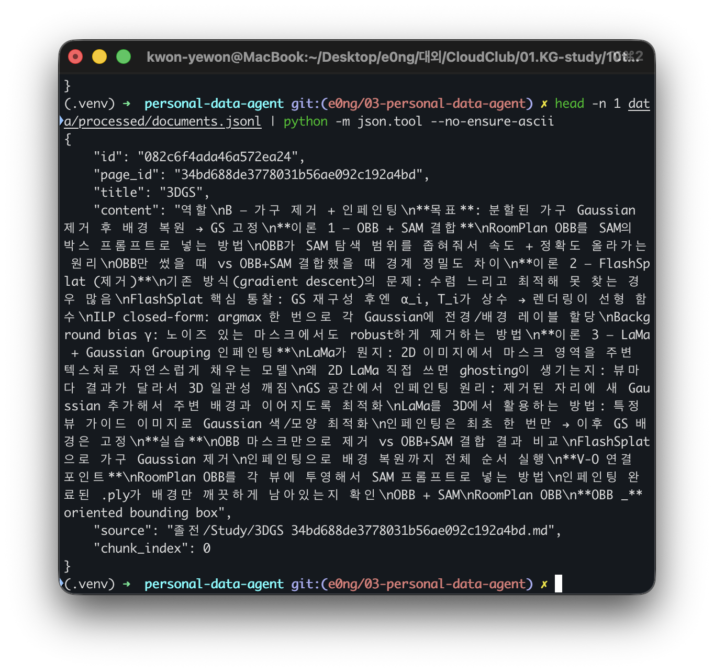
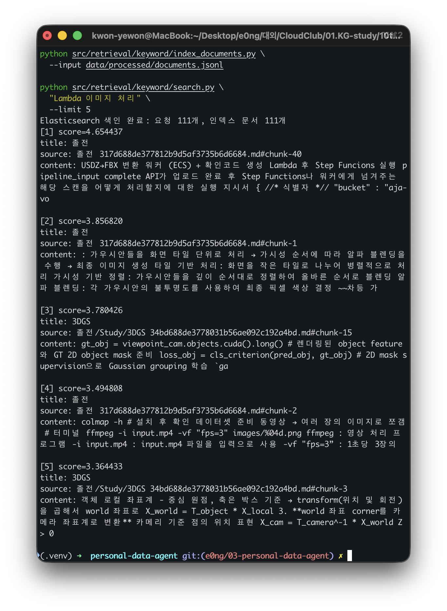
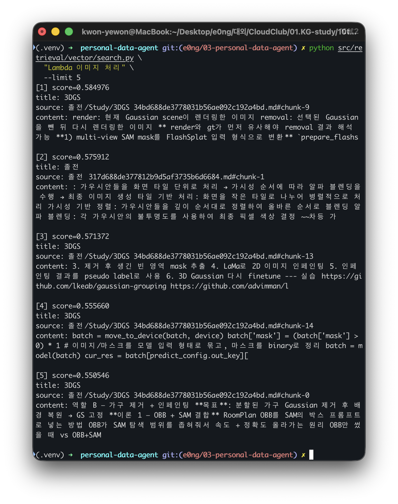
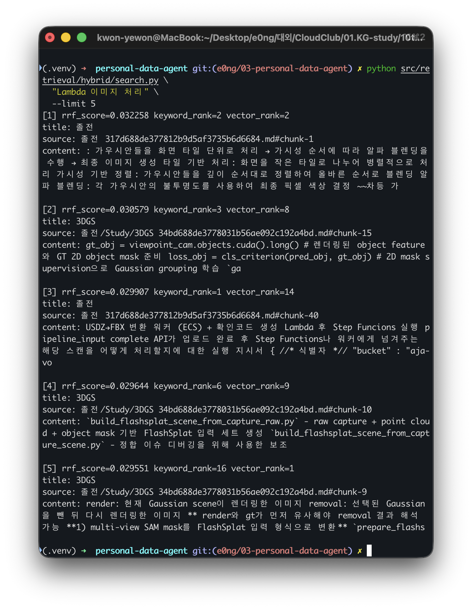

# 개인 데이터 검색 에이전트

> 관련 노트: `../../notes/02-search-generations.md`

## 목표

흩어진 프로젝트 기록에서 과거의 검토 내용과 결정 사항을 찾아 근거와 함께 답변하는 개인 데이터 에이전트를 만든다.

| 단계 | 목표 | 상태 |
|---|---|---|
| 1 | Notion Markdown을 공통 JSONL 청크로 변환 | 완료 |
| 2 | Elasticsearch BM25 키워드 검색 | 완료 |
| 3 | pgvector 벡터 검색 | 완료 |
| 4 | BM25와 벡터 결과를 RRF로 융합 | 완료 |
| 5 | 세 검색 방식의 Recall@K 비교 | 완료 |
| 6 | 검색 결과를 컨텍스트로 조립해 답변과 근거 제공 | 완료 |

## 환경

- 언어 / 런타임: Python 3.13
- 주요 라이브러리: Elasticsearch Python Client 8.15.1, psycopg 3.2.10
- 검색 서버: Elasticsearch 8.15.0 + Nori, PostgreSQL 16 + pgvector
- 임베딩: Ollama, `bge-m3` 1024차원
- 컨테이너 실행: Docker Compose
- 외부 서비스 / 키: 없음


## 1. 환경 준비

```bash
python3 -m venv .venv
source .venv/bin/activate
pip install -r requirements.txt
```

```bash
docker compose up -d --build --wait elasticsearch
```

## 2. 데이터 처리

> 졸업 전시 관련 메모용 노션 페이지

### 파싱

Notion 페이지 markdown 파일을 읽고 파일명에서 `page_id`를 추출한다.

```
title   = AWS - Lambda
page_id = 344d688de377812b9d5af3735b6d6684
source  = 원본 파일의 상대 경로
```

Notion에서 특정 상위 페이지를 `Markdown & CSV`로 내보내고 `Include subpages`를 활성화한다. 압축을 푼 폴더는 `data/raw/notion_data/`에 둔다. 원본과 처리 결과는 개인정보 보호를 위해 Git에서 제외한다.

### 정제

불필요한 항목을 제거한다.

- 제목 기호 `#`
- 목록 기호 `-, *, +`
- 인용 기호 `>`
- 링크 URL
- 이미지 문법
- 코드 블록을 감싸는 ``` 기호
- 연속된 빈 줄
- 본문 첫 줄에 반복된 페이지 제목

### 청킹

최대 1,000자 단위로 분할한다.

- overlap 사용 X
- 줄 단위 처리

```bash
python src/notion/parse_export.py data/raw/notion_data
```

데이터베이스 CSV도 포함하려면 `--include-csv`를 사용한다. 같은 데이터가 Markdown과 CSV에 모두 존재하면 중복될 수 있으므로 결과를 확인한다.

```bash
python src/notion/parse_export.py data/raw/notion_data --include-csv
```

청크 크기는 기본 1,000자이며 필요하면 `--chunk-size`로 변경한다.

```bash
python src/notion/parse_export.py data/raw/notion_data --chunk-size 800
python -m unittest discover -s tests -v
```

### 메타 데이터 구성 및 직렬화

```json
{
  "id": "청크 고유 ID",
  "page_id": "Notion 페이지 ID",
  "title": "페이지 제목",
  "content": "청크 본문",
  "source": "원본 파일의 상대 경로",
  "chunk_index": 0
}
```



⬇️ JSONL로 저장

```
{"id":"a1","page_id":"344d688de377812b9d5af3735b6d6684","title":"AWS - Lambda","content":"첫 번째 청크","source":"Study/AWS - Lambda 344d688de377812b9d5af3735b6d6684.md","chunk_index":0}
{"id":"a2","page_id":"344d688de377812b9d5af3735b6d6684","title":"AWS - Lambda","content":"두 번째 청크","source":"Study/AWS - Lambda 344d688de377812b9d5af3735b6d6684.md","chunk_index":1}
```

| 필드 | 역할 |
|---|---|
| `id` | BM25·벡터·RRF가 같은 청크를 식별하는 안정적인 ID |
| `page_id` | 파일명에서 추출한 Notion 페이지 ID |
| `title` | 페이지 제목 |
| `content` | 검색하고 임베딩할 청크 본문 |
| `source` | 인용에 사용할 원본 파일의 상대 경로 |
| `chunk_index` | 페이지 안에서의 청크 순서 |

## 3. 키워드 검색



### 키워드 색인

`Elasticsearch`의 `personal-documents` 인덱스에 저장한다. 필드 성격에 따라 타입을 나눈다.

- `title`, `content` : 형태소 분석 대상 → `text` + Nori
- `id`, `page_id`, `source` : 정확한 값 식별 필요 → `keyword`

```bash
python src/retrieval/keyword/index_documents.py \
  --input data/processed/documents.jsonl

python src/retrieval/keyword/search.py \
  "Lambda 이미지 처리" \
  --limit 5
```

색인 스크립트는 기본적으로 `personal-documents` 인덱스를 다시 생성해 같은 데이터를 중복 저장하지 않는다. 기존 인덱스에 문서를 덮어쓰려면 `--keep-index`를 사용한다.

### 검색

- Nori 형태소 분석 → 질문 토큰화
- BM25 점수 계산 (제목 점수에 가중치 2배 적용)

```text
제목 점수: BM25(title) × 2
본문 점수: BM25(content)

최종 점수 ≈ 둘 중 높은 점수
```

멀티 필드 질의는 기본값인 `best_fields`로 동작하므로 두 점수를 더하지 않고 더 높은 쪽을 최종 점수로 쓴다. 결과에는 이후 벡터 검색과 RRF에서 재사용할 `id`, `rank`, `score`와 출처 정보가 포함된다.

```bash
python src/retrieval/keyword/search.py \
  "Lambda 이미지 처리" \
  --limit 5 \
  --json
```

## 데이터 저장 구조

Elasticsearch와 pgvector에는 동일한 JSONL 청크를 저장한다. 두 검색 결과가 같은 `id`를 반환해야 RRF로 결합할 수 있다.

```text
documents.jsonl
       │
       ├─ Elasticsearch: personal-documents
       │   └─ id, page_id, title, content, source, chunk_index
       │
       └─ PostgreSQL: document_chunks
           └─ 같은 필드 + embedding vector(1024)
```

## 4. 벡터 검색



### 벡터 색인

PostgreSQL과 로컬 임베딩 모델을 준비한다.

```bash
docker compose up -d --wait postgres
ollama pull bge-m3
```

#### `bge-m3` 임베딩

```text
document_chunks
├─ id
├─ page_id
├─ title
├─ content
├─ source
├─ chunk_index
└─ embedding vector(1024)
```

제목 + 본문을 결합한 뒤 임베딩한다. 처음 실행하면 111개 청크를 모두 임베딩하므로 시간이 걸릴 수 있다.

```bash
python src/retrieval/vector/index_documents.py \
  --input data/processed/documents.jsonl
```

#### HNSW 인덱스 구성

```sql
CREATE INDEX document_chunks_embedding_hnsw
ON document_chunks
USING hnsw (embedding vector_cosine_ops);
```

- `hnsw`: 가까운 벡터를 탐색할 인덱스 방식
- `vector_cosine_ops`: 가까움을 판단할 때 코사인 거리 사용

청킹이 111개뿐이라 상황에 따라 쓰이지 않을 수 있음 — 실제 사용 여부는 PostgreSQL 쿼리 플래너가 결정한다.

### 검색

- `bge-m3` 모델로 질문을 1024차원 벡터로 바꿈
- 문서-질문 사이의 코사인 거리 계산 후 정렬
→ `코사인 유사도 = 1 - 코사인 거리`

```sql
ORDER BY embedding <=> 질문_벡터
```

```bash
python src/retrieval/vector/search.py \
  "이미지를 업로드한 뒤 어떤 과정으로 처리했지?" \
  --limit 5
```

RRF에서 사용할 공통 JSON 결과가 필요하면 `--json`을 추가한다.

```bash
python src/retrieval/vector/search.py \
  "이미지를 업로드한 뒤 어떤 과정으로 처리했지?" \
  --limit 5 \
  --json
```

## 5. 하이브리드 검색 - RRF



같은 질문으로 BM25와 벡터 검색에서 각각 후보 20개를 가져오고, 공통 청크 `id`를 기준으로 RRF 점수를 합산한다. 두 검색의 원래 점수는 범위와 의미가 다르므로 직접 더하지 않고 순위만 사용한다.

```text
같은 질문으로 BM25·벡터 검색 - 상위 20개씩
→ 공통 청크 id로 결과 연결
→ 각 검색의 원래 점수 대신 순위를 1 / (60 + 순위)로 변환해 합산
→ 합산 점수 기준 상위 5개 반환
```

```bash
python src/retrieval/hybrid/search.py \
  "Lambda 이미지 처리" \
  --limit 5
```

각 결과에는 `keyword_rank`와 `vector_rank`가 함께 표시된다. `-`는 해당 문서가 그 검색 방식의 후보 20개에 포함되지 않았다는 의미다.

RRF의 기본 설정은 후보 범위 20개와 순위 상수 60이다. 비교 실험에서는 세 방식 모두 최종 `--limit`을 같게 유지하고, 필요할 때만 후보 범위를 조절한다.

```bash
python src/retrieval/hybrid/search.py \
  "Lambda 이미지 처리" \
  --limit 5 \
  --rank-window 20 \
  --rank-constant 60 \
  --json
```

---

## 6. recall@k

- 각 질문마다 정답 청크 ID 목록을 만들어 둔다 [Ground Truth]

  ```
  - 질문 생성: 노션 청크 111개를 LLM에 보여주고 "이 내용으로 답할 수 있는 질문 10개 생성" 요청
  - 후보 근거 추출: 생성된 질문마다 LLM이 관련 있어 보이는 청크 후보 N개 제시
  - 확정: 후보 중 질문에 실제로 직접 답하는 청크만 사람이 재판단해 reference_chunk_ids로 확정
    (질문과 간접적으로만 관련된 건 context_chunk_ids로 분리, 정답에서 제외)
  ```

- 같은 질문 문장으로 키워드/벡터/하이브리드 검색을 각각 실행해서 상위 `max(k)`개 결과를 가져온다.
- `recall_at_k(retrieved_ids, reference_ids, k)`: 질문의 정답 청크 중 상위 K개 안에 몇 개가 들어왔는가를 0~1 비율로 계산

  ```python
  top_k = set(retrieved_ids[:k])
  found = sum(1 for r in reference_ids if r in top_k)
  return found / len(reference_ids)
  ```

- 이 값을 질문 10개에 대해 각각 계산한 뒤, 같은 방식·같은 K끼리 단순 평균 → 최종 표의 숫자

```bash
python src/evaluation/recall_at_k.py --k 1 3 5 10
```

기본적으로 `--k 1 3 5 10`을 비교하며, 하이브리드 검색에는 5절과 동일한 `--rank-window`/`--rank-constant`를 별도로 지정할 수 있다. 결과를 다른 스크립트에서 재사용하려면 `--json`을 추가한다.

```bash
python src/evaluation/recall_at_k.py --k 1 3 5 10 --json
```

| 방식 | recall@1 | recall@3 | recall@5 | recall@10 |
| --- | --- | --- | --- | --- |
| 키워드(BM25) | 0.575 | 0.925 | 0.950 | 0.975 |
| 벡터 | 0.675 | 0.975 | 0.975 | 1.000 |
| 하이브리드 | 0.775 | 0.975 | 0.975 | 1.000 |

### 확인

- **Top-1에서 방식 간 격차가 가장 크다**
    - recall@1: 키워드 0.575 < 벡터 0.675 < 하이브리드 0.775
    - K가 커질수록 모두 거의 1.0으로 수렴하기 때문에 **방식의 차이가 실제로 드러나는 구간은 가장 위 1개만 봤을 때이다**
    - 상위 1~3개만 쓰는 상황(예: 미리보기, 빠른 응답)에서는 방식 선택이 실질적으로 결과 품질에 영향을 준다

    ❕ 이 격차는 **질문이 문서 자체의 어휘(파라미터명, 동작 동사)를 얼마나 반영하는가**에 영향을 받는다
    동일한 정답 청크라도 추상적 자연어 질문(사례 01)에서는 top5 밖으로 밀리고, 문서 어휘에 가까운 질문(사례 02)에서는 2위로 잡힘을 확인할 수 있다

- **벡터 검색이 키워드보다 전반적으로 우세하다**
    - 모든 K에서 벡터가 키워드보다 높다
    - 자연어 질문이기에 정확한 단어 일치가 필요한 BM25보다 의미 기반 임베딩이 더 잘 맞는다는 것을 보여준다
- **하이브리드가 단순 평균이 아니라 실제로 더 낫다**
    - 하이브리드(0.775)가 벡터(0.675)보다도 recall@1에서 10%p 높다
    - RRF 융합이 벡터가 놓친 걸 키워드가 잡아주는 보완 효과를 실제로 만들어내고 있다는 근거로 볼 수 있다

---

## 사례 01) 근거는 존재하지만 검색이 못 찾은 경우

**질문**: "업로드한 내 가구 USDC 파일은 어떻게 GLB가 되고 언제 사용할 수 있어?"

**정답 근거 청크 (4개)**: `cac5395b`(가구 등록), `cb16217a`(USDC 업로드), `7d75e1e5`(GLB 변환 완료), `0542e7e8`(처리 흐름)

Top - 5

| 순위 | 청크 id | 제목 | 정답 여부 |
| --- | --- | --- | --- |
| 1 | `0542e7e8` | 내 가구 업로드 완료 및 GLB 변환 (chunk 1) | ✅ 정답 |
| 2 | `1aaad409` | 가구 GLB 파일 스트리밍 (chunk 0) | ❌ 무관 (GLB 다운로드 API, 변환 흐름 아님) |
| 3 | `f8579067` | 가구 GLB 파일 스트리밍 (chunk 1) | ❌ 무관 |
| 4 | `9fa241e9` | AWS - S3 (chunk 2) | ❌ 무관 ("GLB", "가구" 단어만 겹침) |
| 5 | `7d75e1e5` | 내 가구 업로드 완료 및 GLB 변환 (chunk 0) | ✅ 정답 |

Recall@5 비교

| 방식 | 찾은 정답 수 | Recall@5 |
| --- | --- | --- |
| BM25 (키워드) | 2/4 | 0.5 |
| 벡터 | 3/4 | 0.75 |
| 하이브리드 (RRF) | 3/4 | 0.75 |

### 발견 1 — 벡터가 BM25보다 우수한 지점

- BM25: [가구 등록 API, 전체 흐름의 시작점]을 아예 못 찾고, 대신 "가구", "GLB" 키워드만 겹치는 무관한 청크[가구 GLB 스트리밍 API, AWS S3 노트]를 끌어옴
- 벡터 : "등록 → 업로드 → 완료 → 변환"이라는 의미적 흐름을 이해해서 정확히 찾아냄.

→ **여러 API 단계를 아우르는 질문에서는 벡터 검색이 BM25보다 강함**

### 발견 2 — 세 방식 모두 놓친 공통 실패 케이스

[USDC 업로드 방법 + 다음 단계 안내]는 BM25·벡터·하이브리드 전부 top5 밖으로 놓침

**→ 원인 추정**

- 해당 청크는 `curl -X PUT`, S3 경로 형식(`{login_id}/furniture/{model_key}.usdc`) 등 **코드/스펙 형식 텍스트** 위주라, "USDC가 어떻게 GLB가 되고"라는 **자연어 질문과 형태소·의미 매칭이 둘 다 약함**
- 반면 "GLB 변환"이라는 단어가 직접 등장하는 다른 청크들에 상대적으로 밀림

## 사례 02) 같은 청크, 질문 표현만 바꿨더니 검색 성공

**질문**: "가구를 등록할 때 받은 upload_url로 뭘 하고, 그다음엔 뭘 호출해?"

**정답 근거 청크 (4개)**: `cac5395b`(가구 등록), `cb16217a`(USDC 업로드), `7d75e1e5`(GLB 변환 완료), `0542e7e8`(처리 흐름) — 사례 01과 동일한 청크 집합

**Recall@5**: BM25/벡터/하이브리드 모두 **4/4 = 1.0**

### 발견 — 검색 성공 여부는 질문의 "표현 방식"에 좌우됨

- 사례 01의 정답 청크 `cb16217a`는 top5 밖으로 밀렸는데, 같은 청크가 이 질문에서는 2위로 잡힘
- 두 질문의 차이
    - 사례 01 : "USDC 파일은 어떻게 GLB가 되고"(추상적 자연어)
    - 사례 02 : "upload_url로 뭘 하고, 그다음엔 뭘 호출해"(문서 자체의 어휘—`upload_url`, "호출"—와 닮은 표현)

→ **같은 청크라도 질문이 문서의 어휘(파라미터명, 동작 동사)를 얼마나 반영하느냐에 따라 검색 성공 여부가 갈림**

→ 코드/스펙형 콘텐츠는 추상적 자연어 질문보다 스펙 언어에 가까운 질문에서 검색이 더 잘 됨

### 답변 품질 (다중홉 연결 확인)

- 인용 순서가 [2]→[2][4]→[3][4]로, 홉 순서(업로드 → 호출 → 상태 변경)를 그대로 따라감

## 사례 03) 질문의 잘못된 전제를 LLM이 스스로 정정함

**질문**: "원본 에셋과 최적화된 에셋을 각각 조회했을 때, 내가 편집한 버전은 둘 중 어디에 반영돼?"

함정 : 검색된 청크(`버전 상세 조회`)에 `version_type: "OPTIMIZED"`, (`사용자 편집 버전 저장`에) `version_type: "USER_EDITED"`가 각각 별개 값으로 존재

→ 즉 편집 버전은 원본/최적화 어느 쪽에 "반영"되는 게 아니라 **독립된 새 버전으로 생성됨**

**답변 결과**: 이분법에 끌려가지 않고 "원본 에셋이나 최적화된 에셋에 반영되는 것이 아니라, 별도의 사용자 편집 버전으로 저장되고 조회된다"고 **전제 자체를 정정**해서 답함

### 발견 — 컨텍스트에 반증 근거가 명시적으로 있으면 유도 질문에 넘어가지 않음

청크 안에 구분 근거(`version_type` 필드가 서로 다름, 별도의 저장 API가 존재함)가 **명시적으로 텍스트에 있었기 때문에** LLM이 질문의 잘못된 프레이밍을 거부할 수 있었음

## 실험의 한계

현재 문서는 개발 중 자유 형식으로 남긴 메모지만, API 단계가 명확히 구분된 주제라 다중 홉(등록 → 업로드 → 변환 → 완료) 연결이 잘 되는 것으로 보인다.

다음에는 구조가 느슨한(단계가 명확하지 않은) 노션 페이지로 같은 실험을 반복해서, 현재 RAG 구성이 어디까지 버티고 어디서 무너지는지 확인할 필요가 있다.

## 구조

```text
personal-data-agent/
├── README.md
├── assets/                            # README에 쓰는 실행 결과 스크린샷
├── .env.example
├── .gitignore
├── docker-compose.yml
├── requirements.txt
├── data/
│   ├── raw/notion_data/               # Notion export, Git 제외
│   ├── processed/documents.jsonl      # 생성 결과, Git 제외
│   └── evaluation/questions.jsonl     # Recall@K Ground Truth 질문
├── infra/
│   ├── elasticsearch/Dockerfile       # Elasticsearch + Nori
│   └── postgres/schema.sql            # document_chunks + HNSW
├── src/
│   ├── common.py
│   ├── notion/parse_export.py
│   ├── retrieval/
│   │   ├── keyword/
│   │   │   ├── index_documents.py
│   │   │   └── search.py
│   │   ├── vector/
│   │   │   ├── index_documents.py
│   │   │   └── search.py
│   │   └── hybrid/
│   │       └── search.py
│   ├── evaluation/
│   │   └── recall_at_k.py
│   └── rag/
│       └── chat.py
└── tests/
    ├── test_parse_notion.py
    ├── test_keyword_retrieval.py
    ├── test_vector_retrieval.py
    ├── test_hybrid_retrieval.py
    └── test_recall_evaluation.py
```

## 현재 결과

- Notion Markdown: 38개
- 생성된 문서 청크: 111개
- Elasticsearch `personal-documents`: 111개
- PostgreSQL `document_chunks`: 111개
- BM25·벡터 RRF 하이브리드 검색 확인
- 자동 테스트: 14개 통과
- Recall@K 비교 결과는 위 "6. recall@k" 참고

## 다음 할 일

- [x] Notion export를 1,000자 기준 JSONL 청크로 변환
- [x] Elasticsearch BM25 색인 및 검색
- [x] 동일한 청크를 임베딩해 `document_chunks`에 저장
- [x] 벡터 Top-K 검색 구현
- [x] BM25와 벡터 결과를 RRF로 융합
- [x] 평가 질문과 Ground Truth를 만들고 Recall@K 비교
- [x] 최종 검색 결과로 답변과 출처 생성
