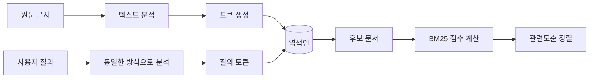
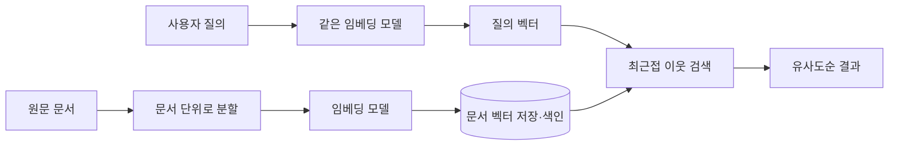

# 02. 검색의 세 세대를 직접 만든다

> 핵심 질문: **"내 문서를 찾는다"는 게 왜 어려운가? 각 방법은 무엇을 잡고 무엇을 놓치는가?**

> 참고 자료
> - [GNU grep 공식 매뉴얼](https://www.gnu.org/software/grep/manual/grep.html)
> - Elastic 공식 문서 — [역색인](https://www.elastic.co/docs/solutions/search/full-text/how-full-text-works) · [텍스트 분석](https://www.elastic.co/docs/manage-data/data-store/text-analysis) · [BM25](https://www.elastic.co/docs/reference/elasticsearch/index-settings/similarity) · [Nori](https://www.elastic.co/docs/reference/elasticsearch/plugins/analysis-nori-analyzer) · [n-gram](https://www.elastic.co/docs/reference/text-analysis/analysis-ngram-tokenizer)
> - [Stanford — Introduction to Information Retrieval(TF-IDF)](https://nlp.stanford.edu/IR-book/pdf/irbookonlinereading.pdf)
> - [Elastic — 벡터 임베딩이란?](https://www.elastic.co/kr/what-is/vector-embedding)
> - [pgvector 공식 문서](https://github.com/pgvector/pgvector)
> - [Malkov & Yashunin — HNSW 원 논문](https://arxiv.org/abs/1603.09320)

## 한 줄 요약

grep은 **문자열의 일치**, 키워드 검색은 **토큰의 관련도**, 벡터 검색은 **의미의 유사성**을 기준으로 문서를 찾는다.


## 0세대: grep 문자열 매칭

### 핵심 개념

grep(Global Regular Expression Print)은 대표적인 **문자열 매칭 기반 검색 도구**로, “이 문자열 패턴이 이 줄에 존재하는가?”를 판단한다. 결과는 일치 또는 불일치로 결정되며, 문서가 질의와 얼마나 관련 있는지를 점수로 계산하지 않는다.


```text
질의: "클라우드 스터디"

문서 A: "클라우드 스터디를 운영한다."      → 문자열 일치 → 검색됨
문서 B: "인프라 기술을 함께 학습한다."     → 문자열 불일치 → 검색되지 않음
```

문자열 매칭은 다음 두 방식으로 나눠 볼 수 있다.
- **고정 문자열 매칭:** 입력한 문자 배열을 그대로 찾는다. ex) `error`
- **패턴 매칭:** 정규 표현식으로 여러 문자 배열을 하나의 규칙으로 표현한다.ex): `error|warning`, `^ERROR`, `step[0-9]`
    - 정규 표현식은 표현 가능한 문자열의 범위를 넓혀 주지만, 단어의 의미를 이해하는 것은 아니다. 사용자가 예상한 철자나 형식을 규칙으로 직접 작성해야 한다.


### 문자열 매칭 과정

```text
질의 문자열 또는 정규식 패턴 입력
              ↓
대상 파일을 줄 단위로 읽기
              ↓
각 줄이 패턴과 일치하는지 검사
              ↓
일치한 줄과 위치를 결과로 출력
```

### 대표적인 옵션 예시

- 고정 문자열: `grep -F "[ERROR]" file.txt`
- 여러 패턴: `grep -E "error|warning" file.txt`
- 대소문자 무시: `grep -i "error" file.txt`
- 하위 폴더를 검색하고 위치 표시: `grep -rHn "error" logs/`


### 무엇을 잡는가?

- 입력한 문자열이 그대로 등장하는 부분을 찾는다.
- 정규 표현식으로 정의할 수 있는 형식과 변형을 찾는다.

### 무엇을 놓치는가?

- **다른 표현:** 의미가 같아도 문자열이 다르면 찾지 못한다. 예: `클라우드 스터디`와 `인프라 기술 학습 모임`
- **의미와 문맥:** 문자열이 어떤 의미로 쓰였는지 구분하지 못한다.
- **관련도 순위:** 일치 여부만 판단하며, 어떤 문서가 더 관련 있는지 평가하지 않는다.

### 정리
따라서 grep은 **찾을 표현을 정확히 알고 있을 때 빠르고 투명한 검색 도구**지만, 서로 다른 표현의 의미를 연결하거나 문서의 관련도를 판단해야 하는 검색에는 한계가 있다.

## 1세대: 키워드 검색

### 핵심 개념

키워드 검색은 문서를 **토큰(token)** 단위로 나누어 역색인에 저장하고, 질의 토큰을 포함한 문서에 관련도 점수를 매겨 순서대로 반환한다.


> grep과 키워드 검색은 모두 질의에 포함된 표현으로 문서를 찾는다는 목적은 같다. 다만 grep은 원문에서 문자열의 일치 여부를 확인하고, 키워드 검색은 미리 분석한 토큰을 바탕으로 관련도 순위를 제공한다.
>
> 이 노트에서는 키워드 검색의 구현 예로 Elasticsearch를 사용한다. Elasticsearch는 문서를 역색인에 저장하는 검색 엔진으로, Nori로 한국어를 분석하고 BM25로 관련도 점수를 계산할 수 있다.



### 토크나이징과 텍스트 분석

토크나이징(tokenizing)은 문장을 검색의 최소 단위인 토큰으로 나누는 과정이다. 

```text
"클라우드 기술을 함께 공부한다"
          ↓ 토크나이징·정규화
[클라우드, 기술, 공부]
```


### 역색인

역색인(inverted index)은 **토큰 → 그 토큰이 등장한 문서**의 방향으로 만든 자료 구조다. 토큰을 알면 전체 문서를 다시 읽지 않고 해당 문서로 바로 이동할 수 있다.

```text
원본 문서
D1: 클라우드 스터디를 운영한다
D2: 클라우드에 파일을 저장한다
D3: 개발 스터디에 참여한다

역색인
클라우드 → D1, D2
스터디   → D1, D3
운영     → D1
파일     → D2
개발     → D3
```

grep과 달리 `클라우드`가 포함된 문서를 빠르게 찾을 수 있을 뿐 아니라, 토큰이 등장한 횟수와 문서 수 같은 통계를 이용해 검색 결과의 점수도 계산할 수 있다.

### TF-IDF

TF-IDF는 **한 문서에서 자주 등장하지만 전체 문서에서는 드문 토큰**을 그 문서의 중요한 키워드로 본다.

```text
TF-IDF(t, d) = TF(t, d) × IDF(t)
```

| 요소 | 의미 | 점수가 커지는 경우 |
|---|---|---|
| TF(Term Frequency) | 토큰 `t`가 문서 `d`에 등장한 빈도 | 해당 문서에서 여러 번 등장할 때 |
| IDF(Inverse Document Frequency) | 토큰 `t`가 전체 문서에서 얼마나 희귀한지 | 소수의 문서에만 등장할 때 |

위의 원본 문서 3개를 기준으로 보면 `클라우드`는 D1과 D2에 등장하지만 `운영`은 D1에만 등장한다. 따라서 더 적은 문서에 등장해 문서를 잘 구별하는 `운영`의 IDF가 `클라우드`보다 높다. 질의 토큰별 TF-IDF 값을 합하면 각 문서에 점수를 부여하고 관련도순으로 정렬할 수 있다.

다만 단순한 TF 계산에서는 같은 단어를 반복할수록 점수가 계속 커질 수 있고, 긴 문서는 단어가 등장할 기회가 많아 상대적으로 유리해질 수 있다.

### BM25

BM25는 TF와 IDF의 생각을 유지하면서 **단어 빈도 포화**와 **문서 길이 보정**을 추가한 관련도 순위 함수다. 

- **IDF:** 여러 문서에 흔하게 등장하는 토큰보다 희귀한 토큰에 높은 가중치를 준다.
- **단어 빈도 포화:** 토큰이 반복될수록 점수는 높아지지만 증가 폭은 점차 줄어든다. 10번 등장했다고 1번 등장한 문서보다 무조건 10배 중요한 것은 아니다.
- **문서 길이 보정:** 긴 문서는 단어가 우연히 많이 등장할 가능성이 높으므로 전체 문서의 평균 길이와 비교해 점수를 보정한다.

```text
BM25 점수
 = 희귀한 질의 토큰인가?
 × 이 문서에 충분히 등장하는가?
 × 문서 길이를 고려해도 중요한가?
```

### 한국어 토크나이징

#### 형태소 분석

형태소 분석은 문장을 의미를 가진 최소 단위로 나누고 품사를 판별한다. 한국어는 조사와 어미가 단어에 붙기 때문에 공백만으로 나누면 같은 어근의 표현이 서로 다른 토큰이 되기 쉽다.

```text
"클라우드기술을 공부했습니다"
          ↓ 형태소 분석
[클라우드, 기술, 공부, 하다]
```

- **장점:** 조사와 어미를 분리하고 원형을 찾을 수 있어 의미 있는 검색 토큰을 만든다.
- **단점:** 형태소 분석기와 사전에 따라 결과가 달라지며, 신조어·상품명·도메인 용어를 잘못 분리할 수 있다.


#### n-gram

n-gram은 문자열을 연속된 `n`개의 문자 단위로 잘라 토큰을 만든다.

```text
"클라우드스터디"의 2-gram
[클라, 라우, 우드, 드스, 스터, 터디]
```

- **장점:** 사전이나 언어 규칙 없이도 부분 문자열, 신조어, 오탈자의 일부를 찾을 수 있다.
- **단점:** 의미 없는 토큰이 많이 생성되어 역색인이 커지고, 짧고 흔한 조각 때문에 관련 없는 문서가 검색될 수 있다.

#### 형태소 분석과 n-gram 비교

| 기준 | 형태소 분석 | n-gram |
|---|---|---|
| 검색 단위 | 형태소와 품사 | 연속된 `n`개 문자 |
| 장점 | 의미 있는 단위와 원형을 얻음 | 사전에 없는 표현과 부분 일치에 강함 |
| 단점 | 사전과 분석기 품질에 의존 | 토큰과 오탐이 많아질 수 있음 |
| 적합한 상황 | 일반적인 한국어 본문 검색 | 상품명, 고유명사, 자동완성, 부분 검색 |

두 방식은 반드시 하나만 선택하는 관계는 아니다. 형태소 분석을 기본으로 사용하고, 부분 일치가 필요한 필드에 n-gram을 별도로 적용할 수 있다.

### 키워드 검색 과정 요약

| 단계 | 하는 일 | 결과 |
|---|---|---|
| 1. 분석 | 문서와 질의를 토큰으로 분리·정규화 | 검색 가능한 토큰 |
| 2. 색인 | 토큰과 문서의 관계를 역방향으로 저장 | 역색인 |
| 3. 후보 검색 | 질의 토큰이 포함된 문서를 찾음 | 후보 문서 집합 |
| 4. 점수 계산 | TF, IDF, 문서 길이를 반영 | BM25 점수 |
| 5. 정렬 | 점수가 높은 문서부터 배치 | 순위가 있는 결과 |

### 무엇을 잡는가?

- 질의와 같은 토큰을 포함한 문서를 빠르게 찾는다.
- 토큰의 빈도와 희소성을 이용해 관련성이 높은 문서를 위로 올린다.

### 무엇을 놓치는가?

- **다른 표현:** 동의어 처리가 없다면 의미가 같아도 토큰이 다르면 찾지 못한다.
- **의미와 문맥:** 토큰의 통계를 사용하므로 문장 전체의 의미나 단어가 쓰인 문맥을 직접 이해하지 못한다.
- **분석 오류:** 토크나이저가 잘못 나눈 단어는 역색인에도 잘못 저장되어 검색 품질에 영향을 준다.

## 2세대: 벡터 검색

### 핵심 개념

벡터 검색은 문서와 질의를 **임베딩(embedding)**이라는 숫자 벡터로 변환하고, 벡터 공간에서 서로 가까운 문서를 찾는 검색 방식이다.

키워드 검색이 같은 토큰의 존재와 빈도를 비교한다면, 벡터 검색은 학습된 모델이 표현한 **의미적 유사성**을 비교한다. 따라서 질의와 문서에 같은 단어가 없어도 의미가 비슷하면 검색될 수 있다.



### 임베딩

임베딩은 텍스트, 이미지, 음성 같은 데이터를 고정된 길이의 숫자 배열로 표현한 것이다. 텍스트 임베딩에서는 의미나 사용 맥락이 비슷한 문장들이 벡터 공간에서 가까운 위치에 놓이도록 모델을 학습한다.

```text
"클라우드 스터디에 참여하고 싶어" → [0.12, -0.43, 0.81, ...]
"인프라 기술을 함께 공부하는 모임" → [0.10, -0.39, 0.78, ...]  ← 가까움
"클라우드에 사진 파일을 저장한다"  → [-0.31, 0.62, 0.05, ...]  ← 상대적으로 멂
```

- 문서와 질의는 **같은 임베딩 모델**로 변환해야 같은 벡터 공간에서 비교할 수 있다.
- 긴 문서는 통째로 표현하기보다 검색할 수 있는 크기의 청크(chunk)로 나누고 각 청크의 벡터를 저장한다.
- 임베딩 모델을 선택할 때는 지원 언어, 검색 도메인, 벡터 차원, 최대 입력 길이, 비용과 속도를 고려한다.
- 임베딩 모델 예시
  - [`text-embedding-3-small`](https://developers.openai.com/api/docs/models/text-embedding-3-small): OpenAI API로 사용하는 범용 텍스트 임베딩 모델이다. 직접 모델을 운영하지 않아도 되고 비교적 빠르고 저렴하지만, 외부 API 호출 비용과 네트워크 연결을 고려해야 한다.
  - [`intfloat/multilingual-e5-large`](https://huggingface.co/intfloat/multilingual-e5-large): 한국어를 포함한 94개 언어를 지원하는 오픈소스 검색용 모델이다. 로컬에서 직접 실행할 수 있지만 모델이 크고, 긴 입력은 최대 512토큰에서 잘린다.

### 코사인 유사도

코사인 유사도는 두 벡터의 **크기보다 방향이 얼마나 비슷한지**를 측정한다. 두 벡터의 내적을 각 벡터 크기의 곱으로 나누어 계산한다.

```text
cosine_similarity(A, B) = (A · B) / (||A|| × ||B||)
```

| 값 | 의미 |
|---:|---|
| `1`에 가까움 | 두 벡터의 방향이 매우 비슷함 |
| `0`에 가까움 | 두 벡터가 거의 무관한 방향임 |
| `-1`에 가까움 | 두 벡터가 반대 방향임 |

실제 검색에서는 질의 벡터와 각 문서 벡터의 코사인 유사도를 계산하고, 값이 높은 문서를 먼저 반환한다. 다만 점수의 의미와 적절한 기준값은 임베딩 모델과 데이터에 따라 달라진다.

### ANN 인덱스와 HNSW

벡터 검색은 질의 벡터와 가까운 `k`개의 문서 벡터를 찾는 **최근접 이웃 검색(k-NN)** 문제다. 이 문제를 푸는 방식은 크게 Exact k-NN과 ANN으로 나뉜다.

```text
최근접 이웃 검색(k-NN)
├── Exact k-NN 
└── ANN(Approximate Nearest Neighbor)
    ├── HNSW
    ├── IVFFlat
    ├── Annoy
    └── 기타 근사 검색 알고리즘
```

- 정확 최근접 이웃 검색(exact k-NN): 질의 벡터를 모든 문서 벡터와 비교한다. 문서가 적을 때 사용하며, 문서가 많고 벡터 차원이 높아지면 모든 거리를 계산하는 비용이 커진다.

- 근사 최근접 이웃 검색(ANN) : 모든 벡터를 확인하지 않고 가까울 가능성이 높은 후보만 탐색한다. 실제로 가장 가까운 벡터를 놓칠 수 있지만 검색 속도를 크게 높인다.


#### 대표적인 ANN 알고리즘: HNSW

HNSW(Hierarchical Navigable Small World)는 벡터를 여러 층의 그래프로 연결하는 대표적인 ANN 알고리즘이다.

```text
상위 계층  A ───────────── D       빠르게 먼 거리 이동
             ╲           ╱
중간 계층  A ─── B ───── D         후보 영역 좁히기
                 ╲     ╱
하위 계층  A ─ B ─ C ─ D ─ E       가까운 이웃 자세히 탐색
```

검색은 연결이 적은 상위 계층에서 시작해 질의에 가까운 방향으로 빠르게 이동하고, 아래 계층으로 내려가면서 주변 이웃을 더 자세히 탐색한다.


HNSW는 그래프를 얼마나 촘촘하게 만들고 후보를 얼마나 넓게 탐색할지 조절하여 검색 속도와 정확도의 균형을 맞춘다.

### 벡터 검색 과정 요약

| 단계 | 하는 일 | 결과 |
|---|---|---|
| 1. 분할 | 긴 문서를 검색 단위로 나눔 | 문서 청크 |
| 2. 임베딩 | 각 청크를 임베딩 모델에 입력 | 문서 벡터 |
| 3. 색인 | 벡터와 원문·메타데이터를 저장 | 벡터 인덱스 |
| 4. 질의 변환 | 같은 모델로 질의를 변환 | 질의 벡터 |
| 5. ANN 검색 | 가까운 벡터 후보를 탐색 | 유사 문서 후보 |
| 6. 정렬 | 거리 또는 유사도로 정렬 | 순위가 있는 결과 |

### 무엇을 잡는가?

- 질의와 표현이 달라도 의미가 비슷한 문서를 찾는다.
- 텍스트뿐 아니라 이미지·음성처럼 벡터로 표현할 수 있는 데이터의 유사성을 찾는다.

### 무엇을 놓치는가?

- **정확한 키워드:** 코드, 모델명, 고유명사처럼 철자 일치가 중요한 질의에서는 키워드 검색보다 약할 수 있다.
- **모델이 학습하지 못한 의미:** 임베딩 모델의 언어·도메인 이해가 부족하면 가까워야 할 문서를 멀리 배치할 수 있다.
- **ANN의 누락:** 근사 검색은 속도를 얻는 대신 실제 최근접 문서를 놓칠 수 있다.

## 세 검색 방식 비교

| 기준 | grep | 키워드 검색(BM25) | 벡터 검색 |
|---|---|---|---|
| 검색 단위 | 문자열 | 토큰 | 의미 벡터 |
| 잘 찾는 것 | 정확한 문자열·형식 | 질의 토큰과 관련 높은 문서 | 표현이 달라도 의미가 비슷한 문서 |
| 놓치는 것 | 다른 표현과 의미·문맥 | 질의 토큰이 없는 유사 표현 | 정확한 철자가 중요한 표현, 모델이 이해하지 못한 의미 |
| 순위 제공 | 없음 | BM25 점수순 | 벡터 유사도순 |
| 한국어 처리 | 별도 언어 처리 없음 | 형태소 분석이나 n-gram 필요 | 한국어를 지원하는 임베딩 모델 필요 |
| 인덱스 필요 여부 | 불필요 | 역색인 필요 | 벡터 및 ANN 인덱스 필요 |
| 검색 속도 | 매번 원문을 탐색 | 색인으로 빠르게 후보 탐색 | ANN으로 빠르게 유사 벡터 탐색 |
| 적합한 상황 | 로그, 코드, 정확한 표현 찾기 | 일반적인 문서·상품 검색 | 자연어 질문, 의미 기반 검색 |

## 궁금한 점 / 더 알아볼 것
- 검색 방식은 세대가 높아질수록 항상 더 좋은 성능을 보일까?
- 실제 검색 서비스에서는 여러 검색 방식을 어떻게 조합해 사용할까?
- 검색의 성능은 어떤 기준과 지표로 평가할 수 있을까?


## 스터디에서 나눌 이야기
- 채팅, Notion, 블로그 등 데이터 유형별로 어떤 검색 방식 또는 조합이 적합할까?
- 우리가 만들 지식 DB에서 ‘검색이 잘된다’는 기준을 어떻게 정할까?
