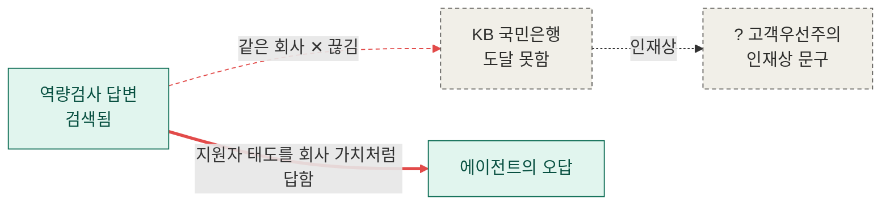

## RDF 기본

RDF, Resource Description Framework는
웹의 대상을 식별하고
대상에 대한 사실을 컴퓨터가 처리할 수 있는 관계로 표현하는 표준

ex) 민지는 A회사에 다닌다

⬇️

```
민지 - 소속 ─▶ A회사
```

### 트리플 [주어-술어-목적어]

```
하나의 사실 = 주어 Subject - 술어 Predicate ─▶ 목적어 Object
```

- 주어 Subject : 설명하려는 대상
- 술어 Predicate : 대상의 속성 또는 관계
- 목적어 Object : 관계가 가리키는 대상 또는 값

하나의 대상에 대한 여러 트리플

⬇️

**그래프**

### 리터럴 Literal

목적어가 개체가 아닌 “값”인 경우, 그 값

- 문자열
- 숫자
- 날짜

```
민지 - 이름 ─▶ "김민지" # 문자열 리터럴
민지 - 나이 ─▶ 25 # 숫자 리터럴
민지 - 생일 ─▶ 2002-02-02 # 날짜 리터럴
```

리터럴에는 데이터 타입이나 언어 표시가 가능하다

- ^^ :  리터럴의 데이터 타입 지정
- xsd : XML Schema Definition에서 정의한 타입 접두어
    
    ```
    http://www.w3.org/2001/XMLSchema#integer
    👉🏻 xsd:integer 
    ```
    

```
"25"^^xsd:integer 
"2025-03-01"^^xsd:date
"민지"@ko 
"Minji"@en
```

### URI 식별

이름만 사용하면 동명이인, 이름이 같은 회사 등 구분이 어려운 경우가 발생한다.

이를 방지하기 위해 RDF는 URI로 대상을 식별한다.

```
https://도메인/대상종류/고유식별자

https://example.com/person/minji → 민지라는 대상
https://example.com/company/a    → A회사라는 대상
```

**schema.org**

대상과 속성을 공통된 의미로 표현하기 위해 만든 구조화 데이터 어휘 체계

- 타입 Type : 대상의 종류
    
    ```
    https://schema.org/Person        → 사람
    https://schema.org/Organization  → 조직
    https://schema.org/Article       → 글
    https://schema.org/Event         → 행사
    ```
    
- 속성 Property : 대상이 가진 값 또는 다른 대상과의 관계
    
    ```
    https://schema.org/name          → 이름
    https://schema.org/birthDate     → 생년월일
    https://schema.org/author        → 작성자
    https://schema.org/affiliation   → 소속 조직
    ```
    

하나의 RDF 트리플

```
<https://example.com/person/minji> 주어
    <https://schema.org/affiliation> 술어
    <https://example.com/company/a> . 목적어
```

> 👀
>
> URI를 매번 쓰면 RDF가 너무 길어지는 문제가 있다. 그리고 길어지는 원인 중 하나가 중복되는 부분들이 많다는 것이다.
>
> 자주 사용되는 부분을 치환할 수 있는 표현이 있다면 편리하지 않을까?

### 네임 스페이스

여러 URI가 공유하는 공통 앞부분

```
@prefix ex: <https://example.com/> . # https://example.com/를 ex:로 치환
@prefix schema: <https://schema.org/> . # https://schema.org/를 schema:로 치환
```

```
<https://example.com/person/minji> -> ex:person/minji
<https://schema.org/affiliation> -> schema:affiliation
```

- @prefix : Turtle의 선언 키워드
- ex: , schema: : 접두어
- https://example.com/ : 네임스페이스 URI

트리플도 짧게 작성 가능하다

```
ex:person/minji schema:affiliation ex:company/a .
```

---

## RDFS/OWL

RDF : 데이터를 트리플로 표현한다

RDFS : 데이터의 클래스, 속성, 계층 구조를 정의한다 → RDF 데이터를 위한 스키마 어휘

OWL : 더 복잡한 의미, 관계, 제약을 표현한다 → 온톨로지 표현 언어

⬇️

Inference : 명시된 사실 + 정의된 규칙으로 새로운 사실을 도출한다

### RDF/RDFS

RDF의 어휘

: “이 리소스는 어떤 타입이다”라는 기본적인 분류 표현

- rdf:type - 리소스가 어떤 클래스에 속하는지 표현
- rdf:Property - 리소스가 속성(Property)임을 표현

```
철수 ── type ──→ BackendDeveloper
:철수 rdf:type :BackendDeveloper .
```

RDFS의 어휘

: 타입[Class]들 사이의 구조와 계층을 정의

- rdfs:Class - 클래스 정의
- rdfs:subClassOf - 클래스 간 상속/포함 관계
- rdfs:subPropertyOf - 속성 간 상위·하위 관계
- rdfs:domain - 해당 속성의 주어가 속하는 클래스
- rdfs:range - 해당 속성의 목적어가 속하는 클래스

```
개발자 ── subClassOf ──→ 사람  # 개발자는 사람에 상속[포함]
:Developer rdfs:subClassOf :Person .

백엔드개발자 ── subClassOf ──→ 개발자 # 백엔드개발자는 개발자에 상속[포함]
:BackendDeveloper rdfs:subClassOf :Developer .
```

**`rdf:type` vs `rdfs:subClassOf`** 

**`rdf:type`**

인스턴스 → 클래스의 관계

```
철수  ── rdf:type ──→ BackendDeveloper
```

철수라는 개별 개체[인스턴스]가 BackendDeveloper라는 클래스에 속함

**`rdfs:subClassOf`** 

클래스 → 클래스

```
BackendDeveloper ── rdfs:subClassOf ──→ Developer
```

BackendDeveloper라는 클래스가 Developer라는 클래스의 하위 클래스

즉, 모든 BackendDeveloper는 Developer

**전체 연결**

```
철수
 │
 └─ rdf:type → BackendDeveloper
                    │
                    └─ rdfs:subClassOf → Developer
                                              │
                                              └─ rdfs:subClassOf → Person
```

⬇️

추론

```
:철수 rdf:type :Developer .
:철수 rdf:type :Person .
```

> 👀
>
> RDFS는 계층 관계를 표현하는데 특화되어있다.
>
> 하지만 아래와 같은 더 자세한 논리조건을 표현하고 싶을 때 RDFS의 한계가 드러난다.
>
> - 부모와 자식은 서로 반대 방향의 관계다.
> - A와 B가 같은 사람임을 표현하고 싶다.

### OWL

- owl:sameAs - 동일한 개체
- owl:equivalentClass - 두 클래스가 동등함
- owl:differentFrom - 서로 다른 개체
- owl:inverseOf - 역관계
- owl:SymmetricProperty - 대칭 관계
- owl:TransitiveProperty - 추이 관계

OWL에서는 
"어떤 조건을 만족하면 이 클래스에 속한다”라는 
정의를 만들 수 있다

```
Parent
= Person이면서
  hasChild 관계를 최소 1개 이상 가진 존재
```

1) Person이다.

2) 최소 한 명의 child가 있다.

```
:Parent owl:equivalentClass [           # Parent 클래스는 뒤의 조건을 만족하는 클래스와 동등
    rdf:type owl:Class ;                # 뒤의 [ ... ]가 하나의 OWL 클래스
    owl:intersectionOf (                # 아래 조건들을 모두 만족해야 함 (AND)
        :Person                         # 조건 1 : Person 클래스에 속해야 함
        [
            rdf:type owl:Restriction ;  # 조건 2 : Property에 대한 제약(Restriction)으로 정의
            owl:onProperty :hasChild ;  # 제약 적용
            owl:minCardinality 1        # hasChild 관계가 최소 1개 이상 존재해야 함
        ]
    )                                   # intersectionOf 조건 끝
] .                                     # Parent 클래스 정의 끝
```

```
Parent
  │
  └─ equivalentClass
           ↓
        [조건]
           │
           ├─ Person
           │
           │       AND
           │
           └─ hasChild 최소 1개
```

### 스키마 vs 온톨로지

#### 스키마 Schema

데이터의 구조를 정의한 규칙

어떤 데이터가 존재하고,
어떤 속성을 가지며,
어떤 형태로 저장되는가?

```
Developer라는 타입이 있다.
Developer에는 name이라는 속성이 있다.
name의 값은 문자열이다.
company의 값은 Company 타입이다.
```

#### 온톨로지 Ontology

도메인에 존재하는 개념과 관게, 그 의미 정의

어떤 개념이 존재하고, 
개념들이 서로 **어떤 관계를 가지며, 
그 관계가 무엇을 의미하는가?**

```
BackendDeveloper는 Developer다.
Developer는 Person이다.
hasParent와 hasChild는 역관계다.
Developer와 Company는 서로 다른 종류의 개념이다.
```

#### ** OWL ≠ Ontology

```
Ontology = 무엇을 정의할 것인가
OWL      = 그것을 어떻게 표현할 것인가
```

---

## SPARQL 맛보기

### SPARQL

그래프 데이터를 조회하는 질의 언어

**트리플**(주어 – 술어 – 목적어)로 이루어진 그래프에서 패턴을 찾는 언어

> 트리플 패턴에서 빈칸을 뚫어놓고, 
”그 빈칸에 들어갈 수 있는 값을 다 찾아줘"
> 
1. 변수는 `?`로 시작한다. `?country`
2. 트리플 패턴은 `주어 술어 목적어 .`로 쓰고 끝에 마침표를 찍는다
3. 같은 주어를 이어 쓸 때는 `;`를 쓴다. `?c a :Country ; :population ?p .`
4. 조건은 `FILTER(?p > 1000000)`, 
없을 수도 있는 값은 `OPTIONAL { … }`로 쓴다.

```sql
PREFIX : <http://example.org/>   # (선택) 긴 주소의 줄임말 선언
SELECT ?country                  # 무엇을 보여줄지[변수]
WHERE {                          # 어떤 패턴을 만족하는 것을 찾을지
  :Seoul :capitalOf ?country .   # 트리플 패턴 (끝에 마침표)
}
LIMIT 10                         # (선택) 개수 제한, ORDER BY 등도 여기
```

### 실제 테스트

> 
> 
> 
> query.wikidata.org
> 
- 한국의 수도

```sql
SELECT ?capitalLabel 
WHERE {
  wd:Q884 wdt:P36 ?capital.                      # 대한민국(Q884) – 수도(P36) – ?
  SERVICE wikibase:label {                       # Wikidata가 제공하는 "이름 붙여주기" 서비스를 호출한다
    bd:serviceParam wikibase:language "ko,en".   # 이름 언어 우선순위: 한국어 → 없으면 영어
  }                                             
}                                                
```

!스크린샷 2026-09-26 오후 8.09.13.png

- 봉준호 감독의 영화

```sql
SELECT DISTINCT ?filmLabel WHERE {   # DISTINCT = 중복 제거
  ?film wdt:P57 wd:Q495980.          # 감독(P57) = 봉준호
  SERVICE wikibase:label { bd:serviceParam wikibase:language "ko,en". }
} LIMIT 5
```

!스크린샷 2026-09-26 오후 8.13.40.png

- **봉준호 감독 영화에 가장 많이 나온 배우는?** 
** 다른 쿼리에 비해 시간이 더 많이 걸림

```sql
SELECT ?actorLabel (COUNT(?film) AS ?n) WHERE {
  ?film wdt:P57  wd:Q495980;         # 봉준호가 감독한 영화
        wdt:P161 ?actor.             # 그 영화의 출연진(P161)
  SERVICE wikibase:label { bd:serviceParam wikibase:language "ko,en". }
} GROUP BY ?actorLabel               # 배우별로 묶어서
  ORDER BY DESC(?n) LIMIT 5          # 출연 편수 많은 순
```

!스크린샷 2026-09-26 오후 8.14.41.png

---

## 프로퍼티 그래프 vs RDF 트리플 스토어

!image.png

### 프로퍼티 그래프 Property Graph

노드와 관계 모두에 속성을 저장할 수 있는 그래프 모델

애플리케이션에서 연결된 데이터를 편리하게 저장하고 탐색하는 것에 초점을 둔다

- 현실의 개체(Entity) : Node
- 개체 사이의 관계 : Edge/Relationship로 연결

```
(철수:Person)
 ├─ name = "철수"
 └─ age = 25

        │
        │ WORKS_FOR
        │ since = 2024
        ↓

(네이버:Company)
 └─ name = "네이버"
```

`age`, `since` 같은 값들이 별도의 노드가 아니라 해당 노드/관계에 붙어 있는 Property이다.

#### Neo4j

Property Graph 모델을 사용하는 대표적인 그래프 데이터베이스

Node, Relationship, Property를 저장하고 **Cypher**를 이용해 그래프를 탐색·질의한다.

** Cypher : Neo4j에서 그래프 데이터를 조회하고 조작할 때 사용하는 질의 언어

```sql
MATCH   : 이런 그래프 패턴을 찾아라
(person:Person) : Person 노드
[:WORKS_FOR]    : WORKS_FOR 관계
(company:Company) : Company 노드

WHERE   : 그중 person.name이 "철수"인 것
RETURN  : 연결된 company를 반환
```

### RDF Graph

데이터의 의미를 표준화하여 표현하고, 서로 다른 지식을 연결하는 것에 초점을 둔다

** SPARQL 질의 언어 사용

- 기본적으로 **모든 사실을** Triple로 표현
- 하나의 개체에 대한 정보도 각각 독립적인 Triple로 표현

```
                  Person
                    ↑
                 rdf:type
                    │
25 ←── age ─────── 철수
                    │
                 worksFor
                    ↓
                  네이버
                    │
                 rdf:type
                    ↓
                 Company
```

Property Graph에서는 `age = 25` 같은 값을 **노드의 Property**로 붙일 수 있지만, 
RDF에서는 `철수 - age - 25` 역시 **하나의 Triple**로 표현된다

> 
> 
> 
> **Property Graph :** 개체와 관계를 중심으로 데이터를 직접 모델링
> **RDF :** 사실과 의미를 Triple 단위로 표현하고 연결
> 

---

## "못 답한 질문"

### 시험 응시 목표일

필요한 청크를 모두 찾았지만 잘못 답한 경우



### KB 역량검사

다음 홉을 찾지 못하고, 다른 내용으로 답한 다중홉 실패


