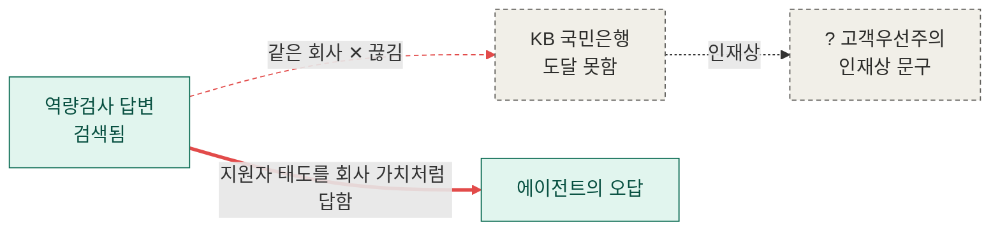

## "못 답한 질문"

### 시험 응시 목표일

필요한 청크를 모두 찾았지만 잘못 답한 경우

```mermaid
flowchart LR
    a["역량검사 답변<br/>검색됨"] -. 같은 회사 ✕ 끊김 .-> b["KB 국민은행<br/>도달 못함"]
    b -. 인재상 .-> ans["? 고객우선주의<br/>인재상 문구"]
    a == 지원자 태도를 회사 가치처럼 답함 ==> wrong["에이전트의 오답"]

    classDef found fill:#E1F5EE,stroke:#0F6E56,color:#085041
    classDef miss fill:#F1EFE8,stroke:#5F5E5A,color:#2C2C2A,stroke-dasharray:4 3
    class a,wrong found
    class b,ans miss
    linkStyle 0 stroke:#E24B4A,stroke-dasharray:4 3
    linkStyle 2 stroke:#E24B4A,stroke-width:3px
```

### KB 역량검사

다음 홉을 찾지 못하고, 다른 내용으로 답한 다중홉 실패

```mermaid
flowchart LR
    a["역량검사 답변<br/>검색됨"] -. 같은 회사 ✕ 끊김 .-> b["KB 국민은행<br/>도달 못함"]
    b -. 인재상 .-> ans["? 고객우선주의<br/>인재상 문구"]
    a == 지원자 태도를 회사 가치처럼 답함 ==> wrong["에이전트의 오답"]

    classDef found fill:#E1F5EE,stroke:#0F6E56,color:#085041
    classDef miss fill:#F1EFE8,stroke:#5F5E5A,color:#2C2C2A,stroke-dasharray:4 3
    class a,wrong found
    class b,ans miss
    linkStyle 0 stroke:#E24B4A,stroke-dasharray:4 3
    linkStyle 2 stroke:#E24B4A,stroke-width:3px
```

