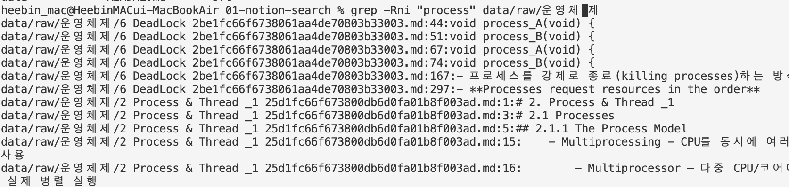
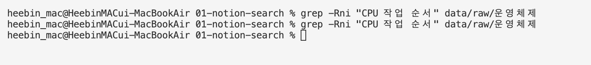
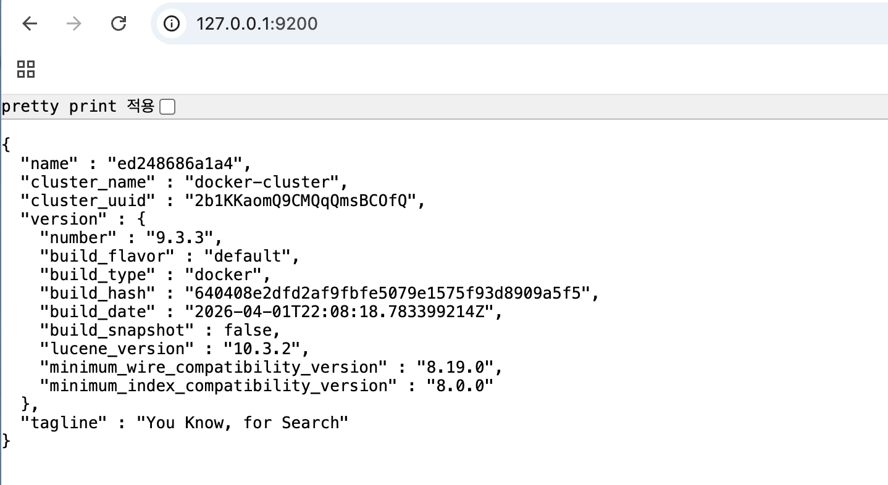
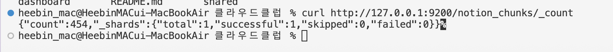
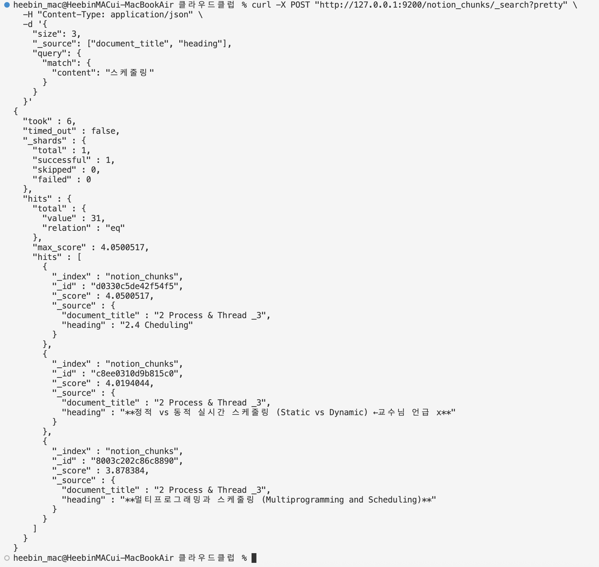
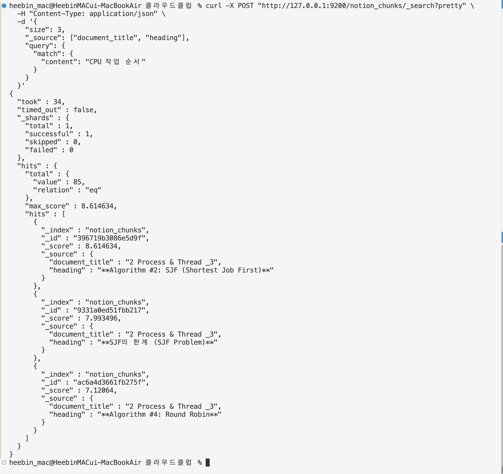

# 1. Notion 문서 저장 및 검색

> 관련 노트: `../../notes/02-search-generations.md`

## 목표

Notion에서 내보낸 운영체제 수업 자료를 이용해 grep, Elasticsearch BM25, pgvector가 각각 어떤 구조로 데이터를 저장하고 검색하는지 확인한다.

## 데이터

- 대상: 운영체제 수업을 정리한 Notion 페이지
- 형식: Markdown
- 원본 위치: `data/raw/`
- 원본 데이터는 개인정보 및 저작권 보호를 위해 Git에 올리지 않는다.
- 시험 대비 자료와 기출문제는 실습 대상에서 제외한다.

## 환경

- 언어 / 런타임: Python 3
- 주요 라이브러리: 없음 (Python 표준 라이브러리 사용)
- 저장소: Elasticsearch, PostgreSQL + pgvector
- 실행 환경: Docker Compose

## 실행 방법

에이전트를 이용해서 코드를 작성하고 실행했다.

저장소 루트에서 아래 명령을 실행한다.

```bash
python3 members/heebindev/labs/01-notion-search/src/notion_parser.py \
  --input members/heebindev/labs/01-notion-search/data/raw \
  --output members/heebindev/labs/01-notion-search/data/processed/chunks.jsonl
```

기본 설정은 제목 단위로 문서를 나누고, 본문이 너무 길면 최대 1,000자와 150자 중복을 적용한다.

Elasticsearch를 실행한다.

```bash
cd members/heebindev/labs/01-notion-search
docker compose up -d elasticsearch
```

실행 상태를 확인한다.

```bash
docker compose ps
curl http://localhost:9200
```

실습이 끝나면 컨테이너를 종료한다. 저장된 데이터는 Docker 볼륨에 남는다.

```bash
docker compose down
```

## 구조

```text
01-notion-search/
├── README.md
├── compose.yaml             # Elasticsearch 실행 설정
├── data/
│   ├── raw/                 # Git에 올리지 않는 Notion 원본
│   └── processed/           # Git에 올리지 않는 변환 결과
└── src/
    ├── notion_parser.py          # Markdown 파싱 및 청킹
    └── elasticsearch_index.py    # Elasticsearch 인덱스 생성 및 적재
```

## 결과

파서를 실행해 생성된 문서 수와 청크 수를 확인한다.

### 1. grep 검색

#### 검색어: process

- 실행 명령어

```bash
cd members/heebindev/labs/01-notion-search
grep -Rni "process" data/raw/운영체제
```



- 113개 줄이 검색되었다.
- 여러 운영체제 문서에서 process라는 문자열을 찾을 수 있었다.
- 파일 경로와 줄 번호가 함께 출력되었다.

#### 검색어: CPU 작업 순서

- 실행 명령어

```bash
cd members/heebindev/labs/01-notion-search
grep -Rni "CPU 작업 순서" data/raw/운영체제
```



- 검색 결과가 없다.
- 문서에 `스케줄링`이라는 표현이 있어도 검색어와 문자열이 다르면 찾지 못했다.

#### 알게 된 점

grep은 검색어와 정확히 일치하는 문자열을 빠르게 찾을 수 있었다.
하지만, 같은 의미라도 표현이 다르면 찾지 못하고, 검색 결과가 얼마나 관련 있는지 알 수 없다.
또한, 파일과 줄 단위의 결과라서 긴 문서의 문맥을 확인하긴 어렵다.

### 2. Elasticsearch

#### 데이터 저장 구조

`notion_chunks` 인덱스에 청크 하나를 문서 하나로 저장한다.

| 필드 | 타입 | 용도 |
| --- | --- | --- |
| `id` | `keyword` | 청크를 구분하는 고유 ID |
| `source` | `keyword` | 원본 파일 경로 |
| `document_title` | `text` | 원본 문서 제목 |
| `heading` | `text` | 청크가 속한 제목 |
| `content` | `text` | BM25 검색 대상 본문 |
| `char_count` | `integer` | 청크의 글자 수 |

#### 데이터 적재

Elasticsearch 컨테이너와 `chunks.jsonl`을 준비한 뒤 저장소 루트에서 실행한다.

```bash
python3 members/heebindev/labs/01-notion-search/src/elasticsearch_index.py \
  --input members/heebindev/labs/01-notion-search/data/processed/chunks.jsonl
```

코덱스의 도움을 받아서 Docker 이미지로 내려받아 컨테이너에서 실행해뒀다.


Elasticsearch는 기본적으로 GUI를 여는 프로그램이 아니라, HTTP 요청을 받는 서버다.
접속 주소는 [http://127.0.0.1:9200](http://127.0.0.1:9200)으로 해뒀다.



인덱스 목록은 [http://127.0.0.1:9200/_cat/indices?v](http://127.0.0.1:9200/_cat/indices?v)에서 확인할 수 있다.
여기에 `notion_chunks`가 표시된다.

저장된 청크 개수는 [http://127.0.0.1:9200/notion_chunks/_count](http://127.0.0.1:9200/notion_chunks/_count)에서 확인할 수 있다.

#### 실제 사용 방법

Elasticsearch에는 보통 터미널이나 Python 코드로 HTTP 요청을 보낸다.

```bash
curl http://127.0.0.1:9200/notion_chunks/_count
```



이제 터미널에서 Elasticsearch로 실제 BM25 검색을 실행해보겠다.

```bash
curl -X POST "http://127.0.0.1:9200/notion_chunks/_search?pretty" \
  -H "Content-Type: application/json" \
  -d '{
    "size": 3,
    "_source": ["document_title", "heading"],
    "query": {
      "match": {
        "content": "스케줄링"
      }
    }
  }'
```

- `notion_chunks`: 검색할 인덱스
- `size: 3`: 상위 결과 3개만 출력
- `_source`: 결과에서 제목과 소제목만 출력
- `match`: `content` 필드에서 검색
- `_score`: BM25로 계산한 관련도 점수



```bash
curl -X POST "http://127.0.0.1:9200/notion_chunks/_search?pretty" \
  -H "Content-Type: application/json" \
  -d '{
    "size": 3,
    "_source": ["document_title", "heading"],
    "query": {
      "match": {
        "content": "CPU 작업 순서"
      }
    }
  }'
```



grep과 달리 검색 결과가 나왔다.
85개의 청크가 검색되었다.
상위 결과로 SJF와 Round Robin 등 CPU 스케줄링 알고리즘이 나타났다.
최고 BM25 점수는 8.614634였다.

Elasticsearch는 검색어를 토큰으로 나눈 뒤 각 단어가 포함된 문서를 찾고,
BM25 점수를 계산하여 관련도가 높은 결과부터 정렬했다.
즉, CPU, 작업, 순서를 토큰으로 나눈 다음, 일부 단어가 들어간 청크도 찾고 BM25로 순위를 계산했다.

따라서 grep보다 다양한 표현을 찾을 수 있었지만,
문장의 의미 자체를 이해한 것은 아니다.

## 다음 단계

- [x] Notion Markdown 문서를 읽고 청크로 나누기
- [x] grep으로 문자열 검색하기
- [x] Elasticsearch에 저장하고 BM25 검색하기
- [ ] PostgreSQL에 임베딩을 저장하고 pgvector로 검색하기
