# 2. 하이브리드 검색과 개인 데이터 에이전트

> 관련 노트: `../../notes/03-hybrid-search-and-rag.md`

## 목표

2주차에 만든 BM25 검색과 벡터 검색을 RRF로 결합한다.
검색 결과를 OpenAI API에 전달하여 내 운영체제 Notion을 근거로 답하는 개인 데이터 에이전트를 만든다.

## 현재 진행 상황

- RRF로 BM25와 벡터 검색을 합치고 여러 질문의 결과를 확인했다.
- 질문 5개의 골드셋 초안을 만들고 BM25·벡터·하이브리드 검색의 Recall@5를 비교했다.
- 검색 근거를 OpenAI API에 전달해 SJF와 I/O 질문에 답하는 것을 확인했다.
- 답하지 못하는 질문을 찾고 원인을 기록하는 작업은 아직 남았다.

## 사용할 데이터

- 운영체제 Notion Markdown 11개
- 청크 454개
- Elasticsearch의 `notion_chunks` 인덱스
- PostgreSQL의 `document_chunks` 테이블
- 임베딩 모델: `intfloat/multilingual-e5-small`

기존 `01-notion-search` 실습에서 적재한 데이터를 그대로 사용한다.
원본 데이터와 `chunks.jsonl`을 다시 복사하지 않는다.

## 환경

- 언어 / 런타임: Python 3.12
- 키워드 검색: Elasticsearch BM25
- 벡터 검색: PostgreSQL + pgvector
- 순위 결합: RRF
- 답변 생성: OpenAI API
- 실행 환경: 스터디 공용 Docker Compose

## 전체 구조

```text
사용자 질문
├── Elasticsearch BM25 검색
└── PostgreSQL pgvector 검색
          ↓
       RRF 순위 결합
          ↓
       상위 청크 선택
          ↓
  OpenAI에 질문과 근거 전달
          ↓
     답변 + 출처 출력
```

## 실행 전 준비

저장소 루트에서 공용 인프라를 실행한다.

```bash
docker compose up -d
bash infra/check.sh
```

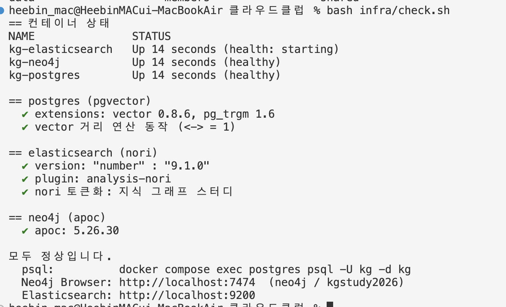

OpenAI API 키는 저장소 루트의 `.env`에 저장했다. `.env`는 Git에서 제외되어 있다.

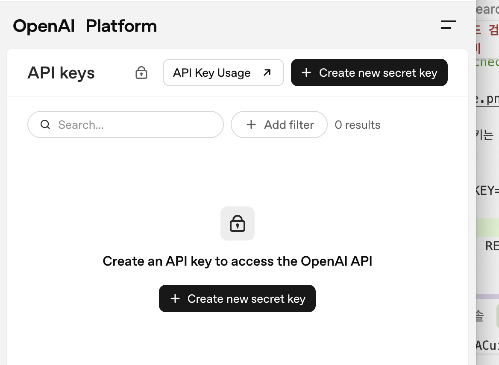
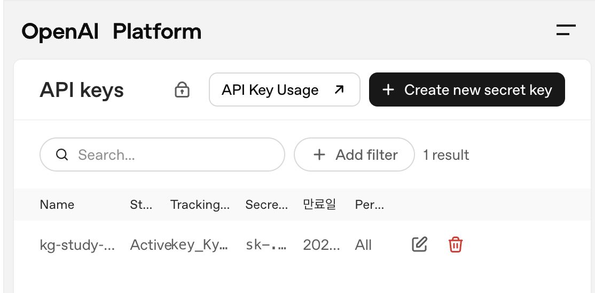

```env
OPENAI_API_KEY={발급받은_API_키}
```

API 키는 코드, README, 터미널 출력, GitHub에 올리지 않는다.

## 구조

```text
02-hybrid-search-rag/
├── README.md
├── goldset.json              # 평가 질문과 정답 청크 ID
└── src/
    ├── hybrid_search.py       # BM25, 벡터 검색, RRF 결합
    ├── evaluate.py            # Recall@k 평가
    └── rag_agent.py           # OpenAI 답변 생성과 근거 출력
```

## 1. RRF 하이브리드 검색

아래 명령으로 질문을 검색했다.

```bash
../01-notion-search/.venv/bin/python src/hybrid_search.py "CPU 작업 순서"
```

검색에 나오는 5개 청크는 내가 미리 고른 것이 아니다. 저장된 전체 454개 청크에서 BM25와 벡터 검색이 각각 상위 20개를 찾고, RRF로 순위를 합친 다음 최종 상위 5개를 자동으로 보여준다. 질문이 달라지면 결과도 달라진다.

확인할 내용은 다음과 같다.

- BM25 상위 결과
- 벡터 검색 상위 결과
- 각 결과의 원래 순위
- RRF 점수와 최종 순위

### 실행 결과

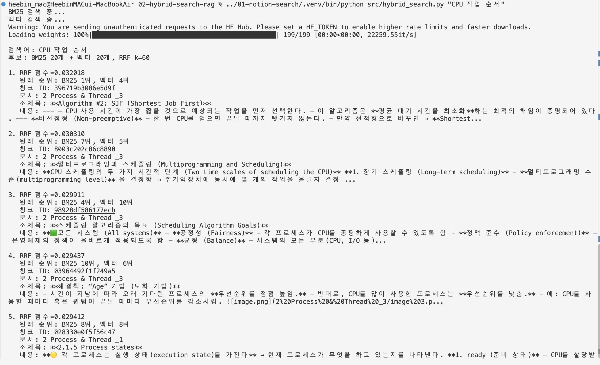
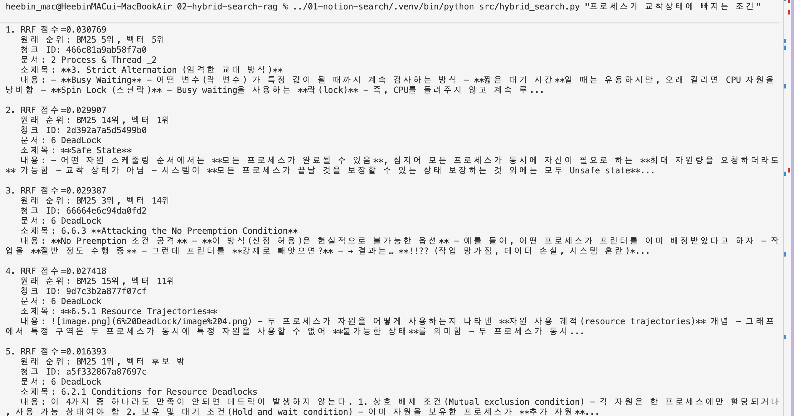
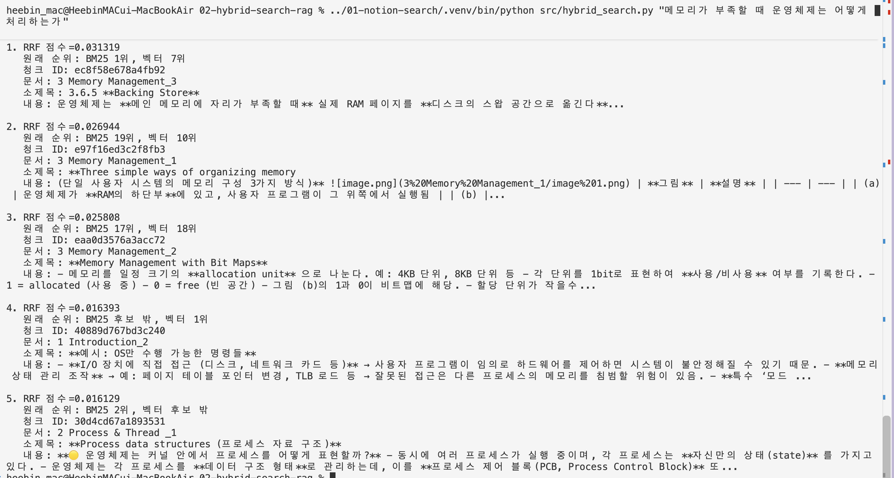
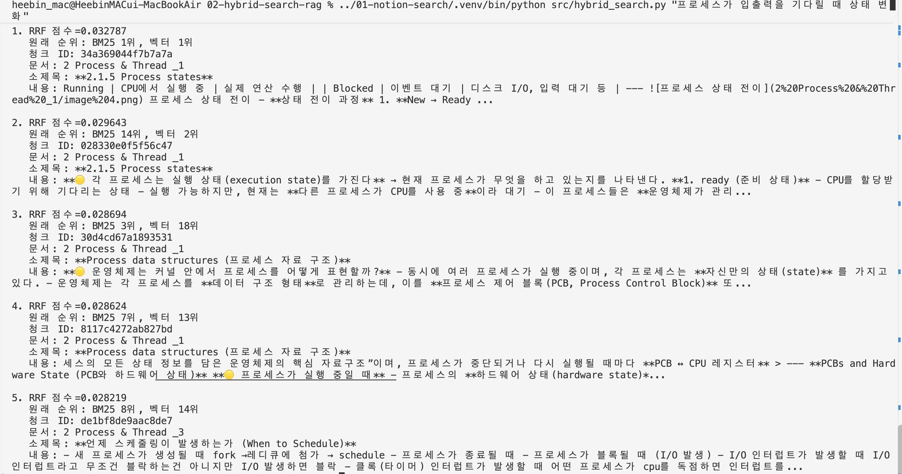

- CPU 작업 순서: 같은 질문이어도 BM25와 벡터 검색의 상위 청크가 달랐다.
- 교착상태 조건: 정답에 가까운 `Conditions for Resource Deadlocks` 청크는 BM25에서 1위였지만, 벡터 검색 후보 20개에는 없어서 RRF 최종 5위로 밀렸다. 반면 관련성이 낮은 `Strict Alternation`은 두 검색 모두 5위라 최종 1위가 됐다. 두 검색을 합친다고 항상 결과가 좋아지는 것은 아니었다.
- 메모리 부족: 1위 `Backing Store`는 질문과 잘 맞았지만, 뒤쪽에는 메모리 구성처럼 질문의 핵심과 거리가 있는 결과도 섞였다.
- 입출력 대기와 상태 변화: `Process states`가 BM25와 벡터 검색 모두 1위라 가장 잘 찾은 사례였다.

## 2. 평가 질문과 골드셋

운영체제 Notion 원문을 확인하고, 질문 5개와 답이 직접 들어 있는 청크를 `goldset.json`에 정답 후보로 표시했다.
여기서 내가 고른 것은 **평가용 질문 5개와 각 질문의 정답 청크 후보**다. 검색할 때 출력되는 상위 5개 청크와는 다르다.

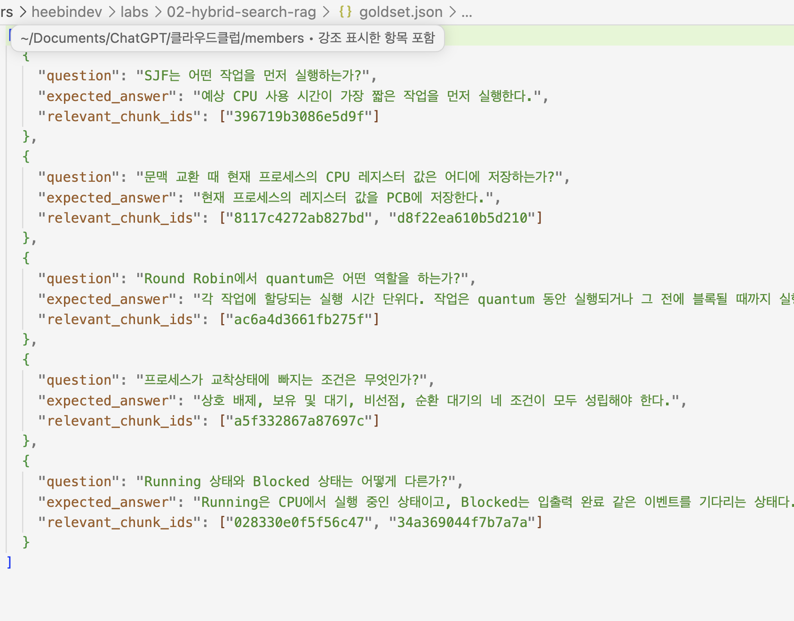

질문이 너무 넓으면 정답으로 볼 청크가 많아지므로, 문맥 교환 질문은 `CPU 레지스터 값을 어디에 저장하는가?`로 범위를 좁혔다.

| 질문 | 정답 청크 ID | 원문 위치 |
| --- | --- | --- |
| SJF는 어떤 작업을 먼저 실행하는가? | `396719b3086e5d9f` | `Algorithm #2: SJF` |
| 문맥 교환 때 현재 프로세스의 CPU 레지스터 값은 어디에 저장하는가? | `8117c4272ab827bd`, `d8f22ea610b5d210` | `Process data structures`, `Example of how a context switch occurs` |
| Round Robin에서 quantum은 어떤 역할을 하는가? | `ac6a4d3661fb275f` | `Algorithm #4: Round Robin` |
| 프로세스가 교착상태에 빠지는 조건은 무엇인가? | `a5f332867a87697c` | `Conditions for Resource Deadlocks` |
| Running 상태와 Blocked 상태는 어떻게 다른가? | `028330e0f5f56c47`, `34a369044f7b7a7a` | `Process states` |

같은 소제목도 청킹 과정에서 여러 청크로 나뉠 수 있어 청크 ID로 구분했다.

## 3. Recall@k 비교

같은 평가 질문으로 BM25, 벡터 검색, 하이브리드 검색을 비교했다.
각 방식이 자동으로 찾은 상위 5개 결과에 골드셋의 정답 청크가 얼마나 들어 있는지 확인했다.

```bash
../01-notion-search/.venv/bin/python src/evaluate.py
```

아래 숫자는 아직 내가 최종 검토하지 않은 골드셋 **초안**을 기준으로 계산한 값이다.

| 질문 | BM25 Recall@5 | 벡터 Recall@5 | 하이브리드 Recall@5 |
| --- | ---: | ---: | ---: |
| SJF는 어떤 작업을 먼저 실행하는가? | 1.00 | 1.00 | 1.00 |
| 문맥 교환 때 현재 프로세스의 CPU 레지스터 값은 어디에 저장하는가? | 0.50 | 1.00 | 1.00 |
| Round Robin에서 quantum은 어떤 역할을 하는가? | 0.00 | 1.00 | 1.00 |
| 프로세스가 교착상태에 빠지는 조건은 무엇인가? | 0.00 | 0.00 | 0.00 |
| Running 상태와 Blocked 상태는 어떻게 다른가? | 1.00 | 1.00 | 1.00 |
| **질문별 평균** | **0.50** | **0.80** | **0.80** |

### 관찰 결과

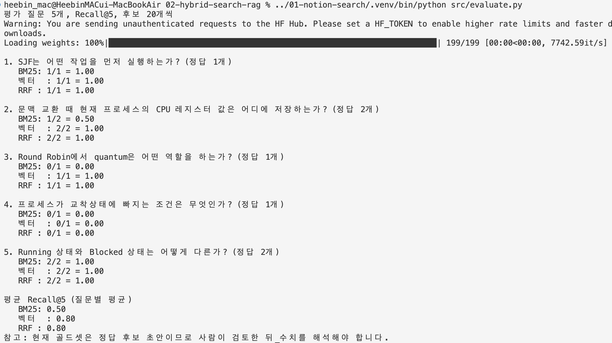

현재 골드셋 초안에서는 벡터 검색과 RRF의 평균 Recall@5가 같았다.
`Round Robin` 질문은 벡터 검색과 RRF가 정답 청크를 찾았지만 BM25는 찾지 못했다.
`교착상태 조건` 질문은 세 방식 모두 정답 청크를 상위 5개 안에 올리지 못했다.
이 질문은 앞서 검색했던 `프로세스가 교착상태에 빠지는 조건`과 표현이 달라 결과도 달라졌다.
질문 표현과 정답 청크 선정에 따라 수치가 달라질 수 있으므로, 이 5개 결과만으로 어느 검색 방식이 항상 낫다고 결론 내리지는 않는다.

## 4. 개인 데이터 에이전트

RRF 상위 청크를 질문의 근거로 조립해 OpenAI API에 전달하는 코드를 만들었다.
먼저 `--dry-run`으로 검색 결과를 확인하고, 이후 실제 답변을 생성했다.

API를 호출하지 않는 모드로 아래 명령을 실행했다.

```bash
../01-notion-search/.venv/bin/python src/rag_agent.py "SJF는 어떤 작업을 먼저 실행하는가?" --dry-run
```

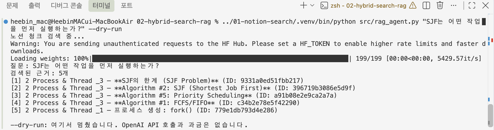

검색 결과 5개 중 `Algorithm #2: SJF` 청크가 2위에 포함된 것을 확인했다.

`--dry-run`을 빼면 실제 API를 호출한다. 실행할 때마다 API 사용량에 따라 비용이 발생한다.

```bash
../01-notion-search/.venv/bin/python src/rag_agent.py "SJF는 어떤 작업을 먼저 실행하는가?"
```

답변 생성에는 `gpt-5-mini`를 사용하고, 임베딩에는 기존 로컬 모델을 그대로 사용한다.
API 키는 저장소 루트의 `.env`에서 자동으로 읽는다. 질문과 근거 본문이 OpenAI API로 전송되므로 이번에는 운영체제 노트만 사용했다. 다른 개인 데이터를 넣기 전에는 민감한 내용이 없는지 확인해야 한다.

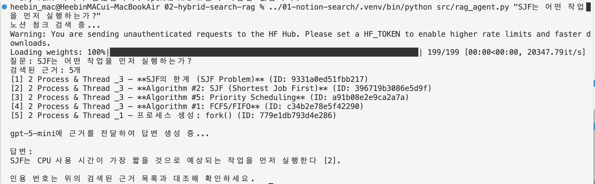

프로그램은 검색된 근거의 문서 제목과 소제목을 먼저 보여주고, 답변에는 `[1]` 같은 근거 번호를 붙인다.
번호가 붙었다고 무조건 맞는 답은 아니므로, 실제 청크 내용과 비교해야 한다. 근거가 없을 때 답을 찾지 못했다고 말하도록 지시했지만, 이 경우는 아직 시험하지 않았다.

### 실행 결과

질문: `SJF는 어떤 작업을 먼저 실행하는가?`

> SJF는 CPU 사용 시간이 가장 짧을 것으로 예상되는 작업을 먼저 실행한다[2].

인용한 `[2]`는 `2 Process & Thread _3`의 `Algorithm #2: SJF (Shortest Job First)` 청크였다.
원문에도 `CPU 사용 시간이 가장 짧을 것으로 예상되는 작업을 먼저 선택한다`고 적혀 있어 답변과 근거가 일치했다.
먼저 답이 분명한 질문으로 검색 → 근거 조립 → 답변 → 인용의 흐름을 확인했다.

## 5. 여러 정보를 연결하는 질문과 남은 과제

다음으로 프로세스 상태와 문맥 교환에 관한 내용을 함께 물었다.

```bash
../01-notion-search/.venv/bin/python src/rag_agent.py "프로세스가 I/O를 기다리면 어떤 상태로 바뀌고, 그동안 CPU는 어떤 프로세스로 넘어가는가?"
```

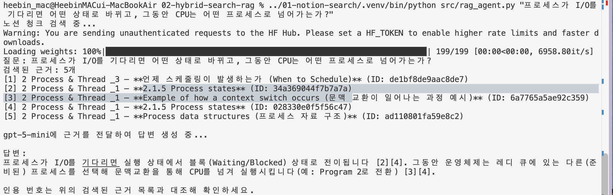

이 질문은 두 정보를 함께 묻지만, 여러 관계를 연속해서 추론해야 하는 다중 홉 질문이라고 보기는 어렵다. 확인할 내용은 다음과 같다.

- 검색 단계에서 필요한 청크를 모두 찾았는가?
- LLM이 검색되지 않은 내용을 추측했는가?
- 답변의 근거가 실제 문서 내용과 일치하는가?

검색 결과에 `Process states` 청크 `[2]`, `[4]`와 문맥 교환 예시 청크 `[3]`이 모두 포함됐다.
LLM은 프로세스가 `Blocked`로 바뀌고 다른 준비된 프로세스로 CPU가 넘어간다고 답했으며, `[2][4]`, `[3][4]`를 인용했다.
원문을 확인하니 두 내용 모두 근거가 있었다. 이번 질문에서는 필요한 청크를 찾아 답했다.

### 실패한 질문과 원인

아직 답하지 못한 질문은 찾지 못했다. 근거가 검색되지 않거나 여러 관계를 연속해서 따라가야 하는 질문을 추가로 시험할 예정이다.

## 체크리스트

- [x] BM25 검색 결과를 공통 형식으로 반환한다.
- [x] 벡터 검색 결과를 공통 형식으로 반환한다.
- [x] 두 검색 결과를 RRF로 결합한다.
- [x] 질문 5개와 정답 청크 후보를 작성한다.
- [ ] 정답 청크가 빠지거나 과하게 포함되지 않았는지 원문과 다시 비교한다.
- [x] BM25, 벡터, 하이브리드 검색의 Recall@5를 골드셋 초안으로 비교한다.
- [x] 개인 데이터 에이전트 코드를 만들고 `--dry-run`으로 근거를 확인한다.
- [x] RRF 상위 청크를 OpenAI API에 전달한다.
- [x] 답변의 인용 번호가 문서 제목·소제목과 연결되는지 확인한다.
- [x] 여러 청크를 함께 참고해야 하는 질문을 한 번 시험한다.
- [ ] 답하지 못한 다중 홉 질문을 기록한다.

## 코덱스의 도움을 받은 부분

이번 실습에서는 코덱스의 도움을 받아 아래 코드를 작성했다.

- BM25와 벡터 검색 결과를 하나의 형식으로 연결하는 코드
- RRF 점수를 계산하고 최종 순위를 만드는 코드
- Recall@k를 계산하는 평가 코드
- 검색 결과를 OpenAI API에 전달하고 답변과 근거를 출력하는 코드
