# 3. 문서에서 지식 그래프 만들기

> 관련 노트: `../../notes/05-rdf-owl-data-pipeline.md`

## 목표

2주차에 만든 운영체제 노트 청크에서 LLM으로 엔티티와 관계를 추출한다.
추출 결과를 PostgreSQL, RDF Turtle 파일과 Neo4j에 저장하고 Cypher로 관계를 조회한다.

처음부터 청크 454개 전체를 처리하지 않고 5개만 추출해 결과와 비용을 먼저 확인한다.

## 전체 흐름

```text
운영체제 노트 청크
→ OpenAI 구조화 출력으로 엔티티·관계·근거 추출
→ PostgreSQL 엔티티·관계·근거 테이블
→ RDF Turtle 파일
→ Neo4j 프로퍼티 그래프
→ Cypher 질의와 브라우저 시각화
```

## 구조

```text
03-triple-extraction-kg/
├── README.md
├── requirements.txt
├── schema/
│   └── ontology.json        # 허용 클래스 5종과 관계 8종
├── outputs/                 # 생성 결과, Git에서 제외
└── src/
    ├── extract_triples.py   # LLM 트리플 추출
    ├── save_postgres.py     # PostgreSQL 저장
    ├── export_turtle.py     # Turtle 내보내기
    └── load_neo4j.py        # Neo4j 적재
```

기존 청크 파일을 복사하지 않고 `../01-notion-search/data/processed/chunks.jsonl`을 읽는다.
Python도 기존 `../01-notion-search/.venv`를 재사용한다.

## 1. 추출할 청크 확인

`03-triple-extraction-kg` 디렉터리에서 실행한다.

```bash
../01-notion-search/.venv/bin/python src/extract_triples.py \
  --contains "SJF" \
  --limit 5 \
  --dry-run
```
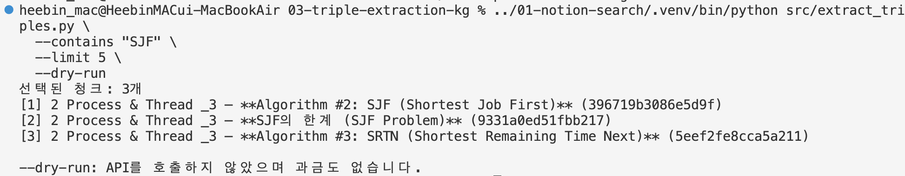

이 단계에서는 선택된 청크만 보여주며 OpenAI API를 호출하지 않아 비용이 발생하지 않는다.

## 2. 엔티티와 관계 추출

`--dry-run`을 빼면 선택한 청크를 OpenAI API로 전송한다.

```bash
../01-notion-search/.venv/bin/python src/extract_triples.py \
  --contains "SJF" \
  --limit 5
```
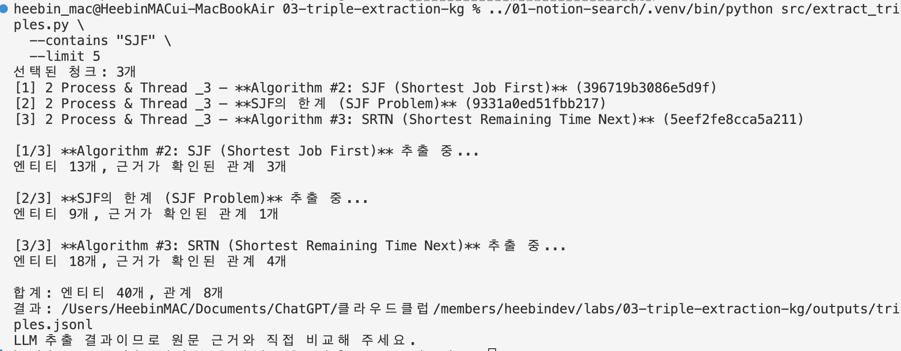
출력은 `outputs/triples.jsonl`에 저장된다. 실행할 때마다 이 파일을 새로 작성한다.
API 비용이 발생하므로 처음에는 `--limit 5`를 유지한다.
`gpt-5-mini`의 추론 강도는 이 작업에 맞게 `minimal`로 지정했고, 내부 추론과 최종 JSON을 위해 출력 한도를 4,000 토큰으로 설정했다.
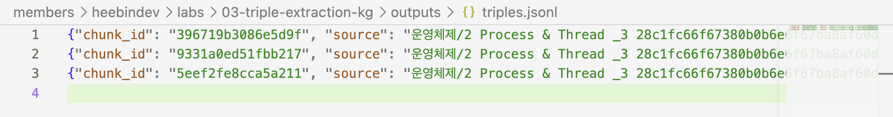

응답이 다시 `incomplete`로 끝나면서 중단 이유가 `max_output_tokens`로 나온다면 다음처럼 한도만 늘릴 수 있다.

```bash
../01-notion-search/.venv/bin/python src/extract_triples.py \
  --contains "SJF" \
  --limit 5 \
  --max-output-tokens 8000
```

각 관계에는 다음 내용이 들어 있다.
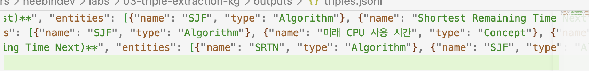
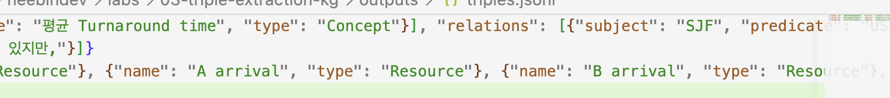

- `subject`: 관계의 출발 엔티티
- `predicate`: 미니 온톨로지에 정의한 관계
- `object`: 관계의 도착 엔티티
- `evidence`: 관계를 추출한 실제 원문 구절

코드는 evidence가 원문에 그대로 포함된 관계만 결과에 남긴다.
그래도 의미가 잘못 추출될 수 있으므로 사람이 원문과 비교해야 한다.

## 3. PostgreSQL에 저장

저장소 루트에서 공용 Docker를 실행한다.

```bash
docker compose up -d postgres neo4j
```
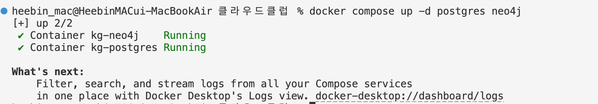

다시 실습 디렉터리에서 아래 명령을 실행한다.

```bash
../01-notion-search/.venv/bin/python src/save_postgres.py
```
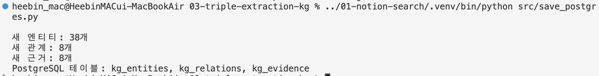
생성되는 테이블은 다음과 같다.

- `kg_entities`: 엔티티 이름과 타입
- `kg_relations`: 주어·관계·목적어
- `kg_evidence`: 원본 청크와 근거 문장

테이블에 저장된 개수를 확인한다.

```bash
docker compose exec postgres psql -U kg -d kg -c \
  "SELECT (SELECT count(*) FROM kg_entities) AS entities, (SELECT count(*) FROM kg_relations) AS relations, (SELECT count(*) FROM kg_evidence) AS evidence;"
```
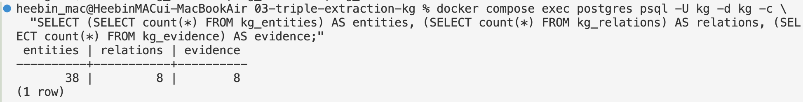

## 4. Turtle 파일로 내보내기

```bash
../01-notion-search/.venv/bin/python src/export_turtle.py
```
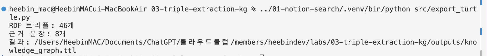
결과는 `outputs/knowledge_graph.ttl`에 생성된다.
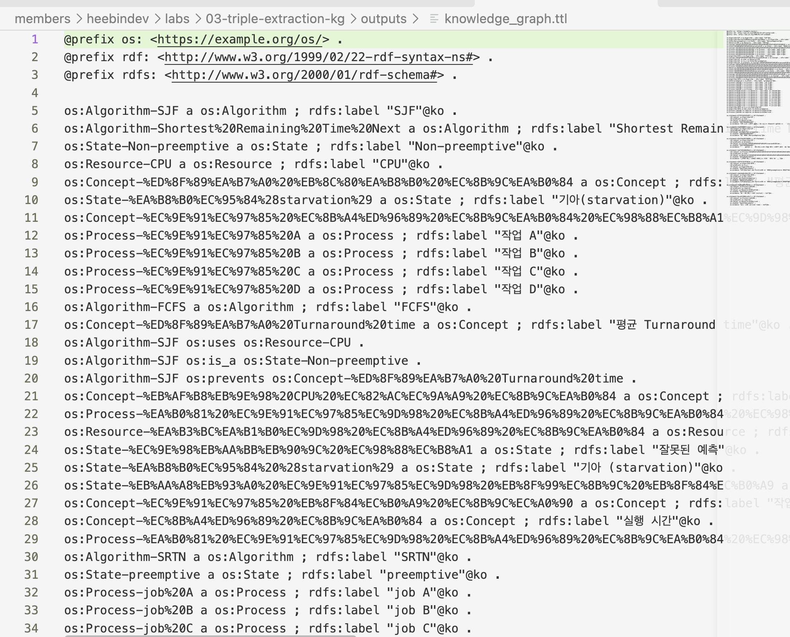
이 단계는 로컬 파일만 만들기 때문에 Docker와 API가 필요하지 않다.

## 5. Neo4j에 적재

Neo4j 컨테이너가 실행 중인 상태에서 아래 명령을 실행한다.

```bash
../01-notion-search/.venv/bin/python src/load_neo4j.py
```
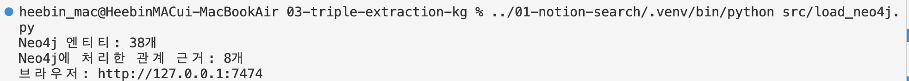
`MERGE`를 사용하므로 같은 엔티티와 관계를 다시 실행해도 중복 생성을 줄일 수 있다.

브라우저에서 [http://localhost:7474](http://localhost:7474)에 접속한다.
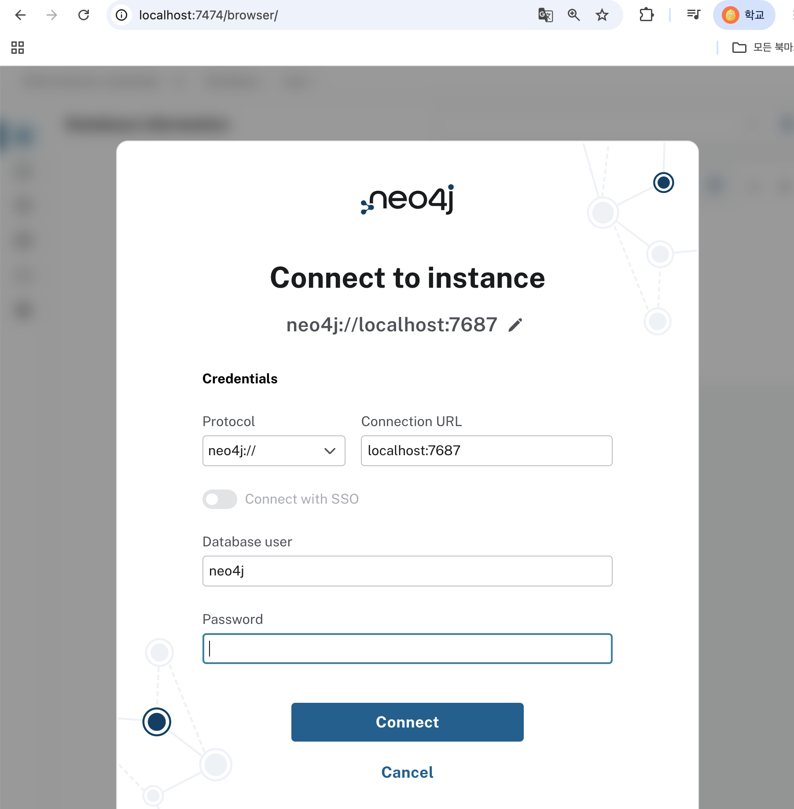

```text
사용자: neo4j
비밀번호: 저장소 .env의 NEO4J_PASSWORD
```
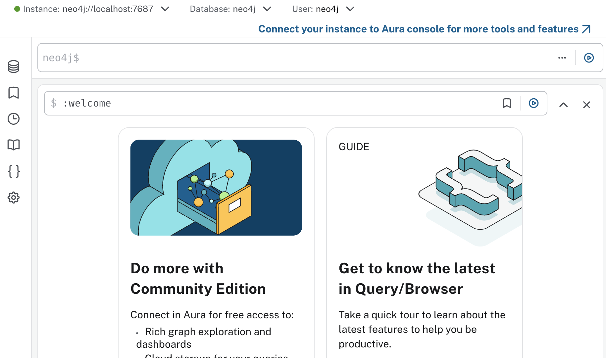
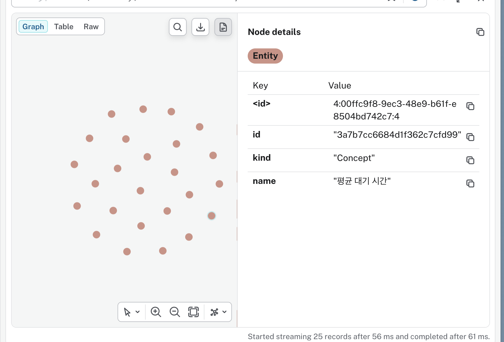
## 6. Cypher 질의

전체 그래프 일부를 확인한다.

```cypher
MATCH path = (a:Entity)-[r]->(b:Entity)
RETURN path
LIMIT 30
```
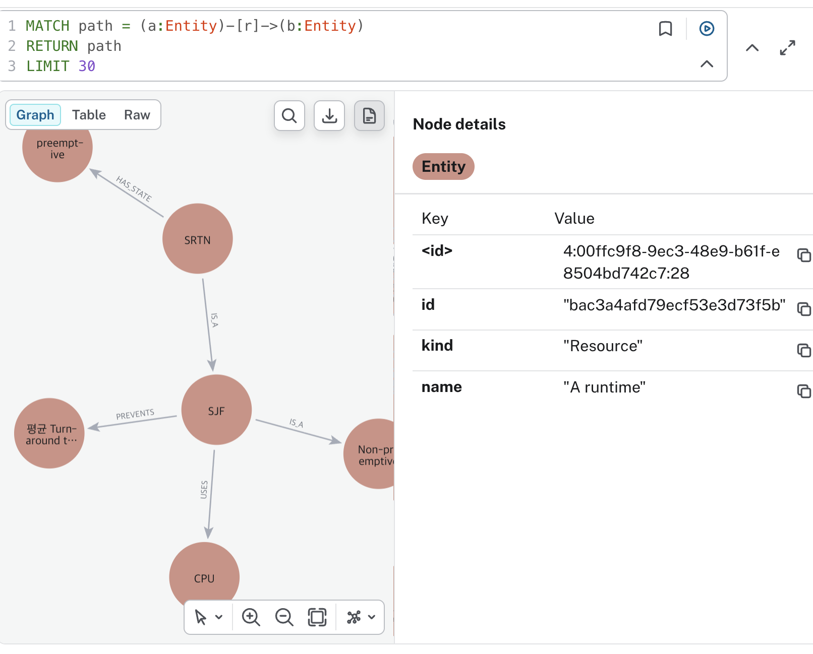

1-hop 관계를 확인한다.

```cypher
MATCH (a:Entity)-[r]->(b:Entity)
RETURN a.name AS 주어, type(r) AS 관계, b.name AS 목적어, r.evidence AS 근거
LIMIT 20
```
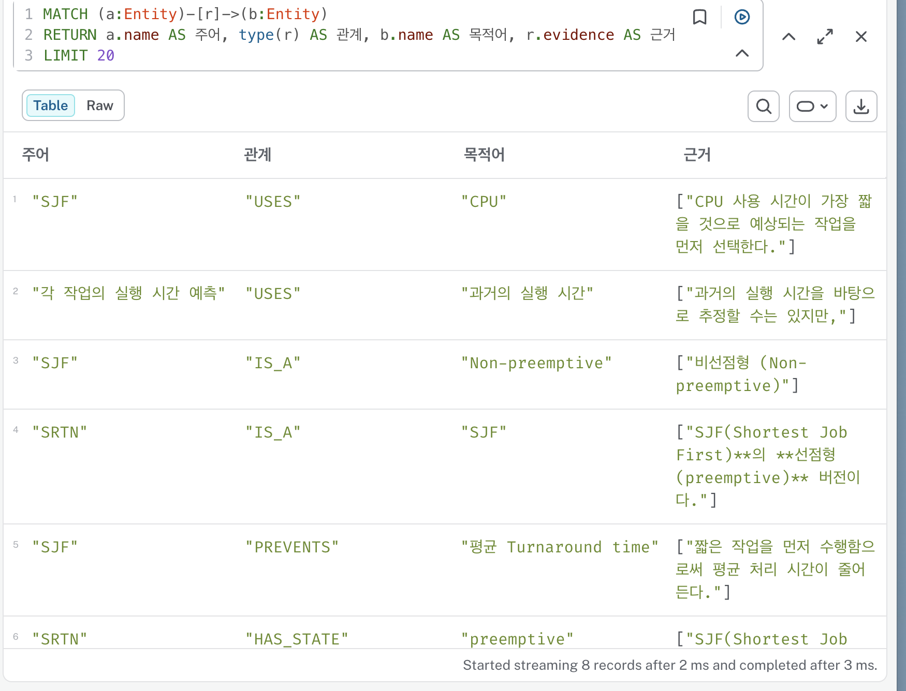

최대 3개의 관계를 따라가는 경로를 확인한다.

```cypher
MATCH path = (start:Entity)-[*1..3]->(end:Entity)
RETURN path
LIMIT 30
```
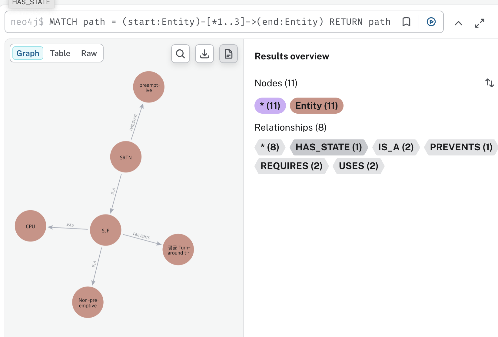

## 7. 결과 및 한계

`SJF`가 포함된 청크를 최대 5개로 설정했지만, 조건에 맞는 청크는 3개가 선택됐다.
이 청크에서 엔티티 38개와 관계 8개를 추출했으며 각 관계의 원문 근거도 함께 저장했다.

PostgreSQL에는 엔티티 38개, 관계 8개, 근거 8개가 저장됐다.
Neo4j에서도 엔티티 38개와 관계 8개를 확인해 두 저장소에 같은 내용이 들어간 것을 확인했다.
같은 추출 결과를 RDF의 Turtle 파일로도 내보냈다.

전체 추출과 저장 과정은 정상적으로 동작했지만 일부 관계는 정확하지 않았다.

```text
SJF → IS_A → Non-preemptive
SJF → PREVENTS → 평균 Turnaround time
job A → REQUIRES → A arrival
```

`Non-preemptive`는 SJF의 종류보다는 특성에 가깝고, SJF는 평균 처리 시간을 방지하는 것이 아니라 줄이는 알고리즘이다.
도착 시간도 작업이 필요로 하는 자원이라고 보기 어렵다.

미리 정한 클래스와 관계만 사용하도록 했기 때문에 적절한 항목이 없을 때 LLM이 기존 스키마에 내용을 억지로 맞춘 것으로 보인다.
JSON Schema를 사용하면 출력 형식과 허용할 값은 제한할 수 있지만, 추출한 의미까지 항상 정확해지는 것은 아니었다.
따라서 원문 근거를 사람이 검토하고 미니 온톨로지의 클래스와 관계를 수정한 뒤 다시 추출하는 과정이 필요하다.

이번 실습에서는 문서에서 트리플을 추출해 여러 저장소에 넣는 파이프라인을 확인했고, 동시에 닫힌 스키마 설계가 추출 품질에 영향을 준다는 점을 확인했다.

## 확인할 내용

- 추출한 엔티티 타입이 미니 온톨로지의 5가지 안에 있는가?
- 관계가 정의한 8가지 안에 있는가?
- 각 관계의 근거가 실제 원문에 있는가?
- 같은 대상이 여러 이름의 엔티티로 만들어지지 않았는가?
- PostgreSQL, Turtle과 Neo4j에 같은 사실이 들어갔는가?
- Cypher로 1-hop과 여러 관계를 따라가는 경로를 찾을 수 있는가?

## 코덱스의 도움을 받은 부분

이번 실습에서는 코덱스의 도움을 받아 다음 코드를 작성했다.

- 닫힌 스키마와 JSON Schema를 적용한 LLM 정보 추출 코드
- 원문 근거가 실제 청크에 포함됐는지 확인하는 코드
- 엔티티·관계·근거를 PostgreSQL에 저장하는 코드
- 같은 결과를 Turtle 파일로 내보내는 코드
- Neo4j에 `MERGE`로 적재하는 코드

OpenAI 구조화 출력은 JSON 문법만 맞추는 JSON mode가 아니라 정의한 JSON Schema를 따르도록 하는 기능을 사용했다.
추출 결과의 형식이 맞더라도 내용이 항상 사실이라는 뜻은 아니므로 근거 확인은 필요하다.

## 참고 자료

- [OpenAI Structured Outputs](https://developers.openai.com/api/docs/guides/structured-outputs)
- [W3C RDF 1.1 Turtle](https://www.w3.org/TR/turtle/)
- [Neo4j Cypher MERGE](https://neo4j.com/docs/cypher-manual/current/clauses/merge/)
