# GraphRAG 에이전트 v2 실습

3주차의 개인 데이터 에이전트 v1은 BM25와 벡터 검색 결과를 RRF로 합친 뒤, 찾은 문서 청크를 LLM에 전달했다.
이번에는 여기에 Neo4j의 엔티티와 관계를 함께 검색하는 과정을 추가한다.

## 이번 실습에서 할 것

1. 문서 검색 결과를 출발점으로 주변 그래프 관계를 찾는다.
2. 문서만 사용한 v1과 문서·그래프를 함께 사용한 v2를 비교한다.
3. 자연어 질문을 Cypher로 바꾸는 Text2Cypher를 실행한다.

이번 실습은 로컬 서치와 Text2Cypher까지만 다룬다. 커뮤니티 탐지와 글로벌 서치는 현재 그래프가 너무 작아서 진행하지 않는다.

## 실습 전에 확인한 점

현재 Neo4j에는 5주차에 만든 작은 그래프만 들어 있다. 엔티티와 관계의 수가 적고, 일부 관계는 닫힌 스키마에 맞추려고 억지로 만들어져 정확하지 않았다. 따라서 이번 결과만으로 GraphRAG가 항상 더 좋다고 판단할 수는 없다.

5주차 스터디에서 연호님께 다음과 같은 피드백을 받았다.

> 현재 스키마에 맞지 않는 사실을 억지로 술어에 끼워 넣기보다는 `null`로 남기고, 나중에 `null`만 모아서 온톨로지를 고칠 때 참고하는 편이 좋다.

예를 들어 `SJF가 평균 Turnaround time을 줄인다`라는 내용은 현재 술어에 `REDUCES`나 `OPTIMIZES`가 없다. 이것을 `PREVENTS`로 저장하면 원래 의미가 달라진다.

```json
{
  "subject": "SJF",
  "predicate": null,
  "object": "평균 Turnaround time",
  "evidence": "짧은 작업을 먼저 수행함으로써 평균 처리 시간이 줄어든다.",
  "reason": "현재 스키마에 REDUCES 또는 OPTIMIZES와 같은 관계가 없음"
}
```

이번 실습에서는 이런 관계를 [review_queue.json](review_queue.json)에 모았다. 원본 Neo4j 데이터는 지우지 않지만, 에이전트 v2가 그래프 근거를 찾을 때는 검토 목록의 관계를 제외한다.

## 파일 구성

```text
04-graphrag-agent/
├── README.md
├── questions.json
├── review_queue.json
└── src/
    ├── common.py
    ├── graph_retriever.py
    ├── graphrag_agent.py
    ├── compare_agents.py
    └── text2cypher.py
```

## 1. 실행 환경 켜기

저장소 루트에서 공용 Neo4j, PostgreSQL, Elasticsearch를 켠다.

```bash
docker compose up -d neo4j postgres elasticsearch
```

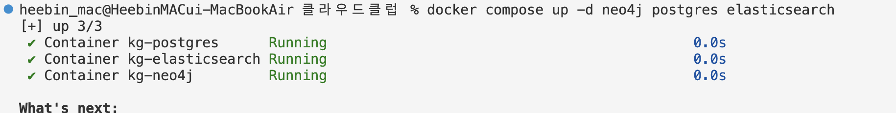

그다음 실습 폴더로 이동한다.

```bash
cd members/heebindev/labs/04-graphrag-agent
```

이 실습은 2주차에 만든 가상 환경을 그대로 사용한다.

## 2. 개인 데이터 에이전트 v2

먼저 과금 없이 어떤 근거가 검색되는지만 확인한다.

```bash
../01-notion-search/.venv/bin/python src/graphrag_agent.py \
  "SRTN은 SJF와 어떤 관계가 있는가?" \
  --dry-run
```

실행 결과에는 다음 세 가지가 나온다.

- RRF로 고른 문서 청크 5개
- 질문과 문서 청크에 연결된 그래프 관계
- 검토 대상으로 분류해 사용하지 않은 관계 수

결과가 괜찮으면 `--dry-run`을 빼고 실제 답변을 생성한다.

```bash
../01-notion-search/.venv/bin/python src/graphrag_agent.py \
  "SRTN은 SJF와 어떤 관계가 있는가?"
```

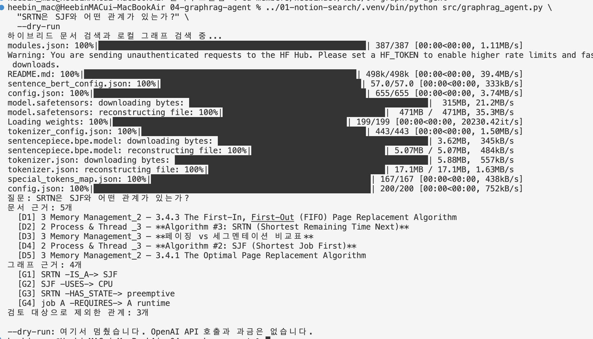

LLM에는 문서 근거 `[D번호]`와 그래프 근거 `[G번호]`가 같이 전달된다. 답변에서도 같은 번호로 근거를 확인할 수 있다.

실행 결과 `SRTN -IS_A-> SJF`, `SRTN -HAS_STATE-> preemptive` 관계가 그래프 근거로 검색되었다. 5주차 결과 중 검토 대상으로 분류한 관계 3개는 답변 근거에서 제외되었다.

## 3. v1과 v2 비교

[questions.json](questions.json)에 있는 같은 질문들로 두 에이전트의 검색 근거를 먼저 확인한다.

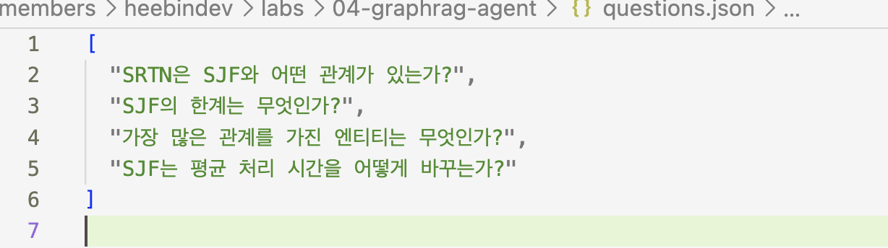

```bash
../01-notion-search/.venv/bin/python src/compare_agents.py
```

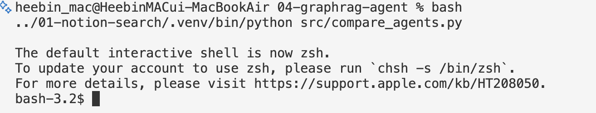

이 명령은 OpenAI API를 호출하지 않는다. 실제 v1·v2 답변까지 생성하려면 아래처럼 실행한다. 질문 하나마다 답변을 두 번 생성하므로 API 사용량이 발생한다.

`questions.json`에 미리 적어둔 질문 4개를 자동으로 읽어서 각 질문을 v1과 v2에 모두 넣고 답변을 비교한다.

1. BM25와 벡터 검색으로 문서 청크를 찾는다.
2. v1은 문서 청크만 OpenAI에 전달한다.
3. v2는 같은 문서 청크와 Neo4j 그래프 관계를 함께 전달한다.
4. 두 답변을 차례로 출력한다.

```bash
../01-notion-search/.venv/bin/python src/compare_agents.py --run-api
```

### 비교 기록

| 질문 | v1 결과 | v2 결과 | 관찰 |
| --- | --- | --- | --- |
| SRTN은 SJF와 어떤 관계가 있는가? | 문서 근거로 SRTN이 SJF의 선점형 버전이라고 답함 | 문서와 `SRTN -IS_A-> SJF`, `SRTN -HAS_STATE-> preemptive` 관계로 답함 | 둘 다 정답이지만 v2는 관계를 추가 근거로 사용함 |
| SJF의 한계는 무엇인가? | 미래 실행 시간 예측, 동시 도착 조건과 기아 가능성을 설명함 | v1과 거의 같은 답을 하고 일부 그래프 관계를 덧붙임 | 원문 설명이 중요한 질문이라 문서 검색만으로 충분했음 |
| 가장 많은 관계를 가진 엔티티는 무엇인가? | 관계 수 정보가 없어 답하지 못함 | 검색된 그래프 관계가 없어 답하지 못함 | 전체 그래프를 집계해야 하므로 로컬 서치가 아닌 Text2Cypher가 필요함 |
| SJF는 평균 처리 시간을 어떻게 바꾸는가? | 문서의 예시를 근거로 평균 처리 시간이 감소한다고 답함 | 문서 위주로 같은 답을 생성함 | 잘못 추출된 `PREVENTS` 관계를 제외해도 문서 근거로 답할 수 있었음 |

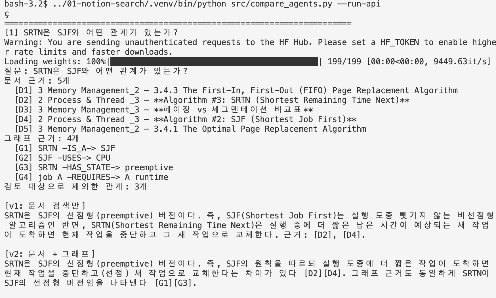

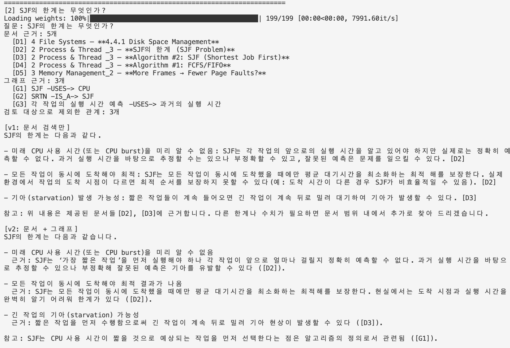

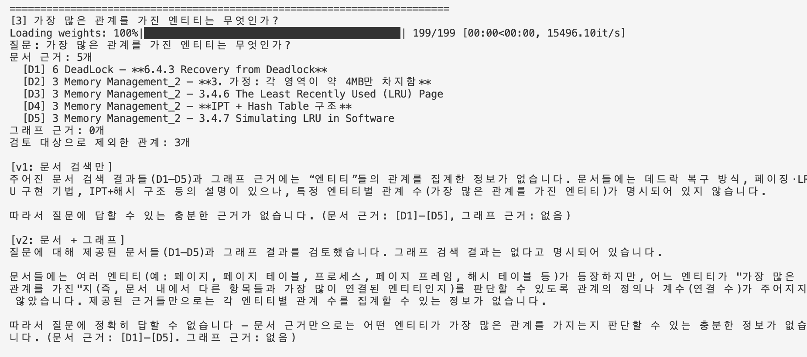

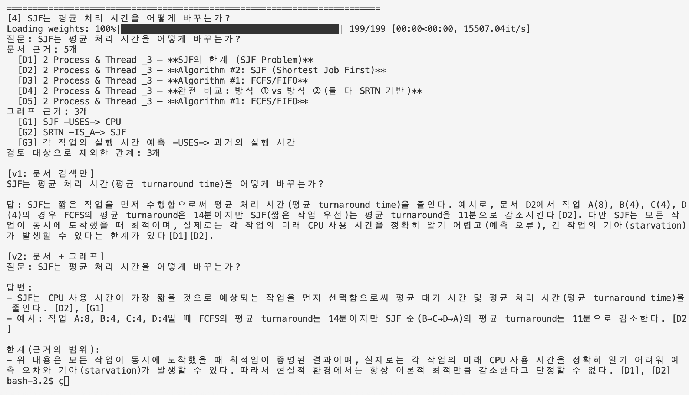

### 관찰 결과

첫 번째 질문에서는 v2가 SRTN과 SJF 사이의 관계를 답변 근거로 사용했다. 다만 v1도 문서 청크만으로 같은 답을 찾았기 때문에 답변 자체가 크게 좋아진 것은 아니었다.

두 번째와 네 번째 질문은 개념의 한계나 구체적인 예시를 묻는 질문이라 그래프보다 원문 청크가 더 유용했다. 그래프 관계가 추가되더라도 답변은 v1과 거의 같았다.

세 번째 질문은 전체 그래프에서 관계 수를 세어야 하는 집계 질문이다. 현재 v2의 로컬 서치는 질문과 관련된 특정 엔티티 주변만 검색하므로 그래프 근거를 찾지 못했고, v1과 v2 모두 답하지 못했다. 다음 Text2Cypher 실습에서 같은 질문을 Cypher 집계 질의로 바꾸어 다시 확인한다.

그래프 검색 결과에는 질문과 직접 관련 없는 `job A -REQUIRES-> A runtime` 같은 관계도 일부 섞였다. 문서 청크와 연결되어 있다는 이유만으로 가져온 관계이므로, 그래프를 추가한다고 항상 답변이 좋아지는 것은 아니었다. 질문과 관계의 관련성을 더 엄격하게 판단하는 과정이 필요하다.

또한 잘못 추출된 `SJF -PREVENTS-> 평균 Turnaround time` 관계는 `review_queue.json`에 넣어 v2의 근거에서 제외했다. 부정확한 관계를 그대로 사용하는 것보다 `null`로 분류해 따로 검토하는 방식이 실제 답변에서도 필요하다는 것을 확인했다.

현재 그래프가 작고 관계의 품질도 완전하지 않아 이번 결과만으로 v2가 v1보다 항상 좋다고 결론 내릴 수는 없다. 그래프에 질문에 필요한 관계가 있을 때만 추가 근거로 도움이 되었다.

## 4. Text2Cypher

Text2Cypher는 사용자의 자연어 질문과 그래프 스키마를 LLM에 전달해 Cypher를 만들고, 그 질의를 Neo4j에서 실행하는 방식이다.

먼저 API 호출 없이 LLM에 전달할 스키마를 확인한다.

```bash
../01-notion-search/.venv/bin/python src/text2cypher.py \
  "관계가 가장 많은 엔티티는 무엇인가?" \
  --dry-run
```
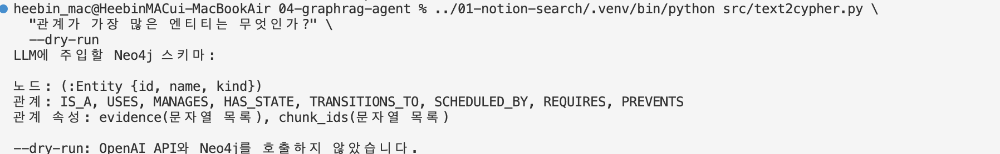

Cypher만 만들고 Neo4j에서 실행하지 않으려면 다음과 같이 한다.

```bash
../01-notion-search/.venv/bin/python src/text2cypher.py \
  "관계가 가장 많은 엔티티는 무엇인가?" \
  --generate-only
```
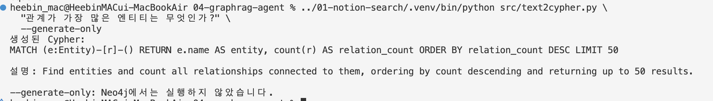

생성과 실행을 모두 하려면 옵션을 뺀다.

```bash
../01-notion-search/.venv/bin/python src/text2cypher.py \
  "관계가 가장 많은 엔티티는 무엇인가?"
```


안전을 위해 이 스크립트는 `MATCH`로 시작하고 `RETURN`이 있는 읽기 질의만 허용한다. `CREATE`, `MERGE`, `DELETE`, `SET`처럼 데이터를 바꾸는 문장이 나오면 실행하지 않는다.

### Text2Cypher 관찰 기록

| 질문 | 생성된 Cypher가 적절했는가? | 결과 | 실패 이유 또는 관찰 |
| --- | --- | --- | --- |
| 관계가 가장 많은 엔티티는 무엇인가? | 적절한 집계 질의를 생성함 | SJF 4개, SRTN과 job A가 각각 2개로 나옴 | 로컬 서치가 답하지 못한 집계 질문을 계산했지만 검토 대상 관계도 개수에 포함됨 |
| SJF와 직접 연결된 엔티티는 무엇인가? | SJF와 1-hop으로 연결된 노드를 찾음 | CPU, Non-preemptive, SRTN, 평균 Turnaround time이 나옴 | 방향 없는 관계를 사용해 원래 방향이 결과에서 드러나지 않았고 부정확한 관계도 포함됨 |
| SJF의 평균 처리 시간은 몇 초인가? | 이름에 평균·처리·초가 들어간 주변 노드를 찾음 | `평균 Turnaround time` 노드 하나를 찾음 | 관련 노드만 찾았을 뿐 수치가 저장되어 있지 않아 몇 초인지는 답하지 못함 |

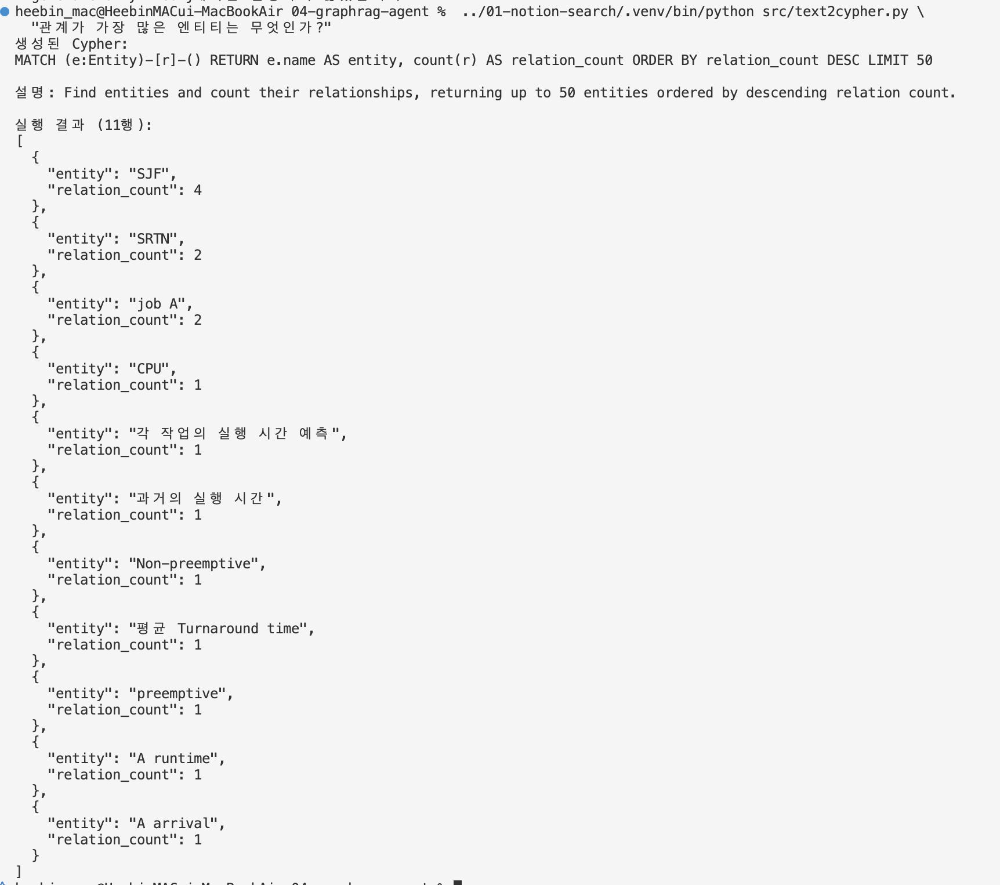

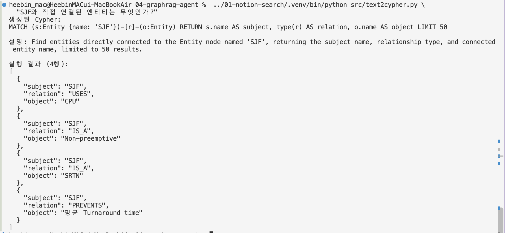

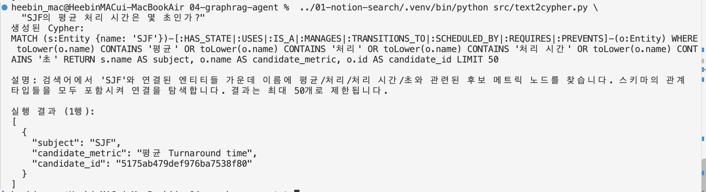

### 실행 결과

첫 번째 질문에서는 LLM이 다음과 같은 집계 Cypher를 만들었다.

```cypher
MATCH (e:Entity)-[r]-()
RETURN e.name AS entity, count(r) AS relation_count
ORDER BY relation_count DESC
LIMIT 50
```

문서 검색과 로컬 GraphRAG는 `가장 많은 관계`라는 질문에 답하지 못했지만, Text2Cypher는 Neo4j의 전체 관계를 세어 SJF가 4개로 가장 많다고 반환했다. 집계 질문에는 그래프 질의가 유리하다는 것을 확인했다.

다만 이 숫자는 정제된 정답이 아니라 현재 Neo4j 원본의 관계 수이다. `SJF -IS_A-> Non-preemptive`, `SJF -PREVENTS-> 평균 Turnaround time`처럼 `review_queue.json`에 넣어 둔 관계도 포함됐다. GraphRAG v2의 검색기는 이 관계들을 제외하지만 Text2Cypher는 생성된 Cypher로 Neo4j를 직접 조회하므로 자동으로 제외하지 않는다.

두 번째 질문에서는 다음 질의가 만들어졌다.

```cypher
MATCH (s:Entity {name: 'SJF'})-[r]-(o:Entity)
RETURN s.name AS subject, type(r) AS relation, o.name AS object
LIMIT 50
```

SJF와 직접 연결된 노드 4개를 찾았지만 `-[r]-`처럼 방향을 지정하지 않고 탐색했다. 실제 그래프의 관계는 `SRTN -IS_A-> SJF`인데 출력만 보면 `SJF -IS_A-> SRTN`처럼 오해할 수 있다. 관계 방향이 중요한 질문에서는 `-[r]->` 또는 `<-[r]-`처럼 방향을 명확히 지정하고 반환값도 확인해야 한다.

세 번째 질문에서는 `평균 Turnaround time`이라는 후보 노드를 찾았다. 하지만 이 노드에는 초 단위 수치가 저장되어 있지 않아 `몇 초인가?`에는 답할 수 없었다. Text2Cypher가 오류 없이 실행됐다는 것과 질문에 제대로 답했다는 것은 다르다는 것을 확인했다.

### Text2Cypher에서 확인한 점

- 자연어 집계 질문을 `count()`와 `ORDER BY`가 있는 Cypher로 바꿀 수 있었다.
- 현재 그래프 스키마를 알려주자 존재하는 라벨과 관계를 사용했다.
- 생성된 질의가 실행되더라도 관계의 정확성까지 보장되지는 않았다.
- 방향 없는 탐색은 원래 관계 방향을 헷갈리게 만들 수 있었다.
- 그래프에 저장되지 않은 수치나 속성은 Text2Cypher로도 답할 수 없었다.
- 검토 대상 관계를 제외하려면 Neo4j 원본을 정제하거나 Text2Cypher 실행 단계에도 필터가 필요하다.

## 전체 실습 결론

이번 실습에서는 3주차의 문서 검색 에이전트 v1에 Neo4j 그래프 검색을 추가해 v2를 만들고 같은 질문으로 비교했다.

- SRTN과 SJF의 관계처럼 그래프에 관계가 명확히 저장된 질문에서는 v2가 그래프를 추가 근거로 사용할 수 있었다.
- SJF의 한계나 평균 처리 시간처럼 원문의 설명과 예시가 중요한 질문은 v1만으로도 충분했고, v2의 답변이 크게 좋아지지는 않았다.
- 현재 로컬 GraphRAG는 특정 엔티티 주변만 검색하므로 전체 관계 수를 묻는 집계 질문에는 답하지 못했다.
- 같은 집계 질문을 Text2Cypher로 바꾸자 Neo4j 전체 관계를 직접 세어 결과를 반환했다.
- 하지만 부정확한 관계가 Neo4j에 들어 있으면 집계 결과에도 그대로 포함됐고, 그래프에 없는 수치 정보는 Text2Cypher도 찾지 못했다.
- 질문과 관련 없는 그래프 관계가 컨텍스트에 섞이기도 했기 때문에 그래프를 추가한다고 항상 답변이 좋아지는 것은 아니었다.

결국 GraphRAG의 답변 품질은 LLM이나 검색 방식만으로 결정되지 않았다. 앞 단계에서 엔티티와 관계를 얼마나 정확하게 추출했는지, 현재 온톨로지가 내용을 자연스럽게 표현할 수 있는지, 질의에서 관계 방향과 필요한 속성을 제대로 사용했는지가 함께 중요했다.

이번에는 그래프가 작아 커뮤니티 탐지와 글로벌 서치를 직접 실행하지 않았다. 로컬 서치와 Text2Cypher를 통해 그래프가 관계 탐색과 집계에는 도움이 되지만 원문 설명이나 그래프에 없는 정보까지 대신할 수는 없다는 점을 확인했다.

참고한 문서:

- [Neo4j GraphRAG Python 사용자 가이드](https://neo4j.com/docs/neo4j-graphrag-python/current/user_guide_rag.html)
- [Neo4j Cypher Cheat Sheet](https://neo4j.com/docs/cypher-manual/current/cheat-sheet/)
- [OpenAI Responses API](https://developers.openai.com/api/reference/python/resources/responses)
