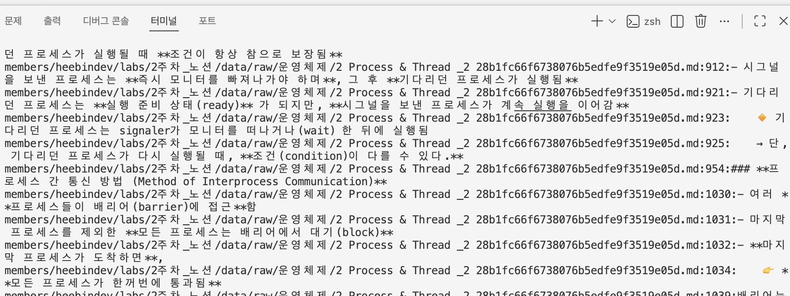

# 2. 검색의 세 세대를 만들다

## 1. 0세대: grep

[GNU grep 공식 문서](https://www.gnu.org/software/grep/manual/grep.html)

문자열 매칭 — 왜 이것만으로는 안 되는가? (표현 불일치, 순위 없음)

> 유명한 리눅스 명령어로, 검색어와 같은 문자열이나 패턴이 있는지를 확인한다.

```bash
grep -Rni "process" \
  "members/heebindev/labs/2주차_노션/data/raw/운영체제"
```



grep은 입력한 문자열이나 정규식 패턴이 포함된 줄을 찾아 출력한다.
의미가 같은지는 판단하지 않기 때문에 원문과 검색어의 표현이 다르면 찾지 못할 수 있다.
또한 내가 찾고자 하는 단어가 어느 정도로 관련 있는지와 상관없이 출력한다.
즉, 별도의 데이터베이스는 필요 없지만 검색 결과에 관련도 순위가 없다.
또한 관련 파일이 많아질수록 검색할 때 확인해야 하는 데이터도 증가한다.

## 2. 1세대: 키워드 검색
역색인, TF-IDF → BM25, 토크나이징(한국어 형태소 vs n-gram)

> 검색어에 포함된 단어가 어떤 문서에서 중요하게 사용됐는가?

### 토큰과 토크나이징
앞에서 청킹이라는 개념이 있었다. 토큰과 토크나이징도 텍스트를 나눈다는 점에서는 비슷하다.
하지만 청킹은 긴 문서를 검색하기 좋은 크기로 나누는 것이고, 토크나이징은 문장을 검색 가능한 단어 단위로 나누는 것이다.
예를 들어 "프로세스가 실행된다"라는 문장이 있으면
이 문장을 검색 가능한 단어인 토큰으로 나누는 것이 토크나이징이다.
"프로세스 / 실행"
참고로 한국어의 경우에는 조사와 어미가 붙기 때문에 공백만으로 나누기 어렵다.
아래는 한국어 분석기다.
https://www.elastic.co/docs/reference/elasticsearch/plugins/analysis-nori-analyzer

### 역색인(Inverted Index)
우리가 보통 생각하는 색인(인덱스)의 경우에는
문서 1 -> 프로세스
문서 2 -> 프로세스와 스레드
문서 3 -> 스레드
문서 4 -> 기타
문서 5 -> 프로세스
문서 6 -> 메모리
문서 7 -> 메모리
문서 8 -> 메모리

이렇게 인덱스 순으로 나타내지만,
역색인의 경우에는
프로세스 → 문서 1, 문서 2, 문서 5
스레드   → 문서 2, 문서 3
메모리   → 문서 6, 문서 7, 문서 8
책의 마지막 부분에 있는 찾아보기처럼 단어를 기준으로 문서 목록을 저장한다.

### TF-IDF
TF(Term Frequency): 이 문서에서 그 단어가 얼마나 많이 나오는가?
IDF(Inverse Document Frequency): 전체 문서에서 이 단어가 얼마나 희귀한가?
만약 내 운영체제 Notion의 하위 페이지에 "스케줄링"이라는 단어가 자주 나오고 다른 문서에서는 별로 나오지 않는다면, 이 "스케줄링"이라는 단어를 해당 문서를 구분하는 중요한 단어로 보는 것이다.

### BM25
https://velog.io/@junegood/BM25
BM25의 경우에는 위의 TF-IDF 개념을 더 발전시켜서 아래 내용을 추가로 고려한다.
- 단어가 반복되어도 점수를 끝없이 높이지 않는다.
- 긴 문서가 무조건 유리하지 않도록 문서 길이를 보정한다.
- 검색어와 문서의 관련도 점수를 계산한다.
- 점수에 따라 검색 결과를 정렬한다.

### Elasticsearch
Elasticsearch는 오픈소스 검색 엔진이다.
데이터를 인덱싱할 때 역색인을 미리 생성하기 때문에, 검색할 때 모든 원문을 다시 읽지 않고 빠르게 관련 문서를 찾을 수 있다.
BM25를 기본 유사도 알고리즘으로 사용한다.
https://www.elastic.co/docs/reference/elasticsearch/index-settings/similarity

## 3. 2세대: 벡터 검색
임베딩, 코사인 유사도, ANN 인덱스(HNSW)

> 검색어와 문서의 표현이 달라도 의미가 비슷할까?

### 임베딩
텍스트를 의미를 나타내는 숫자 배열인 벡터로 변환하는 과정이다.
"삼성전자의 주식 변화" => [.13, -0.52, 0.81, ...]
임베딩 모델마다 변환하는 값이 다르기 때문에 질문과 문서를 같은 임베딩 모델로 변환해야 한다.

### 코사인 유사도
코사인 유사도는 두 벡터가 가리키는 방향이 얼마나 비슷한지를 측정한다.
즉, 코사인 유사도는 값이 클수록 가깝다는 의미다.

PostgreSQL의 확장 기능인 pgvector에서는 `<=>` 연산자로 코사인 거리를 반환한다.
코사인 거리는 값이 작을수록 가깝고, 코사인 유사도는 `1 - 코사인 거리`로 구할 수 있다.
https://www.databricks.com/kr/blog/what-is-pgvector
https://github.com/pgvector/pgvector

### ANN과 HNSW
정확 검색:
질문과 모든 문서 벡터를 비교한다. 정확하지만 데이터가 많으면 느려진다.

ANN:
가까울 가능성이 높은 후보만 탐색한다. 매우 빠르지만 일부 결과가 누락될 수 있다.

HNSW는 벡터를 여러 층의 그래프처럼 연결해서 가까운 후보를 찾는 ANN 인덱스다.
