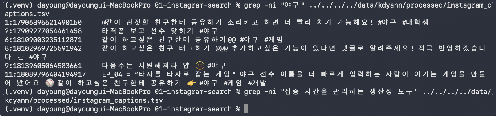
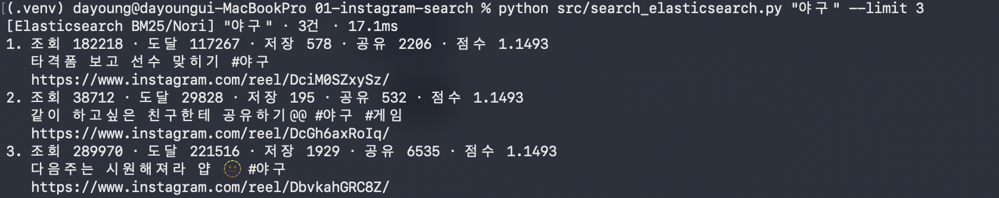
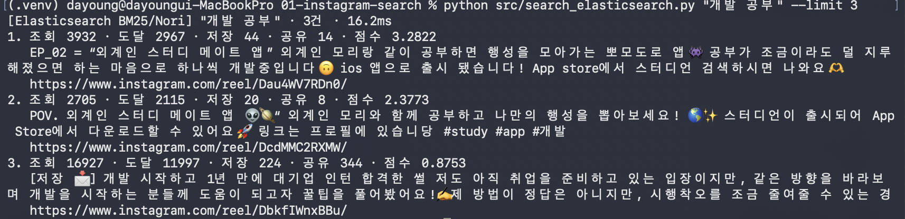
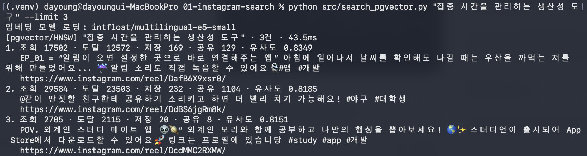
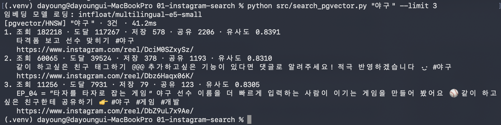

# 01. Instagram 게시물로 검색의 세 세대 비교

> 관련 노트: `../../notes/02-search-generations.md`

## 목표

Instagram 프로페셔널 계정의 게시물과 인사이트를 공식 API로 수집하고, 같은
13개 문서를 grep, Elasticsearch BM25, pgvector로 검색하여 차이를 비교한다.

## 환경

- Python 3.9
- Docker Compose, PostgreSQL 17 + pgvector, Elasticsearch 9 + Nori
- 임베딩 모델: `intfloat/multilingual-e5-small` 384차원
- Instagram API 토큰: `.env`에만 저장하고 Git에서 제외

## 실행 방법

Instagram API 설정값을 입력하고 데이터를 수집한다.

```bash
cd members/kdyann/labs/01-instagram-search
cp .env.example .env

set -a
source .env
set +a
python src/fetch_instagram.py
```

저장소 루트에서 검색 인프라를 실행한 뒤 Python 환경을 준비한다.

```bash
docker compose up -d postgres elasticsearch

cd members/kdyann/labs/01-instagram-search
python3 -m venv .venv
source .venv/bin/activate
python -m pip install -r requirements.txt
```

세 가지 방식으로 같은 데이터를 저장하고 검색한다.

```bash
# grep
python src/prepare_grep.py
grep -ni "야구" ../../../../data/kdyann/processed/instagram_captions.tsv
grep -ni "집중 시간을 관리하는 생산성 도구" ../../../../data/kdyann/processed/instagram_captions.tsv

# Elasticsearch BM25
python src/index_elasticsearch.py
python src/search_elasticsearch.py "야구" --limit 3
python src/search_elasticsearch.py "개발 공부" --limit 3

# pgvector
python src/index_pgvector.py
python src/search_pgvector.py "야구" --limit 3
python src/search_pgvector.py "집중 시간을 관리하는 생산성 도구" --limit 3
```

## 구조

```text
Instagram API
    └── instagram_documents.jsonl (공통 문서 13개)
          ├── grep: 캡션 TSV 전체 스캔
          ├── Elasticsearch: Nori 역색인 + BM25
          └── PostgreSQL: 384차원 임베딩 + HNSW
```

실제 캡션과 인사이트가 담긴 `data/kdyann/` 및 토큰이 담긴 `.env`는 Git에
올리지 않는다. 소스 코드, 실행 문서, 결과 캡처만 공유한다.

## 결과

### 0세대: grep

`야구`가 포함된 7줄을 찾았지만, 의미상 관련된 게시물이 있어도 정확한 문자열이
없는 `집중 시간을 관리하는 생산성 도구`는 찾지 못했다. 관련도 순위도 없다.



### 1세대: Elasticsearch BM25

Nori로 캡션을 분석해 역색인을 만들었다. `야구`와 `개발 공부`에 관련된 문서를
BM25 점수 순으로 반환했다.





### 2세대: pgvector

문서를 384차원 벡터로 변환하고 HNSW 인덱스에서 코사인 유사도로 검색했다.
원문과 표현이 다른 `집중 시간을 관리하는 생산성 도구`도 결과를 반환했지만,
기대했던 스터디 앱 게시물은 3위였다.



`야구` 검색에서는 야구 관련 게시물이 유사도 순으로 반환되었다.



| 쿼리 | grep | BM25 | pgvector | 관찰 |
|---|---:|---:|---:|---|
| `야구` | 7줄 | 3건 | 3건 | 모두 찾았지만 grep에는 순위가 없다. |
| `개발 공부` | 0건 | 3건 | 3건 | 키워드 분석과 의미 검색은 분리된 단어를 찾았다. |
| `집중 시간을 관리하는 생산성 도구` | 0건 | 0건 | 3건 | 표현이 겹치지 않아 벡터 검색만 결과를 냈다. |

## 배운 점

- grep은 정확한 문자열 검색은 빠르지만 표현이 다르면 찾지 못한다.
- BM25는 토큰이 일치하는 문서에 관련도 순위를 제공한다.
- 벡터 검색은 표현 불일치를 보완하지만 가장 관련 있는 문서를 항상 1위에 놓지는 않는다.
- 같은 문서와 쿼리를 사용해야 검색 방식 자체의 차이를 비교할 수 있다.
- Instagram 인사이트는 검색 결과의 성과를 해석하는 메타데이터로 활용할 수 있다.

## 다음 단계

- [ ] 검색 결과와 실제 콘텐츠 성과의 관계 비교

## 참고 자료

- [Meta Instagram API 공식 문서](https://www.postman.com/meta/instagram/documentation/6yqw8pt/instagram-api)
- [Elasticsearch Nori analyzer 공식 문서](https://www.elastic.co/docs/reference/elasticsearch/plugins/analysis-nori-analyzer)
- [pgvector HNSW 공식 문서](https://github.com/pgvector/pgvector#hnsw)
- [multilingual-e5-small 모델 카드](https://huggingface.co/intfloat/multilingual-e5-small)
