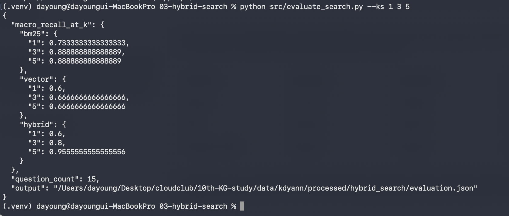
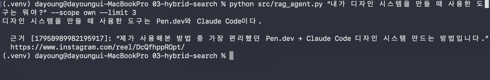
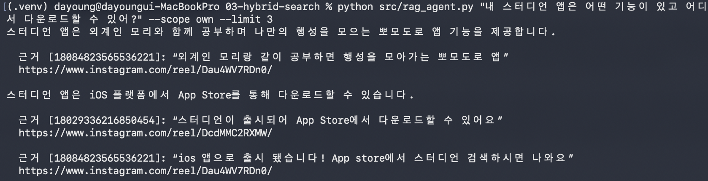

# 03. 하이브리드 검색과 RAG

> 관련 노트: [03-hybrid-search.md](../../notes/03-hybrid-search.md)

## 목표

Instagram 게시물에 자연어로 질문하는 **개인 데이터 에이전트 v1**을 만든다. BM25와 벡터 검색을 RRF로 융합하고, 같은 평가 질문으로 키워드·벡터·하이브리드의 Recall@k를 비교한다. 답변에는 근거 발췌와 출처를 붙이고 답하지 못한 질문과 이유를 지식 그래프 학습의 재료로 ㄱㄱ

## 환경

- 런타임: Python, 기존 01 실습의 `.venv` 재사용. 실제 검증 환경은 Python 3.9이며 새 환경은 Python 3.10 이상 권장.
- 라이브러리: `psycopg[binary] 3.2.10`, `sentence-transformers 3.4.1`.
- 검색 인프라: 저장소 루트 Docker Compose의 Elasticsearch + Nori, PostgreSQL + pgvector.
- 임베딩: 로컬 `intfloat/multilingual-e5-small`, 384차원, 정규화된 벡터.
- 답변 생성: `.env`의 `OPENAI_API_KEY`, `OPENAI_MODEL`로 OpenAI Responses API 호출.
- 데이터: 내 게시물 13개와 참고 캡션 235개, 중복 없는 문서 총 248개. 영상·음성·댓글 본문은 포함하지 않는다.

## 실행 방법

### 1. 터미널 준비

```bash
cd /Users/dayoung/Desktop/cloudclub/10th-KG-study
docker compose up -d
cd members/kdyann/labs/03-hybrid-search
source ../01-instagram-search/.venv/bin/activate
```

기존 01 가상환경과 캐시된 E5 모델을 재사용한다. 새 환경에서는 다음처럼 설치하고 모델을 한 번 받아둔다. 검색 실행은 캐시된 모델만 읽는다.

```bash
python3 -m venv .venv
source .venv/bin/activate
python -m pip install -r requirements.txt
python -c 'from sentence_transformers import SentenceTransformer; SentenceTransformer("intfloat/multilingual-e5-small")'
```

`.env`에는 직접 발급한 키와 사용 가능한 모델 이름을 입력한다.

```dotenv
OPENAI_API_KEY=발급받은_키
OPENAI_MODEL=gpt-4.1-mini
```

### 2. 같은 코퍼스로 검색 색인 만들기

```bash
python src/index_search.py
```

`instagram_documents.jsonl`과 `instagram_topic_documents.jsonl`을 읽고 각 문서에 `own` 또는 `reference` 출처를 붙인다. 03 전용 Elasticsearch 색인과 pgvector 테이블 `kdyann_hybrid_posts`를 갱신한다. 코퍼스 지문·모델·문서 수를 저장하고 두 저장소의 적재가 완료된 뒤 검색을 허용한다. 수집 데이터를 바꾸면 이 명령을 다시 실행한다. 

### 3. BM25·벡터·RRF 검색 직접 비교하기

```bash
python src/hybrid_search.py "내가 디자인 시스템을 만들 때 사용한 도구는 뭐야?" --scope own --mode bm25 --limit 3
python src/hybrid_search.py "내가 디자인 시스템을 만들 때 사용한 도구는 뭐야?" --scope own --mode vector --limit 3
python src/hybrid_search.py "내가 디자인 시스템을 만들 때 사용한 도구는 뭐야?" --scope own --mode hybrid --limit 3 --json
```

BM25는 Nori로 분석한 캡션을 검색한다. 벡터 검색은 `passage:`·`query:` 접두사를 넣은 E5 임베딩의 코사인 거리로 정렬한다. pgvector에는 HNSW 색인이 있지만 전체 검색의 실제 실행 계획은 PostgreSQL이 선택한다. 출처를 제한한 검색은 필터 때문에 후보가 부족해지는 문제를 피하려고 해당 부분 집합을 정확히 비교한다.

하이브리드는 각 검색기의 상위 후보 20개를 `1 / (60 + 순위)`로 합친다. 같은 문서는 ID로 합치고 원래 BM25 점수와 벡터 유사도는 직접 더하지 않는다. JSON 출력의 `bm25_rank`, `vector_rank`로 어느 목록에서 기여했는지 확인

### 4. Recall@k 비교하기

```bash
python src/evaluate_search.py --ks 1 3 5
```

[evaluation/questions.json](evaluation/questions.json)의 15개 질문을 세 방식에 똑같이 보낸다. 내 글 질문 9개, 참고 글 질문 4개, 전체 코퍼스 질문 2개다. 검색 순위를 보기 전에 캡션을 읽고 정답 문서를 지정했다. 검색기별 후보는 20개로 맞추고 질문별 `상위 k개에서 찾은 정답 문서 수 / 전체 정답 문서 수`를 평균한다.


### 6. 검증

```bash
python -m unittest discover -s tests -v
```

합성 응답으로 RRF 순위 계산, 평가 정답·Recall 계산, 출처·발췌 검사, 근거 검토 결과의 반영과 오류 처리를 확인했다.

## 구조

```text
03-hybrid-search/
├── README.md
├── .env.example
├── requirements.txt
├── evaluation/questions.json
├── assets/                     
├── src/
│   ├── hybrid_search.py        # 코퍼스·BM25·pgvector·RRF
│   ├── index_search.py         # 전용 색인 적재와 일치 검사
│   ├── evaluate_search.py      # 세 방식의 Recall@k
│   ├── rag_agent.py            # 검색·답변·인용·근거 검토
│   ├── instagram_common.py
│   ├── fetch_topic_instagram.py
│   ├── fetch_reference_instagram.py
│   └── propose_content.py
└── tests/                     # 검색·평가·RAG·기존 수집 테스트
```

RAG는 **질문 → 검색 → 컨텍스트 조립 → LLM 초안 → 인용 검사 → 별도 LLM 근거 검토 → 답변**으로 진행한다. 기본 컨텍스트는 5개 문서, 문서당 최대 1,800자, 전체 최대 8,000자다.

모델은 주장마다 출처 ID와 원문 발췌를 반환한다. 코드는 실제로 제공한 발췌와 일치하는지 검사하고 원문 URL을 붙인다. 별도 검토 호출에는 인용한 출처의 제공된 원문 맥락과 저자 역할도 전달한다. 내 글의 ‘제가’는 사용자 본인으로 연결하되, 글의 소유자라는 정보만으로 사용 경험을 인정하지 않는다. 검토자는 “언급·추천·기능 소개”를 “직접 사용했다”로 바꾼 주장을 제외하고 미해결 이유에 남긴다. 검토가 실패하면 초안을 성공 답변으로 내보내지 않는다. 

답변 생성은 [Responses API](https://developers.openai.com/api/docs/guides/text)를 사용하며, 주장·인용·검토 결과는 [Structured Outputs](https://developers.openai.com/api/docs/guides/structured-outputs)로 받는다. 

## 결과

### 검색 색인과 Recall@k

2026-09-17 총 248개 문서를 두 저장소에 적재했다. 기존 01 Elasticsearch·pgvector의 문서 13개는 적재 전후 전체 레코드 지문이 같았다. 수동 정답 15개 질문의 평균 Recall은 다음과 같다.

| 검색 방식 | Recall@1 | Recall@3 | Recall@5 |
|---|---:|---:|---:|
| BM25 | 0.7333 | 0.8889 | 0.8889 |
| 벡터 | 0.6000 | 0.6667 | 0.6667 |
| 하이브리드 RRF | 0.6000 | 0.8000 | 0.9556 |

이 세트에서는 상위 1·3개는 BM25가 높았고 상위 5개는 하이브리드가 높았다. 하이브리드가 항상 더 좋다는 결과는 아니다.

> **캡처 1 — 세 검색 방식의 Recall@k 비교**
> `python src/evaluate_search.py --ks 1 3 5`로 평가 질문 15개의 평균 Recall@1·3·5를 비교한 결과.



### 근거를 인용하는 개인 데이터 에이전트

OpenAI 인증과 설정한 모델의 접근을 확인했고 내 디자인 글의 캡션으로 Pen.dev와 Claude Code를 원문 인용과 함께 답하는 것을 확인했다. 검색을 연결한 스터디언 질문에서는 외계인 모리·행성을 모으는 뽀모도로 기능과 App Store 출시 근거를 찾았다.

처음에는 검토자가 내 글의 작성자 맥락을 놓치고 질문에 없는 제작 절차·모든 도구까지 요구해 올바른 답을 거절하거나 불필요한 미해결 항목을 붙였다. 제공된 원문 맥락과 저자 역할을 함께 전달하고 질문의 요구 범위를 좁힌 뒤, 위 캡처용 두 명령을 실제 CLI에서 다시 실행했다. 디자인 도구와 스터디언 기능·다운로드 경로를 인용과 함께 반환했고 두 응답 모두 `answered`였다. 이는 해당 실행에서 확인한 결과이며 매번 같은 모델 판정을 보장하지는 않는다.

추가로 스터디언 질문을 기본 컨텍스트 5개로 실행했을 때는 모델이 제공된 원문과 일치하지 않는 발췌를 반환해 `generation_error`로 차단됐다. 잘못된 인용을 막는 것과 모델이 매번 유효한 답을 생성하는 것은 다른 문제였다,.

수정 후 내 글의 정확한 인용만 붙인 ‘사용자와 참고 작성자가 Claude Code를 공통으로 직접 사용했다’는 잘못된 주장도 실제 검토 API에 따로 보냈다. 검토자는 내 사용 경험은 인정하고 참고 작성자의 사용 근거가 없다는 이유로 공통 사용 주장을 거절했다. 

> **캡처 2 — 내 디자인 시스템 도구 질문과 원문 인용**



> **캡처 3 — 스터디언 기능과 다운로드 질문**




- `data/kdyann/processed/hybrid_search/index_metadata.json`: 색인한 코퍼스 지문·문서 수·모델.
- `data/kdyann/processed/hybrid_search/evaluation.json`: 질문별 순위·Recall과 평균값.
- `data/kdyann/processed/rag_runs.jsonl`: 질문·제공한 컨텍스트·답변·실행 상태.
- `data/kdyann/processed/rag_unresolved_questions.jsonl`: 답하지 못한 질문·미해결 이유. API·검색 오류는 별도 상태로 구분한다.

## 배운 점

- BM25 점수와 벡터 유사도는 척도가 달라 RRF에서는 점수 대신 순위를 합쳤다. 여러 목록의 근거를 합치면 상위 후보를 넓힐 수 있지만 앞쪽 순위가 항상 좋아지는 것은 아닌 것을 배웠다. 
- 필요한 문서를 찾는 것과 그 원문의 사실·관계를 정확히 연결하는 것은 다르다. 인용 URL과 실제 발췌가 있어도 답변의 해석이 맞는지 확인해야 한다는 점.
- 검토자가 내 글의 ‘제가 사용해본’을 사용자 경험으로 연결하지 못해 올바른 답을 거절한게 있었다. 인용한 출처의 제공된 원문 맥락과 저자 역할을 함께 전달하고, 질문에 없는 제작 절차·모든 도구까지 요구하지 않도록 수정해야되는 것을 알게 됐따.

## 다음 단계

- [ ] 독립 평가 질문을 늘리고 검색 후보 수·컨텍스트 길이에 따른 결과 비교.
- [ ] 답하지 못한 질문을 사실·관계 관점에서 분류하고 온톨로지 배경·변천사·방법론 학습으로 연결.
- [ ] 대화의 후속 질문과 검색 재시도 연결.
- [ ] 모델 검토의 잘못된 거절·과도한 미해결 요구를 평가할 질문을 늘려 수정 효과 확인.
- [ ] 이후 확장: 하루 한 번 수집·검색·콘텐츠 생성 → Discord 전달 → Hermes 메모리 갱신.
- [ ] 자동 실행의 중복 방지·재시도·단계별 성공 기록. 전체 코퍼스·생성물은 프로젝트에 보관하고 Hermes에는 선호·교훈·결과 링크를 요약 반영.
