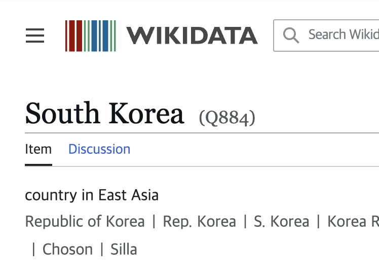
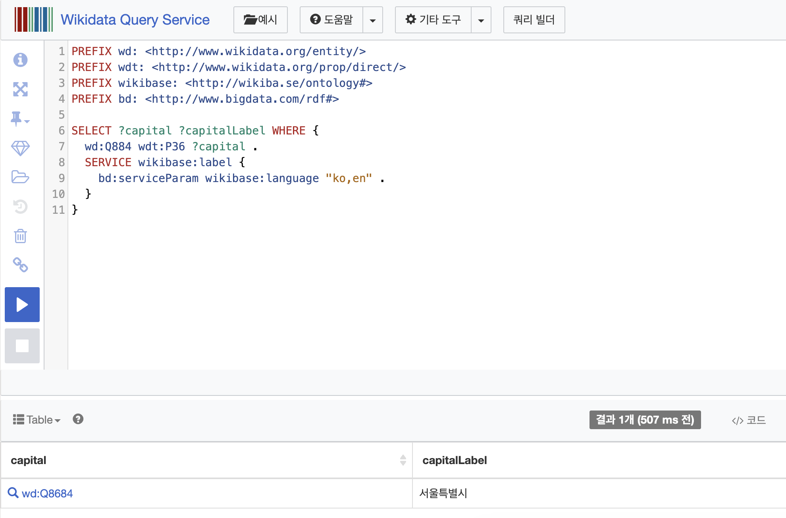
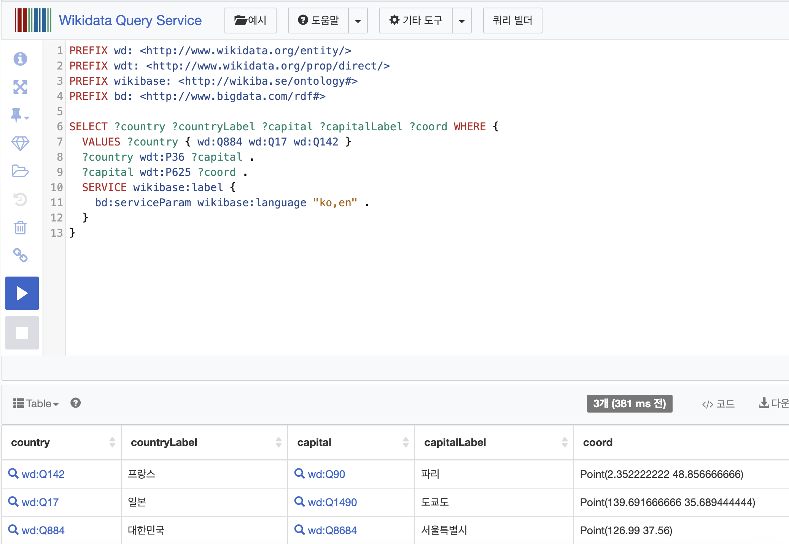
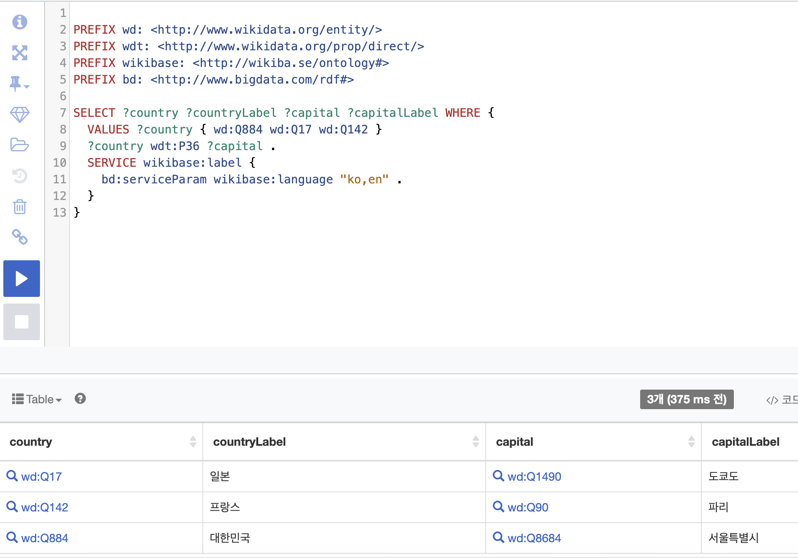
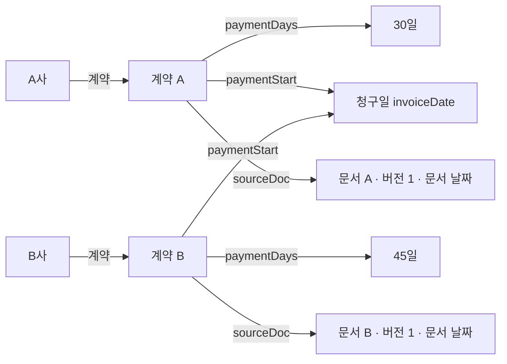

# 04. SPARQL 질의와 계약 비교 그래프 모델링

> 관련 노트: [04-2. 온톨로지 모델링 — RDF·OWL로 사실과 관계 표현하기](../../notes/04-2-ontology-modeling.md)

## 환경

- 웹 브라우저와 [Wikidata Query Service](https://query.wikidata.org/)
- 별도 설치나 API 키 없이 공개 엔드포인트 사용

## 결과

### 1. Wikidata에서 사실과 관계 질의하기

Wikidata의 `Q` 식별자는 항목, `P` 식별자는 속성이다. `wd:Q884`는 대한민국, `wdt:P36`은 수도 관계다. `wdt:`는 우선 순위가 반영된 직접 속성 표현이다. deprecated 진술은 제외하고 preferred 진술이 있으면 그것을, 없으면 normal 진술을 사용한다. 

#### 질의 1: 대한민국의 수도는?

질의 파일: [01-capital.rq](src/01-capital.rq)



```sparql
PREFIX wd: <http://www.wikidata.org/entity/>
PREFIX wdt: <http://www.wikidata.org/prop/direct/>
PREFIX wikibase: <http://wikiba.se/ontology#>
PREFIX bd: <http://www.bigdata.com/rdf#>

SELECT ?capital ?capitalLabel WHERE {
  wd:Q884 wdt:P36 ?capital .
  SERVICE wikibase:label {
    bd:serviceParam wikibase:language "ko,en" .
  }
}
```

- `?capital`: 수도 자리에 들어갈 값을 찾는 변수.
- `WHERE`: 그래프에서 찾아야 할 패턴.
- `SELECT`: 결과로 보고 싶은 변수.
- `SERVICE wikibase:label`: 항목의 이름을 한국어 우선, 없으면 영어로 가져오는 Wikidata 기능.

2026-09-29 실행 결과, `capital`에 서울특별시의 식별자 `Q8684`, `capitalLabel`에 `서울특별시`가 반환됐다. 



#### 질의 2: 세 나라의 수도와 그 수도의 좌표는?

질의 파일: [02-capital-coordinates.rq](src/02-capital-coordinates.rq)

```sparql
PREFIX wd: <http://www.wikidata.org/entity/>
PREFIX wdt: <http://www.wikidata.org/prop/direct/>
PREFIX wikibase: <http://wikiba.se/ontology#>
PREFIX bd: <http://www.bigdata.com/rdf#>

SELECT ?country ?countryLabel ?capital ?capitalLabel ?coord WHERE {
  VALUES ?country { wd:Q884 wd:Q17 wd:Q142 }
  ?country wdt:P36 ?capital .
  ?capital wdt:P625 ?coord .
  SERVICE wikibase:label {
    bd:serviceParam wikibase:language "ko,en" .
  }
}
```

`VALUES`로 대한민국(Q884), 일본(Q17), 프랑스(Q142)만 고른다. `P625`는 좌표다. 두 패턴이 `?capital`을 공유하므로 나라 → 수도 → 좌표를 연결해서 찾는다. 이처럼 같은 변수로 사실을 결합하는 것은 조인(join)이며, OWL 추론을 실행한 것은 아니다.

2026-09-29 실행 결과는 다음 세 행이었다. `coord`는 `Point(경도 위도)` 형태다.

| 나라 | 수도 | 좌표 |
| --- | --- | --- |
| 프랑스 | 파리 | `Point(2.352222222 48.856666666)` |
| 일본 | 도쿄도 | `Point(139.691666666 35.689444444)` |
| 대한민국 | 서울특별시 | `Point(126.99 37.56)` |



행 순서를 지정하지 않았으므로 실행할 때 순서가 달라도 정상이고 공개 데이터의 값과 표시는 변경될 수 있다. 결과 표시 방식을 Map으로 바꾸면 좌표를 지도에서도 볼 수 있다.

#### 질의 3: 나라와 수도의 관계만 조회하기

질의 파일: [03-country-capitals.rq](src/03-country-capitals.rq)

```sparql
PREFIX wd: <http://www.wikidata.org/entity/>
PREFIX wdt: <http://www.wikidata.org/prop/direct/>
PREFIX wikibase: <http://wikiba.se/ontology#>
PREFIX bd: <http://www.bigdata.com/rdf#>

SELECT ?country ?countryLabel ?capital ?capitalLabel WHERE {
  VALUES ?country { wd:Q884 wd:Q17 wd:Q142 }
  ?country wdt:P36 ?capital .
  SERVICE wikibase:label {
    bd:serviceParam wikibase:language "ko,en" .
  }
}
```

좌표 패턴을 빼고 나라와 수도의 연결만 조회해봤다. 2026-09-29 실행한 표에는 일본–도쿄도, 프랑스–파리, 대한민국–서울특별시의 세 쌍이 나왔다.



시간 초과나 서비스 오류가 나면 잠시 후 다시 시도한다. 문법 오류라면 접두어 선언부터 마지막 중괄호까지 빠짐없이 복사했는지 확인한다.

### 2. W3의 계약 비교 질문을 그래프로 그리기

[W3 하이브리드 검색 노트](../../notes/03-hybrid-search.md)의 A사·B사 계약은 가상 예시이고 실제로 내가 답변 실패를 측정한 사례는 아니다. 같은 예시를 그래프로 옮겨 “어떤 정보를 연결해야 비교할 수 있을까?”를 생각해봤다.

회사에 곧바로 `지급기한=30일`을 붙이면 같은 회사의 다른 계약이나 개정 계약을 구분하기 어렵다. 계약을 별도 대상으로 두고 회사·조건·근거 문서를 연결한다.



위 문서 버전도 모델링을 설명하기 위해 붙인 가상 값이며, 문서 날짜는 실제 원문에서 확인해 저장할 항목이다. `청구일`은 기준의 종류를 뜻한다. 실제 지급 예정일을 계산하려면 개별 청구서의 `invoiceDate` 날짜 값과 어떤 계약에 따른 청구인지도 추가해야 한다.

비교 순서는 `회사 → 계약 → 지급 기한·기산점·근거 문서`. 두 계약의 기산점이 모두 청구일인 것을 확인한 뒤 `45 - 30 = 15일`로 차이를 구한다.

원문에서 조건을 잘못 추출하거나 개정 버전을 혼동하면 그래프로 바꿔도 답이 틀릴 수 있다. 실제 데이터에서는 계약 식별자, 적용 시점, 문서 버전·날짜와 원문 위치까지 함께 관리할 필요가 있어보인다.

## 실습 후 생각해볼 질문

- 계약이 개정되면 과거 조건과 현재 유효한 조건을 어떻게 구분할까?
- 문서를 검색해 비교하는 방식과 사실을 그래프로 구조화하는 방식의 준비 비용은 어떻게 다를까?
- 그래프 질의로 찾은 사실과 논리적 추론으로 얻은 사실을 답변에서 어떻게 구분해 보여줄까?
