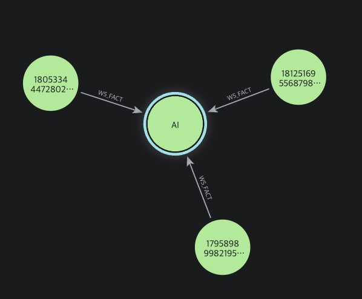

# W5. 문서에서 트리플로: 내 콘텐츠와 인기 게시물 연결하기

## 질문과 결과

"최근 7일 동안 반응을 얻은 참고 게시물 중, 내 콘텐츠와 주제로 연결되는 글이 있을까?" 라는 질문을 던져 캡션에서 근거가 확인되는 사실만 추출해 그래프에 넣고, `내 게시물 → 공통 Topic ← 참고 게시물` 경로를 찾았다.

| 확인한 항목 | 결과 |
| --- | --- |
| 입력 | 내 게시물 13건 + 최근 참고 게시물 26건 = 문서 39건 |
| 선정 기준 | 최근 7일, 게시 후 24시간 이상, 관찰 좋아요 100개 이상, 최대 50건 |
| 검토 후 남긴 추출 사실 | 38건. 각각 원문 근거와 문자 위치 포함 |
| RDF 내보내기 | Turtle·JSON-LD, RDF 트리플 589개 |
| PostgreSQL | 문서 39개, 엔티티 65개, 엣지 38개, 근거 38개 |
| Neo4j 질의 | `AI`를 공유하는 내 글 → 참고 글 경로 2건 |

### AI 경로: 내 글과 참고 글이 만나는 사례



내 게시물 `17958989982195917`에서 `AI` Topic을 거쳐 참고 게시물 `18125169556879801`, `18053344472802404`로 이어진다. [최근 참고 후보 질의](src/queries/04_recent_candidate.cypher)는 양쪽 캡션 근거, 참고 글의 게시 시각과 관찰 반응 지표도 함께 반환한다. 그래프의 `W5_FACT`는 두 글이 같은 주제를 언급했다는 관계

## 방법

1. W2의 내 캡션 13건과 W3의 참고 게시물 26건을 문서로 사용했다. 참고 게시물은 저장된 후보에서 최근 7일·좋아요 100개 이상 조건으로 다시 선정했다. 
2. [미니 온톨로지](ontology.ttl)에 `Post`, `Concept`, `Topic`, `Project`, `Feature` 5개 클래스와 콘텐츠 관계 7개를 RDFS 스타일로 정의했다. `rdfs:domain`·`rdfs:range`는 타입 설명이고, 실제 출력 제한은 JSON Schema와 로컬 검증이 담당한다.
3. [추출 파이프라인](src/pipeline.py)은 few-shot 예시와 강제 JSON 출력을 사용하고, 각 사실에 원문과 정확히 일치하는 evidence 문자열 및 문자 오프셋을 요구한다. LLM이 만든 사실은 의미 검토를 거쳐 채택했다. 좋아요 수는 추출 모델의 추정이 아닌 수집 시 관찰값이다.
4. 검토본의 엔티티·엣지·근거를 PostgreSQL에 저장하고, 같은 그래프를 Turtle·JSON-LD로 직렬화했다. [적재기](src/persist.py)는 Neo4j에서 고유 ID와 `MERGE`를 사용해 중복 적재를 막는다.
5. Neo4j Browser에서 [1-hop](src/queries/01_one_hop.cypher), [1~3-hop](src/queries/02_paths_1_to_3.cypher), [공통 주제](src/queries/03_shared_topic.cypher), [최근 참고 후보](src/queries/04_recent_candidate.cypher) 질의를 실행했다.

## 산출물과 재현

실제 데이터 검토본은 `data/kdyann/processed/content_graph/reviewed-100likes-ai/`에 있음.

| 파일 | 내용 |
| --- | --- |
| `documents.jsonl` | 캡션, `published_at`, `collected_at`, 선정 정보·관찰 지표 |
| `facts.jsonl` | 검토한 관계 38건과 근거 스팬 |
| `graph.ttl`, `graph.jsonld` | 동일 그래프의 Turtle·JSON-LD 출력 |
| `review_decisions.json` | 제외한 추출과 근거 기반 Topic 보강 기록 |

저장소 루트에서 합성 예제를 실행하면 외부 API와 DB 없이 추출 형식 및 직렬화를 확인할 수 있다.

```bash
python3 members/kdyann/labs/05-content-graph/src/pipeline.py \
  --documents members/kdyann/labs/05-content-graph/examples/documents.jsonl \
  --predictions members/kdyann/labs/05-content-graph/examples/predictions.jsonl \
  --limit-own 2 --limit-reference 1 --as-of 2026-09-30 \
  --output data/kdyann/processed/content_graph/example
python3 -m unittest discover -s members/kdyann/labs/05-content-graph/tests -v
```

실제 검토본을 로컬 PostgreSQL·Neo4j에 적재할 때는 다음을 실행한다. 

```bash
docker compose up -d postgres neo4j
python3 -m pip install -r members/kdyann/labs/05-content-graph/requirements.txt
export NEO4J_PASSWORD='로컬 Neo4j 비밀번호'
python3 members/kdyann/labs/05-content-graph/src/persist.py \
  --output data/kdyann/processed/content_graph/reviewed-100likes-ai --target both
```

기본 접속값은 `PG_DSN=postgresql://kg:kg@127.0.0.1:5432/kg`, `NEO4J_URI=bolt://127.0.0.1:7687`, `NEO4J_USER=neo4j`다. [Neo4j Browser](http://localhost:7474/)에서 아래 값을 설정한 뒤 `src/queries/03_shared_topic.cypher` 또는 `04_recent_candidate.cypher` 내용을 실행하고 Graph 보기를 선택하면 된다.

```cypher
:param topic_name => '야구';
:param as_of => '2026-09-30T23:59:59Z';
```

`야구`는 내 글 사이의 연결을, `AI`는 내 글과 참고 글 사이의 연결을 확인하는 데 쓴다. 실행 시점이 달라지면 최근 7일 조건의 결과도 달라지므로 `as_of`를 결과를 확인한 날짜에 맞춘다.

## 채팅 사이트 만들기

W5 그래프를 질문으로 조회하는 사이트를 로컬에 [로컬 서버](src/local_chat.py)와 [화면](web/index.html)으로 만들었다. 질문에는 읽기 전용 그래프 질의를 사용한다. 다음 명령은 저장소 루트에서 실행한다. 위 PostgreSQL·Neo4j 적재가 끝나 있어야 한다.

```bash
docker compose up -d postgres neo4j
export NEO4J_PASSWORD='로컬 Neo4j 비밀번호'
python3 members/kdyann/labs/05-content-graph/src/local_chat.py --port 8765
```

브라우저에서 [http://127.0.0.1:8765/](http://127.0.0.1:8765/)을 열어 `내 게시물의 주제는 뭐야?` 또는 `최근 유행한 것 중 내 게시물에 참고할 만한 거 있어?`라고 물을 수 있다. 첫 질문은 근거가 확인된 내 Topic을, 두 번째는 질의 시점의 최근 7일에 내 글과 공통 Topic을 가진 참고 게시물과 양쪽 원문 근거를 보여준다. 이번 적재본에서는 내 주제 6개와 `AI` 연결 후보 2개가 표시됐다. 후보 카드에서 대본을 요청하면 선택한 내 글·참고 글의 발췌를 바탕으로 초안을 만든다. 대본 생성 때만 W3의 OpenAI 설정과 API 키가 필요하다.

이 화면은 위 세 가지 동작을 지원하는 채팅이다. 공통 Topic은 탐색 후보를 찾는 조건이며, 후보가 계정 콘셉트에 적합하다는 판정은 아니다. 새 참고 게시물을 자동 수집하지 않으므로 날짜가 지나 후보가 사라지면 수집·추출·적재를 다시 실행해야 한다.

## 다음 단계

- 다음 단계에서는 참고 글 수집 주제를 내 콘텐츠에 맞게 좁히고, 공통 Topic보다 구체적인 콘셉트·형식·근거를 함께 평가한 뒤 주제와 대본 생성으로 이어가야된다..

참고: [OpenAI Structured Outputs](https://platform.openai.com/docs/guides/structured-outputs), [W3C RDF 1.1 Turtle](https://www.w3.org/TR/turtle/), [W3C JSON-LD 1.1](https://www.w3.org/TR/json-ld11/).
