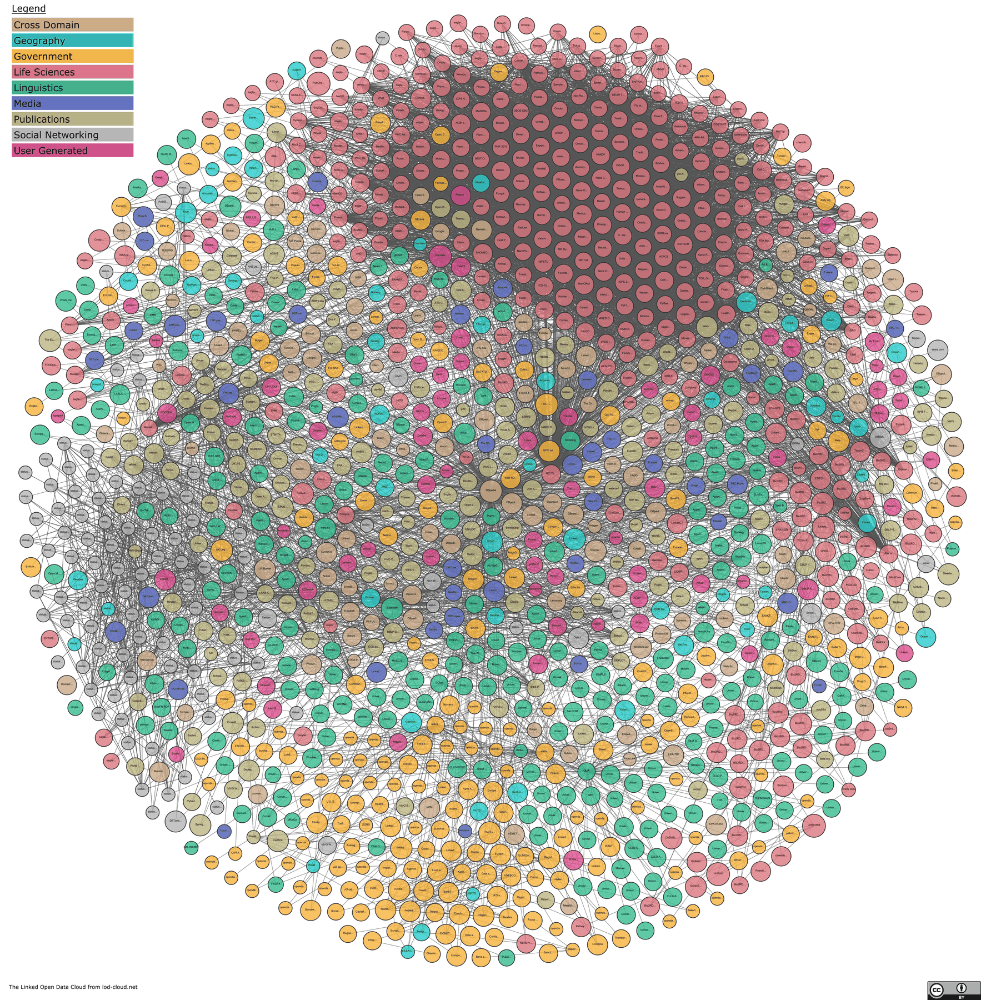
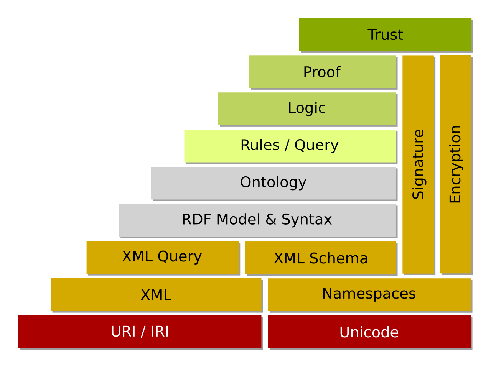
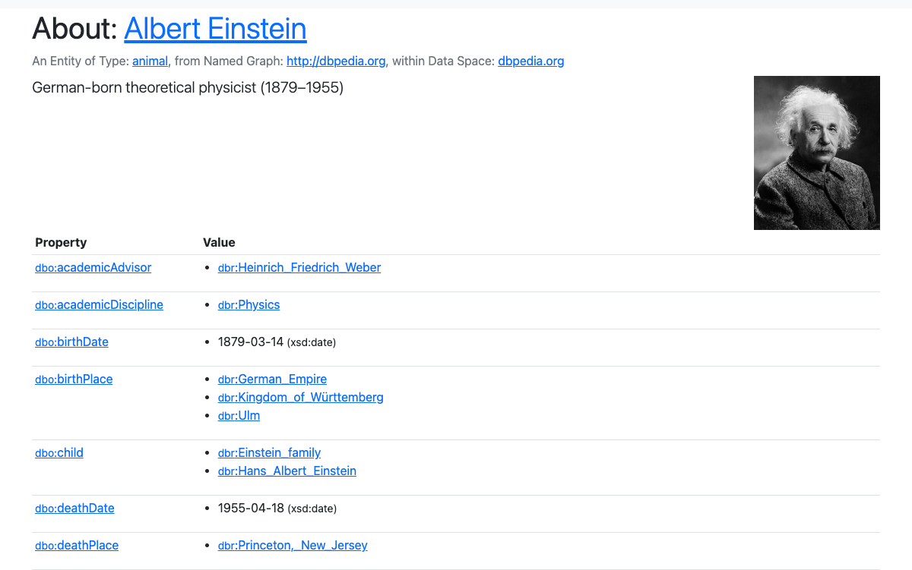
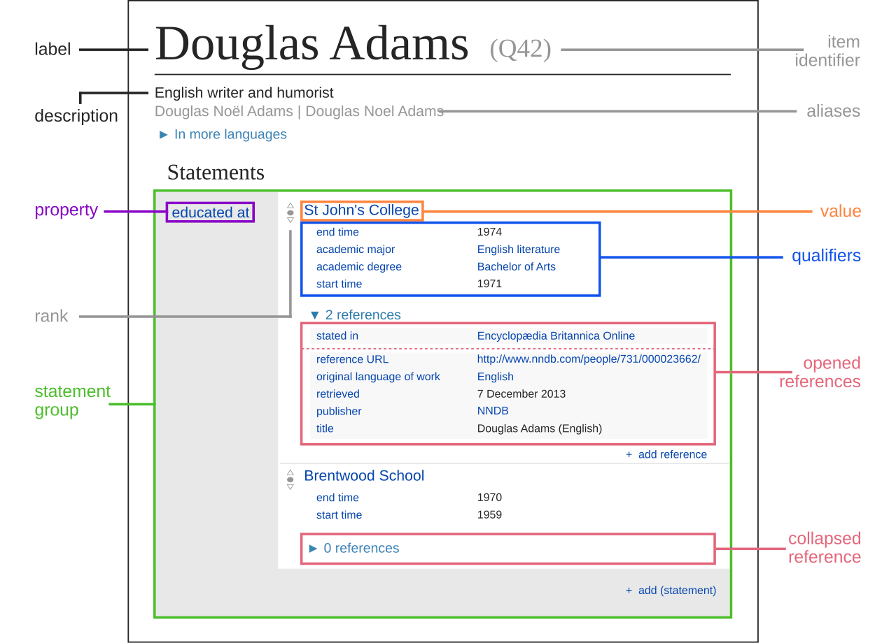
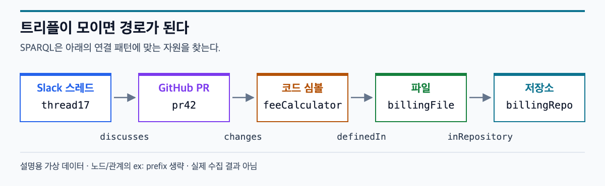

# 02. W4. 지식 그래프의 배경 — 온톨로지 변천사와 방법론

> 핵심 질문: 검색이 문서를 찾는다면, 사실과 관계를 찾으려면 무엇이 필요한가?

## 한 줄 요약

지식 그래프는 대상과 관계를 명시적으로 연결해 사실을 찾게 하고, 온톨로지는 그 그래프에서 사용할 개념과 관계의 의미를 정한다.

## 핵심 개념

- **지식 그래프(KG):** 대상과 대상 사이의 관계를 그래프 형태로 표현한 지식 집합.\[13\]
- **RDF:** 사실을 주어·술어·목적어 트리플로 표현하는 W3C 데이터 모델.\[1\]
- **온톨로지:** 특정 분야의 개념·속성·관계와 그 의미를 표현한 형식적 모델.\[3\]
- **RDFS / OWL:** RDF 위에 클래스·속성 계층과 더 풍부한 의미·제약을 표현하는 언어.\[2\]\[3\]
- **SPARQL:** RDF 그래프에서 트리플 패턴을 질의하는 표준 언어.\[4\]
- **추론(inference):** 명시한 규칙과 사실에서 논리적으로 따라오는 사실을 도출하는 것. 근거 없이 문장을 생성하는 것과 다르다.\[3\]

## 상세 정리

### 1. 문서 검색과 사실·관계 검색

일반적인 문서 검색은 질문과 관련된 문서나 문장 조각을 찾아준다. 지식 그래프는 그 문서에 등장하는 대상과 관계를 분리해 저장하므로, 여러 관계를 따라가야 답할 수 있는 질문을 표현하기 쉽다.\[4\]\[13\]

예를 들어 다음 질문을 생각해볼 수 있다.

> 특정 Slack 스레드에서 논의한 PR은 어떤 코드 심볼을 바꿨고, 그 심볼은 어느 저장소에 속하는가?

문서 검색은 `PR`이나 함수명을 언급한 메시지를 찾는 데 유용하다. 그래프 질의는 `Slack 스레드 → PR → 코드 심볼 → 저장소`처럼 이미 표현된 연결을 따라간다.\[4\] KG가 원문이나 검색을 대체하는 것은 아니다. 관계가 올바르게 추출됐는지 원문과 근거를 확인할 수 있어야 한다.



**그림 1. Linked Open Data Cloud** — 2026-06-15 공개본. 각 원은 개별 사람이 아니라 **데이터셋**이고, 선은 데이터셋 사이의 연결이다. 모든 노드 이름을 읽기보다는 서로 다른 분야의 데이터가 연결되는 전체 모습을 보자.\[16\] [큰 원본 보기](https://lod-cloud.net/versions/2026-06-15/lod-cloud.png)

### 2. 주요 변천사

아래는 W4에서 다룰 대표 흐름이다. 하나의 표준이 모든 후속 제품으로 그대로 이어졌다는 뜻은 아니며, 각 시도가 데이터의 의미와 연결을 다룬 서로 다른 방식이라는 관점으로 본다.

- **시맨틱 웹:** 2001년 Berners-Lee, Hendler, Lassila의 글은 컴퓨터가 의미를 처리할 수 있는 웹 콘텐츠의 비전을 제시했다.\[14\]
- **RDF·RDFS·OWL:** 웹 자원을 식별하고 사실을 그래프로 표현하며, 용어와 의미를 기계가 해석할 수 있게 하는 표준 계열이 만들어졌다.\[1\]\[2\]\[3\]
- **링크드 데이터와 DBpedia·Wikidata:** 공개 데이터를 URI로 식별하고 다른 데이터와 연결하려는 접근이다. DBpedia는 Wikimedia 프로젝트의 내용을 구조화해 링크드 데이터로 제공하고, Wikidata는 식별자·속성·주장·한정어·출처 등을 갖춘 데이터 모델을 운영한다.\[5\]\[6\]\[13\]
- **Google Knowledge Graph:** 2012년 Google은 문자열 일치뿐 아니라 대상 자체와 그 관계를 검색에 활용한다는 방향을 “things, not strings”로 소개했다.\[7\]
- **기업 KG와 제품 온톨로지:** 회사 내부 데이터의 대상을 연결해 검색, 분석, 업무 애플리케이션에 활용한다. Palantir Foundry Ontology는 이 중 한 제품 구현 사례다.\[9\]
- **GraphRAG:** 2024년 발표된 연구는 그래프를 활용한 질의 중심 요약 접근을 제안했다. KG가 모든 RAG의 필수 구성요소라는 뜻은 아니며, 어떤 질문 유형에서 그래프 구조가 도움이 되는지를 살펴본다.\[8\]

#### 시맨틱 웹: 의미를 쌓아 올리는 구상



**그림 2. 시맨틱 웹의 역사적 계층 개념도.** 아래쪽의 **URI/IRI**, 중간의 **RDF Model & Syntax · Ontology**, 위쪽의 **Logic · Proof · Trust**를 차례로 보자.\[19\]

이 그림은 “대상을 식별하는 것에서 출발해, 사실의 의미와 추론·신뢰까지 다루자”는 구상을 보여준다. **현재 모든 시스템이 이 계층을 그대로 구현해야 한다는 설계도는 아니다.** 특히 RDF를 쓰기 위해 XML을 반드시 써야 하는 것은 아니며, 아래에서 볼 Turtle도 RDF를 표현하는 문법이다.\[1\]

#### DBpedia: 문서 속 정보를 속성과 값으로 보기



**그림 3. DBpedia의 Albert Einstein 페이지** 일부를 2026-09-30에 캡처했다. 웹페이지의 내용을 재구성한 모형이 아니라 실제 화면의 발췌다.\[17\]

- `dbo:birthDate → 1879-03-14 (xsd:date)`: 날짜 **값(리터럴)**을 읽는다.
- `dbo:birthPlace → dbr:Ulm`: 다른 **대상(자원)**으로 연결되는 링크를 읽는다.
- 같은 `Property / Value` 표 안에도 단순한 값과 다른 자원으로의 연결이 함께 들어 있다.\[17\]

이렇게 보면 “위키 문서를 검색한다”와 “그 문서에서 구조화한 사실을 따라간다”의 차이가 조금 더 구체적이다.

#### Wikidata: 주장에 조건과 출처까지 붙이기



**그림 4. Wikidata 도움말에서 사용하는 서술 구조 설명도.** 실제 서비스의 최신 화면 캡처가 아니라, Douglas Adams 항목을 소재로 만든 학습용 그림이다.\[18\]\[20\]

그림에서는 다음 순서로 읽으면 된다.

1. **대상:** `Douglas Adams (Q42)`는 누구에 관한 정보인지 나타낸다.
2. **속성 → 값:** `educated at → St John's College`는 어느 학교에서 공부했는지 표현한다.
3. **한정어(qualifier):** `start time`, `end time` 등은 그 주장에 기간 같은 맥락을 더한다.
4. **출처(reference):** 아래에 펼쳐진 영역은 해당 주장의 근거를 기록하는 자리다.\[18\]\[20\]

핵심은 “이 사람이 이 학교를 다녔다”에서 끝나지 않고, **언제의 사실인지, 무엇을 근거로 하는지**도 함께 표현한다는 점이다.\[18\]

### 3. RDF 트리플과 식별자

RDF의 기본 문장은 다음 형태다.

```text
주어(subject) — 술어(predicate) — 목적어(object)
```

RDF 트리플에서 주어는 IRI 또는 blank node, 술어는 IRI, 목적어는 IRI·blank node·리터럴이 될 수 있다. 리터럴은 문자열·수치·날짜 등의 값과 datatype 또는 language tag를 표현한다. IRI를 쓰면 이름이 같은 대상을 식별자 차이로 구별할 수 있고, prefix는 namespace IRI를 줄여 쓰는 Turtle 표기법이다.\[1\]

아래는 이번 스터디의 데이터 원천을 떠올리기 위한 **가상 예시**다. 실제 Slack·GitHub 데이터를 확인해 만든 사실은 아니다.

```turtle
@prefix ex: <https://example.org/kg/> .

ex:thread17 ex:discusses ex:pr42 .
ex:pr42 ex:changes ex:feeCalculator .
ex:feeCalculator ex:definedIn ex:billingFile .
ex:billingFile ex:inRepository ex:billingRepo .
```

각 줄은 하나의 사실이다. 예를 들어 `ex:pr42`는 특정 PR의 식별자이고, `ex:changes`는 관계를 나타내는 식별자다. `feeCalculator`라는 표시 이름이 같더라도 IRI가 다르면 다른 대상으로 취급할 수 있다.\[1\]

### 4. 스키마, RDFS, OWL, 추론

쉽게 구분하면, **스키마**는 데이터의 구조와 필드·타입을 정하고, **온톨로지**는 개념과 관계가 무엇을 의미하는지 및 그들 사이의 논리적 규칙을 표현한다. 다만 이는 설명을 위한 구분이다. RDF 생태계에서는 RDFS 자체가 RDF 데이터를 위한 모델링 어휘를 제공하고, OWL은 클래스·속성·개체·값과 형식적 의미를 표현하므로 스키마와 온톨로지의 경계가 늘 칼같이 나뉘는 것은 아니다.\[2\]\[3\]

- **RDFS:** `rdfs:Class`, `rdfs:subClassOf`, `rdfs:subPropertyOf`, `rdfs:domain`, `rdfs:range` 같은 기본 용어로 분류와 계층을 표현한다.\[2\]
- **OWL:** 클래스와 속성에 더 풍부한 공리·제약을 부여해 의미를 표현한다. 이유기를 사용하면 주어진 공리와 사실에서 따라오는 관계나 타입을 도출할 수 있다.\[3\]
- **주의:** OWL의 형식적 의미에서 어떤 사실이 기록되지 않았다는 이유만으로 거짓이라고 단정할 수는 없다. 추론 규칙으로부터 도출되는 것과 데이터베이스의 필수 입력값 검증은 구별해야 한다.\[3\]

예를 들어 RDFS의 subclass 관계와 instance type을 표현하면 `pr42`가 `Change`의 일종이라고 추론할 수 있다.\[2\]

```turtle
ex:PullRequest rdfs:subClassOf ex:Change .
ex:pr42 rdf:type ex:PullRequest .
```

### 5. SPARQL 맛보기

SPARQL은 RDF 그래프에 패턴을 맞춰 질의한다.\[4\] 위 예시 그래프에서 PR을 논의한 스레드와 그 PR이 바꾼 심볼을 찾는 간단한 패턴은 다음과 같다.



**그림 5. 3절의 가상 Turtle 예시를 그대로 그린 경로다.** 상자는 자원, 화살표 아래의 이름은 관계다. 아래 질의의 각 줄을 화살표와 하나씩 대응시켜 보자. 실제 Slack·GitHub 수집 결과가 아니다. [편집 가능한 SVG](assets/02-knowledge-graph-background/rdf-query-path.svg)

```sparql
PREFIX ex: <https://example.org/kg/>

SELECT ?thread ?pr ?symbol ?repository
WHERE {
  ?thread ex:discusses ?pr .
  ?pr ex:changes ?symbol .
  ?symbol ex:definedIn ?file .
  ?file ex:inRepository ?repository .
}
```

이 질의가 답하려면 위 관계들이 실제 그래프에 들어 있어야 한다. SPARQL은 그래프 패턴을 질의하는 언어이지, 사실을 자동으로 수집하거나 관계의 진위를 보증하는 기능은 아니다.\[4\]

### 6. 프로퍼티 그래프와 RDF 트리플 스토어

둘 다 노드와 관계를 다루지만 기본 표현이 다르다. RDF는 트리플과 식별 가능한 자원·어휘를 중심으로 하고, Neo4j 계열 프로퍼티 그래프는 타입이 있는 노드·관계에 key-value 속성을 붙여 표현한다.\[1\]\[12\]

| 비교 | RDF 트리플 그래프 | 프로퍼티 그래프 |
| --- | --- | --- |
| 기본 사실 | 주어–술어–목적어 | 노드–타입이 있는 관계–노드 |
| 식별·용어 | URI/IRI와 공유 어휘를 폭넓게 사용 | 보통 애플리케이션·저장소 내부의 노드/관계 ID와 라벨 사용 |
| 속성 | 관계 자체의 추가 정보를 표현할 때 별도 자원 등 모델링이 필요할 수 있음 | 노드와 관계 모두에 key-value 속성을 직접 붙일 수 있음 |
| 질의 예 | SPARQL | Cypher 등 구현별 질의 언어 |
| 강조점 | 데이터 간 식별·상호운용성과 의미 표현 | 연결 경로와 속성을 가진 그래프를 애플리케이션에서 다루기 |

이 비교는 경향을 설명하는 것이지 절대적인 기능 경계는 아니다. 양쪽 모두 그래프 구조를 표현할 수 있으며, 서로 변환하려면 식별자·속성·추론 의미의 차이를 고려해야 한다.\[1\]\[12\]

### 7. W3의 못 답한 질문을 그래프로 바꾸기

W3에서 실제로 정리한 질문을 하나 골라, 답을 먼저 만들지 말고 필요한 사실의 모양부터 그린다.

```text
질문:
필요한 대상(노드):
필요한 관계(화살표):
질문에 답하려면 필요한 근거:
현재 빠진 사실 또는 불확실한 연결:
```

관계가 없어서 답할 수 없는지, 원문은 있지만 엔티티 식별이 안 되는지, 애초에 질문에 필요한 데이터가 수집되지 않았는지를 구별한다.

## 마무리 질문

- 문서 검색 결과와 KG에서 찾은 사실·관계의 차이를 예로 설명할 수 있는가?
- 가상 문장을 트리플로 만들고, URI/IRI와 리터럴을 구별할 수 있는가?
- RDFS와 OWL은 각각 어떤 의미 표현과 추론을 더하는가?
- SPARQL 패턴은 그래프에서 어떤 경로를 찾는가?
- RDF와 프로퍼티 그래프를 “승자”가 아니라 모델링 관점의 차이로 설명할 수 있는가?

## 교재

- Martin Kleppmann, *Designing Data-Intensive Applications*, 2장 「데이터 모델과 질의 언어」
  - 관계형·문서·그래프 모델
  - 프로퍼티 그래프와 Cypher
  - 트리플 스토어와 SPARQL, 시맨틱 웹
  - Datalog는 질의 언어와 추론의 계보를 더 보고 싶을 때 선택

## 궁금한 점 / 더 알아볼 것

- 시맨틱 웹의 목표와 실제 채택 사이에는 어떤 간극이 있었을까?
- RDF와 프로퍼티 그래프 사이에 데이터를 옮길 때 무엇을 잃거나 새로 정해야 할까?
- 우리 데이터에서 이름이 같다는 것과 동일한 엔티티라는 것은 어떻게 구별할까?

## 그림 출처와 이용 조건

이미지는 문서와 함께 로컬 파일로 보관했다. 외부 이미지는 원본의 의미를 바꾸지 않고 화면 발췌, 크기 조정, 흰 배경 처리와 PNG 용량 최적화만 적용했다.

| 그림 | 출처·제작자 | 이용 조건·처리 |
| --- | --- | --- |
| 1. Linked Open Data Cloud | LOD Cloud, John P. McCrae 및 기여자.\[16\] | [CC BY 4.0](https://creativecommons.org/licenses/by/4.0/). 2026-06-15 공개본을 축소했고, 이미지의 출처·라이선스 표시를 보존했다. |
| 2. 시맨틱 웹 계층도 | Sebastian Faubel / Sqrt66, Wikimedia Commons.\[19\] | 원본 파일 페이지에 퍼블릭 도메인으로 공개됨. PNG 미리보기를 흰 배경으로 정리했다. |
| 3. DBpedia 화면 | DBpedia 및 Wikipedia 기여자.\[17\] 사진: Oren Jack Turner, 1947.\[21\] | 본문 데이터는 [CC BY-SA 4.0](https://creativecommons.org/licenses/by-sa/4.0/). 제목과 표 일부를 캡처했다. 포함된 초상 사진의 국가별 권리 안내는 별도 원본 페이지를 참고한다.\[21\] |
| 4. Wikidata 서술 구조 | Charlie Kritschmar (WMDE), Wikimedia Commons.\[20\] | [CC0 1.0](https://creativecommons.org/publicdomain/zero/1.0/). PNG 미리보기를 흰 배경으로 정리했다. |
| 5. RDF 질의 경로 | 이 노트의 가상 예시를 직접 도식화 | PNG와 편집 가능한 SVG를 함께 보관했다. |

## Sources

\[1\] <https://www.w3.org/TR/rdf11-primer>
\[2\] <https://www.w3.org/TR/rdf-schema>
\[3\] <https://www.w3.org/TR/owl2-primer>
\[4\] <https://www.w3.org/TR/sparql11-query>
\[5\] <https://www.w3.org/DesignIssues/LinkedData.html>
\[6\] <https://www.wikidata.org/wiki/Wikidata:Data_model>
\[7\] <https://blog.google/products-and-platforms/products/search/introducing-knowledge-graph-things-not>
\[8\] <https://arxiv.org/abs/2404.16130>
\[9\] <https://palantir.com/docs/foundry/ontology/core-concepts>
\[12\] <https://neo4j.com/docs/getting-started/appendix/graphdb-concepts>
\[13\] <https://www.dbpedia.org/about>
\[14\] <http://www.sciam.com/author/tim-berners-lee-james-hendler-and-ora-lassila>
\[16\] <https://lod-cloud.net>
\[17\] <https://dbpedia.org/page/Albert_Einstein>
\[18\] <https://www.wikidata.org/wiki/Help:Statements>
\[19\] <https://commons.wikimedia.org/wiki/File:W3c-semantic-web-layers.svg>
\[20\] <https://commons.wikimedia.org/wiki/File:Datamodel_in_Wikidata.svg>
\[21\] <https://commons.wikimedia.org/wiki/File:Albert_Einstein_1947.jpg>
