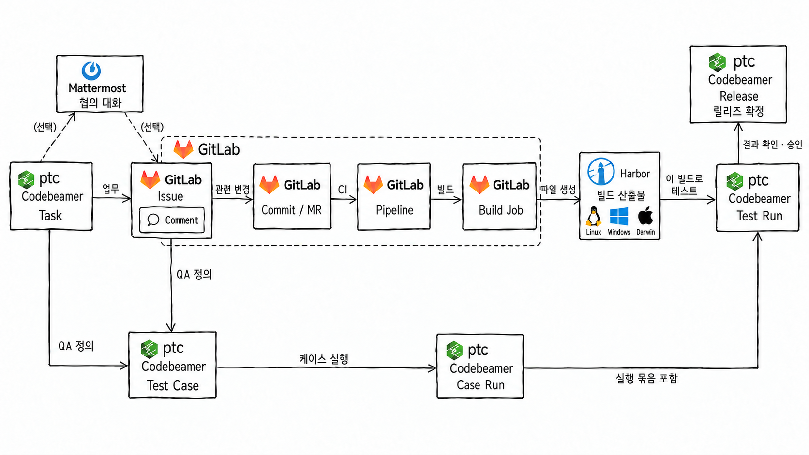

# sunghyun

안녕하세요! 클클 10기에 새로 합류한 이성현입니다.
이번 스터디에서 다른 분들과 함께 배우고, 공부한 내용을 꾸준히 기록하겠습니다.

## 스터디 목표

KG, Graph 개념들을 이해하고 RAG 관련된 내용들을 최대한 많이 습득하고자합니다.
PostgreSQL, Elasticsearch, Docker를 직접 사용해 데이터 저장과 검색 과정을 이해하고, 회사 문서와 업무 플랫폼 데이터를 연결한 지식 그래프를 만들고, 검색과 그래프를 함께 사용하는 개인 에이전트로 발전시키는 것이 목표입니다.

## 폴더 구조

```text
members/sunghyun/
├── README.md                  # 자기소개, 목표, 진행 현황
├── readings.md                # 주차별 읽을거리·참고자료
├── notes/                     # 학습 정리
│   ├── 01-knowledge-graph-and-ontology.md
│   ├── 02-search-methods.md
│   ├── 03-hybrid-rag-and-evaluation.md
│   ├── 04-knowledge-graph-background.md
│   ├── 05-rdf-ontology-pipeline.md
│   └── 06-graphrag-and-agentic-search.md
├── labs/                      # 실습 기록과 코드
│   ├── 01-rag-basics/          # 1주차: RAG·KG 기초
│   │   ├── README.md
│   │   └── src/
│   ├── 02-search-lab/          # 2주차: 청킹·BM25·벡터·HNSW
│   │   ├── README.md           # 목표, 환경, 실행 방법, 결과
│   │   └── src/               # 청킹·검색·임베딩 코드
│   │       ├── bm25_lab/      # Elasticsearch / BM25 실습
│   │       └── pgvector_lab/  # pgvector / HNSW 실습
│   ├── 03-hybrid-rag/          # 3주차: RRF·RAG·Recall 평가
│   │   ├── README.md
│   │   └── src/
│   ├── 04-knowledge-graph/     # 4주차: 지식 그래프·온톨로지
│   │   ├── README.md
│   │   └── src/
│   ├── 05-rdf-pipeline/        # 5주차: 근거 검증·DB 적재·RDF 내보내기
│   └── 06-graphrag/            # 6주차: 검색·그래프·에이전틱 비교
└── assets/                    # 노트·실습에서 사용하는 구조도·스크린샷
```

- [주차별 읽을거리·참고자료](readings.md)
- 새 학습 정리는 `notes/NN-topic.md`, 새 실습은 `labs/NN-topic/README.md`와 `src/`에 기록한다.
- 작성 양식은 공용 [노트 템플릿](../../templates/note-template.md), [실습 템플릿](../../templates/lab-template.md), [읽을거리 템플릿](../../templates/readings-template.md)을 참고한다.

## 진행 현황

2026-10-08 기준입니다. 5·6주차에는 회사 플랫폼을 연결한 그래프와 검색 에이전트를 구축하고, 결과와 한계를 notes·labs에 정리했습니다.

- 1주차: [RAG와 지식 그래프 기초](notes/01-knowledge-graph-and-ontology.md).
- 2주차: [청킹·BM25·벡터 검색·HNSW](notes/02-search-methods.md). 전체 2,685개 청크 검색, JSON/DB 결과 비교와 HNSW 실행 계획을 확인했습니다.
- 3주차: [하이브리드 검색·RAG·Recall 평가](notes/03-hybrid-rag-and-evaluation.md). RRF 결합과 답변 생성·검색 평가를 진행했습니다. 당시 남긴 관계·집계 질문은 5·6주차의 다중 홉 실습으로 이어졌습니다.
- 4주차: [지식 그래프·온톨로지 배경](notes/04-knowledge-graph-background.md). RDF·OWL·링크드 데이터, Wikidata 질의, 그래프 모델과 GraphRAG 이론을 공부했습니다.
- 5주차: [근거 있는 트리플과 데이터 파이프라인](notes/05-rdf-ontology-pipeline.md). 닫힌 스키마·LLM 추출 후보 검토, Postgres/Neo4j 적재, Turtle·JSON-LD 내보내기와 브라우저 시각화를 진행했습니다. Task·개발 이슈·Commit/MR·CI·Harbor 파일·테스트·릴리즈를 연결했습니다.
- 6주차: [GraphRAG와 에이전틱 검색 비교](notes/06-graphrag-and-agentic-search.md). v1 하이브리드 검색에 그래프 리트리버를 더한 v2를 구현하고, 릴리즈·기준 빌드·실행 차수별 결과를 비교했습니다. Text2Cypher 생성과 GLM-5.2의 그래프 도구 유무 비교에서 근거 부족·잘못된 경로 조회도 기록했습니다.

## 현재 만든 구조



Task와 Issue에서 Test Case를 정의하고, Harbor에 저장한 환경별 빌드를 대상으로 Case Run을 기록해 Test Run으로 묶는 흐름입니다. 테스트 결과 검토·승인 후 릴리즈 확정까지의 업무 설계를 구조도로 정리했습니다.

현재 저장된 파일→Release 관계는 목표 버전 배정입니다. 릴리즈 승인 자동화는 구현하지 않았고, QA 실행 결과는 시뮬레이션입니다. 그래프 도구를 제공해도 모델이 잘못된 경로를 조회하면 오답을 낼 수 있음을 확인했습니다. 자동 변경·삭제 동기화와 커뮤니티 기반 글로벌 서치는 아직 구현하지 않았습니다.

## 주차별 실습

- [1주차: RAG와 지식 그래프 기초](labs/01-rag-basics/README.md)
- [2주차: 검색의 세 세대 비교](labs/02-search-lab/README.md)
- [3주차: 하이브리드 검색, RAG와 Recall 평가](labs/03-hybrid-rag/README.md)
- [4주차: 지식 그래프와 온톨로지](labs/04-knowledge-graph/README.md)
- [5주차: RDF 추출·저장·내보내기](labs/05-rdf-pipeline/README.md)
- [6주차: GraphRAG·Cypher 생성·에이전틱 비교](labs/06-graphrag/README.md)

5·6주차 공개 코드는 회사 데이터 대신 작은 합성 데이터로 구성했습니다. 실제 회사 그래프의 전체 UI·데이터를 배포한 것은 아니며, 측정 결과와 공개 예제의 재현 범위는 각 문서에 구분해 적었습니다.
