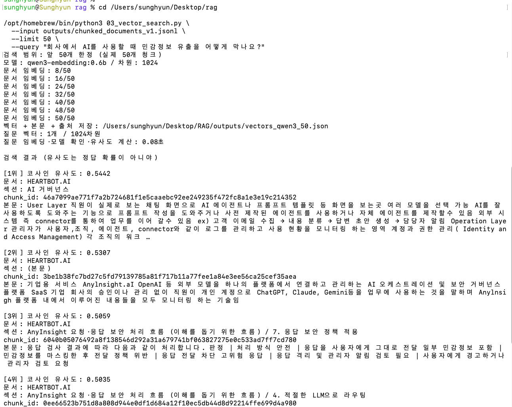
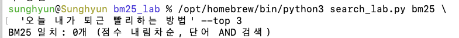
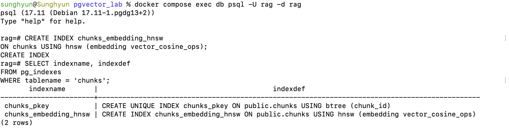

# 02. grep, BM25, 벡터 검색과 HNSW

## 한 줄 요약

같은 문서를 문자열, 키워드, 벡터로 검색해 보고 각 방식의 차이를 공부했다.

## 핵심 개념

| 개념 | 역할 |
|---|---|
| 청킹 | 긴 문서를 검색하기 좋은 크기로 나누기 |
| grep | 입력한 문자열이 들어 있는 내용 찾기 |
| Nori | 한국어 문장을 검색할 단어로 나누기 |
| 역색인 | 각 단어가 어느 문서에 있는지 미리 정리하기 |
| BM25 | 단어의 빈도와 희소성 등을 보고 검색 순위 매기기 |
| 임베딩 | 텍스트를 숫자 배열인 벡터로 변환하기 |
| pgvector | PostgreSQL에서 벡터를 저장하고 검색하기 |
| HNSW | 가까운 벡터를 빠르게 찾기 위한 그래프 인덱스 |

## 상세 정리

### 문서를 왜 청크로 나눌까?

긴 문서 하나에는 여러 내용이 섞여 있다. 서버 등록 방법을 찾는데 설치부터 사용자 관리까지 전부 비교하는 것보다, 관련 부분을 따로 검색하는 편이 낫다. 이렇게 문서를 작은 글 조각으로 나누는 작업이 청킹이다.

이번에는 문서와 소제목 경계를 유지하면서 본문을 최대 2,000자로 나눴다. 문서 364개 중 본문이 있는 302개에서 청크 2,685개를 만들었다. 청크에는 본문뿐 아니라 원래 문서와 소제목 정보도 남겼다.

임베딩할 때는 본문에 문서 경로와 소제목을 붙였다. 짧은 본문만 봐서는 어떤 제품이나 기능에 관한 내용인지 알기 어려울 수 있기 때문이다. 실습에서 `raw_text`는 본문, `embedding_text`는 이 정보를 붙인 텍스트다. 둘 다 문자열이고, 임베딩 모델을 거쳐야 숫자 벡터가 된다.

### grep은 같은 문자열을 찾는다

문자열 검색은 검색어가 그대로 들어 있는 내용을 찾는다. 정확한 에러 코드나 제품명을 찾을 때는 간단하게 사용할 수 있다.

하지만 ‘로그인 실패’로 검색하면 ‘로그인에 실패했습니다’를 놓칠 수 있다. 실습에서는 문자열을 그대로 비교했고, 결과는 관련도 순위 없이 나왔다.

### Nori, Elasticsearch, BM25는 각각 무엇을 할까?

처음에는 세 가지가 한 번에 나와서 헷갈렸다. 문장을 나누는 일, 데이터를 저장하고 검색하는 일, 점수를 매기는 일로 구분하니 이해하기 쉬웠다.

- **Nori**: 한국어 형태소 분석기. 조사와 어미 등을 처리해 검색할 단어를 만든다.
- **Elasticsearch**: 문서를 저장하고 검색하는 프로그램.
- **BM25**: 검색어와 문서의 단어를 비교해 점수를 매기는 방법.

실제로 Nori에 문장을 넣었을 때 다음처럼 나왔다.

```text
Codebeamer에서 로그인에 실패했습니다
→ codebeamer | 로그인 | 실패
```

Elasticsearch는 문서를 넣을 때 단어를 분석하고 역색인을 만든다. 역색인은 책 뒤의 찾아보기처럼 ‘이 단어는 어느 문서에 있는가’를 미리 정리한 것이다.

```text
로그인 → 청크 1, 청크 3
서버   → 청크 2, 청크 3
```

검색할 때도 질문을 단어로 나누고, 역색인에서 해당 단어가 있는 청크를 찾는다. 그다음 BM25 점수로 순위를 정한다. 이 과정에는 임베딩 벡터가 필요하지 않다.

일반 DB에 원본을 두고 Elasticsearch에 검색용 데이터를 따로 넣기도 한다. 원본만 수정하고 검색용 데이터를 갱신하지 않으면 검색에서는 예전 내용이 나올 수 있다.

### BM25는 무엇을 보고 점수를 매길까?

TF, DF, IDF를 구분해서 이해했다.

- **TF**: 한 청크 안에서 특정 단어가 나온 횟수.
- **DF**: 전체 청크 중 그 단어가 들어 있는 청크 수.
- **IDF**: 드물게 나오는 단어를 더 중요하게 보는 값.

‘방법’처럼 여러 문서에 나오는 단어보다 ‘codebeamer’처럼 특정 문서에 나오는 단어가 검색 대상을 구분하는 데 도움이 될 수 있다.

BM25는 TF와 IDF를 함께 사용한다. 같은 단어를 반복한다고 점수가 끝없이 크게 올라가지는 않고, 긴 문서가 유리해지지 않도록 길이도 보정한다. 단순히 단어가 많거나 문서가 길다고 순위가 높아지는 것은 아니다.

Nori로 단어를 나눠도 ‘로그인’과 ‘접속’처럼 표현 자체가 다르면 키워드 검색으로 놓칠 수 있다.

### OR와 AND를 바꿔 봤다

‘URM 서버 등록하는 방법’은 Nori에서 `urm | 서버 | 등록 | 방법`으로 나왔다.

OR는 이 단어 중 하나 이상이 있으면 검색 대상에 들어간다. AND는 모든 단어가 있어야 한다. 단어가 문장 순서대로 붙어 있을 필요는 없다.

| 조건 | 검색된 청크 수 | 1위 |
|---|---:|---|
| OR | 709개 | URM 초기 설정 |
| AND | 1개 | URM 초기 설정 |

AND로 바꾸니 결과가 크게 줄었다. 처음에는 AND로 해야 덜 놓친다고 생각했는데, 필요한 내용이 있어도 검색어 중 하나가 없으면 빠진다. OR는 넓게 찾고, AND는 조건을 좁히는 방식이다.

이번에는 1위 청크의 BM25 점수가 두 조건에서 같았다. 후보를 정하는 조건과 점수를 계산하는 방법은 구분해야 한다. Top-k는 점수가 높은 결과를 몇 개 보여줄지 정하는 값이다.

### 벡터 검색은 의미가 가까운 내용을 찾는다

임베딩 모델에 텍스트를 넣으면 숫자 배열이 나온다. 이번에는 Ollama의 `qwen3-embedding:0.6b`를 사용했고, 청크 하나당 1,024차원 벡터가 생성됐다.

질문도 같은 모델로 임베딩한 다음 문서 벡터와 비교한다. 코사인 유사도는 벡터의 방향이 얼마나 비슷한지 보는 기준이다. 벡터 검색에서 사용할 수 있는 비교 방법 중 하나다.

처음에는 50개로 테스트했지만, 그 안에 없는 문서는 찾을 수 없었다. 이후 전체 2,685개를 임베딩하고 검색했다.

같은 URM 질문으로 검색했을 때 결과는 다음과 같았다.

| 순위 | 문서 | 코사인 유사도 |
|---|---|---:|
| 1 | URM 초기 설정 | 0.6678 |
| 2 | URM 고객사 배포 전 체크리스트 | 0.6642 |
| 3 | Admin 사용자 가이드 / Add Server | 0.6583 |

2위 본문은 ‘현재 기능을 사용중인 고객사 없음’뿐이었다. 임베딩에 문서 경로와 소제목도 넣었기 때문에 본문이 짧아도 관련 문서로 나올 수 있었다. 경로가 점수에 얼마나 영향을 줬는지는 따로 실험하지 않았다.

검색한 뒤에는 벡터에 연결된 원문을 가져온다. 나중에 답변용 LLM에 전달하는 것도 이 텍스트다. 검색용 벡터를 다시 글로 복원하는 과정은 아니다.

### pgvector에 저장하면 무엇이 달라질까?

처음에는 벡터를 JSON 파일에 저장하고 Python에서 비교했다. 이후 같은 벡터를 PostgreSQL로 옮겼다.

pgvector는 PostgreSQL의 확장 기능이다. 테이블에 본문과 문서 정보를 저장하면서 벡터 컬럼도 함께 둘 수 있다. 기존 벡터를 옮겼기 때문에 다시 임베딩하지 않았다.

같은 질문 벡터로 비교했을 때 Python과 DB의 검색 순위가 같았다. 벡터가 그대로라면 저장 위치가 바뀌어도 정확 검색 결과는 같아야 한다고 이해했다.

### HNSW로 검색을 빠르게 하기

정확 검색은 전체 벡터를 비교한다. ANN은 전체를 비교하지 않고 가까운 벡터를 찾는 근사 검색이며, HNSW는 이를 구현하는 방법 중 하나다.

HNSW는 벡터들을 여러 층의 그래프로 연결해 둔다. 위층에는 일부 벡터만 있고, 아래층으로 갈수록 많아진다. 위층의 벡터는 아래층에도 남아 있으며, 맨 아래층에는 모든 벡터가 있다.

```text
위층:    B → D → L
                 ↓ 같은 L에서 아래층 탐색 시작
아래층:  L → F, G, H 등의 이웃 탐색
```

위층에서 질문과 가까운 지점으로 이동하고, 그 지점에서 아래층의 이웃을 탐색한다. 트리의 자식으로 내려가는 구조는 아니다. 벡터 값은 같고 층별 이웃 연결이 다르다.

아래층에 모든 벡터가 있어도 연결을 따라 일부만 방문하므로 전체 비교보다 빠를 수 있다. 대신 실제로 가장 가까운 벡터를 놓칠 수 있다. `ef_search`로 탐색 후보를 넓힐 수 있지만, 이 값이 실제 방문한 벡터 개수와 같은 것은 아니다.

인덱스를 만든 뒤 실행 계획에서 `chunks_embedding_hnsw` 사용을 확인했다. 이번 질문에서는 정확 검색과 HNSW의 Top-3가 같았고, DB 시간은 65.023ms와 6.371ms였다. 이번 실행에서는 약 10배 차이가 났다. 질문 임베딩 시간은 제외한 수치이며 다른 질문도 같은 차이가 나는지는 더 비교해 봐야 한다.

## 직접 수행한 실습과 화면

| 실습 | 실행한 내용 | 확인한 결과 |
|---|---|---|
| `01_chunk_documents.py` | 문서를 본문·소제목 단위로 청킹 | 문서 364개에서 청크 2,685개 생성 |
| 문자열 검색·Nori 분석 | 문자열 일치 검색과 형태소 분석 비교 | 문자열 그대로 찾는 방식과 단어로 나누는 방식 구분 |
| `bm25_lab/search_lab.py` | Elasticsearch + Nori로 BM25 OR/AND 비교 | 같은 URM 질문에서 OR 709개, AND 1개 |
| `02_embed_sample.py` · `03_vector_search.py` | 소규모 임베딩 실습 후 50개 청크 검색, 전체 범위로 확장 | qwen3-embedding:0.6b의 1,024차원 벡터와 코사인 검색 확인 |
| `pgvector_lab/04_pgvector_search.py` | 전체 2,685개 벡터를 PostgreSQL + pgvector에서 검색 | Python과 DB의 정확 검색 순위 비교 |
| HNSW 인덱스 생성·검색 | 인덱스 생성 후 실행 계획과 정확 검색 결과 비교 | HNSW 실제 사용 확인, 같은 질문의 Top-3 일치 |

### 50개 청크로 벡터 검색해 보기



50개 청크를 임베딩하고 질문과 가까운 본문을 출력한 초기 실습이다. 이 화면의 검색 범위는 50개이며, 이후 전체 2,685개로 확장했다. 검색 범위 밖 문서는 찾아낼 수 없다는 점을 확인했다.

### BM25 AND에서 후보가 없는 경우



‘오늘 내가 퇴근 빨리하는 방법’ 질문은 이 AND 조건에서 0개가 나왔다. 이 결과만으로 전체 문서에 답이 없다고 판단할 수는 없다.

### pgvector에 HNSW 인덱스 만들기



`CREATE INDEX` 실행 후 `pg_indexes`에서 코사인 검색용 `chunks_embedding_hnsw`가 생성된 것을 확인했다. 인덱스의 존재와 검색에서의 실제 사용은 별개이며, 실제 사용 여부는 이후 검색 실행 계획에서 확인했다.


## 예시 / 코드

코사인 검색용 HNSW 인덱스를 만들 때 사용한 SQL이다.

```sql
CREATE INDEX chunks_embedding_hnsw
ON chunks USING hnsw (embedding vector_cosine_ops);
```

실습 코드와 실행 방법은 [검색 실습 README](../labs/01-search-generations/README.md)에 정리했다.

## 궁금한 점 / 더 알아볼 것

- [ ] Nori와 n-gram으로 나눴을 때 검색 결과 비교하기
- [x] 정답 청크가 상위 결과에 얼마나 들어오는지 평가하기 — [3주차 Recall 실습](03-hybrid-rag-and-evaluation.md)에서 진행
- [x] BM25와 벡터 검색 결과를 합치는 RRF 공부하기 — [3주차 하이브리드 실습](03-hybrid-rag-and-evaluation.md)에서 진행

## 스터디에서 나눌 이야기

같은 질문이라도 검색 방식에 따라 다른 문서가 나왔다. 키워드를 정확히 찾는 BM25와 표현이 다른 내용도 찾는 벡터 검색을 함께 쓰면 어떨지 다음 실습에서 확인해 보고 싶다.

> 참고 자료: [pgvector](https://github.com/pgvector/pgvector), [Elasticsearch BM25](https://www.elastic.co/docs/reference/elasticsearch/index-settings/similarity), [Nori](https://www.elastic.co/docs/reference/elasticsearch/plugins/analysis-nori)
