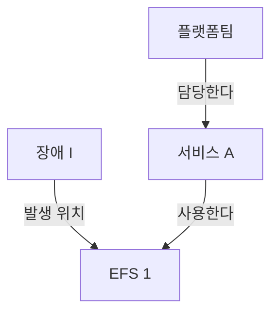

# 04. 지식 그래프는 왜 필요한가? — 온톨로지 변천사와 방법론

## 한 줄 요약

> [!NOTE]
> 지식 그래프는 여러 문서의 사실을 같은 대상으로 식별하고 의미 있는 관계로 연결한다. 문서 하나로 답하기 어려운 질문을 관계를 따라가며 해결하도록 돕는다.

**전체 흐름:** 문서 검색의 한계 → 대상과 관계 → 공통 표현과 식별자 → 데이터 연결 → 요약과 업무 실행

## 핵심 개념

| 개념 | 이해한 내용 |
|---|---|
| 지식 그래프 | 서비스·스토리지·팀 같은 대상과 그 관계를 연결한 데이터 |
| 온톨로지 | 어떤 종류의 대상과 관계가 있고 무엇을 뜻하는지 정의한 모델 |
| RDF | 주어–술어–목적어 트리플로 사실과 정의를 표현하는 데이터 모델 |
| RDFS / OWL | 클래스·계층부터 역관계·동치 등 논리적 의미까지 정의하는 어휘와 언어 |
| 링크드 데이터 | 웹에서 식별자를 조회하고 다른 대상의 식별자로 연결하는 방식 |
| GraphRAG / 팔란티어 | 그래프를 활용한 전체 자료 요약 / 업무 대상·관계·행동을 연결한 운영 모델 |

> [!TIP]
> 이번 주는 이론 학습이다. Wikidata 공개 질의는 직접 확인했다. 사내 KG 구축·팔란티어 실행·GraphRAG 성능 비교는 후속 학습이다.

## 상세 정리

### 1. 문서를 찾았는데 왜 답을 못 할까?

3주차에는 BM25·벡터 검색과 RRF, 답변 생성, Recall 평가를 했다. 4주차에는 “사실과 관계를 찾으려면 무엇이 필요한가?”를 공부했다.

예를 들어 아래 사실이 서로 다른 문서에 있다면 한 문서만으로는 담당 팀을 알 수 없다.

- 문서 A: 서비스 A는 EFS 1을 사용한다.
- 문서 B: 장애 I는 EFS 1에서 발생했다.
- 문서 C: 플랫폼팀이 서비스 A를 담당한다.

“장애 I가 발생한 스토리지를 사용하는 서비스의 담당 팀은?”이라는 질문은 이 사실들을 연결해야 한다. 벡터 검색으로 근거를 모두 찾고 LLM이 연결할 수도 있지만, 필요한 근거가 모두 검색된다는 보장은 없다.

**그림 1. 장애의 영향과 담당 팀을 연결하는 관계**



장애 → 스토리지 → 서비스 → 팀을 따라가면 플랫폼팀을 찾는다. 이때 저장된 관계를 반대 방향에서 조회하는 데 OWL은 필수가 아니다.

못 답한 이유도 구분해야 한다. 근거가 있는데 검색에서 빠졌다면 **검색 누락**, 원문에도 담당 정보가 없다면 **사실 부족**, 다른 EFS를 같은 대상으로 연결했다면 **식별 오류**다. 그래프를 만든다고 없는 사실이 생기지는 않는다.

W3의 질문을 화이트보드로 옮길 때는 `실제 질문 → 대상 → 관계 → 관계의 근거 문서 → 빠진 연결` 순서로 그리면 된다. 이번에는 위 가상 예시로 이해했으며, 실제 W3 질문의 근거를 모두 그래프로 검증한 것은 아니다.

### 2. 전체 흐름은 어떻게 이어졌나?

| 흐름 | 해결하려던 문제 |
|---|---|
| 시맨틱 웹 비전, 2001 | 사람이 읽는 웹을 컴퓨터도 의미 있게 처리하도록 만들기 |
| RDF / OWL 표준 | 사실의 표현 방식과 관계의 의미를 공유하기 |
| 링크드 데이터·DBpedia·Wikidata | 서로 다른 데이터의 대상을 식별하고 웹에서 연결하기 |
| Google KG, 2012 | “things not strings”: 단어 문자열보다 실제 대상을 구분하기 |
| 기업 KG | 부서별 데이터를 연결해 서비스·팀·고객 등의 관계를 찾기 |
| MS GraphRAG, 2024 | 많은 문서에 걸친 주제와 반복되는 내용을 종합하기 |
| 팔란티어 온톨로지 | 업무 대상·관계에 권한과 실행 가능한 행동을 연결하기 |

이 표는 이해를 위한 흐름이다. RDF의 초기 표준은 1999년이며, 팔란티어가 GraphRAG 이후 등장했다는 뜻도 아니다. 각 방식은 서로 대체되기보다 함께 쓰인다.

시맨틱 웹도 단순한 하이퍼링크 연결이 아니었다. 관계의 의미를 공유하려는 비전이었다. 다만 웹 전체에서 공통 어휘·대상 일치·품질·갱신 책임을 맞추기는 어려웠다. KG는 특정 제품이나 기업처럼 범위를 좁혀 운영할 수 있었다는 차이로 이해했다. “시맨틱 웹은 전부 실패, KG는 전부 성공”으로 나누기는 어렵다.

### 3. 그 관계의 의미는 무엇으로 정의할까?

처음에는 구체적인 관계를 정의하면 곧 OWL을 쓰는 것으로 생각했다. 하지만 **온톨로지는 설계한 의미 모델**, **RDF는 표현 구조**, **RDFS·OWL은 그 의미를 표현하는 표준**이다. OWL 파일이 없어도 대상과 관계의 의미를 설계했다면 온톨로지 설계라고 볼 수 있다.

- RDF = Resource Description Framework: 사실을 트리플로 표현한다.
- RDFS = RDF Schema: 클래스·속성·하위 클래스 등의 기본 의미를 정의한다.
- OWL = Web Ontology Language: 역관계·동치·서로 양립할 수 없는 클래스 등 더 풍부한 논리를 표현한다.

RDFS와 OWL의 정의도 RDF 트리플로 표현할 수 있고, 둘을 함께 쓸 수 있다. 데이터베이스 스키마가 저장 구조와 필드를 중심으로 한다면, 온톨로지는 대상·관계의 의미와 논리적 연결에 초점을 둔다. 둘의 역할은 겹칠 수 있다.

### 4. 거꾸로 검색하는 것과 역관계 추론은 어떻게 다를까?

`플랫폼팀 — 담당한다 → 서비스 A`가 저장돼 있다면 “누가 서비스 A를 담당하나?”는 기존 사실을 검색하면 된다.

OWL에서 `담당한다`와 `담당팀이있다`를 역관계로 정의하면 `서비스 A — 담당팀이있다 → 플랫폼팀`이라는 다른 술어의 사실이 논리적으로 따라온다.

| 구분 | 예시 |
|---|---|
| 기존 사실 검색 | `?팀 — 담당한다 → 서비스 A`에서 주어 찾기 |
| 역관계 정의 | `담당한다 — owl:inverseOf → 담당팀이있다` |
| 도출되는 사실 | `서비스 A — 담당팀이있다 → 플랫폼팀` |

정의는 관계에 한 번 작성하면 같은 관계를 쓰는 새 서비스에도 적용된다. 다만 추론을 지원하는 엔진이나 질의 처리가 있어야 활용된다. RDF를 저장하는 것만으로 자동 추론이 실행되지는 않는다. 역관계 이름을 반드시 추가해야 하는 것도 아니다.

`EFS 1은 EFS다`와 `EFS는 스토리지의 하위 클래스다`에서 `EFS 1은 스토리지다`를 도출하는 것도 추론이다. 사실이 없으면 모른다고 해야 하며, OWL에서 누락된 사실은 일반적으로 거짓을 뜻하지 않는다.

### 5. 이름이 같으면 같은 대상일까?

같은 “김민수”라도 다른 사람일 수 있다. 같은 대상으로 잘못 묶으면 이후의 관계까지 엉뚱하게 연결된다. 이름이 바뀌어도 대상의 식별자는 유지할 수 있다.

- URI = Uniform Resource Identifier: 대상을 식별하는 문자열.
- IRI = Internationalized Resource Identifier: 국제화된 문자도 사용할 수 있도록 확장한 식별자.
- 리터럴: 이름·숫자·날짜 같은 값.
- 네임스페이스: 식별자에 쓰는 공통 범위. prefix는 긴 주소를 줄여 적는 표기다.

링크드 데이터는 식별자를 붙이는 데서 끝나지 않는다. HTTP 식별자로 정보를 조회할 수 있게 하고, 다른 대상의 식별자로 이어지는 링크도 제공한다. DBpedia는 위키백과에서 구조화한 데이터를 제공하고, Wikidata는 공동 편집으로 지식을 관리한다.

### 6. Wikidata는 사실과 조건을 어떻게 기록할까?

`베를린(Q64) — 국가(P17) → 독일(Q183)`에서 Q는 항목, P는 속성의 Wikidata 식별자다. 전 세계의 모든 시스템이 반드시 같은 Q·P를 쓰는 것은 아니다. Wikidata 안에서 정해진 식별자를 전체 IRI로 공유하는 것이다. 언어별 이름이 달라도 같은 항목을 가리킨다.

클레임은 속성과 값으로 사실을 주장하고, 한정어는 기간·역할 등의 조건을 붙인다. 출처와 순위도 함께 볼 수 있다. 예를 들어 근무 종료일이 있으면 해당 근무 기록의 기간을 읽어야 한다. 과거 근무가 끝났다는 사실만으로 현재 재입사 가능성까지 부정할 수는 없다.

`wdt:`는 직접 관계를 간단히 조회하는 방식이다. 한정어나 출처가 필요한 질문에서는 statement를 조회하고 `p:`·`ps:`·`pq:` 등의 구조를 사용해야 한다.

### 7. 그래프를 저장하는 방식도 다를까?

| 비교 | 프로퍼티 그래프, Neo4j 계열 | RDF 트리플 스토어 |
|---|---|---|
| 기본 표현 | 노드·관계에 키–값 속성 | 주어–술어–목적어 트리플 |
| 관계의 기간 | 관계 속성으로 표현하기 편함 | 별도 노드·트리플 등으로 모델링 |
| 대표 질의 | Cypher | SPARQL |
| 설계의 강조점 | 애플리케이션에서 필요한 연결과 탐색 | 공통 식별자·어휘·데이터 교환·의미 |

어느 쪽이 무조건 더 빠르거나 단순한 것은 아니다. 이번에는 공통 식별자와 의미를 공유하는 RDF 쪽이 더 맞는다고 느꼈다. OWL 추론 지원은 저장소별로 따로 확인해야 한다.

서비스 담당 팀이 바뀌면 **담당 관계를 갱신**해야 한다. 이력을 남기려면 관계의 유효 기간도 보관한다. 과거 담당과 현재 담당을 혼동하지 않도록 갱신 책임자·출처·검증 과정이 필요하다. RDF·OWL 표준을 쓴다고 데이터 일치와 품질까지 자동으로 해결되지는 않는다.

### 8. 팔란티어와 GraphRAG는 무엇이 다른가?

팔란티어의 Object는 서비스·팀·장애 같은 업무 대상, Link는 그 사이 관계, Action은 상태 변경 같은 실행이다. ObjectType·LinkType·ActionType은 각각의 종류와 실행 정의다. 권한·조건·업무 로직을 함께 다룬다.

RDF와 대상·관계를 표현한다는 점은 비슷하다. 하지만 RDF는 데이터 모델이고 팔란티어 온톨로지는 운영 플랫폼의 모델이므로 같은 수준의 기술은 아니다. RDF 기반 애플리케이션에도 행동을 구현할 수 있다. 단순히 담당 팀을 답하는 데 Action은 필요 없고, 승인된 담당자가 장애 상태를 바꾸려면 실행이 필요하다.

MS의 2024 GraphRAG는 다음 흐름으로 글로벌 질문에 답한다.

1. LLM으로 문서에서 대상·관계·설명을 추출한다.
2. Leiden 커뮤니티 탐지로 연결이 밀접한 집단을 계층적으로 만든다.
3. 커뮤니티별 요약 보고서를 만든다.
4. 질문에 대해 보고서별 부분 답변을 만들고 유용한 내용을 종합한다.

“전체 장애 보고서에서 반복되는 원인은?”처럼 자료 전체의 경향을 묻는 질문에 맞는다. 특정 장애의 담당 팀을 찾는 질문은 필요한 관계를 탐색하면 되므로 모든 보고서를 종합할 필요는 없다. 추출 오류·요약 손실·구축 비용도 고려해야 하며, 모든 질문에서 벡터 RAG보다 낫다고 볼 수는 없다.

## 예시 / 코드

### RDF: 대상과 이름 구분

```turtle
@prefix ex: <https://example.org/study/> .
ex:serviceA ex:uses ex:efs1 .
ex:serviceA ex:name "주문 서비스"@ko .
```

`ex:serviceA`는 대상의 식별자이고, `"주문 서비스"@ko`는 한국어 이름 값이다. Turtle은 RDF를 적는 문법이다.

### SPARQL: 베를린의 국가 조회

SPARQL = SPARQL Protocol and RDF Query Language: RDF를 질의하는 언어와 프로토콜이다.
[Wikidata Query Service](https://query.wikidata.org/)에서 설치 없이 실행했다.

```sparql
PREFIX wd: <http://www.wikidata.org/entity/>
PREFIX wdt: <http://www.wikidata.org/prop/direct/>

SELECT ?country WHERE {
  wd:Q64 wdt:P17 ?country .
}
```

주어와 술어를 지정하고 목적어 `?country`를 찾는다. 학습 중 공개 엔드포인트에서 `http://www.wikidata.org/entity/Q183`이 반환됐고, 직접 실행해 결과도 확인했다.

### 가상 그래프: 장애에서 담당 팀까지

```sparql
PREFIX ex: <https://example.org/study/>

SELECT ?team WHERE {
  ex:incidentI ex:occurredOn ?storage .
  ?service ex:uses ?storage .
  ?team ex:owns ?service .
}
```

질의 구조를 이해하기 위한 예시다. 이 가상 데이터를 실제 저장소에 적재해 실행하지는 않았다.

## 궁금한 점 / 더 알아볼 것

- [ ] W3에서 남긴 실제 질문을 골라 근거 문서와 빠진 관계를 함께 그려보기
- [ ] 현재 담당 팀과 과거 담당 팀의 유효 기간을 어떻게 모델링할지 비교하기
- [ ] GraphRAG 글로벌 검색의 비용과 답변 품질을 실제 자료로 평가하기

## 스터디에서 나눌 이야기

- 시맨틱 웹과 기업 KG는 기술만이 아니라 적용 범위와 데이터 운영 책임도 다르다.
- “거꾸로 찾기”와 “새 술어의 사실을 도출하기”를 구분하니 OWL 역관계가 이해됐다.
- 구글은 대상 식별, Apple은 KG의 지속적인 구축·서빙, Amazon은 상품 맥락·추천 사례로 비교할 수 있다. 제품 전체 내부 구조를 안다고 해석하지 않는다.
- 팔란티어는 업무 실행, MS GraphRAG는 커뮤니티 요약 기반 글로벌 검색이라는 목적 차이가 핵심이다.

<details>
<summary>참고 - 공식 자료·출처</summary>

- [학습 원본: Notion](https://www.notion.so/3ebdbb08775281a1a19ecc9804484067)
- [RDF Primer](https://www.w3.org/TR/rdf11-primer/), [RDFS](https://www.w3.org/TR/rdf-schema/), [OWL Primer](https://www.w3.org/TR/owl2-primer/)
- [Linked Data](https://www.w3.org/DesignIssues/LinkedData.html), [Wikidata SPARQL 튜토리얼](https://www.wikidata.org/wiki/Wikidata:SPARQL_tutorial)
- [Google Knowledge Graph 소개](https://blog.google/products-and-platforms/products/search/introducing-knowledge-graph-things-not/)
- [Palantir Ontology](https://www.palantir.com/docs/foundry/architecture-center/ontology-system)
- [Microsoft GraphRAG 논문, 2024](https://arxiv.org/abs/2404.16130), [Global Search](https://microsoft.github.io/graphrag/query/global_search/)

</details>

## 총정리

지식 그래프는 사실을 대상과 관계로 연결하고, 온톨로지는 그 대상과 관계의 의미를 정의한다. 공통 표현과 식별자는 연결을 돕지만 품질을 대신 관리해 주지는 않는다.

| 핵심 | 정리 |
|---|---|
| 문서 검색과의 차이 | 관련 문서를 찾는 데서 더 나아가 여러 사실의 연결을 따라간다. |
| RDF·온톨로지·OWL | 표현 구조, 의미 모델, 풍부한 논리 표현을 각각 구분한다. |
| 검색과 추론 | 저장된 관계를 거꾸로 찾는 것과 새로운 술어의 사실을 도출하는 것은 다르다. |
| 활용 목적 | GraphRAG는 전체 자료의 주제 종합, 팔란티어는 업무 대상과 실행 연결에 초점을 둔다. |
| 한계 | 누락된 사실·잘못된 식별·오래된 관계는 갱신과 검증이 필요하다. |

**기억할 흐름:** 사실을 식별하고 → 의미 있는 관계로 연결하고 → 질문에 필요한 연결을 찾는다.
