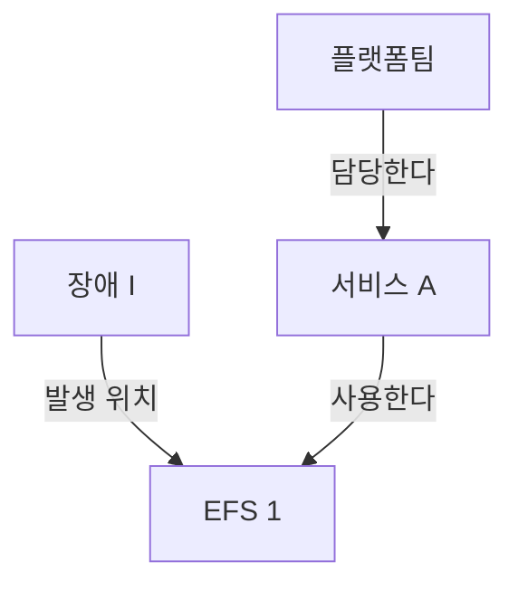

# 04. 지식 그래프는 왜 필요한가? — 온톨로지 변천사와 방법론


학습 원본: [노션 — 지식 그래프는 왜 필요한가? — 온톨로지 변천사와 방법론](https://www.notion.so/3ebdbb08775281a1a19ecc9804484067).
이 파일은 원문의 개념·예시·보충 설명을 학습 기록으로 옮기고, 아래에 분담 발표 내용을 확장한 것이다.

## 이 문서에서 발표 내용을 어디서 찾을까?

| 분담 주제 | 발표 절 |
|---|---|
| ① 시맨틱 웹과 KG | [대중화와 운영 범위](#presentation-1) |
| ② Wikidata 구조 | [식별자·클레임·한정어](#presentation-2) |
| ③ 구글·애플·아마존 사례 | [기업별 활용 목적](#presentation-3) |
| ④ 팔란티어 Object/Link/Action | [의미 모델과 업무 실행](#presentation-4) |
| ⑤ MS GraphRAG 논문 | [커뮤니티 탐지와 글로벌 서치](#presentation-5) |

앞부분은 개념 학습, **분담 발표** 부분은 발표 시 확인할 상세 설명과 원고다.

## 한 줄 요약

> [!NOTE]
> 지식 그래프는 여러 문서의 사실을 같은 대상으로 식별하고 의미 있는 관계로 연결한다. 문서 하나로 답하기 어려운 질문을 관계를 따라가며 해결하도록 돕는다.

**전체 흐름:** 문서 검색의 한계 → 대상과 관계 → 공통 표현과 식별자 → 데이터 연결 → 요약과 업무 실행

## 핵심 개념

| 개념 | 이해한 내용 |
|---|---|
| 지식 그래프 | 서비스·스토리지·팀 같은 대상과 그 관계를 연결한 데이터 |
| 온톨로지 | 어떤 종류의 대상과 관계가 있고 무엇을 뜻하는지 정의한 모델 |
| RDF | 주어–술어–목적어 트리플로 사실과 정의를 표현하는 데이터 모델 |
| RDFS / OWL | 클래스·계층부터 역관계·동치 등 논리적 의미까지 정의하는 어휘와 언어 |
| 링크드 데이터 | 웹에서 식별자를 조회하고 다른 대상의 식별자로 연결하는 방식 |
| GraphRAG / 팔란티어 | 그래프를 활용한 전체 자료 요약 / 업무 대상·관계·행동을 연결한 운영 모델 |

> [!TIP]
> 이번 주는 이론 학습이다. Wikidata 공개 질의는 직접 확인했다. 사내 KG 구축·팔란티어 실행·GraphRAG 성능 비교는 후속 학습이다.

## 상세 정리

### 1. 문서를 찾았는데 왜 답을 못 할까?

3주차에는 BM25·벡터 검색과 RRF, 답변 생성, Recall 평가를 했다. 4주차에는 “사실과 관계를 찾으려면 무엇이 필요한가?”를 공부했다.

예를 들어 아래 사실이 서로 다른 문서에 있다면 한 문서만으로는 담당 팀을 알 수 없다.

- 문서 A: 서비스 A는 EFS 1을 사용한다.
- 문서 B: 장애 I는 EFS 1에서 발생했다.
- 문서 C: 플랫폼팀이 서비스 A를 담당한다.

“장애 I가 발생한 스토리지를 사용하는 서비스의 담당 팀은?”이라는 질문은 이 사실들을 연결해야 한다. 벡터 검색으로 근거를 모두 찾고 LLM이 연결할 수도 있지만, 필요한 근거가 모두 검색된다는 보장은 없다.

**그림 1. 장애의 영향과 담당 팀을 연결하는 관계**



장애 → 스토리지 → 서비스 → 팀을 따라가면 플랫폼팀을 찾는다. 이때 저장된 관계를 반대 방향에서 조회하는 데 OWL은 필수가 아니다.

못 답한 이유도 구분해야 한다. 근거가 있는데 검색에서 빠졌다면 **검색 누락**, 원문에도 담당 정보가 없다면 **사실 부족**, 다른 EFS를 같은 대상으로 연결했다면 **식별 오류**다. 그래프를 만든다고 없는 사실이 생기지는 않는다.

W3의 질문을 화이트보드로 옮길 때는 `실제 질문 → 대상 → 관계 → 관계의 근거 문서 → 빠진 연결` 순서로 그리면 된다. 이번에는 위 가상 예시로 이해했으며, 실제 W3 질문의 근거를 모두 그래프로 검증한 것은 아니다.

### 2. 전체 흐름은 어떻게 이어졌나?

| 흐름 | 해결하려던 문제 |
|---|---|
| 시맨틱 웹 비전, 2001 | 사람이 읽는 웹을 컴퓨터도 의미 있게 처리하도록 만들기 |
| RDF / OWL 표준 | 사실의 표현 방식과 관계의 의미를 공유하기 |
| 링크드 데이터·DBpedia·Wikidata | 서로 다른 데이터의 대상을 식별하고 웹에서 연결하기 |
| Google KG, 2012 | “things not strings”: 단어 문자열보다 실제 대상을 구분하기 |
| 기업 KG | 부서별 데이터를 연결해 서비스·팀·고객 등의 관계를 찾기 |
| MS GraphRAG, 2024 | 많은 문서에 걸친 주제와 반복되는 내용을 종합하기 |
| 팔란티어 온톨로지 | 업무 대상·관계에 권한과 실행 가능한 행동을 연결하기 |

이 표는 이해를 위한 흐름이다. RDF의 초기 표준은 1999년이며, 팔란티어가 GraphRAG 이후 등장했다는 뜻도 아니다. 각 방식은 서로 대체되기보다 함께 쓰인다.

시맨틱 웹도 단순한 하이퍼링크 연결이 아니었다. 관계의 의미를 공유하려는 비전이었다. 다만 웹 전체에서 공통 어휘·대상 일치·품질·갱신 책임을 맞추기는 어려웠다. KG는 특정 제품이나 기업처럼 범위를 좁혀 운영할 수 있었다는 차이로 이해했다. “시맨틱 웹은 전부 실패, KG는 전부 성공”으로 나누기는 어렵다.

### 3. 그 관계의 의미는 무엇으로 정의할까?

처음에는 구체적인 관계를 정의하면 곧 OWL을 쓰는 것으로 생각했다. 하지만 **온톨로지는 설계한 의미 모델**, **RDF는 표현 구조**, **RDFS·OWL은 그 의미를 표현하는 표준**이다. OWL 파일이 없어도 대상과 관계의 의미를 설계했다면 온톨로지 설계라고 볼 수 있다.

- RDF = Resource Description Framework: 사실을 트리플로 표현한다.
- RDFS = RDF Schema: 클래스·속성·하위 클래스 등의 기본 의미를 정의한다.
- OWL = Web Ontology Language: 역관계·동치·서로 양립할 수 없는 클래스 등 더 풍부한 논리를 표현한다.

RDFS와 OWL의 정의도 RDF 트리플로 표현할 수 있고, 둘을 함께 쓸 수 있다. 데이터베이스 스키마가 저장 구조와 필드를 중심으로 한다면, 온톨로지는 대상·관계의 의미와 논리적 연결에 초점을 둔다. 둘의 역할은 겹칠 수 있다.

### 4. 거꾸로 검색하는 것과 역관계 추론은 어떻게 다를까?

`플랫폼팀 — 담당한다 → 서비스 A`가 저장돼 있다면 “누가 서비스 A를 담당하나?”는 기존 사실을 검색하면 된다.

OWL에서 `담당한다`와 `담당팀이있다`를 역관계로 정의하면 `서비스 A — 담당팀이있다 → 플랫폼팀`이라는 다른 술어의 사실이 논리적으로 따라온다.

| 구분 | 예시 |
|---|---|
| 기존 사실 검색 | `?팀 — 담당한다 → 서비스 A`에서 주어 찾기 |
| 역관계 정의 | `담당한다 — owl:inverseOf → 담당팀이있다` |
| 도출되는 사실 | `서비스 A — 담당팀이있다 → 플랫폼팀` |

정의는 관계에 한 번 작성하면 같은 관계를 쓰는 새 서비스에도 적용된다. 다만 추론을 지원하는 엔진이나 질의 처리가 있어야 활용된다. RDF를 저장하는 것만으로 자동 추론이 실행되지는 않는다. 역관계 이름을 반드시 추가해야 하는 것도 아니다.

`EFS 1은 EFS다`와 `EFS는 스토리지의 하위 클래스다`에서 `EFS 1은 스토리지다`를 도출하는 것도 추론이다. 사실이 없으면 모른다고 해야 하며, OWL에서 누락된 사실은 일반적으로 거짓을 뜻하지 않는다.

### 5. 이름이 같으면 같은 대상일까?

같은 “김민수”라도 다른 사람일 수 있다. 같은 대상으로 잘못 묶으면 이후의 관계까지 엉뚱하게 연결된다. 이름이 바뀌어도 대상의 식별자는 유지할 수 있다.

- URI = Uniform Resource Identifier: 대상을 식별하는 문자열.
- IRI = Internationalized Resource Identifier: 국제화된 문자도 사용할 수 있도록 확장한 식별자.
- 리터럴: 이름·숫자·날짜 같은 값.
- 네임스페이스: 식별자에 쓰는 공통 범위. prefix는 긴 주소를 줄여 적는 표기다.

링크드 데이터는 식별자를 붙이는 데서 끝나지 않는다. HTTP 식별자로 정보를 조회할 수 있게 하고, 다른 대상의 식별자로 이어지는 링크도 제공한다. DBpedia는 위키백과에서 구조화한 데이터를 제공하고, Wikidata는 공동 편집으로 지식을 관리한다.

### 6. Wikidata는 사실과 조건을 어떻게 기록할까?

`베를린(Q64) — 국가(P17) → 독일(Q183)`에서 Q는 항목, P는 속성의 Wikidata 식별자다. 전 세계의 모든 시스템이 반드시 같은 Q·P를 쓰는 것은 아니다. Wikidata 안에서 정해진 식별자를 전체 IRI로 공유하는 것이다. 언어별 이름이 달라도 같은 항목을 가리킨다.

클레임은 속성과 값으로 사실을 주장하고, 한정어는 기간·역할 등의 조건을 붙인다. 출처와 순위도 함께 볼 수 있다. 예를 들어 근무 종료일이 있으면 해당 근무 기록의 기간을 읽어야 한다. 과거 근무가 끝났다는 사실만으로 현재 재입사 가능성까지 부정할 수는 없다.

`wdt:`는 직접 관계를 간단히 조회하는 방식이다. 한정어나 출처가 필요한 질문에서는 statement를 조회하고 `p:`·`ps:`·`pq:` 등의 구조를 사용해야 한다.

### 7. 그래프를 저장하는 방식도 다를까?

| 비교 | 프로퍼티 그래프, Neo4j 계열 | RDF 트리플 스토어 |
|---|---|---|
| 기본 표현 | 노드·관계에 키–값 속성 | 주어–술어–목적어 트리플 |
| 관계의 기간 | 관계 속성으로 표현하기 편함 | 별도 노드·트리플 등으로 모델링 |
| 대표 질의 | Cypher | SPARQL |
| 설계의 강조점 | 애플리케이션에서 필요한 연결과 탐색 | 공통 식별자·어휘·데이터 교환·의미 |

어느 쪽이 무조건 더 빠르거나 단순한 것은 아니다. 이번에는 공통 식별자와 의미를 공유하는 RDF 쪽이 더 맞는다고 느꼈다. OWL 추론 지원은 저장소별로 따로 확인해야 한다.

서비스 담당 팀이 바뀌면 **담당 관계를 갱신**해야 한다. 이력을 남기려면 관계의 유효 기간도 보관한다. 과거 담당과 현재 담당을 혼동하지 않도록 갱신 책임자·출처·검증 과정이 필요하다. RDF·OWL 표준을 쓴다고 데이터 일치와 품질까지 자동으로 해결되지는 않는다.

### 8. 팔란티어와 GraphRAG는 무엇이 다른가?

팔란티어의 Object는 서비스·팀·장애 같은 업무 대상, Link는 그 사이 관계, Action은 상태 변경 같은 실행이다. ObjectType·LinkType·ActionType은 각각의 종류와 실행 정의다. 권한·조건·업무 로직을 함께 다룬다.

RDF와 대상·관계를 표현한다는 점은 비슷하다. 하지만 RDF는 데이터 모델이고 팔란티어 온톨로지는 운영 플랫폼의 모델이므로 같은 수준의 기술은 아니다. RDF 기반 애플리케이션에도 행동을 구현할 수 있다. 단순히 담당 팀을 답하는 데 Action은 필요 없고, 승인된 담당자가 장애 상태를 바꾸려면 실행이 필요하다.

MS의 2024 GraphRAG는 다음 흐름으로 글로벌 질문에 답한다.

1. LLM으로 문서에서 대상·관계·설명을 추출한다.
2. Leiden 커뮤니티 탐지로 연결이 밀접한 집단을 계층적으로 만든다.
3. 커뮤니티별 요약 보고서를 만든다.
4. 질문에 대해 보고서별 부분 답변을 만들고 유용한 내용을 종합한다.

“전체 장애 보고서에서 반복되는 원인은?”처럼 자료 전체의 경향을 묻는 질문에 맞는다. 특정 장애의 담당 팀을 찾는 질문은 필요한 관계를 탐색하면 되므로 모든 보고서를 종합할 필요는 없다. 추출 오류·요약 손실·구축 비용도 고려해야 하며, 모든 질문에서 벡터 RAG보다 낫다고 볼 수는 없다.


<details>
<summary>참고 - RDF는 파일 형식인가, 데이터 모델인가?</summary>

RDF는 데이터 모델이다. Turtle·RDF/XML·JSON-LD는 그 모델을 표현하는 형식이다. IRI로 이름을 부여하지 않은 대상을 blank node로 표현할 수도 있다.

식별자 주소가 반드시 사람이 보는 웹페이지여야 하는 것은 아니다. 링크드 데이터는 HTTP 조회로 유용한 정보를 제공하고 다른 식별자로 연결하는 원칙까지 포함한다.

</details>

<details>
<summary>참고 - 검색·추론·데이터 검증은 어떻게 다른가?</summary>

| 구분 | 목적 | 예시 |
|---|---|---|
| 검색 | 저장된 사실 찾기 | 서비스 A를 담당하는 팀 검색 |
| 추론 | 사실과 논리 정의에서 따라오는 지식 도출 | EFS 1이 스토리지라는 사실 도출 |
| 검증 | 기록이 정한 조건을 만족하는지 검사 | 담당 팀 값이 최소 하나 있는지 확인 |

**SHACL = Shapes Constraint Language** — RDF 데이터의 기록 조건을 검사하는 언어다. 필수 값 누락 등의 조건은 OWL 추론과 구분해서 다룬다.

RDFS의 domain/range는 일반적인 입력 거부 검사와 다르다. 관계를 사용한 대상의 타입을 추론할 수 있다. OWL의 존재·수량 조건도 DB의 필수 칼럼 검사와 동일하지 않다.

사람과 스토리지를 `owl:disjointWith`로 배타적으로 정의한 뒤 같은 대상을 둘 다로 기록하면 모순을 발견할 수 있다. 그러나 어느 사실이나 정의를 고쳐야 하는지까지 자동 결정되지는 않는다. LLM으로 문서에서 관계를 추출하는 일도 논리적 추론과 별개다.

참고: [RDFS](https://www.w3.org/TR/rdf-schema/), [OWL Primer](https://www.w3.org/TR/owl2-primer/), [SHACL](https://www.w3.org/TR/shacl/).

</details>

<details>
<summary>참고 - 다른 데이터의 ID는 모두 owl:sameAs로 연결하나?</summary>

`owl:sameAs`는 두 식별자가 같은 대상을 뜻한다는 강한 선언이다. “근무한다”나 “소재지가 있다”처럼 서로 다른 대상을 연결하는 관계에 필요하지 않다.

같은 이름과 나이라는 이유만으로 다른 사람을 합치면 그 사람의 근무·담당 관계까지 잘못 연결된다. 동일 대상이라는 근거를 확인한 뒤 선언해야 한다.

</details>

<details>
<summary>참고 - 담당 팀이 바뀌면 팀 객체 자체를 삭제하나?</summary>

대상의 존재와 관계의 유효성은 별개다. 플랫폼팀이 다른 서비스를 담당할 수도 있으므로 특정 서비스와의 담당 관계를 종료하거나 변경한다.

관계의 이력을 남기려면 유효 기간과 출처를 함께 관리한다. 현재 담당을 조회할 때 해당 기간을 확인한다. 오래된 사실에 올바른 추론을 적용해도 현재 답은 틀릴 수 있으므로 갱신 주체와 검증 책임이 필요하다.

</details>

## 예시 / 코드

### RDF: 대상과 이름 구분

```turtle
@prefix ex: <https://example.org/study/> .
ex:serviceA ex:uses ex:efs1 .
ex:serviceA ex:name "주문 서비스"@ko .
```

`ex:serviceA`는 대상의 식별자이고, `"주문 서비스"@ko`는 한국어 이름 값이다. Turtle은 RDF를 적는 문법이다.

### SPARQL: 베를린의 국가 조회

SPARQL = SPARQL Protocol and RDF Query Language: RDF를 질의하는 언어와 프로토콜이다.
[Wikidata Query Service](https://query.wikidata.org/)에서 설치 없이 실행했다.

```sparql
PREFIX wd: <http://www.wikidata.org/entity/>
PREFIX wdt: <http://www.wikidata.org/prop/direct/>

SELECT ?country WHERE {
  wd:Q64 wdt:P17 ?country .
}
```

주어와 술어를 지정하고 목적어 `?country`를 찾는다. 학습 중 공개 엔드포인트에서 `http://www.wikidata.org/entity/Q183`이 반환됐고, 직접 실행해 결과도 확인했다.

### 가상 그래프: 장애에서 담당 팀까지

```sparql
PREFIX ex: <https://example.org/study/>

SELECT ?team WHERE {
  ex:incidentI ex:occurredOn ?storage .
  ?service ex:uses ?storage .
  ?team ex:owns ?service .
}
```

질의 구조를 이해하기 위한 예시다. 이 가상 데이터를 실제 저장소에 적재해 실행하지는 않았다.

## 분담 발표 — 주제별 설명과 발표 원고

각 주제는 **문제 → 원리 → 사례 → 한계** 순서로 설명한다. 아래 사례 중 사내 서비스·장애 모델은 이해를 위한 가정이고, 기업 사례는 연결한 공개 자료 범위다.

<a id="presentation-1"></a>

### ① 시맨틱 웹은 왜 대중화에 실패했고 KG는 왜 성공했나?

**웹 전체의 의미를 통일하는 목표보다, 범위와 책임자를 정한 서비스에서 관계를 활용하는 목표가 운영하기 쉬웠다.** 다만 시맨틱 웹의 완전한 실패와 KG의 완전한 성공으로 나눌 수는 없다.

#### 시맨틱 웹은 무엇을 하려 했나?

사람은 “서비스 A가 EFS 1을 사용한다”를 읽고 관계를 이해한다. 컴퓨터도 같은 대상과 관계를 처리하도록 공통 식별자와 의미를 제공하려는 비전이다. 단순히 웹페이지에 링크를 더 붙이자는 주장이 아니다.

2001년 Berners-Lee·Hendler·Lassila가 이 비전을 소개했다. RDF의 초기 표준은 이미 1999년에 있었고, OWL 1은 2004년 W3C 권고가 됐다. 따라서 2001년 이후 트리플이 처음 생겼다고 이해하면 안 된다.

#### 공통 표준이 있는데 왜 어려웠나?

다음 표는 원문의 학습용 해석을 정리한 것이다. 하나의 원인으로 역사 전체를 설명하는 결론은 아니다.

| 문제 | 웹 전체에서 어려운 이유 | 기업·제품 KG에서의 대응 |
|---|---|---|
| 대상 식별 | 같은 대상의 ID가 다르고 동명이인도 존재 | 내부 식별자·매칭 기준과 관리 담당자 설정 |
| 용어 합의 | 조직마다 `담당한다`의 의미가 다름 | 적용 업무에서 관계의 뜻과 범위 정의 |
| 데이터 품질 | 기록의 오류와 모순을 누가 고칠지 불명확 | 출처 검토·검증·갱신 절차 운영 |
| 최신성 | 담당 팀 변경이 여러 데이터에 늦게 반영 | 원천 시스템과 동기화·유효 기간 관리 |
| 활용 동기 | 정보를 구조화하는 비용에 비해 이익이 모호 | 검색·추천·운영 등 구체적인 목적 설정 |

RDF·OWL은 표현과 의미를 공유하는 수단이다. **같은 표준으로 적었다고 두 데이터가 같은 대상인지, 사실이 최신인지 자동으로 판단되지는 않는다.**

#### KG는 어떤 방식으로 활용됐나?

Google은 검색어가 가리키는 실제 대상을 구별하고 관련 사실을 제공했다. 기업은 서비스·팀·장애처럼 업무에 필요한 범위부터 연결할 수 있다. 공개 영역에서도 DBpedia·Wikidata처럼 구조화된 지식과 식별자를 공유한다.

시맨틱 웹의 목표가 모두 실현되지 않았더라도 관련 표준과 아이디어는 이런 활용으로 이어졌다. KG를 RDF·OWL만으로 구현해야 하는 것은 아니다.

> **발표 원고:** 시맨틱 웹은 웹페이지를 연결하는 것을 넘어 대상과 관계의 의미를 컴퓨터도 처리하게 하려는 비전이었습니다. 하지만 웹 전체에서 식별자·용어·품질·갱신 책임을 맞추기는 어려웠습니다. KG는 검색이나 기업 업무처럼 목적과 범위를 정해 활용할 수 있었습니다. 그래서 실패와 성공을 단정하기보다, 적용 범위와 운영 방식이 달라졌다고 설명하는 것이 적절합니다.

참고: [2001년 시맨틱 웹 원문](https://www.cs.cmu.edu/~fgandon/lecture/licence_travaux_etude2002/TheSemanticWeb/), [Google의 2012년 발표](https://blog.google/products-and-platforms/products/search/introducing-knowledge-graph-things-not/).

<a id="presentation-2"></a>

### ② Wikidata 구조 뜯어보기 — Q/P 식별자, 클레임, 한정어

**Wikidata는 단순한 대상 간 연결에 주장의 기간·조건·근거·우선순위를 함께 기록한다.** 그래서 “관계가 있는가?”뿐 아니라 “언제, 어떤 조건에서 성립하는가?”를 살펴볼 수 있다.

#### Q와 P는 무엇을 식별하나?

| 표현 | 뜻 | 실제 예시 |
|---|---|---|
| Q 식별자 | 사람·장소·개념 등 항목 | `Q64`: 베를린, `Q183`: 독일 |
| P 식별자 | 항목의 관계나 값을 나타내는 속성 | `P17`: 국가 |
| 전체 IRI | 어떤 시스템의 ID인지 포함한 식별자 | `http://www.wikidata.org/entity/Q64` |
| 언어별 레이블 | 사람이 읽는 이름 | 같은 Q64에 Berlin·베를린 등 표기 |

Q/P는 Wikidata가 관리하는 식별자다. 모든 회사와 데이터베이스가 반드시 같은 ID를 쓰는 것은 아니다. 외부 데이터가 Wikidata의 전체 IRI를 참조하면 같은 대상을 연결하는 데 활용할 수 있다.

#### 관계 하나에 어떤 정보가 더 붙나?

| 요소 | 역할 | 설명용 근무 사례 |
|---|---|---|
| 클레임(claim) | 속성과 값으로 표현한 주장 | 사람 X — 근무 기관 → 회사 A |
| 한정어(qualifier) | 그 주장의 조건·기간 | 시작일 2020년, 종료일 2024년 |
| 참조(reference) | 주장을 뒷받침하는 출처 | 근무 기록을 확인한 문서·URL |
| 랭크(rank) | 진술 선택 우선순위 | preferred / normal / deprecated |

클레임에 참조와 랭크 등을 포함해 관리하는 단위가 진술(statement)이다. 같은 속성에 여러 진술이 있을 수 있다. 랭크는 사실의 확률 점수가 아니고, 출처를 붙였다는 것만으로 정확성이 보장되지는 않는다.

근무 종료일이 2024년이면 **해당 근무 기록은 종료됐다**고 읽는다. 그 기록만으로 현재 재입사했는지까지 판단하지는 않는다. 이것이 이름과 관계만 읽는 것보다 한정어를 확인해야 하는 이유다.

#### `wdt:`만 조회하면 충분할까?

| 접두어 | 질의에서의 역할 |
|---|---|
| `wd:` | 항목 IRI를 짧게 표기 |
| `wdt:` | 랭크가 반영된 직접 관계 조회, 한정어·참조는 포함하지 않음 |
| `p:` | 항목에서 진술 노드로 이동 |
| `ps:` | 진술의 주된 값 조회 |
| `pq:` | 진술의 한정어 조회 |

아래는 **질의 구조를 보여주는 예시**다. `$PERSON_QID`를 실제 항목 ID로 바꿔야 하며 이번 학습에서 실행한 질의는 아니다.

```sparql
PREFIX wd: <http://www.wikidata.org/entity/>
PREFIX p: <http://www.wikidata.org/prop/>
PREFIX ps: <http://www.wikidata.org/prop/statement/>
PREFIX pq: <http://www.wikidata.org/prop/qualifier/>

SELECT ?employer ?start ?end WHERE {
  wd:$PERSON_QID p:P108 ?statement .
  ?statement ps:P108 ?employer .
  OPTIONAL { ?statement pq:P580 ?start . }
  OPTIONAL { ?statement pq:P582 ?end . }
}
```

`P108`은 근무 기관, `P580`은 시작 시점, `P582`는 종료 시점이다. 날짜가 없다는 사실이 무기한 근무나 현재 재직을 증명하는 것은 아니다.

> **발표 원고:** Wikidata의 Q는 대상, P는 속성을 식별합니다. 베를린 Q64가 국가 P17을 통해 독일 Q183과 연결되는 식입니다. 실제 사실에는 한정어·출처·랭크도 붙습니다. 특히 현재 상태를 묻는 질문은 관계만 읽지 말고 기간과 다른 진술을 확인해야 합니다. 직접 관계를 조회하는 `wdt:`와 진술을 거쳐 한정어를 조회하는 경로도 구분해야 합니다.

참고: [Wikidata 진술 구조](https://www.wikidata.org/wiki/Help:Statements), [한정어](https://www.wikidata.org/wiki/Help:Qualifiers), [SPARQL 튜토리얼](https://www.wikidata.org/wiki/Wikidata:SPARQL_tutorial).

<a id="presentation-3"></a>

### ③ 구글·애플·아마존 KG 사례 — 같은 그래프로 무엇을 다르게 해결하나?

**구글은 검색 대상의 의미, 애플 공개 연구는 지식의 지속적 구축과 제공, 아마존 연구는 상품과 사용 맥락의 연결을 강조한다.** 회사 이름보다 해결하려던 문제를 비교하면 차이가 보인다.

| 기업·공개 사례 | 문제 | KG 활용 | 핵심 키워드 |
|---|---|---|---|
| Google, 2012 KG 소개 | 같은 문자열이 다른 대상을 뜻함 | 검색 대상을 구별하고 관련 사실 제공 | 대상 식별 |
| Apple, Saga 공개 연구 | 많은 사실을 최신 상태로 계속 제공해야 함 | 배치와 증분 처리를 결합한 KG 구축·서빙 | 지속적 갱신 |
| Amazon, COSMO 공개 연구 | 상품명만으로 사용 목적과 고객 의도를 설명하기 어려움 | 상품의 기능·대상·사용 상황을 관계로 표현 | 사용 맥락 |

#### 구글: “things not strings”는 무엇인가?

Google의 설명에서 타지마할은 건축물일 수도, 음악가일 수도 있다. 문자열이 같아도 실제 대상은 다르다. 구분한 대상의 속성과 관련 정보를 제공하면 단어 일치만으로 검색할 때보다 질문의 의미를 다룰 수 있다.

**입력:** 대상 이름이나 검색어. **활용:** 대상 구별과 관련 사실 제공. 모든 검색 결과가 KG만으로 생성된다는 뜻은 아니다.

#### 애플: 왜 그래프를 한 번 만드는 것으로 끝나지 않나?

Apple의 Saga 연구는 대규모 사실을 지속적으로 통합하고 여러 애플리케이션에 제공하는 플랫폼을 설명한다. 전체 데이터를 처리하는 배치 방식과 변경을 반영하는 증분 방식을 결합한다. 중요한 문제는 정보의 최신성·정확성·가용성이다.

사내 사례에 적용하면 담당 팀 변경을 빠르게 반영하면서 여러 서비스가 같은 관계 데이터를 조회하는 문제와 연결된다. 이는 학습용 적용 해석이며, 공개 연구만으로 모든 Siri 응답의 내부 구조를 단정하지 않는다.

#### 아마존: 상품 속성만 저장하면 부족한가?

Amazon의 COSMO 연구는 상품과 기능·사용자·사용 장소 등의 맥락을 연결한다. 구매·검색 행동에서 암묵적인 관계 후보를 생성하고 사람의 검토와 모델 기반 필터링을 활용한다.

설명용으로 `겨울 코트 — 사용 목적 → 보온`처럼 상품명에 직접 없는 의도를 관계로 표현할 수 있다. 이는 고객 질의와 상품의 관련성을 판단하는 데 도움을 준다. LLM이 생성한 관계를 곧바로 확정된 사실로 취급해서는 안 된다.

> **발표 원고:** 세 회사 모두 대상과 관계를 활용하지만 목적은 다릅니다. 구글은 같은 문자열이 어떤 대상을 뜻하는지 구별합니다. 애플의 공개 연구는 지식 그래프를 지속적으로 만들고 최신 정보를 제공하는 운영 문제를 다룹니다. 아마존은 상품과 사용 목적을 연결해 추천에 활용합니다. 따라서 KG의 가치는 그래프라는 형태뿐 아니라 어떤 문제에 필요한 관계를 담고 유지하는지에 있습니다.

참고: [Google KG](https://blog.google/products-and-platforms/products/search/introducing-knowledge-graph-things-not/), [Apple Saga](https://machinelearning.apple.com/research/continuous-construction), [Amazon COSMO](https://www.amazon.science/blog/building-commonsense-knowledge-graphs-to-aid-product-recommendation).

<a id="presentation-4"></a>

### ④ 팔란티어 온톨로지의 Object/Link/Action — RDF와 무엇이 같고 다른가?

**대상과 관계를 표현한다는 점은 비슷하지만, 팔란티어는 업무 변경과 권한까지 연결하는 제품 체계다.** RDF는 데이터 모델이므로 두 대상을 같은 수준의 제품처럼 비교하면 혼동하기 쉽다.

#### 서비스·팀·장애를 어떤 요소로 표현하나?

| 요소 | 의미 | 가상 운영 사례 |
|---|---|---|
| Object Type | 업무 대상의 종류와 속성 정의 | Service, Team, Incident |
| Object | 구체적인 업무 대상 | 서비스 A, 플랫폼팀, 장애 I |
| Link Type | 대상 사이 관계의 종류 | 담당한다, 장애가 발생했다 |
| Link | 실제 연결 | 플랫폼팀이 서비스 A를 담당 |
| Action Type | 변경 작업의 입력·규칙 정의 | 장애 상태 변경 |
| Action 실행 | 정의에 따른 변경 수행 | 장애 I를 조치 완료로 변경 |

먼저 대상으로 업무 상태를 표현하고, 관계로 연결하고, 허용된 작업으로 변경한다. Action의 입력·규칙과 권한을 통해 실행을 통제한다.

#### “담당 팀은?”과 “상태를 바꿔줘”는 어떻게 다른가?

| 요청 | 필요한 일 |
|---|---|
| 서비스 A의 담당 팀은? | Object와 Link를 조회해 답변 |
| 장애 I를 조치 완료로 변경해줘 | 대상 선택, 입력·권한·조건 확인, Action 실행 |

첫 요청에는 Action이 필수가 아니다. 두 번째는 답변 생성만으로 완료되지 않으며 실제 업무 상태를 바꿔야 한다. 위 조건은 개념을 설명하는 가상 정책이지 특정 고객의 실제 설정은 아니다.

#### RDF·OWL과 어디에서 갈라지나?

| 비교 | RDF·OWL | 팔란티어 온톨로지 |
|---|---|---|
| 범주 | 데이터 모델·논리 표현 언어 | 업무 운영 플랫폼의 의미·실행 모델 |
| 대상·관계 | 식별자와 트리플로 표현 | Object와 Link로 업무 대상 연결 |
| 의미 | 클래스·계층·역관계 등 정의 | 업무 유형·관계·속성과 운영 로직 정의 |
| 변경 실행 | 앱·API·워크플로를 별도 구현 | Action Type을 제품 체계에 결합 |
| 권한 | RDF 표준 자체가 업무 권한을 제공하지 않음 | 플랫폼의 권한·실행 체계와 연결 |

RDF 기반 시스템도 애플리케이션을 붙여 변경 작업을 수행할 수 있다. 반대로 Object Type을 정의했다고 그것이 OWL 클래스와 같은 추론 의미를 자동으로 갖는 것은 아니다.

> **발표 원고:** 팔란티어에서 Object는 서비스나 장애 같은 업무 대상이고 Link는 그 사이 연결입니다. Action은 상태를 변경하는 실행입니다. RDF와 대상·관계를 표현한다는 점은 비슷하지만, 팔란티어는 행동·권한·업무 로직까지 운영 체계에 결합합니다. 담당 팀을 답하는 데는 관계 조회로 충분하고, 장애 상태를 바꾸려면 허용된 작업 실행이 필요합니다.

참고: [Ontology system](https://www.palantir.com/docs/foundry/architecture-center/ontology-system), [Action Types](https://www.palantir.com/docs/foundry/action-types/overview/).

<a id="presentation-5"></a>

### ⑤ GraphRAG 논문(MS, 2024) — 커뮤니티 탐지 기반 글로벌 서치

**관련 청크 몇 개로 답하기 어려운 전체 자료의 주제를, 그래프의 커뮤니티 요약과 부분 답변의 종합으로 다루는 방법이다.** 여기서 GraphRAG는 2024년 MS 논문의 방법을 가리키며, 그래프를 사용하는 모든 RAG를 같은 구조로 묶지 않는다.

논문: *From Local to Global: A Graph RAG Approach to Query-Focused Summarization*. 최초 공개는 2024년 4월 24일이다. 아래는 핵심 방법 요약이며 세부 수치 평가를 재현한 결과가 아니다.

#### 왜 기존 Top-k 검색만으로 어려운 질문이 있나?

“장애 I의 발생 시각은?”은 정확한 근거 문서를 찾는 질문이다. “전체 장애 보고서에서 반복되는 원인과 공통 대응은?”은 여러 문서의 주제를 종합하는 질문이다.

후자의 경우 관련 청크 몇 개만 보면 특정 유형에 편중될 수 있다. 논문은 이를 **질문에 초점을 맞춘 전체 자료 요약** 문제로 다룬다. 벡터 검색이 전체 요약에 원천적으로 불가능하다는 뜻은 아니다.

#### 그래프와 커뮤니티 요약은 어떻게 준비하나?

| 구축 단계 | 입력·처리 | 만들어지는 것 |
|---|---|---|
| 1. 추출 | LLM이 청크에서 대상·관계·설명을 추출 | 대상과 관계의 그래프 |
| 2. 통합 | 여러 청크에서 나온 정보를 모음 | 문서 간 연결과 설명 |
| 3. 커뮤니티 탐지 | Leiden 알고리즘으로 연결이 밀접한 집단 구성 | 계층적인 커뮤니티 |
| 4. 보고서 생성 | 각 집단의 대상·관계·설명을 요약 | 커뮤니티 보고서 |

커뮤니티는 서로 연결이 밀접한 노드 묶음이다. 폴더나 부서명이 자동으로 그대로 커뮤니티가 되는 것은 아니다. 계층을 사용하면 같은 자료를 넓은 수준과 세부 수준에서 묶어 볼 수 있다.

#### 글로벌 서치는 그 요약을 어떻게 사용하나?

1. 사용할 커뮤니티 수준과 보고서들을 준비한다.
2. **Map:** 보고서 내용을 바탕으로 질문에 대한 부분 답변과 유용성 정보를 생성한다.
3. 유용한 부분 답변을 선택하고 제한된 답변 컨텍스트에 맞춘다.
4. **Reduce:** 선택한 부분 답변을 종합해 최종 답변을 작성한다.

Map-reduce는 부분 결과를 만들고 통합하는 패턴이다. 질문할 때마다 모든 원문을 그대로 LLM에 넣는 방식이나, 특정 노드의 이웃만 순서대로 탐색하는 방식과 구별된다. 현재 구현의 최적화와 2024년 논문의 핵심 방법도 구분한다.

#### 장애 보고서에 적용하면 무엇이 보이나?

| 가상 커뮤니티 | 보고서 내용 | 부분 답변의 역할 |
|---|---|---|
| 스토리지 관련 | I/O 지연·공유 파일 시스템 문제 | 스토리지 관련 반복 원인 설명 |
| 배포 관련 | 설정 불일치·변경 후 실패 | 배포 관련 반복 원인 설명 |
| 인증 관련 | 토큰 만료·권한 누락 | 인증 관련 반복 원인 설명 |

각 부분 답변을 종합하면 특정 보고서 한 개보다 넓은 유형을 다룰 수 있다. 이 표는 가정이며 실제 커뮤니티 탐지·보고서 생성 결과가 아니다. 요약의 표현만으로 발생 빈도나 통계를 확정하려면 원문과 집계도 확인해야 한다.

#### 논문의 결과는 어디까지 의미하나?

논문은 약 100만 토큰 규모 데이터의 글로벌 질문에서 기존 RAG 기준선보다 답변의 포괄성과 다양성이 개선됐다고 보고한다. 이는 해당 평가의 결론이며, 특정 사실의 정확도·모든 데이터·지연·비용에서 우월함을 증명하지는 않는다.

구축에는 대상·관계 추출과 보고서 생성 비용이 든다. 추출 오류와 요약 손실도 답변에 전파될 수 있다. 갱신과 원문 검증을 함께 설계해야 한다.

| 질문 | 우선 검토할 접근 |
|---|---|
| 전체 보고서의 반복 원인·주제는? | 커뮤니티 요약 기반 글로벌 서치 |
| 장애 I를 누가 담당하는가? | 필요한 사실·관계의 조회 |
| 장애 I의 정확한 시각은? | 원문 또는 명시적으로 저장한 사실 확인 |
| 승인된 담당자가 상태를 변경해줘 | 권한과 실행 워크플로 |

> **발표 원고:** MS의 GraphRAG는 전체 자료의 주요 주제처럼 일부 청크만으로 답하기 어려운 질문에 초점을 둡니다. LLM으로 대상과 관계를 추출하고, Leiden 알고리즘으로 커뮤니티를 만든 뒤 보고서를 미리 요약합니다. 질문이 오면 보고서별 부분 답변을 만들고 유용한 내용을 최종 답변으로 종합합니다. 이는 단순한 다중 홉 조회와 다르며, 특정 사실 조회까지 항상 이 방식으로 처리할 필요는 없습니다.

참고: [2024년 논문 v1](https://arxiv.org/abs/2404.16130v1), [공식 Global Search](https://microsoft.github.io/graphrag/query/global_search/).

### 발표 전에 어떤 질문을 점검하면 될까?

| 주제 | 반드시 설명할 수 있어야 하는 질문 |
|---|---|
| ① | 같은 RDF 표준을 써도 식별·품질 문제가 남는 이유는? |
| ② | 직접 관계 조회에서 기간이 사라지는 이유는? |
| ③ | 구글·애플·아마존이 각각 해결하는 문제가 어떻게 다른가? |
| ④ | 담당 팀 조회와 장애 상태 변경은 왜 다른 기능인가? |
| ⑤ | 글로벌 서치는 왜 단순한 다중 홉 탐색과 다른가? |


## 궁금한 점 / 더 알아볼 것

- [ ] W3에서 남긴 실제 질문을 골라 근거 문서와 빠진 관계를 함께 그려보기
- [ ] 현재 담당 팀과 과거 담당 팀의 유효 기간을 어떻게 모델링할지 비교하기
- [ ] GraphRAG 글로벌 검색의 비용과 답변 품질을 실제 자료로 평가하기

## 스터디에서 나눌 이야기

- 시맨틱 웹과 기업 KG는 기술만이 아니라 적용 범위와 데이터 운영 책임도 다르다.
- “거꾸로 찾기”와 “새 술어의 사실을 도출하기”를 구분하니 OWL 역관계가 이해됐다.
- 구글은 대상 식별, Apple은 KG의 지속적인 구축·서빙, Amazon은 상품 맥락·추천 사례로 비교할 수 있다. 제품 전체 내부 구조를 안다고 해석하지 않는다.
- 팔란티어는 업무 실행, MS GraphRAG는 커뮤니티 요약 기반 글로벌 검색이라는 목적 차이가 핵심이다.

<details>
<summary>참고 - 공식 자료·출처</summary>

- [학습 원본: Notion](https://www.notion.so/3ebdbb08775281a1a19ecc9804484067)
- [RDF Primer](https://www.w3.org/TR/rdf11-primer/), [RDFS](https://www.w3.org/TR/rdf-schema/), [OWL Primer](https://www.w3.org/TR/owl2-primer/)
- [Linked Data](https://www.w3.org/DesignIssues/LinkedData.html), [Wikidata SPARQL 튜토리얼](https://www.wikidata.org/wiki/Wikidata:SPARQL_tutorial)
- [Google Knowledge Graph 소개](https://blog.google/products-and-platforms/products/search/introducing-knowledge-graph-things-not/)
- [Palantir Ontology](https://www.palantir.com/docs/foundry/architecture-center/ontology-system)
- [Microsoft GraphRAG 논문, 2024](https://arxiv.org/abs/2404.16130), [Global Search](https://microsoft.github.io/graphrag/query/global_search/)

</details>

## 총정리

지식 그래프는 사실을 대상과 관계로 연결하고, 온톨로지는 그 대상과 관계의 의미를 정의한다. 공통 표현과 식별자는 연결을 돕지만 품질을 대신 관리해 주지는 않는다.

| 핵심 | 정리 |
|---|---|
| 문서 검색과의 차이 | 관련 문서를 찾는 데서 더 나아가 여러 사실의 연결을 따라간다. |
| RDF·온톨로지·OWL | 표현 구조, 의미 모델, 풍부한 논리 표현을 각각 구분한다. |
| 검색과 추론 | 저장된 관계를 거꾸로 찾는 것과 새로운 술어의 사실을 도출하는 것은 다르다. |
| 활용 목적 | GraphRAG는 전체 자료의 주제 종합, 팔란티어는 업무 대상과 실행 연결에 초점을 둔다. |
| 한계 | 누락된 사실·잘못된 식별·오래된 관계는 갱신과 검증이 필요하다. |

**기억할 흐름:** 사실을 식별하고 → 의미 있는 관계로 연결하고 → 질문에 필요한 연결을 찾는다.
