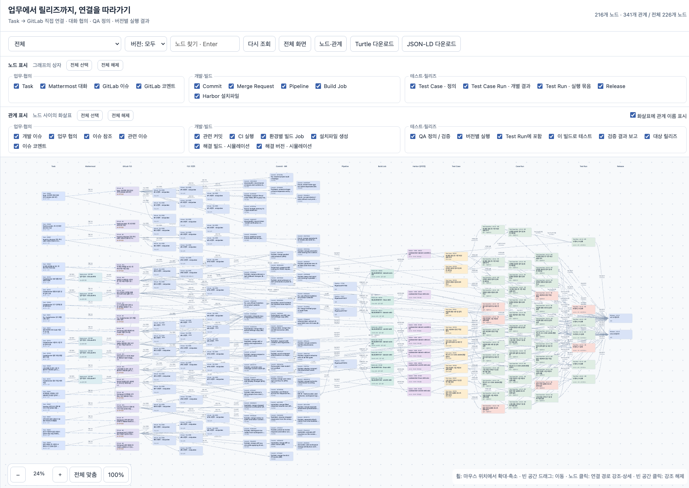

# 05. 문서에서 근거 있는 트리플로

이번 주에는 여러 플랫폼에 나뉜 업무·개발·테스트 정보를 연결했다. 온톨로지는 무엇을 노드와 관계로 관리할지 정하는 설계이고, Neo4j는 그 설계에 맞춘 그래프를 저장하고 조회하는 도구다.

관련 실습: [5주차 파이프라인](../labs/05-rdf-pipeline/README.md).

Notion 「5-6 Week」의 공부·실습 순서에 맞춰 정리했다. 페이지의 일부 ‘학습 예정’ 설명은 구현 전 기록이므로, 아래에는 이후 실행한 과정과 확인한 범위를 반영했다.

| 공부·실습 항목 | 이번에 확인한 것 |
|---|---|
| 닫힌 스키마·RDFS | 5개 클래스, 공개 v0의 8개 관계, ID·방향·종류 제한 |
| LLM 추출·few-shot·근거 | JSON 후보 → 근거 검사 → 채택/제외, 전체 자동 추출과 구분 |
| Turtle·JSON-LD | 같은 RDF를 두 형식으로 저장하고 다시 파싱해 비교 |
| Postgres·Neo4j 적재 | 엔티티/관계/근거 보존, 안정적인 ID로 중복 없는 재적재 |
| 1-hop·다중 홉 | Task→Issue, Task→Issue→Test Case, 빌드 기준 실행 결과 |
| 브라우저 시각화 | 노드·관계 필터, 확대/축소, 연결 강조, 메타데이터·출처 |

## 전체 그래프 구조



제공한 화면은 당시 **전체 226개 노드 중 216개 노드·341개 관계를 표시한 스냅샷**이다. 필터에 따른 표시 수와 전체 적재 수를 구분한다. 이후 GitLab MR을 반영한 2026-10-08 14:39 동기화 기록은 240개 노드·389개 관계·393개 근거, 372개 청크다. 앞서 수행한 모델 비교는 346개 청크 시점이며 최신 그래프에서 재평가한 수치가 아니다.

왼쪽의 업무에서 개발 이슈·코드, 가운데 CI·환경별 빌드 파일, 오른쪽 테스트 정의·개별 실행 결과·실행 묶음·릴리즈 순으로 읽는다. 화면에서 나란히 놓였다고 직접 관계가 있는 것은 아니므로 화살표 이름과 방향을 확인한다. 특히 Test Run과 릴리즈는 빌드 파일을 통해 확인하며, 모든 노드가 일렬로 연결되는 모델은 아니다.

GitLab API에서 실제 MR 15개를 추가했다. 이슈와 관련 MR, MR과 기존 커밋은 `relatedCommit`으로 함께 표현하고, 확인된 MR의 파이프라인 참조도 연결했다. MR이 merged라는 사실만으로 특정 테스트 통과를 추정하지 않는다.

## 어떤 질문을 답할 그래프인가?

처음에는 소프트웨어와 기능을 연결하려고 했다. 하지만 “어떤 기능을 제공하는가?”는 사용자 가이드를 검색하는 RAG로도 답할 수 있었다. 그래서 여러 시스템의 사실을 연결해야 하는 질문으로 범위를 바꿨다.

> 고객 요청이 어떤 개발 이슈·코드와 연결되고, 어떤 빌드를 대상으로 몇 차 테스트했으며, 어떤 릴리즈에 배정됐는가? 산출물이 있으면 함께 확인할 수 있는가?

- Codebeamer: PM 수준 Task, Test Case, Test Run, 릴리즈.
- Mattermost: 요청에 대한 협의와 개발 이슈 링크. 대화가 없으면 Task와 이슈를 직접 연결한다.
- GitLab: 상세 개발 이슈, 댓글, 커밋·MR, 파이프라인·빌드 Job.
- Harbor: 환경별 빌드 파일과 변경되지 않는 digest 참조.
- 파일 저장소: 관련 산출물이 있을 때 연결한다.

ALM 안에서도 추적성을 관리할 수 있다. 여기서 그래프를 만드는 이유는 서로 다른 플랫폼의 ID와 관계를 같은 모델로 조회하기 위해서다. RAG로도 근거를 찾아 연결할 수 있지만, 검색된 일부 문서만 보고 전체 테스트 수나 누락된 연결을 판단하기는 어렵다. 그래프 역시 수집이 빠졌다면 현실 전체를 나타내지 못한다.

## 클래스와 관계를 어떻게 정했나?

| 클래스 | 담는 대상 |
|---|---|
| Task | 요청을 실행할 업무 |
| Issue | 개발 이슈 |
| Change | 커밋·MR·빌드 작업 등의 변경 정보 |
| Verification | Test Case, 개별 Case Run, 여러 결과를 묶은 Test Run |
| Artifact | 협의 메시지, 빌드 파일, 릴리즈, 산출물 |

클래스는 5종으로 시작하고 `kind`로 세부 종류를 구분했다. 학습용 관계는 8개로 제한했다. 실제 UI에서는 파이프라인·댓글 등을 표현하면서 더 많은 관계로 확장했다.

```text
Task ─hasIssue→ Issue ─relatedCommit→ Commit
                      └hasVerification→ Test Case
Test Case ─hasExecution→ Case Run ─partOfRun→ Test Run
Harbor 파일 ─hasTestRun→ Test Run
Harbor 파일 ─forRelease→ Release
```

`relatedCommit`은 관련 커밋이라는 뜻이다. 관련 커밋이 있다고 수정 완료나 테스트 통과라고 판단하지 않는다. `forRelease`도 해당 빌드의 릴리즈 배정이며, 검증 성공을 뜻하지 않는다.

RDFS는 클래스와 관계의 의미를 표현한다. domain/range만으로 입력 오류를 거부하는 검증기가 되는 것은 아니다. 허용한 종류·관계와 방향은 JSON Schema와 코드로 제한했다. 이번 실습에는 OWL 추론을 적용하지 않았다.

## 노드와 메타데이터는 어떻게 나눴나?

독립적으로 연결하거나 조회할 대상은 노드로 만들었다. 그 대상의 설명은 속성으로 저장했다.

- Harbor 파일 노드: 파일명, 설치 환경, 저장소 참조, SHA-256, 기준 커밋.
- Test Run 노드: 실행 차수, 기준 빌드, 릴리즈, 시뮬레이션 여부.
- Case Run 노드: 케이스 ID, 부모 Test Run, Passed/Failed.
- 플랫폼 뱃지: `platform` 속성을 UI에서 표시한 것이다.

설치 환경과 Harbor 저장소를 별도 노드로 만들었다가 파일 속성으로 합쳤다. 이번 질문에서는 환경 자체의 관계보다 “어느 파일을 설치해 테스트했는가?”가 필요했기 때문이다.

## LLM이 추출한 사실은 어떻게 확인했나?

1. 원문 청크와 고정 엔티티 ID, 허용 술어, few-shot을 모델에 준다.
2. subject·predicate·object와 근거 구간을 JSON으로 받는다.
3. 근거가 원문 부분 문자열과 같은지, 방향과 클래스가 스키마에 맞는지 검사한다.
4. 관계의 의미를 검토하고 채택한 것만 적재한다.

JSON 형식이 맞아도 사실은 틀릴 수 있다. 관계 방향을 뒤집거나, 같은 댓글에 나온 테스트와 커밋을 근거 없이 연결할 수 있다. 초기 LLM 후보 14개 중 5개를 채택하고 9개를 제외했다. 이는 코드·근거 검토 결과이며 사람의 업무 승인을 뜻하지 않는다. 전체 그래프를 모두 LLM이 자동 추출한 것도 아니다. API에서 확인한 명시적 참조와 실습용 관계를 함께 사용했다.

입력은 기존 W2 회사 문서 전체가 아니라, 같은 청크 필드 구조로 만든 플랫폼 API 스냅샷이었다. 공개 labs에는 회사 원문 대신 새로 만든 작은 예제만 포함했다.

## 구축 과정은 어떤 순서였나?

1. 플랫폼 API의 문서·메시지·이슈·댓글·커밋·MR 정보를 스냅샷으로 모았다.
2. 청크에 문서 ID와 플랫폼 엔티티 ID를 붙여 원문과 그래프를 연결했다.
3. LLM 후보 또는 API의 명시적 링크에서 관계를 만들고 근거와 방향을 검토했다.
4. 동일 ID의 엔티티·관계·근거를 Postgres와 Neo4j에 적재했다.
5. 성공한 패키징 Job의 VSIX를 Harbor에 저장하고 파일 digest·OS·CPU를 보존했다.
6. 파일→Test Run, Case Run→Test Run, 파일→Release를 연결해 빌드 기준 조회를 구성했다.
7. RDF 내보내기와 브라우저 시각화로 저장 결과·경로·출처를 확인했다.

Harbor에는 환경별 파일이 쌓이므로 파일명만으로 같은 빌드라고 합치면 안 된다. 안정적인 아티팩트 참조와 digest를 식별에 사용한다. 릴리즈 배정이나 QA 시뮬레이션처럼 임의로 넣은 관계는 API로 관찰한 관계와 근거 종류를 구분한다.

## 어디에 저장했고 무엇을 내보냈나?

Postgres에는 엔티티·엣지·근거를 저장하고 Neo4j에는 조회용 그래프를 적재했다. 안정적인 플랫폼 ID를 기준으로 `MERGE`해 재실행 시 중복 생성을 막았다. UI는 Neo4j 조회 결과를 브라우저에서 시각화한다.

RDF는 주어–술어–목적어 모델이다. Turtle과 JSON-LD는 같은 RDF 내용을 서로 다르게 쓰는 직렬화 형식이다. 내보낸 두 파일을 다시 파싱해 동일한 그래프인지 비교했다. 그림을 저장하는 것과는 다르다.

```turtle
@prefix kg: <https://example.org/kg/> .
@prefix id: <https://example.org/id/> .
id:task1 kg:hasIssue id:issue1 .
```

## 빌드·테스트·릴리즈를 연결하며 헷갈렸던 부분

파이프라인은 CI 실행 한 묶음이고, Job은 그 안의 개별 작업이다. 같은 파이프라인에서 OS·CPU 조합별 패키징 Job이 여러 개 실행될 수 있다. Job이 만든 VSIX는 VS Code 확장 설치 파일이며 컨테이너 이미지가 아니다. 이를 OCI 아티팩트로 Harbor에 보관했다.

```text
Commit → Pipeline → 성공한 Build Job → Harbor 빌드 파일
                                          ├→ Test Run ← Case Run ← Test Case
                                          └→ Release
```

Build Job을 릴리즈에 바로 연결하는 대신, 실제 저장된 파일을 연결했다. Test Run도 그 파일의 digest를 기준으로 묶어야 “무엇을 테스트했는가?”를 확인할 수 있다. 기준 빌드를 모르는 과거 실행에는 임의의 실제 검증 관계를 넣지 않았다.

Test Case는 정의, Case Run은 케이스 하나의 결과, Test Run은 여러 Case Run의 실행 묶음이다. 케이스 실행 6개가 있다고 테스트를 6차 진행한 것은 아니다. 차수와 케이스 수를 따로 조회해야 한다. QA 결과와 일부 해결 버전 매핑은 실습 시뮬레이션이며 실제 제품 검증 증명이 아니다.

## 문서가 바뀌면 처음부터 다시 만들어야 하나?

목표는 문서 ID·버전 해시로 변경을 감지하고, 변경 문서의 청크와 근거를 다시 검토해 파생 관계를 갱신하는 것이다. 같은 관계에 다른 문서 근거가 남아 있다면 함께 지우면 안 된다.

이번에는 스냅샷 수집과 재적재를 실행했다. 플랫폼 webhook부터 삭제·변경 전파까지 자동으로 처리하는 운영 파이프라인은 완성하지 않았다. `MERGE`는 중복 방지이며 사라진 관계의 자동 제거 기능은 아니다.

## 참고 자료

- [Notion 5-6 Week — 공부·실습 원문](https://www.notion.so/3ebdbb08775280408518f1bb6058cc4c)

- [W3C RDF 개념](https://www.w3.org/TR/rdf11-concepts/)
- [W3C RDFS](https://www.w3.org/TR/rdf-schema/)
- [Neo4j MERGE](https://neo4j.com/docs/cypher-manual/current/clauses/merge/)
