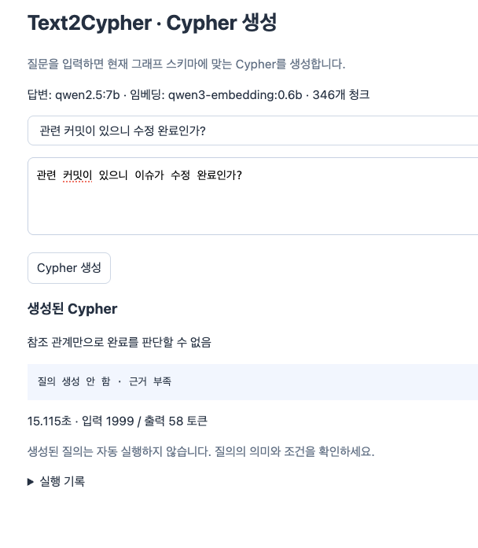
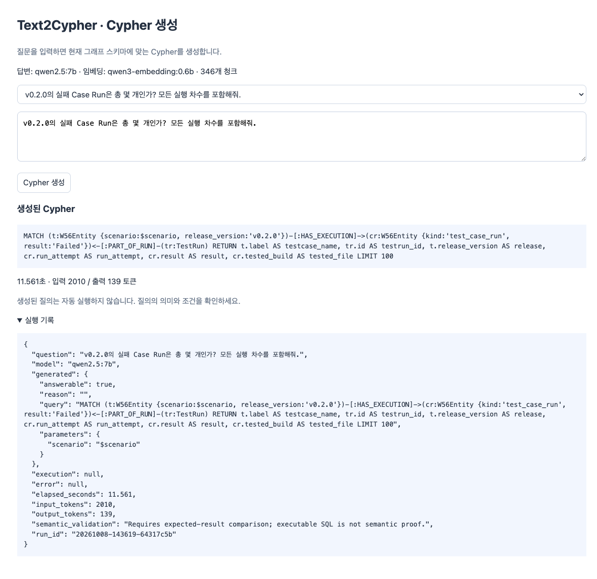
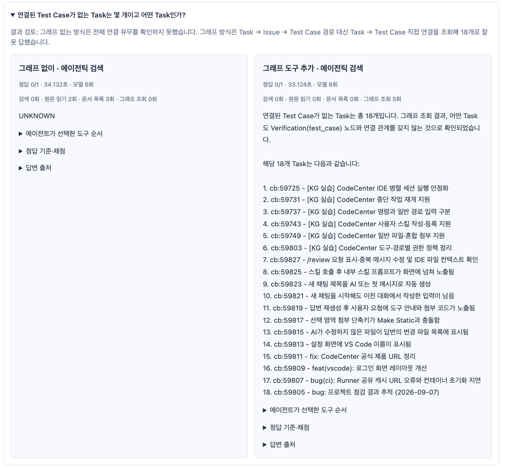

# 06. 검색에 그래프를 붙이고 같은 질문으로 비교하기

그래프를 만들었다고 GraphRAG가 완성되는 것은 아니다. 질문에서 관련 대상을 찾고 관계를 따라 근거를 모아 답변에 넣는 검색 흐름이 필요하다. 이번에는 이 흐름을 붙이고, 그래프를 쓰지 않는 방식과 같은 질문으로 비교했다.

관련 실습: [6주차 검색·그래프 실습](../labs/06-graphrag/README.md).

Notion 「5-6 Week」의 공부·실습과 제공한 「GraphRAG 학습 정리 — 시작 노드 찾기부터 전체 답변까지」 질의응답을 함께 반영했다. 질의응답의 EFS Issue #13·QA #7·Result #77은 개념 설명용 가상 사례이므로 회사 그래프의 사실로 가져오지 않았다.

| 공부·실습 항목 | 정리한 내용 |
|---|---|
| 로컬/글로벌/Text2Cypher | 조회 범위와 질의 생성 방식 구분, 글로벌은 공부만 |
| 하이브리드 리트리버 | 벡터·BM25·RRF → 엔티티 ID → 관계·근거 |
| 빌드 시점 선지불 | 색인 구축의 사전 계산, 제품 빌드와 구분 |
| v1 → v2 | 같은 청크 검색에 그래프 리트리버 추가 |
| 같은 질문 비교 | 검색된 일부 근거와 전체 범위 집계의 차이, 정답·시간·토큰 기록 |
| Text2Cypher | 근거 부족으로 생성 보류, 생성문과 검증된 질의의 차이 |

추가로 진행한 에이전틱 비교는 그래프 도구 유무를 바꾸고 같은 GLM-5.2 질문을 실행한 별도 실험이다. 커뮤니티 탐지·글로벌 서치 구현과는 구분한다.

## v1과 v2에서 무엇이 달라졌나?

```text
v1: 질문 → 벡터·BM25 → RRF → 청크 → 답변
v2: 질문 → 같은 검색 → 엔티티 ID → 그래프 경로·집계 → 근거 → 답변
```

벡터는 의미가 비슷한 문서, BM25는 단어가 맞는 문서를 찾는다. RRF는 두 순위를 결합한다. v2는 검색 청크가 가리키는 엔티티를 시작점으로 주변 관계를 확장한다. 전체 개수가 필요한 질문에는 Top-k 검색 결과가 아닌 별도의 전체 범위 그래프 질의를 사용했다.

W6 저장소는 작은 파일 기반 색인이다. `chunks.jsonl`은 원문 청크이고 `w6-vector-index.json`은 청크 임베딩이다. 이 실습의 벡터 검색은 메모리에서 정확 코사인 유사도를 계산하며, 이전 주의 pgvector/HNSW 실습과 구분한다. 그래프는 Neo4j를 조회한다. 청킹과 임베딩은 다른 단계다.

## 검색 후보와 그래프 연결은 같은 것인가?

아니다. 벡터·키워드는 시작 후보를 찾고, 그래프는 **이미 저장한 관계**를 가져온다. 의미가 비슷한 이슈와 테스트가 검색됐다고 검증 관계가 자동으로 생기지는 않는다.

RRF는 서로 다른 검색 점수 대신 순위를 합친다. 한 청크가 BM25 1위, 벡터 2위이고 상수 k=60이면 `1/61 + 1/62 ≈ 0.032522`다. 같은 청크 ID의 점수를 합쳐 후보를 정한다. 이 실습의 ‘하이브리드’는 BM25+벡터+RRF이고, 그래프 확장은 그다음 단계다. 이름이 HybridRetriever라고 모든 구현이 이 조합인 것은 아니다.

`#17`처럼 ID가 확실하면 프로젝트와 ID로 직접 조회할 수 있다. ID를 모르면 검색 청크의 `entity_ids`를 Neo4j 노드 ID에 연결한다. 모든 노드를 임베딩할 필요는 없다. 이번에는 청크를 임베딩했으며, 제공한 질의응답의 ‘Neo4j 노드 embedding 속성·벡터 인덱스’ 예시는 가능한 다른 설계다.

그래프 리트리버는 새 저장소가 아니라 앱의 조회 컴포넌트다. 앱이 시작 ID와 조회 범위를 정하고, Neo4j가 관계를 조회하며, 리트리버가 노드·관계·원문 근거를 반환한다. 모델은 반환된 근거로 답변한다. 고정 질의로도 구현할 수 있으므로 Text2Cypher가 필수는 아니다.

## 최신 구조도에서 검색해야 할 경로

[업무부터 릴리즈 확정까지의 구조도](05-rdf-ontology-pipeline.md#업무부터-테스트릴리즈-확정까지의-흐름)를 기준으로, 업무 질문은 Task에서 개발·빌드 단계를 거쳐 Harbor 파일을 찾고 해당 파일의 실행 결과를 확인한다.

```text
Task → Issue → Commit·MR → Pipeline → Build Job → Harbor 파일
                                                     └→ Test Run ← Case Run ← Test Case
Harbor 파일 → Release  (현재 저장된 목표 버전 배정)
```

그림을 업무 순서대로 읽으면 Case Run 다음에 Test Run이 나오지만, 저장된 조회 경로는 파일→Test Run←Case Run이다. 에이전트에 이 방향을 알려야 직접 연결이 없는 노드를 잘못 조회하지 않는다.

예를 들어 “이 Task의 v0.2.0 빌드에서 수행한 Test Run은 몇 차이며, 케이스별 통과·실패는 각각 몇 개인가?”를 묻는다. 답변에는 Task·Issue ID, Harbor 파일의 digest와 설치 환경, Test Run ID·차수, Case Run별 결과를 함께 제시한다. 버전이 같다는 이유만으로 다른 파일의 결과를 섞지 않는다.

현재 그래프로 확인할 수 있는 것은 버전 배정과 연결된 실행 기록이다. 최신 그림의 결과 검토·승인 후 릴리즈 확정은 업무 설계이며, 아직 저장하지 않은 승인 사실을 LLM이 만들어 답하면 안 된다.

## 어떤 다중 홉 질문을 했나?

> 중단 작업 재개 Task의 GitLab 이슈와 v0.1.0·v0.2.0 테스트 결과는? 재실행과 어떤 케이스가 통과·실패했는지도 알려줘.

Task → Issue → Test Case → Case Run → Test Run을 따라가면 해당 업무의 결과를 모을 수 있다. 릴리즈에 배정된 빌드만 보고 싶다면 다른 범위로 조회해야 한다.

```text
Release ← FOR_RELEASE ─ Harbor 파일 ─ HAS_TEST_RUN → Test Run ← PART_OF_RUN ─ Case Run
```

“전체 과거 실행”, “릴리즈 배정 빌드에서 실행”, “최신 차수만”은 다른 질문이다. 답변에는 릴리즈·차수·Test Run ID·기준 파일·Case Run 결과를 함께 보여주도록 수정했다. 빌드를 모르는 과거 실행은 빌드 기준 집계에 포함하지 않는다.

### 릴리즈 질문은 성공·실패 수로 구체화했다

> v0.1.0 릴리즈에 배정된 Harbor 빌드에서 실행한 Test Run은 몇 개이고, Case Run 통과·실패는 각각 몇 개인가? 실행 차수와 기준 빌드, 케이스명도 알려줘.

같은 질문을 v0.2.0에도 적용했다. 두 방식의 처음 검색 Top-6은 같게 하고 v2에는 전체 범위의 빌드 연결 조회를 추가했다.

| 확인 범위 | v1 검색만 | v2 그래프 결합 |
|---|---|---|
| 얻는 근거 | 검색된 6개 청크에 있는 실행 기록 | 릴리즈에 배정된 파일과 명시적으로 연결된 전체 실행 |
| 개수 판단 | 일부 청크의 결과를 전체로 일반화하면 틀림 | 파일→Test Run←Case Run을 DISTINCT로 집계 |
| v0.1.0 답변 확인 | 통과 2 언급, 실패·전체 실행 범위 불명확 | 파일 2개, Test Run 2개(3·4차), 통과 4·실패 0 |
| v0.2.0 답변 확인 | 통과 2·실패 0, 실행 수 진술도 구조화 결과와 불일치 | 파일 2개, Test Run 2개(2·3차), 통과 4·실패 0 |

이 결과는 **파일과 연결된 실행만** 센다. 전체 버전 이력에서의 실패 Case Run 수와 범위가 다르다. v2는 DB 행으로 집계·상세 표를 구성한 부분이 있으므로 LLM의 자율 추론 능력으로 해석하지 않는다. 실제 코퍼스의 별도 릴리즈 비교 실행 기록이며 공개 합성 예제의 측정값이 아니다.

## GraphRAG 패턴은 어떻게 나뉘나?

| 방식 | 하는 일 | 이번 범위 |
|---|---|---|
| 로컬 서치 | 엔티티를 찾아 주변 그래프와 근거를 조회 | 구현 |
| 글로벌 서치 | 커뮤니티 탐지·요약을 미리 만들고 전체 주제를 종합 | 공부만, 미구현 |
| Text2Cypher | 자연어 질문으로 Cypher 생성 | 생성과 별도 실행 기록 확인 |

Local Search와 Global Search는 주로 사용하는 근거의 범위를, Text2Cypher는 질의를 누가 만드는지를 설명한다. 특정 노드 주변 Cypher를 모델이 만들면 Local Search와 Text2Cypher를 조합할 수 있다. 전체 실패 수 같은 조건 질의는 벡터로 시작점을 찾지 않고 그래프 전체를 조회할 수도 있다.

Microsoft의 Local Search는 엔티티·관계와 원문, 관련 커뮤니티 보고서 등을 선별한다. 이번 구현은 Neo4j 기반의 간단한 로컬 조회이며 Microsoft GraphRAG 전체 구현을 사용한 것은 아니다. [공식 Local Search 설명](https://microsoft.github.io/graphrag/query/local_search/).

### 커뮤니티는 경로를 묶는 것인가?

경로는 Task→Issue→Test Case처럼 관계를 따라가는 순서이고, 커뮤니티는 연결 구조를 분석해 묶은 노드 그룹이다. 같은 모양의 경로가 네 개 있어야 하는 조건은 없다. 비슷한 경로가 있어도 서로 연결되지 않으면 같은 커뮤니티라고 단정할 수 없다.

Leiden/Louvain은 그룹 소속을 정하고, LLM은 그 그룹의 엔티티·관계·설명을 보고 요약 보고서를 만든다. Neo4j에 저장하기만 하면 communityId가 자동 생성되는 것은 아니다. GDS 등으로 탐지를 별도 실행해야 한다. 이번 실습에는 탐지와 보고서 생성을 적용하지 않았다.

Global Search는 미리 만든 여러 커뮤니티 보고서를 묶음별로 분석(Map)하고 필요한 부분을 종합(Reduce)한다. ‘노드의 communityId → 같은 그룹의 다른 노드’ 조회는 탐색 확장이며, 보고서를 종합하는 Global Search와 다르다. [공식 Global Search 설명](https://microsoft.github.io/graphrag/query/global_search/).

### ‘빌드 시점 선지불’은 Harbor 빌드를 뜻하나?

여기서 빌드는 검색용 데이터를 준비하는 단계다. 문서 청킹·임베딩·그래프 적재·색인 생성, 필요하면 커뮤니티 탐지와 보고서 생성을 질문 전에 수행한다. VSIX를 만드는 CI Build Job과는 다른 의미다.

미리 쓴 계산 시간·LLM 사용량을 여러 질문에서 재사용한다는 뜻이다. 일반 벡터 RAG도 청킹과 임베딩을 사전 계산한다. 모든 GraphRAG가 커뮤니티 요약을 요구하지 않으며, 사전 계산 후에도 질문 임베딩·검색·답변 생성 비용은 남는다. 입력 스냅샷은 보존하고 그래프·벡터·요약은 재생성 가능한 파생물로 관리하는 배치 사고가 필요하다.

## Text2Cypher는 실행만 되면 성공인가?

아니다. 문법이 맞고 실행돼도 관계 경로나 집계 범위가 틀리면 오답이다. 실제 클래스·관계·속성 예시와 few-shot을 모델에 주고, 생성문과 결과를 정답에 대조했다. UI에서는 생성만 하도록 정리했다.

좋았던 사례는 “관련 커밋이 있으니 수정 완료인가?”에 `answerable=false`와 근거 부족 이유를 반환한 것이다. `relatedCommit`은 완료를 뜻하지 않으므로 질의를 억지로 만들지 않는 것이 맞다.

### 근거 부족으로 Cypher를 만들지 않은 화면



화면의 답변은 “참조 관계만으로 완료를 판단할 수 없음”이다. 사용자가 ‘생성 실패’라고 부른 사례지만 시스템 오류가 아니라 **근거 부족에 따른 생성 보류**다. 완료·검증을 나타내는 사실이 없으면 `answerable:false`로 멈추는 것이 적절하다. Qwen 7B의 기록은 15.115초, 입력 1,999·출력 58토큰이다.

### Cypher가 생성됐지만 정답으로 확정할 수 없는 화면



“v0.2.0 실패 Case Run은 몇 개? 모든 차수 포함”에 문자열은 생성됐다. 기록은 11.561초, 입력 2,010·출력 139토큰이며 `execution:null`이다. **생성 완료·실행 성공·의미상 정답은 세 가지 다른 상태**다.

생성문을 실제 스키마와 비교하면 다음 문제가 보인다.

- `PART_OF_RUN`을 Test Run→Case Run 방향으로 적었다. 실제는 Case Run→Test Run이다.
- `tr:TestRun` 라벨을 썼지만 이 그래프의 실행 묶음은 `W56Entity`/`Verification`, `kind:'test_run'`이다.
- 질문은 개수를 요청했지만 `count` 대신 행을 반환하고 `LIMIT 100`으로 잘랐다.
- 차수는 Test Run의 속성이고 기준 파일은 파일→Test Run 관계로 확인해야 한다. 생성문은 Case Run에서 찾는다.
- 실행 파라미터도 `scenario`의 실제 값 대신 문자 `"$scenario"`를 넣었다.

전체 버전 이력의 실패 수만 확인한다면 아래처럼 범위와 집계부터 명확히 작성한다. 이것은 스키마를 대조해 작성한 교정 예시이며 첨부 화면의 모델이 생성한 문장이 아니다.

```cypher
// $scenario에는 실제 조회할 시나리오 ID를 전달한다.
MATCH (cr:W56Entity {scenario:$scenario, kind:'test_case_run',
                    release_version:'v0.2.0', result:'Failed'})
RETURN count(DISTINCT cr) AS failed_count;
```

케이스명·차수를 보려면 `Test Case-HAS_EXECUTION→Case Run-PART_OF_RUN→Test Run`을 조회한다. 기준 파일은 `File-HAS_TEST_RUN→Test Run`으로 추가한다. 파일을 모르는 기록도 남기려면 OPTIONAL MATCH를 사용하고 미확인은 null로 표시한다. [Neo4j OPTIONAL MATCH](https://neo4j.com/docs/cypher-manual/current/clauses/optional-match/).

## 고정 GraphRAG와 에이전틱 검색은 어떻게 달랐나?

고정 v2는 코드가 경로 확장과 일부 집계 질의를 선택한다. 에이전틱 검색은 모델이 다음 검색어, 원문 읽기, 추가 조회, 답변 종료를 선택한다. 그래프 도구가 있는 쪽에는 조회용 Cypher도 제공했다.

기존 v1/v2 모델 비교에서는 Qwen v1 3/9·v2 9/9, GLM v1 2/9·v2 9/9의 사실 항목 점수를 얻었다. 다만 버전·케이스 결과의 일부 v2 답변은 Neo4j 행으로 구성한 템플릿이며, 모델이 자유롭게 관계를 찾아 해결한 결과와 같지 않다. 역사적 모델 비교의 프롬프트·출력 한도도 완전히 동일하지 않았다.

이를 확인하려고 GLM-5.2로 별도의 에이전틱 비교를 새로 실행했다. 같은 청크 346개, 같은 질문 4개, 동일 출력 한도와 최대 5회 조회 도구 예산을 사용했다. 정답은 모델에 주지 않고 실행 후 비교했다.

### 2026-10-08 에이전틱 비교 결과

| 방식 | 사실 항목 정답 | 모델 호출 | 입력 / 출력 토큰 | 총 시간 |
|---|---:|---:|---:|---:|
| 그래프 없이 검색·원문·목록 | 4/9 | 22 | 61,988 / 7,858 | 117.7초 |
| 같은 도구 + 그래프 조회 | 3/9 | 18 | 82,083 / 6,296 | 82.7초 |

모델 요청 이름은 `zai-org/GLM-5.2`, 실제 응답 이름은 `zai-org/GLM-5.2-MXFP4`였다. 제공된 MangoBoost API로 실행했다. 입력·출력 단가를 확인하지 못해 금액은 계산하지 않았다. 임베딩·색인 구축 비용은 표에서 제외했다. 모델 호출은 줄었지만 입력 토큰은 늘었으므로 “더 저렴하다”고 결론 내리지 않는다.

| 질문 | 그래프 없이 | 그래프 도구 추가 |
|---|---|---|
| 이슈 #16 재현 절차 | 원문을 못 찾아 단계 수 UNKNOWN | 같은 실패 |
| 재개 Task의 두 버전 결과 | 일부 Case Run만 집계 | Task로 제한하지 않고 전체 버전 결과 집계 |
| Test Case 없는 Task | 전체 연결 확인 불가 | Task→Issue→Test Case 대신 직접 연결을 조회해 18개로 오답 |
| v0.2.0 실패 Case Run 수 | 1개 정답 | 1개 정답 |

재개 Task의 정답은 이슈 #17, v0.1.0 통과 4·실패 2, v0.2.0 통과 2·실패 0이다. Test Case 미연결 Task 정답은 수집 그래프 기준 13개다. 이는 실습 QA 데이터이며 실제 제품 품질 평가가 아니다.

이번 결과는 질문별 한 번씩 실행한 기록이다. 자동 점수는 지정한 9개 사실 항목을 비교하며, 답변 전체 의미나 인용 내용의 타당성을 모두 검증하지 않는다.

### 그래프 도구가 있어도 틀린 사례



이 화면의 질문은 “연결된 Test Case가 없는 Task는 몇 개이고 어떤 Task인가?”다. 그래프 없는 쪽은 UNKNOWN, 그래프 도구가 있는 쪽은 18개라고 답했다. 해당 질문의 정답 항목은 양쪽 모두 0/1이다. 왼쪽 34.132초·모델 6회, 오른쪽 33.124초·모델 6회·그래프 조회 5회였다.

18개라는 답은 모델이 실제 저장된 Task→Issue→Test Case 대신 Task→Test Case 직접 연결을 확인했기 때문에 나왔다. 직접 관계가 없다는 사실을 ‘연결된 테스트가 없음’으로 잘못 해석했다. 올바른 경로로 확인한 정답은 당시 수집 그래프 기준 13개다. 그래프 조회 횟수가 많다고 경로가 맞는 것은 아니다.

```cypher
MATCH (t:W56Entity {scenario:$scenario, kind:'task'})
WHERE NOT EXISTS {
  (t)-[:HAS_ISSUE]->()-[:HAS_VERIFICATION]->
      (:W56Entity {kind:'test_case'})
}
RETURN t.id, t.label;
```

이 사례에서는 부족한 근거를 인정한 UNKNOWN과, 잘못된 집계 결과를 단정한 답변을 구분해 기록했다. 전체 비교의 4/9·3/9는 네 질문의 사실 항목 합계이고 이 화면의 0/1은 한 질문 점수다.

## 이번 실습에서 확인한 점

그래프는 관계와 집계 근거를 제공하지만 모델이 경로를 잘못 고르면 오답을 낸다. 검색 없는 그래프만으로도 문서의 긴 재현 절차를 대신할 수 없다. 문서 설명 질문과 관계·집계 질문을 구분하고, 조회 범위를 정답 기준과 함께 기록해야 차이를 설명할 수 있다.

공개 labs는 동일한 원리를 작은 합성 데이터로 다시 실행하도록 옮겼다. 공개 실행 데이터에는 회사 원문·사내 식별자·인증 정보를 넣지 않았다. 이 노트의 제공된 화면은 실제 실습을 설명하는 자료이며 일부 업무 제목·ID를 포함한다. 전체 운영 UI 소스는 배포하지 않았다. 공개 예제의 결과와 위 실제 실험 수치를 혼동하지 않는다.

## 참고 자료

- [Notion 5-6 Week — 공부·실습 원문](https://www.notion.so/3ebdbb08775280408518f1bb6058cc4c)
- 제공 자료: `graphrag-study-notes.md`의 질의응답, 이번 채팅의 구축·수정 과정과 실행 기록.

- [GraphRAG 질의 방식](https://microsoft.github.io/graphrag/query/overview/)
- [Neo4j 경로 패턴](https://neo4j.com/docs/cypher-manual/current/patterns/variable-length-patterns/)
