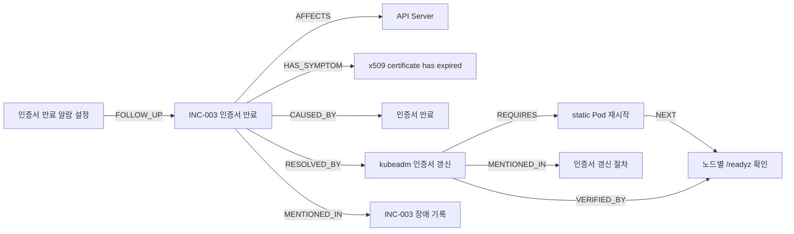
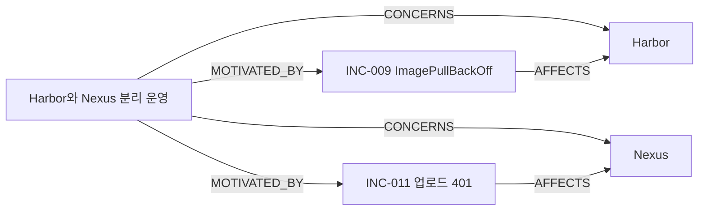

# 옵시디언 작업기록 지식 그래프 — 노드와 엣지 설계

## 한 줄 요약

옵시디언에 흩어진 장애 기록, 작업 절차, 운영 결정을 **장애 → 원인 → 조치 → 검증 → 후속 작업**으로
연결하고, 모든 관계에서 원문 근거를 다시 확인할 수 있는 개인 작업기록 지식 그래프를 설계했다.

## 출발점: 검색했는데도 답하지 못하는 질문

2주차에는 같은 옵시디언 작업기록을 grep, Elasticsearch BM25, pgvector로 검색했다. 3주차에는
BM25와 벡터 검색 결과를 RRF로 합쳐 하이브리드 검색과 RAG 챗봇을 만들었다.

하이브리드 검색은 질문과 관련된 청크를 찾는 데에는 도움이 되지만, 여러 문서에 흩어진 사실의
관계를 미리 알고 있는 것은 아니다. 다음 질문이 대표적이다.

> 인증서 만료 장애의 원인은 무엇이었고, 어떤 조치로 해결했으며, 작업 후 무엇을 검증했고,
> 아직 남아 있는 후속 작업은 무엇인가?

이 질문의 답은 한 문서에 모여 있지 않다.

| 필요한 사실 | 기록된 문서 |
|---|---|
| 장애 증상과 원인 | `troubleshooting/INC-003-apiserver-etcd-tls-expiry.md` |
| 인증서 갱신과 static Pod 재시작 | `howto/kubeadm-인증서-갱신-절차.md` |
| 노드별 `/readyz` 검증 | 절차 문서와 관련 장애 기록 |
| 인증서 만료 알람 후속 작업 | `daily/2026-02-03.md` |

RAG가 이 문서를 모두 검색할 수도 있지만, 어떤 문서가 **원인**, **해결**, **검증**, **후속 작업**인지
관계는 질문할 때마다 LLM이 다시 추론해야 한다. 그래서 이 관계를 그래프로 명시하기로 했다.

```text
문서 검색: 질문과 비슷한 청크를 찾는다.
그래프 탐색: 찾은 대상과 연결된 관계를 따라간다.
```

## 설계 원칙

### 1. 업무 개념과 출처를 분리한다

그래프는 두 층으로 구성한다.

```text
지식 층: Incident, System, Symptom, Cause, Action, Decision, Todo
근거 층: Document와 각 관계의 evidence
```

지식 층은 질문에 답하기 위한 의미 구조다. 근거 층은 그 사실을 어디에서 확인했는지 추적한다.
그래프에 관계가 있다는 이유만으로 답하지 않고, 최종 답변에는 반드시 원문 청크를 함께 전달한다.

### 2. 현재 질문에 필요한 작은 스키마부터 시작한다

처음부터 사람, 팀, 프로젝트, 명령어, 메트릭을 모두 별도 타입으로 나누면 그래프가 복잡해진다.
현재 평가 질문에 필요한 장애·원인·조치·결정부터 만들고 실제 질문으로 검증한 뒤 확장한다.

### 3. 날짜와 상태는 우선 속성으로 둔다

날짜를 모두 노드로 만들면 `2026-02-03` 같은 노드가 지나치게 많아진다. 현재는
`occurred_at`, `created_at`, `status` 속성으로 두고 시간 자체를 연결해 탐색해야 할 때만 확장한다.

## 노드 설계

현재 구현에는 8종, 총 15개 노드가 있다.

| 노드 타입 | 의미 | 대표 속성 | 예시 |
|---|---|---|---|
| `Incident` | 실제로 발생한 장애나 문제 | `id`, `label`, `description`, `source_path` | INC-003 인증서 만료 |
| `System` | 장애·결정의 대상이 되는 시스템 | `label`, `description` | API Server, Harbor, Nexus |
| `Symptom` | 운영자가 관찰한 현상 | `label`, `description` | `x509 certificate has expired` |
| `Cause` | 확인된 장애 원인 | `label`, `description` | 인증서 만료 |
| `Action` | 명령, 절차, 검증 등 수행한 행동 | `action_type`, `source_path` | 인증서 갱신, `/readyz` 확인 |
| `Decision` | 비교 후 선택한 운영 결정 | `status`, `source_path` | Harbor와 Nexus 분리 운영 |
| `Todo` | 장애·결정 이후 남은 후속 작업 | `status`, `source_path` | 인증서 만료 알람 설정 |
| `Document` | 사실의 출처가 되는 원본 문서 | `source_path`, `description` | INC-003 장애 기록 |

### Action을 하나의 타입으로 둔 이유

명령어, 절차, 검증을 처음부터 별도 노드 타입으로 나누지 않았다. 모두 사람이 수행하는 행동이라는
공통점이 있고, 다음과 같이 `action_type`으로 구분할 수 있기 때문이다.

```text
procedure    kubeadm 인증서 갱신
command      static Pod 재시작
verification 노드별 /readyz 확인
```

질문이 늘어나면서 명령어만 별도로 검색하거나 검증 결과를 저장할 필요가 생기면 `Command`,
`Verification` 타입으로 분리할 수 있다.

### Chunk를 아직 노드로 만들지 않은 이유

검색에서는 청크가 중요하지만 현재 그래프에서는 `Document`와 엣지의 `evidence` 문자열로 출처를
표현한다. 청킹 설정을 바꿀 때마다 청크 ID가 달라질 수 있기 때문이다. 청크 ID를 안정적으로 유지할
수 있게 되면 다음 구조로 확장할 예정이다.

```text
Document ─HAS_CHUNK→ Chunk
Knowledge Node ─MENTIONED_IN→ Chunk
```

## 엣지 설계

현재 구현에는 11종, 총 16개 엣지가 있다.

| 엣지 | 출발 → 도착 | 답할 수 있는 질문 |
|---|---|---|
| `AFFECTS` | Incident → System | 이 장애는 어떤 시스템에 영향을 줬나? |
| `HAS_SYMPTOM` | Incident → Symptom | 당시 어떤 현상이 보였나? |
| `CAUSED_BY` | Incident → Cause | 확인된 원인은 무엇인가? |
| `RESOLVED_BY` | Incident → Action | 무엇을 해서 해결했나? |
| `REQUIRES` | Action → Action | 이 작업을 완료하려면 추가로 무엇이 필요한가? |
| `NEXT` | Action → Action | 다음 순서의 작업은 무엇인가? |
| `VERIFIED_BY` | Action → Action | 작업 성공을 어떻게 검증했나? |
| `CONCERNS` | Decision → System | 이 결정은 어떤 시스템에 관한 것인가? |
| `MOTIVATED_BY` | Decision → Incident | 어떤 문제 경험이 이 결정에 영향을 줬나? |
| `FOLLOW_UP` | Todo → Incident/Decision | 이 할 일은 어떤 사건에서 생겼나? |
| `MENTIONED_IN` | 지식 노드 → Document | 이 사실을 어느 문서에서 확인했나? |

모든 엣지는 `evidence`를 가진다. 예를 들어 `INC-003 → RESOLVED_BY → 인증서 갱신`이라는 관계에는
`INC-003#조치`가 근거로 붙는다. 관계의 방향은 질문할 때 따라갈 경로가 자연스럽도록 정했다.

## 사례 1: 인증서 만료 장애



이 그래프에서는 다음 경로를 따라 답을 구성한다.

```text
INC-003
 ├─ CAUSED_BY → 인증서 만료
 ├─ RESOLVED_BY → 인증서 갱신
 │                  ├─ REQUIRES → static Pod 재시작
 │                  └─ VERIFIED_BY → /readyz 확인
 └─ FOLLOW_UP ← 인증서 만료 알람 설정
```

## 사례 2: 이미지 레지스트리 운영 결정



이 구조는 단순히 “Harbor 문서 찾아줘”가 아니라 다음 질문을 처리하기 위한 것이다.

> 왜 레지스트리를 하나로 통합하지 않았고, 분리 운영에서 실제로 어떤 인증 문제가 발생했는가?

결정 노드에서 두 시스템과 관련 장애로 이동하면, 결정의 이유와 운영 비용을 한 번에 찾을 수 있다.

## RDF 트리플로 표현하면

현재 구현은 JSON 기반 작은 프로퍼티 그래프지만, 각 엣지는 RDF 트리플과 같은 형태로 읽을 수 있다.

```turtle
@prefix worklog: <https://example.org/worklog/> .

worklog:INC-003
    worklog:affects worklog:KubernetesAPIserver ;
    worklog:hasSymptom worklog:X509Expired ;
    worklog:causedBy worklog:CertificateExpired ;
    worklog:resolvedBy worklog:RenewCertificate .

worklog:RenewCertificate
    worklog:requires worklog:RestartStaticPod ;
    worklog:verifiedBy worklog:CheckReadyz .
```

예를 들어 장애의 원인·조치·검증을 찾는 SPARQL은 다음처럼 쓸 수 있다.

```sparql
SELECT ?cause ?action ?verification
WHERE {
  worklog:INC-003 worklog:causedBy ?cause ;
                  worklog:resolvedBy ?action .
  ?action worklog:verifiedBy ?verification .
}
```

## 검색 RAG와 Graph RAG의 역할

| 방식 | 찾는 기준 | 잘 맞는 질문 |
|---|---|---|
| BM25 | 같은 기술 용어·오류 문자열 | `x509` 오류가 난 기록은? |
| Vector | 문장 의미의 유사도 | 표현이 다른 장애 회상 질문 |
| Hybrid RRF | BM25와 Vector 순위 결합 | 일반적인 작업기록 질문 |
| Graph | 노드와 관계 | 원인 → 조치 → 검증 → 후속 작업 질문 |
| Hybrid + Graph | 관련 청크와 관계 근거 결합 | 여러 문서를 연결해야 하는 복합 질문 |

그래프가 검색을 대체하는 것은 아니다. 검색은 26개 문서 전체에서 후보를 찾고, 그래프는 명시적으로
구조화한 관계를 따라 추가 근거를 제공한다. 최종 형태는 두 결과를 합쳐 LLM에 전달하는 것이다.

## 검증 질문

그래프가 실제로 필요한지 판단하기 위해 다음 질문을 사용한다.

| 질문 | 기대 탐색 경로 |
|---|---|
| 인증서 장애의 원인과 해결 방법은? | Incident → Cause, Incident → Action |
| 인증서를 갱신한 다음 무엇을 해야 하나? | Action → REQUIRES → Action |
| 작업 성공을 어떻게 확인했나? | Action → VERIFIED_BY → Action |
| 장애 이후 남은 후속 작업은? | Incident ← FOLLOW_UP ← Todo |
| 레지스트리를 왜 분리 운영했나? | Decision → System, Decision → Incident |

## 현재 구현과 한계

- [`knowledge_graph.json`](../labs/01-worklog-search/dataset/knowledge_graph.json)에 15개 노드와 16개
  엣지를 수동으로 검증해 기록했다.
- [`knowledge_graph.py`](../labs/01-worklog-search/src/knowledge_graph.py)가 노드 ID와 엣지 참조를
  검증하고 Graphviz 표현을 만든다.
- [`graph_retrieval.py`](../labs/01-worklog-search/src/graph_retrieval.py)가 질문과 겹치는 노드의
  1-hop 이웃을 찾고 실제 원문 청크로 연결한다.
- Streamlit `Worklog Copilot`에서 Graph와 Hybrid + Graph 모드를 선택할 수 있다.

현재 그래프는 인증서 장애와 레지스트리 결정 중심의 작은 v1이다. 26개 문서 전체를 그래프로
변환하지 않았으며, 질문 의도 분류나 다중 홉 경로 계획도 아직 규칙 기반이다. 자동 추출부터 시작하면
잘못된 관계가 대량으로 생길 수 있으므로, 먼저 작은 그래프와 평가 질문으로 스키마를 검증했다.

## 다음 단계

1. 나머지 장애 기록에서 `Incident–Cause–Action` 후보를 추출한다.
2. 사람이 승인한 관계만 그래프에 반영한다.
3. `Document–Chunk` 출처 구조와 안정적인 청크 ID를 추가한다.
4. Neo4j에 적재하고 Cypher로 2~3 hop 관계를 조회한다.
5. Hybrid 검색 결과와 Graph 경로를 함께 LLM에 제공한다.
6. 일반 질문과 멀티홉 질문을 나눠 답변 정확도와 근거 충실도를 비교한다.

핵심은 그래프를 크게 만드는 것이 아니라, **검색만으로 놓쳤던 관계 질문을 실제로 더 잘 답하는지**
평가하는 것이다.
