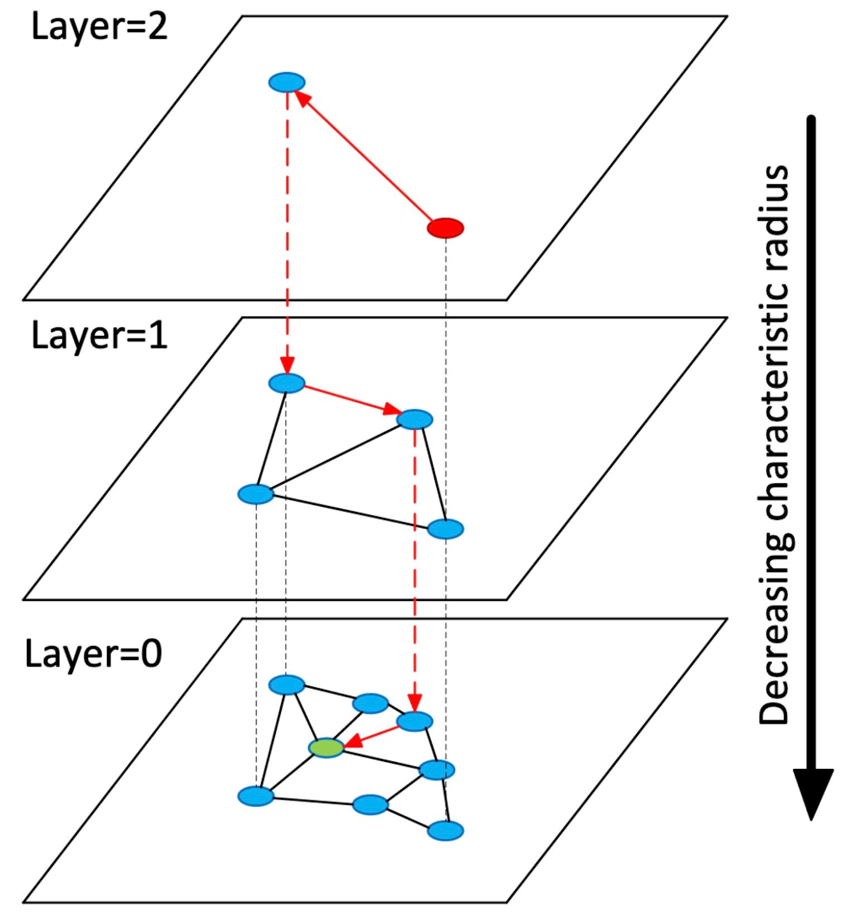

# 2세대 검색 - 임베딩, 코사인 유사도, HNSW

## 한 줄 요약

벡터 검색은 질의와 문서 청크를 같은 임베딩 모델로 숫자 벡터로 바꾼 뒤, 벡터 간 거리가 가까운 청크를 찾는다. HNSW는 모든 벡터를 비교하지 않고도 빠르게 가까운 후보를 찾기 위한 근사 최근접 이웃 인덱스다.

## 임베딩: 텍스트를 비교 가능한 좌표로 바꾸기

임베딩 모델은 문장이나 문단을 고정 길이 실수 배열로 변환한다.

```text
"재수강 신청 기간"  -> [0.12, -0.03, 0.71, ...]
"수업을 다시 듣는 절차" -> [0.10, -0.01, 0.69, ...]
```

두 텍스트의 표면 단어가 달라도, 모델이 의미·용례를 비슷하게 학습했다면 두 벡터가 가까워질 수 있다. 반드시 문서와 질의를 **같은 모델·같은 임베딩 공간**에서 변환해야 비교가 의미 있다. 임베딩 차원이 같더라도 다른 모델이 만든 벡터를 섞으면 좌표축의 뜻이 달라져 거리를 해석할 수 없다.

임베딩은 문서 전체보다 검색 가능한 의미 단위인 청크(chunk)에 적용하는 경우가 많다. 청크가 너무 크면 서로 다른 주제가 하나의 벡터에 섞이고, 너무 작으면 답변에 필요한 문맥이 끊긴다. 따라서 청킹은 벡터 검색 이전에 품질을 크게 좌우하는 설계 문제다.

## 코사인 유사도

벡터 검색에서 자주 쓰는 척도는 두 벡터의 방향이 얼마나 비슷한지를 보는 코사인 유사도다.

```text
cosine_similarity(a, b) = (a · b) / (||a|| × ||b||)
```

값이 클수록 방향이 비슷하다. 많은 임베딩 파이프라인은 벡터를 정규화한 뒤 코사인 유사도 또는 이에 대응하는 거리를 사용한다. pgvector에서 `<=>`는 코사인 **거리**이고, 코사인 유사도는 `1 - (embedding <=> query)`로 계산한다.

```sql
SELECT id, content,
       1 - (embedding <=> $1) AS cosine_similarity
FROM message_chunks
ORDER BY embedding <=> $1
LIMIT 5;
```

## 정확 검색과 ANN

벡터가 적으면 질의 벡터와 모든 저장 벡터의 거리를 계산하는 **정확 최근접 이웃 검색**이 가장 정확하다. 하지만 데이터가 커지면 매 질의마다 전수 비교하는 비용이 커진다.

ANN(Approximate Nearest Neighbor)은 속도를 위해 일부 후보만 탐색한다. 따라서 가장 가까운 벡터를 항상 100% 찾는 대신, 좋은 후보를 충분히 높은 확률로 빠르게 찾는 것을 목표로 한다. 이때 검색 품질은 `recall` 같은 지표로 측정한다.

## HNSW: 계층형 이웃 그래프

HNSW(Hierarchical Navigable Small World)는 벡터를 노드로, 가까운 벡터 사이의 연결을 간선으로 하는 여러 층의 그래프를 만든다.



1. 위층의 성긴 그래프에서 멀리 이동하며 좋은 영역을 빠르게 찾는다.
2. 아래층의 촘촘한 그래프에서 가까운 후보를 더 정밀하게 탐색한다.
3. 이 과정으로 전수 비교보다 훨씬 적은 후보를 비교한다.

pgvector는 기본적으로 정확 최근접 이웃 검색을 수행하며, HNSW 인덱스를 추가하면 속도와 recall을 맞바꾸는 ANN 검색을 사용한다. 코사인 거리용 HNSW 인덱스는 다음처럼 만든다.

```sql
CREATE INDEX message_chunks_embedding_hnsw_idx
ON message_chunks USING hnsw (embedding vector_cosine_ops);
```

`m`(층당 최대 연결 수)과 `ef_construction`(인덱스 생성 중 후보 목록 크기)을 크게 하면 일반적으로 recall은 좋아지지만, 인덱스 생성 시간·삽입 속도·메모리 비용이 증가한다. 검색 시의 `hnsw.ef_search`도 recall과 지연 시간의 균형을 조절한다.

## 벡터 검색의 논리적 저장 구조

원문 파일을 날짜/공지/짧은 대화 묶음 기준으로 청킹하고, 각 청크의 텍스트와 메타데이터·벡터를 함께 저장한다.

```text
document_chunks
├── id             : 청크 ID
├── content         : 검색할 텍스트 청크
├── metadata        : 출처·날짜·주제 등의 구조화 정보
└── embedding       : vector(차원 수는 선택한 모델에 맞춤)
```

메타데이터는 "언제", "어느 출처", "어떤 주제"처럼 명시적인 조건을 처리하고, 벡터는 `content`의 의미 유사도를 처리한다. Weaviate 자료도 메타데이터 필터링이 의미상 비슷하지만 실제로는 무관한 후보를 제거하는 방법이라고 설명한다.

## 잘 잡는 것과 놓치는 것

| 상황                                     | 벡터 검색의 특성                                                 |
| ---------------------------------------- | ---------------------------------------------------------------- |
| `수업을 다시 듣는 절차` -> `재수강 안내` | 표현 불일치가 있어도 관련 청크를 찾을 가능성이 있음              |
| 정확한 URL, 학번, 오류 코드, 고유명사    | 키워드 검색이 더 안전할 수 있음                                  |
| 전혀 관계없는 질의                       | top-k는 항상 결과를 돌려줄 수 있으므로 거리 임계값·후처리가 필요 |
| 최신 공지만 원함                         | 날짜 메타데이터 필터를 함께 적용해야 함                          |

그래서 실제 RAG에서는 BM25와 벡터 검색 결과를 결합하는 하이브리드 검색, 그 뒤 후보를 다시 정렬하는 reranker를 자주 사용한다. 이는 "벡터가 grep과 BM25를 완전히 대체한다"가 아니라, 각 방식의 실패 지점을 보완한다는 뜻이다.

## RAG 파이프라인에서의 위치

RAG는 검색 결과를 곧바로 답으로 쓰는 것이 아니라, 검색된 청크를 언어 모델의 입력 문맥으로 제공해 답변 근거로 사용한다. Weaviate 자료는 이 흐름을 인덱싱, 검색 전(pre-retrieval), 검색(retrieval), 검색 후(post-retrieval) 단계로 나눈다. 벡터 검색은 retrieval의 핵심 요소지만, 데이터 정제·청킹·질의 변환·메타데이터 필터링·reranking과 함께 볼 때 전체 품질을 이해할 수 있다.

## 참고 자료

- [pgvector 공식 README](https://github.com/pgvector/pgvector) - 코사인 거리 연산자, 정확/근사 검색, HNSW 인덱스와 파라미터
- [HNSW 원 논문](https://arxiv.org/abs/1603.09320) - 계층형 navigable small world 그래프 기반 ANN 방법
- [Weaviate Advanced RAG Techniques](https://weaviate.io/ebooks/advanced-rag-techniques) - 임베딩, 메타데이터 필터링, 이상치 제거, 하이브리드 검색, reranking의 파이프라인상 위치
