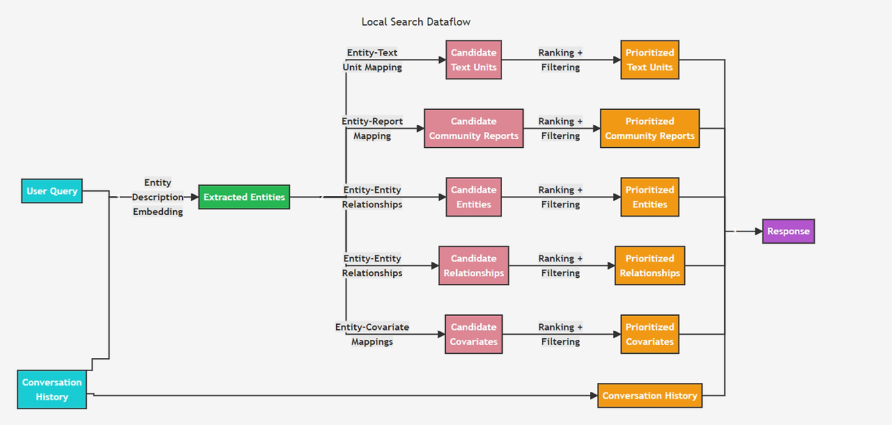

# 로컬 서치: 엔티티에서 출발해 주변 관계를 가져오기

> 참고 자료:
> - [Microsoft GraphRAG: Local Search](https://microsoft.github.io/graphrag/query/local_search/)
> - [Han et al. (2025), RAG vs. GraphRAG: A Systematic Evaluation and Key Insights](https://arxiv.org/abs/2502.11371)

## 한 줄 요약

로컬 서치는 질문에 나온 대상을 지식 그래프에서 찾고, 그 대상과 연결된 주변 정보를 모아 LLM의 컨텍스트로 넣는 검색 방식이다. 여러 사실을 이어야 답이 나오는 질문에 강하다.

## 1. 기본 개념

### 지식 그래프

사실을 노드와 관계로 저장한 데이터다.

```text
문장:   "봉준호가 기생충을 연출했다."
그래프: (봉준호) ─연출→ (기생충)
```

- **노드(엔티티)**: 사람, 영화처럼 이름을 붙일 수 있는 대상
- **관계(엣지)**: 두 노드를 잇는 연결. 종류(연출, 출연)와 방향이 있다

### 홉과 서브그래프

관계 하나를 건너는 것을 1홉이라고 한다. 여러 관계를 건너야 답이 나오는 질문을 **다중 홉 질문**이라고 한다.

```text
(괴물) ←출연─ (송강호) ─출연→ (박쥐) ←연출─ (박찬욱)
 출발         1홉            2홉           3홉
```

**서브그래프**는 전체 그래프에서 필요한 부분만 잘라낸 그래프다.

### 임베딩과 컨텍스트

**임베딩**은 문장을 벡터로 바꾼 것이다. 의미가 비슷한 문장은 가까운 벡터가 되므로, 단어가 달라도 의미로 비교할 수 있다.

**컨텍스트**는 LLM이 답하기 전에 함께 받는 참고자료다. LLM이 한 번에 읽을 수 있는 양에는 한계가 있어서, 무엇을 넣을지 고르는 것이 검색의 역할이다.

## 2. 예시 그래프

```text
(봉준호) ─연출→ (살인의 추억), (괴물), (설국열차), (기생충)
(박찬욱) ─연출→ (공동경비구역 JSA), (올드보이), (박쥐), (헤어질 결심)
(송강호) ─출연→ (살인의 추억), (괴물), (설국열차), (기생충), (공동경비구역 JSA), (박쥐)
(박해일) ─출연→ (살인의 추억), (괴물), (헤어질 결심)
```

영화 기사에서 사실을 뽑아 만든 그래프이고, 기사 원문은 청크 단위로 따로 저장되어 있다고 가정한다.

## 3. 벡터 RAG로는 왜 어려운가

> 질문: "괴물에 출연한 배우가 박찬욱 감독과 함께한 영화는?"

벡터 RAG는 질문과 의미가 가까운 청크를 가져온다. 가장 가까운 청크는 괴물 기사지만, 이 기사에는 출연 배우가 박찬욱과 찍은 영화 정보가 없다.

```text
필요한 사실                            들어 있는 기사
괴물에 송강호·박해일 출연             → 괴물 기사         (검색됨)
송강호가 박쥐에 출연, 박찬욱이 연출    → 박쥐 기사         (질문과 의미가 멀어 검색 안 됨)
박해일이 헤어질 결심에 출연           → 헤어질 결심 기사   (검색 안 됨)
```

이 질문에 필요한 문서는 질문과 비슷한 문서가 아니라 답으로 이어지는 문서다. 그래프에서는 `괴물`에서 출발해 관계를 따라가면 된다.

```text
(괴물) ←출연─ (송강호) ─출연→ (박쥐)        ←연출─ (박찬욱)
(괴물) ←출연─ (박해일) ─출연→ (헤어질 결심)  ←연출─ (박찬욱)
```

## 4. 로컬 서치의 3단계

```text
질문 → ① 엔티티 링킹 → ② 서브그래프 확장 → ③ 컨텍스트 구성 → LLM 답변
```

### ① 엔티티 링킹

질문 속 표현을 그래프의 특정 노드에 연결하는 단계다. 그래프 탐색은 노드에서 시작하므로, "괴물"이라는 단어가 어느 노드를 가리키는지 먼저 정해야 한다.

이 단계가 어려운 이유는 다음과 같다.

| 문제 | 예시 |
| --- | --- |
| 같은 대상, 다른 이름 | "Parasite"와 "기생충" |
| 같은 이름, 다른 대상 | 제목이 같은 다른 작품 |
| 이름이 없는 질문 | "반지하 가족이 나오는 영화" |

연결 방법은 크게 두 가지다.

| 방법 | 동작 | 장점 | 단점 |
| --- | --- | --- | --- |
| 이름 매칭 | 질문 속 고유명사를 노드 이름·별칭과 비교 | 빠르고 결과를 설명하기 쉽다 | 등록되지 않은 표현은 찾지 못한다 |
| 의미 매칭 | 질문 임베딩과 노드 설명문 임베딩을 비교 | 표현이 달라도 찾는다 | 비슷하지만 틀린 노드를 고를 수 있다 |

의미 매칭을 하려면 인덱싱 단계에서 노드마다 LLM으로 설명문을 만들고, 이를 임베딩해 둔다.

```text
괴물: "2006년 개봉한 봉준호 감독의 괴수 영화. 한강에 나타난 괴물과 맞서는 가족 이야기."
```

"한강 괴수 영화 출연진"이라는 질문에는 "괴물"이라는 단어가 없지만, 이 설명문과 의미가 가까워 `괴물` 노드를 찾을 수 있다.

링킹이 틀리면 이후 단계가 정확해도 엉뚱한 답이 나온다.

### ② 서브그래프 확장

출발 노드에서 관계를 따라가며 주변 노드와 관계를 모으는 단계다. 범위를 정하지 않으면 노드 수가 홉마다 곱으로 늘어난다.

```text
노드당 이웃이 평균 10개일 때: 1홉 10개, 2홉 100개, 3홉 1,000개
```

**허브 노드**도 문제다. 허브는 아주 많은 노드와 연결된 노드로, 예를 들어 `드라마` 장르 노드는 수천 편의 영화와 이어져 있다. 허브를 거치면 질문과 무관한 노드가 대량으로 들어온다.

그래서 확장 범위를 제한한다.

- **관계 종류**: 출연·연출 질문이면 해당 관계만 따라간다
- **방향**: 정해진 방향으로만 이동한다
- **개수**: 노드당 가져올 이웃 수에 상한을 둔다

### ③ 컨텍스트 구성

LLM은 그래프를 직접 읽지 못하므로, 모은 노드와 관계를 텍스트로 바꾼다.

```text
[질문] 괴물에 출연한 배우가 박찬욱 감독과 함께한 영화는?

[관계]
- 송강호 ─출연→ 괴물         (출처: 괴물 기사)
- 송강호 ─출연→ 박쥐         (출처: 박쥐 기사)
- 박찬욱 ─연출→ 박쥐         (출처: 박쥐 기사)
- 박해일 ─출연→ 괴물         (출처: 괴물 기사)
- 박해일 ─출연→ 헤어질 결심   (출처: 헤어질 결심 기사)
- 박찬욱 ─연출→ 헤어질 결심   (출처: 헤어질 결심 기사)
```

LLM은 이를 근거로 "송강호는 박쥐, 박해일은 헤어질 결심"이라고 답하고 출처를 함께 제시할 수 있다.

관계와 원문은 함께 넣는 것이 좋다. 관계만 있으면 근거를 확인할 수 없고, 원문만 있으면 벡터 RAG와 차이가 없다.

실제 구현에서는 이웃 노드와 관계 외에도 노드가 등장한 원문 청크, 노드가 속한 커뮤니티의 요약 등을 후보로 함께 모은다. 이후 후보마다 순위를 매겨, 컨텍스트에 들어갈 수 있는 분량만 남긴다.



*출처: [GraphRAG 공식 문서 - Local Search](https://microsoft.github.io/graphrag/query/local_search/)*

## 5. 강점과 한계

| 질문 | 적합도 | 이유 |
| --- | --- | --- |
| 괴물 출연 배우가 박찬욱과 함께한 영화는? | 높음 | 흩어진 사실을 관계로 잇는다 |
| 기생충의 줄거리는? | 낮음 | 답이 한 문서에 있어 벡터 RAG로 충분하다 |
| 기사 전체에서 많이 다룬 주제는? | 부적합 | 출발할 엔티티가 없다. 글로벌 서치가 맞다 |

| 실패 원인 | 증상 | 대응 |
| --- | --- | --- |
| 링킹 실패 | 엉뚱한 노드에서 출발 | 별칭 보강, 의미 매칭, 벡터 검색으로 출발점 찾기 |
| 추출 누락 | 필요한 관계가 그래프에 없음 | 원문 청크를 함께 넣어 보완 |
| 과도한 확장 | 무관한 정보가 컨텍스트를 채움 | 관계 종류·방향·개수 제한 |

Han et al. (2025)의 비교 실험에서도 다중 홉 질문은 GraphRAG가, 한 문서에 답이 있는 단일 홉 질문은 벡터 RAG가 더 좋은 성능을 보였다.
