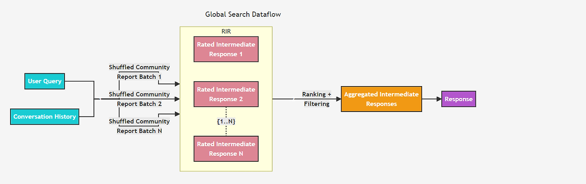

# 글로벌 서치: 커뮤니티 요약으로 전체 질문에 답하기

> 참고 자료:
> - [Edge et al. (2024), From Local to Global: A Graph RAG Approach to Query-Focused Summarization](https://arxiv.org/abs/2404.16130)
> - [Microsoft GraphRAG: Global Search](https://microsoft.github.io/graphrag/query/global_search/)
> - [Traag et al. (2019), From Louvain to Leiden: guaranteeing well-connected communities](https://www.nature.com/articles/s41598-019-41695-z)

## 한 줄 요약

글로벌 서치는 그래프를 커뮤니티로 나누고 커뮤니티마다 요약을 미리 만들어 둔 뒤, 질문이 오면 요약들을 나눠 읽고(Map) 합쳐서(Reduce) 답하는 검색 방식이다. 자료 전체를 봐야 답할 수 있는 질문을 위해 만들어졌다.

글로벌 서치는 GraphRAG 논문(Edge et al., 2024)에서 제안된 방법이다.

## 1. 기본 개념

### 커뮤니티와 커뮤니티 탐지

**커뮤니티**는 내부끼리는 촘촘하게, 바깥과는 느슨하게 연결된 노드 묶음이다. 학생을 노드로, "서로 아는 사이"를 관계로 그리면 같은 반 학생들이 하나의 커뮤니티로 묶이는 것과 같다.

**커뮤니티 탐지**는 그래프의 연결 구조만 보고 이런 묶음을 자동으로 찾는 알고리즘이다.

### Map-Reduce

큰 작업을 여러 조각으로 나눠 각각 처리(Map)한 뒤, 결과를 하나로 합치는(Reduce) 방식이다.

### 컨텍스트 창

LLM이 한 번에 읽을 수 있는 입력의 최대 길이다. 자료 전체를 한 번에 넣을 수 없다는 제약이 글로벌 서치 설계의 출발점이다.

## 2. 벡터 RAG로는 왜 어려운가

영화 기사 1만 건이 있다고 하자.

| 질문 | 답의 위치 |
| --- | --- |
| 기생충은 몇 년에 개봉했어? | 특정 기사 하나에 있다 |
| 괴물 출연 배우가 박찬욱과 찍은 영화는? | 몇몇 기사에 흩어져 있다 (로컬 서치) |
| 이 기사들은 주로 어떤 주제를 다루나? | 특정 기사에 없다. 전체를 요약해야 나온다 |

세 번째 질문을 벡터 RAG로 풀면 질문과 비슷한 기사 몇 건만 보고 답하게 되므로, 전체를 대표하는 답이 나오지 않는다. 그렇다고 1만 건을 모두 LLM에 넣을 수도 없다.

원 논문은 이런 질문을 **QFS(Query-Focused Summarization, 질의 중심 요약)** 문제로 정의한다. 답을 찾는 문제가 아니라, 질문의 관점에서 전체 자료를 요약하는 문제라는 뜻이다.

글로벌 서치의 해법은 그래프를 주제별 커뮤니티로 나누고, 각 커뮤니티의 요약을 미리 만들어 두는 것이다. 질문이 오면 원문 대신 이 요약들을 읽는다.

## 3. 전체 흐름

```text
[인덱싱: 질문 전에 미리]
그래프 → ① 커뮤니티 탐지 → ② 커뮤니티 요약 생성

[질의: 질문이 왔을 때]
질문 → ③ 요약별 부분 답변 생성 (Map) → ④ 부분 답변 종합 (Reduce) → 최종 답변
```

## 4. 커뮤니티 탐지

```text
[커뮤니티 A]                             [커뮤니티 B]
봉준호 ─연출→ 살인의 추억, 괴물,           박찬욱 ─연출→ 공동경비구역 JSA, 올드보이,
              설국열차, 기생충                           박쥐, 헤어질 결심
송강호 ─출연→ 살인의 추억, 괴물,           최민식 ─출연→ 올드보이
              설국열차, 기생충             탕웨이 ─출연→ 헤어질 결심
박해일 ─출연→ 살인의 추억, 괴물

두 커뮤니티를 잇는 관계
송강호 ─출연→ 공동경비구역 JSA, 박쥐
박해일 ─출연→ 헤어질 결심
```

봉준호 작품과 출연진은 서로 촘촘하게 연결되어 있고, 박찬욱 작품 쪽과는 소수의 출연 관계로만 이어진다. 커뮤니티 탐지 알고리즘은 이 연결 구조를 보고 두 묶음으로 나눈다.

### Modularity

커뮤니티 분할이 얼마나 잘 되었는지 나타내는 지표다. 커뮤니티 내부의 연결이, 같은 수의 연결을 무작위로 배치했을 때 기대되는 값보다 얼마나 많은지를 본다. 내부 연결이 무작위보다 많을수록 값이 높고, 커뮤니티 탐지 알고리즘은 이 값을 높이는 방향으로 노드를 나눈다.

### Leiden 알고리즘

커뮤니티 탐지에는 주로 Leiden 알고리즘을 사용한다. 이전에 널리 쓰인 Louvain 알고리즘은 내부가 실제로는 끊어진 커뮤니티를 만들 수 있는데, Leiden은 이 문제를 개선해 각 커뮤니티 내부가 연결되어 있음을 보장한다.

커뮤니티마다 요약을 만들기 때문에 이 성질이 중요하다. 내부가 끊어진 커뮤니티는 서로 관련 없는 내용을 하나의 요약에 섞는다.

### 계층 구조

찾은 커뮤니티 안에서 다시 하위 커뮤니티를 찾는 과정을 반복하면 계층이 만들어진다. 원 논문은 네 단계(C0~C3)를 사용했다.

```text
C0 (최상위, 커뮤니티 수 적음)
 └─ C1
     └─ C2
         └─ C3 (최하위, 커뮤니티 수 많음)
```

| 레벨 | 커뮤니티 수 | 요약 내용 | 질의 비용 |
| --- | --- | --- | --- |
| 상위 (C0) | 적다 | 큰 흐름 중심, 세부 생략 | 낮다 |
| 하위 (C3) | 많다 | 세부 내용 포함 | 높다 |

질의할 때 어느 레벨의 요약을 사용할지 선택한다.

## 5. 커뮤니티 요약 생성

커뮤니티마다 LLM에게 소속 노드와 관계 정보를 주고 보고서를 작성하게 한다. 보고서는 제목, 요약, 중요도 점수, 주요 발견(findings) 등으로 구성된다.

```text
제목: 봉준호 감독과 주요 협업 배우
요약: 봉준호는 살인의 추억, 괴물, 설국열차, 기생충을 연출했다.
      송강호는 네 작품에 모두 출연했다.
발견:
 - 송강호는 봉준호 작품에 반복적으로 출연했다
```

커뮤니티가 크면 정보가 컨텍스트 창에 다 들어가지 않는다. 논문은 이를 다음과 같이 처리한다.

- **최하위 커뮤니티**: 연결이 많은 노드와 관계부터 넣고, 컨텍스트 창이 차면 멈춘다.
- **상위 커뮤니티**: 정보가 넘치면 원본 대신 하위 커뮤니티의 요약을 넣는다. 요약을 다시 요약하는 셈이다.

이 요약은 모두 인덱싱 단계에서 미리 만들어 둔다.

## 6. Map-Reduce 질의

> 질문: "이 기사들은 주로 어떤 주제를 다루나?"

**준비**: 선택한 레벨의 커뮤니티 요약을 무작위로 섞은 뒤, 컨텍스트 창에 맞는 크기의 묶음(batch)으로 나눈다.

**Map**: 묶음마다 LLM을 병렬로 호출한다. 각 호출은 자기 묶음만 읽고 부분 답변과, 그 답변이 질문에 얼마나 도움이 되는지 나타내는 점수(0~100)를 낸다.

```text
묶음 1 → "감독들의 해외 영화제 수상이 자주 다뤄진다"      90점
묶음 2 → "같은 배우가 여러 감독의 작품에 반복 출연한다"   70점
묶음 3 → 질문과 관련된 내용 없음                         0점
```

**Reduce**:

1. 0점인 부분 답변을 버린다.
2. 남은 답변을 점수 순으로 정렬한다.
3. 컨텍스트 창이 찰 때까지 높은 점수부터 담는다.
4. LLM이 이를 종합해 최종 답변을 작성한다.

요약을 무작위로 섞는 이유는 관련 정보가 한 묶음에 몰리지 않게 하기 위해서다. 한 묶음에 몰리면 그 묶음의 컨텍스트 창 안에서 일부 정보가 빠질 수 있다.



*출처: [GraphRAG 공식 문서 - Global Search](https://microsoft.github.io/graphrag/query/global_search/)*

로컬 서치는 한 노드에서 출발해 주변으로 넓혀 가고, 글로벌 서치는 전체 요약을 나눠 병렬로 읽은 뒤 합친다.

## 7. 원 논문 결과

| 항목 | 내용 |
| --- | --- |
| 비교 대상 | 벡터 RAG |
| 평가 방법 | 정답이 없는 질문이므로, LLM이 두 답변을 비교해 더 나은 쪽을 판정 |
| 결과 | 포괄성(빠짐없이 다루는가)과 다양성(여러 관점을 제시하는가)에서 벡터 RAG보다 우세 |
| 비용 | 최상위(C0) 요약만 사용해도 원문 전체를 요약하는 방식보다 토큰을 약 97% 적게 사용 |

LLM이 판정한 결과이고, 짧고 직접적인 답에서는 벡터 RAG가 유리했다. 따라서 글로벌 서치가 항상 낫다는 뜻이 아니라, 전체를 묻는 질문에서 더 넓고 다양한 답을 준다는 의미다.

## 8. 강점과 한계

| 질문 | 적합도 | 이유 |
| --- | --- | --- |
| 이 기사들의 주요 주제는? | 높음 | 답이 자료 전체에 퍼져 있다 |
| 기생충은 몇 년에 개봉했어? | 낮음 | 세부 사실은 요약 과정에서 빠진다 |
| 괴물 출연 배우가 박찬욱과 찍은 영화는? | 부적합 | 특정 엔티티의 연결 질문이라 로컬 서치가 맞다 |

| 한계 | 이유 |
| --- | --- |
| 비용 | 요약 생성에 LLM 호출이 많이 들고, 질의할 때도 묶음 수만큼 LLM을 호출한다 |
| 데이터 변경 | 데이터가 추가되면 커뮤니티와 요약을 다시 만들어야 한다 |
| 오류 전파 | 그래프에 잘못 추출된 관계가 요약에 그대로 반영된다 |
