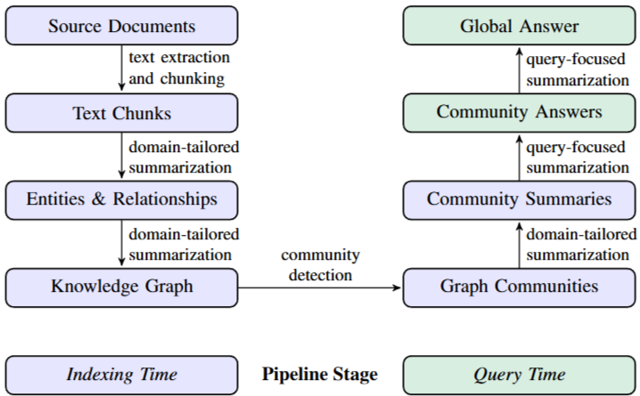

# 그래프 인덱싱: 인덱싱 시점에 미리 만드는 그래프와 요약

> 참고 자료:
> - [Edge et al. (2024), From Local to Global](https://arxiv.org/abs/2404.16130)
> - [Peng et al. (2024), Graph Retrieval-Augmented Generation: A Survey](https://arxiv.org/abs/2408.08921)
> - [Microsoft GraphRAG: Indexing Overview](https://microsoft.github.io/graphrag/index/overview/)
> - [Microsoft Research Blog: LazyGraphRAG](https://www.microsoft.com/en-us/research/blog/lazygraphrag-setting-a-new-standard-for-quality-and-cost/)
> - [Microsoft Research Blog: Moving to GraphRAG 1.0](https://www.microsoft.com/en-us/research/blog/moving-to-graphrag-1-0-streamlining-ergonomics-for-developers-and-users/)

## 한 줄 요약

GraphRAG는 엔티티·관계 추출, 커뮤니티 탐지, 커뮤니티 요약처럼 비용이 큰 작업을 질문이 오기 전, 인덱싱 시점에 미리 수행한다. 원 논문은 이를 그래프 인덱스를 만들고 커뮤니티 요약을 미리 생성(pregenerate)한다고 표현한다. 질의는 빨라지지만 인덱싱 비용이 크고 데이터가 바뀌면 다시 계산해야 하므로, 그래프 인덱싱은 질의와 분리된 배치 작업으로 다룬다.

## 1. 기본 개념

### 인덱싱

검색을 빠르게 하기 위해 데이터를 미리 가공해 두는 작업이다. 책의 색인처럼, 만드는 데 드는 비용은 한 번 치르고 이후의 검색은 빨라진다.

### 인덱싱 시점과 질의 시점

- **인덱싱 시점(indexing time)**: 질문이 오기 전, 인덱스를 만드는 시점
- **질의 시점(query time)**: 사용자가 질문해 검색이 실행되는 시점

비용이 큰 계산을 인덱싱 시점에 미리 해 두면 질의는 빨라지지만 인덱싱 비용이 커진다. 반대로 질의 시점으로 미루면 인덱싱 비용은 작아지지만 질의마다 비용과 시간이 든다. 어떤 계산을 어느 시점에 할지가 인덱싱 설계의 핵심이다. 기존 GraphRAG는 커뮤니티 요약까지 인덱싱 시점에 만들어 둔다.

### 배치 처리

데이터를 모아 두었다가 정해진 시점에 한꺼번에 처리하는 방식이다. 요청이 올 때마다 처리하는 실시간 처리와 대비된다.

## 2. 그래프 인덱싱 방식

그래프 정보를 검색할 수 있게 만드는 방식은 크게 네 가지로 나뉜다.

| 방식 | 설명 |
| --- | --- |
| Graph Indexing | 그래프 구조를 그대로 유지해, BFS 같은 그래프 탐색으로 검색한다 |
| Text Indexing | 그래프 정보를 템플릿 문장이나 요약 같은 텍스트로 변환해 검색한다 |
| Vector Indexing | 그래프 정보를 임베딩 벡터로 변환해 유사도로 검색한다 |
| Hybrid Indexing | 여러 방식을 함께 사용한다 |

3절의 파이프라인에서 그래프 저장(④)은 graph indexing, 엔티티 설명문(③)과 커뮤니티 요약(⑤)은 text indexing, 임베딩(⑥)은 vector indexing에 가깝다. 세 가지를 함께 쓰므로 hybrid indexing에 해당한다.

## 3. 인덱싱 파이프라인

```text
문서
 → ① 청크 분할
 → ② 엔티티·관계 추출 (LLM, gleaning 포함)
 → ③ 엔티티·관계 설명 요약 (LLM)
 → ④ 그래프 구성과 커뮤니티 탐지
 → ⑤ 커뮤니티 요약 생성 (LLM)
 → ⑥ 임베딩 생성
```



*출처: [Edge et al. (2024), From Local to Global](https://arxiv.org/abs/2404.16130), Figure 1*

### ① 청크 분할

문서를 LLM이 처리하기 좋은 크기로 나눈다. 원 논문 실험에서는 600토큰 단위를 사용했다.

### ② 엔티티·관계 추출

청크마다 LLM이 엔티티와 관계를 추출한다.

```text
입력: "봉준호 감독의 기생충에는 송강호, 조여정이 출연한다..."

엔티티: 봉준호, 기생충, 송강호, 조여정
관계:   봉준호 ─연출→ 기생충
        송강호 ─출연→ 기생충
        조여정 ─출연→ 기생충
```

LLM은 한 번의 추출로 모든 엔티티를 찾지 못하는 경우가 많다. 그래서 추출 후 빠진 엔티티가 있는지 다시 묻고, 있다고 답하면 추가로 추출하게 한다. 이 과정을 **gleaning**이라고 하며, 정해 둔 최대 횟수까지 반복한다. 추출 품질은 높아지지만 청크당 LLM 호출 수가 늘어난다.

### ③ 설명 요약

같은 엔티티가 여러 청크에 등장하면 설명도 여러 개가 생긴다. LLM이 이를 하나의 설명으로 합친다.

```text
청크 A: "송강호는 기생충에서 기택 역을 맡았다"
청크 B: "송강호는 괴물에서 강두를 연기했다"
→ 송강호: "한국 영화배우. 기생충(기택), 괴물(강두) 등에 출연했다."
```

이 설명문은 로컬 서치에서 질문과 비교하는 노드 설명문으로 쓰인다.

### ④ 그래프 구성과 커뮤니티 탐지

추출한 엔티티와 관계로 그래프를 만들고, Leiden 알고리즘으로 계층적 커뮤니티를 찾는다. 이 단계는 LLM을 사용하지 않는다.

### ⑤ 커뮤니티 요약 생성

커뮤니티마다 LLM이 요약 보고서를 작성한다. 글로벌 서치가 질의 시점에 읽는 자료다.

### ⑥ 임베딩 생성

엔티티 설명문, 청크 등을 임베딩해 저장한다. 질의 시점에 의미 기반 검색에 사용한다.

## 4. 비용 구조

키워드 검색의 역색인이나 벡터 검색의 HNSW 인덱스도 인덱싱 시점에 미리 만든다. GraphRAG가 다른 점은 인덱싱 단계의 상당 부분을 LLM이 수행한다는 것이다. LLM 호출은 호출마다 비용과 시간이 들기 때문에 인덱싱 비용이 훨씬 커진다.

LLM을 호출하는 단계는 ②, ③, ⑤다.

```text
LLM 호출 수 ≈ 청크 수 × 추출 횟수(gleaning 포함)   ← ②
            + 설명을 요약할 엔티티·관계 수           ← ③
            + 커뮤니티 수                           ← ⑤
```

문서가 늘어나면 청크, 엔티티, 커뮤니티 수가 함께 늘어나므로 비용도 커진다.

질의 비용이 없어지는 것은 아니다. 글로벌 서치는 질문마다 커뮤니티 요약 묶음 수만큼 LLM을 호출한다. 미리 생성해 두는 것은 질의 비용을 줄이기 위해 비용 일부를 인덱싱 시점으로 옮기는 것이다.

### 미리 생성하는 방식이 유리한 경우

| 조건 | 인덱싱 시점에 미리 생성 | 질의 시점에 처리 |
| --- | --- | --- |
| 질의 횟수 | 많다 | 적다 |
| 데이터 변경 | 드물다 | 잦다 |
| 질문 유형 | 전체를 묻는 질문이 많다 | 구체적인 질문이 대부분이다 |

질의가 많으면 인덱싱 비용이 여러 질의에 나뉘어 회수된다. 반대로 질의가 적거나 데이터가 자주 바뀌면, 만들어 둔 인덱스를 충분히 활용하기 전에 다시 만들어야 한다.

## 5. 배치 처리와 인덱스 갱신

인덱싱 시점에 미리 생성하는 방식에서는 인덱싱이 질의와 분리된 배치 작업이 된다.

```text
[배치]  정해진 시점에 문서를 모아 ①~⑥ 실행 → 결과 저장
[질의]  저장된 결과를 읽어 답변 (요약을 새로 생성하지 않음)
```

LLM 호출이 대량으로 발생하므로, 단계별 결과를 저장하고 동일한 입력의 LLM 결과를 캐시해 두는 것이 중요하다. 중간에 실패해도 처음부터 다시 실행하지 않아도 된다.

### 데이터가 추가될 때

| 단계 | 다시 처리할 범위 |
| --- | --- |
| ② 추출 | 새 청크만 |
| ③ 설명 요약 | 새 청크에 등장한 엔티티만 |
| ④ 커뮤니티 탐지 | 그래프 구조가 바뀌므로 커뮤니티 경계가 달라질 수 있다 |
| ⑤ 커뮤니티 요약 | 구성이 바뀐 커뮤니티는 다시 생성해야 한다 |

추출은 새 데이터만 처리하면 되지만, 커뮤니티와 요약은 그래프 전체 구조에 영향을 받는다. 그래프 인덱스를 자주 갱신하기 어려운 이유다. 그래서 기존 인덱스와 새 데이터의 차이만 계산해 병합하는 증분 업데이트 방식이 함께 쓰인다.

## 6. LazyGraphRAG

LazyGraphRAG는 인덱싱 비용을 줄이기 위해 LLM 사용을 질의 시점으로 미루는(defer) GraphRAG다.

| | 기존 GraphRAG | LazyGraphRAG |
| --- | --- | --- |
| 인덱싱 시점 | LLM으로 엔티티·관계 추출과 요약 수행 | LLM 없이 명사구를 추출하고, 함께 등장하는 개념끼리 연결 |
| 질의 시점 | 미리 만든 요약을 사용 | 질문에 필요한 부분만 LLM으로 처리 |

발표된 결과에 따르면 LazyGraphRAG의 인덱싱 비용은 벡터 RAG와 같은 수준으로 기존 GraphRAG의 0.1%이며, 전체를 묻는 질문에서 기존 글로벌 서치와 비슷한 품질을 훨씬 낮은 질의 비용으로 달성했다.

어떤 계산을 인덱싱 시점에 하고 어떤 계산을 질의 시점에 할지는 정해진 답이 없다. 데이터 변경 빈도, 질의량, 질문 유형에 따라 선택한다.
